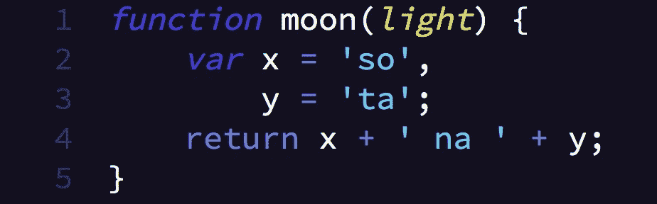
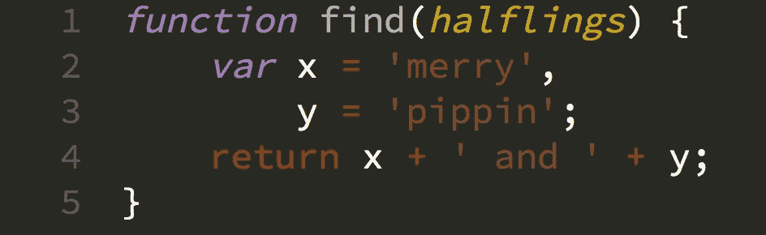
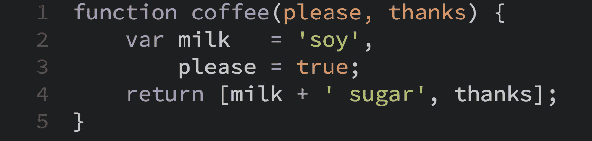
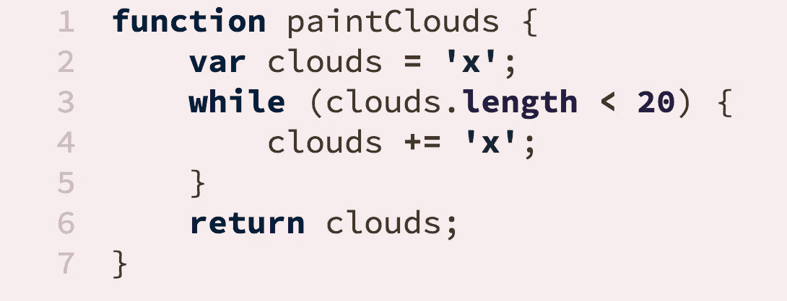
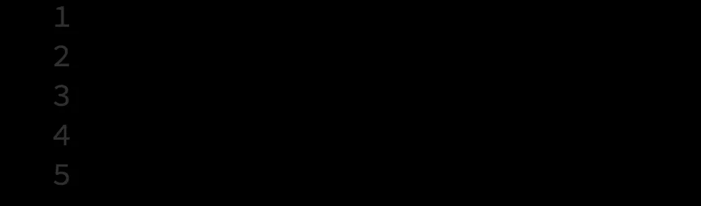
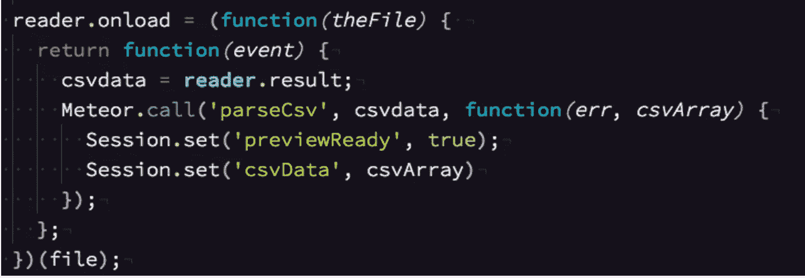

# 如何用你梦想的配色方案激发嫉妒

> 原文：<https://medium.com/swlh/live-a-richer-life-with-your-dream-color-scheme-b98cc7c0247c>

[Art by Liviu Mihai](http://coolvibe.com/2011/dreamscape-by-liviu-mihai/)

软件工程师来到这个世界就像是空白的石板——空的容器，里面装满了事实，是的，但主要是观点。观点是编程的碳水化合物:没有什么营养价值却占据空间，留给你一种显著的(虚假的)饱腹感。

高级工程师迫不及待地告诉你为什么一个决定比另一个更糟糕。毕竟，这是身为高级工程师的一大好处。虽然有无数这样的宗教斗争要被抹黑，但我们现在将目光转向令人眼花缭乱的文本编辑器配色方案领域。

> *“这是一个举世公认的真理，一个拥有好的文本编辑器的工程师一定想要一个配色方案。不管这样一个工程师在第一次进入一个松弛的渠道时，他的感受和观点是多么鲜为人知，这个真理在周围团队的头脑中已经根深蒂固，以至于他们被认为是某个相邻程序员的合法财产。”*
> 
> —简·奥斯汀，《傲慢与偏见》(1813 年)

# 时尚的力量

一个令人尊敬的配色方案就像一双好鞋。它们应该是舒适的、多功能的和高质量的。不要满足于日晒——这是配色方案的反过来，这意味着当每个人都已经拥有一双深色或浅色时，你认为你很时髦。

一个配色方案向办公室和那些有幸与你配对的人宣告，你对编程是认真的。一个非常合适的配色方案告诉其他工程师，“我在编写代码方面非常有效，我可以把宝贵的时间花在优化颜色组合上，以适应我的个性和生活选择。”

坦白说:没有配色方案的工程师是永远不会被尊重的工程师。如果没有他标志性的红金色套装，钢铁侠会是什么样子？还是托尼·斯塔克，但是一个没有品牌，不起眼，没有资本的钢铁侠。

如果没有独特的配色，还不如不做工程师。

# 寻找一种会引起嫉妒的配色方案

你的配色方案就是你的编码个性。厚颜无耻地穿着它，没有道歉。

理想的配色方案应该会引起您的经理和其他开发人员的注意。这应该会让他们拿着 Philz 咖啡在你身后停下来，对你明显优越的设置充满嫉妒。目瞪口呆之下，他们会失去注意力，把热咖啡因洒在地板上。

不要停止寻找配色方案，直到你听到身后地板上“[丝绸般的光彩](http://www.philzcoffee.com/coffee-medium-blends-silken-splendor)”令人满意的飞溅声。你*会*忍不住转身，但是记住你是俄耳甫斯，向后看一眼会毁掉你作为一个冷漠工程师的名声。

通过其他开发人员浪费多少时间在网上寻找来衡量你的配色方案的质量。你知道他们不会找到它，因为你一定要深入互联网的一些更偏远的角落。当他们在谷歌搜索结果的第 11 页寻找一个他们甚至不知道如何拼写的单词时，他们开心地咯咯笑着。

“那是什么主题？”一个好奇的观察者问道。

“哦，只是一点小东西，我周末在我的 SOMA 合作社的屋顶上晒太阳时做的，”你回答道，打开了一个“烤玉米和 Poblano”米饭立方体。

“你没下载吗？!"好奇的观察者惊叹道，难以置信。

“嗯，它的灵感来自 09 年的 *Jaunty* ，但我调整了排水沟，所以它现在真的更符合*石炭纪*。“把营养丰富的米粒放进嘴里，你用指关节敲敲，在 Das 键盘 5Q 上打出一个宏指令；它会根据你的配色点亮。

好奇的观察者挪动着她的脚问道:“你能给我发一个链接吗？”

“没有。”

# 一系列令人羡慕的配色方案，让其他人也想成为你

因为很难找到一个独一无二的配色方案，我们决定通过收集最好的、最聪明的和最大胆的配色方案来帮助你，并将它们列在这篇博文中。

# 精神错乱

正如我前面提到的，如果你使用 Solarized，你就是一个傻瓜。你根本没有研究过这个，是吗？你真的想用一个[失败的和尚](http://observer.com/2015/02/meet-the-man-behind-solarized-the-most-important-color-scheme-in-computer-history/#color-coded)设计的配色方案吗？由成功的和尚设计的怎么样？

当你在凌晨 3:30 被传呼机叫醒并需要保持冷静时，Lunarized 被渲染成午夜蓝和黄昏紫。

# 乌鲁克海

这是莫诺凯的半兽人哥哥。从泥中挖出，这个方案让你享受每一次击键都被追捕的感觉。萨鲁曼的白色变种也可用。

# 后天前一天

明天是一个很好的主题集合，但我认为克里斯·肯普森对未来看得不够远。*后天的前一天*和明天的*用完全一样的颜色*但是说的时间更长，所以你知道更好。

# 鲍勃·罗斯

*“大家好，欢迎来到‘编码的快乐’。如果这是你第一次和我们在一起，让我发出个人邀请，今晚拿出你的笔记本电脑和我们一起编码，我想你会喜欢的。*

*告诉你，让我们今天开始，在屏幕上运行***所有的颜色，我想我们今天就做一个快乐的小代码示例。我们用一点液体白色覆盖我们的编辑器，刚好足以使编辑器湿润。有了这个，我们就可以出发享受美好时光了。”**

**

# *秘密行动模式*

**

*厌倦了同事窃取你的作品？让你的代码处于隐形模式，挫败你的敌人！来自加拿大暴风雪或马里亚纳海沟(如图)。*

# *冷漠*

**

*这种配色方案实际上是真实的，但是被重新命名为更无聊的生动语法，感觉像是一种逃避。我的意思是，这就像把下一代 MacBook 称为“光滑的铝”。*

*不过，这很奇怪:一个“以微妙的深紫色为底色，配以生动的糖果般的颜色”的配色方案听起来不像是一个人会无动于衷的东西，所以也许改名是最好的。*

*随便啦。*

**Alek 是 circle ci***的一名开发人员，在这里他说的比他应该说的多，写的也差不多，都是关于持续集成和交付——你在等待好代码时要做的事情。***

**如果你喜欢这个，你可能会喜欢他的其他科技小说: [*连续(分解)集成*](/@smartalek/continuous-dis-integration-c777d96481d6) *，* [*连续交付:一个圣诞故事*](/@smartalek/continuous-delivery-f4301259f0e2) *，* [*等待好代码*](/@smartalek/waiting-for-good-code-9f17291209c2) *。***

***原载于 2017 年 4 月 3 日 circleci.com***。****