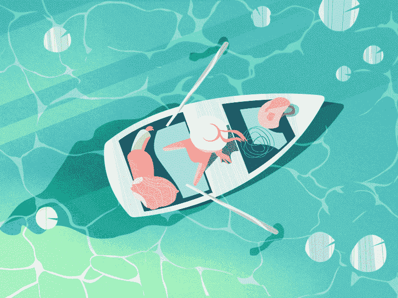

# 在一年中经历 10 年的精彩经历

> 原文：<https://medium.com/swlh/living-10-years-worth-of-amazing-experiences-in-a-single-year-2aff5da7f93f>

[Peace](https://dribbble.com/shots/4003136-Peace) by [Emre Kanlioglu](https://dribbble.com/emrekanlioglu)

十年的生活中会发生很多事情，你会学到新的技能，认识新的人，做新的事情。你的动机可能会改变，你的优先事项可能会改变，而许多事情可能会保持不变，这只是普通人的默认体验。然而，当我们比较被动型和主动型肝脏时，事情往往会有很大的不同。