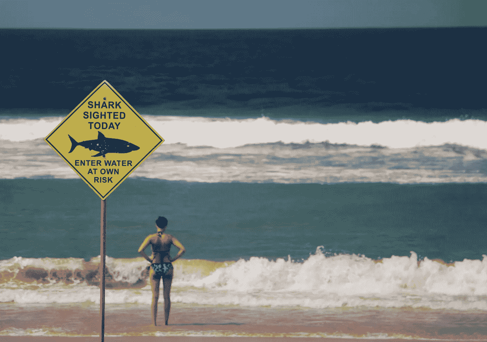

# 生活就像决策一样，是一种道德努力

> 原文：<https://medium.com/swlh/living-like-decision-making-is-a-moral-endeavor-66e43e633ec6>

Photo by [Lubo Minar](https://unsplash.com/photos/ECxwQjLRwLA?utm_source=unsplash&utm_medium=referral&utm_content=creditCopyText) on [Unsplash](https://unsplash.com/search/photos/decision?utm_source=unsplash&utm_medium=referral&utm_content=creditCopyText)

生活，就像决策一样，是一种道德努力，在这种努力中，个人必须批判性地意识到他们的价值观和道德规范是所有道德判断的基础。

本质上，指导我们专业努力和互动的价值观应该与指导我们个人生活的价值观相同，反之亦然。