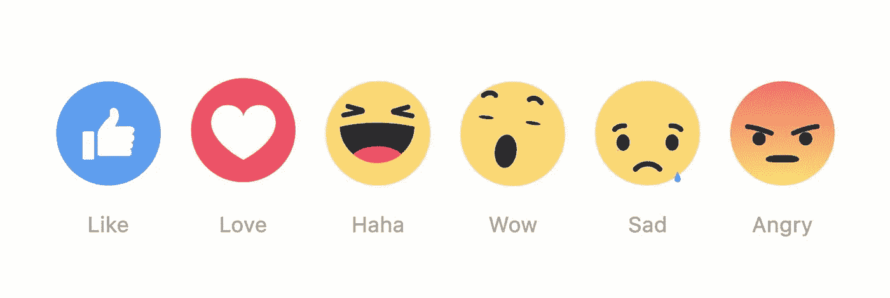
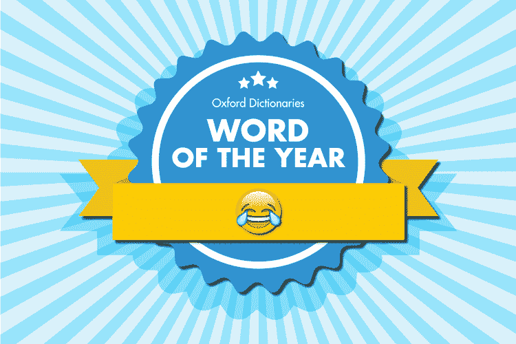
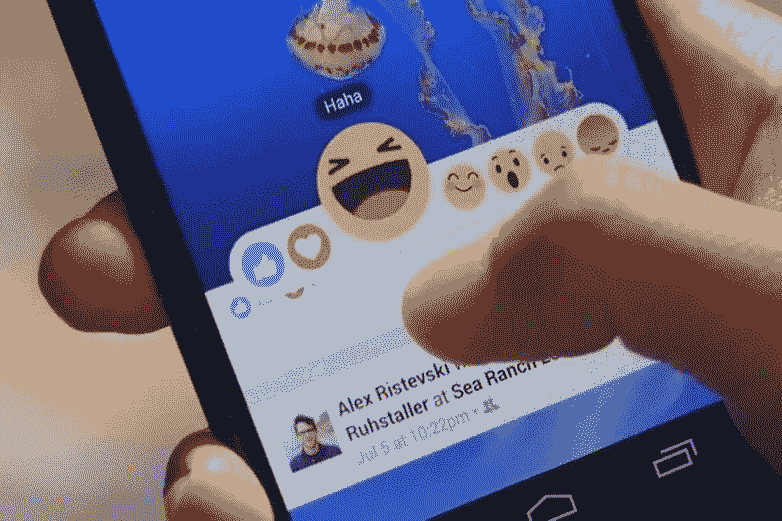
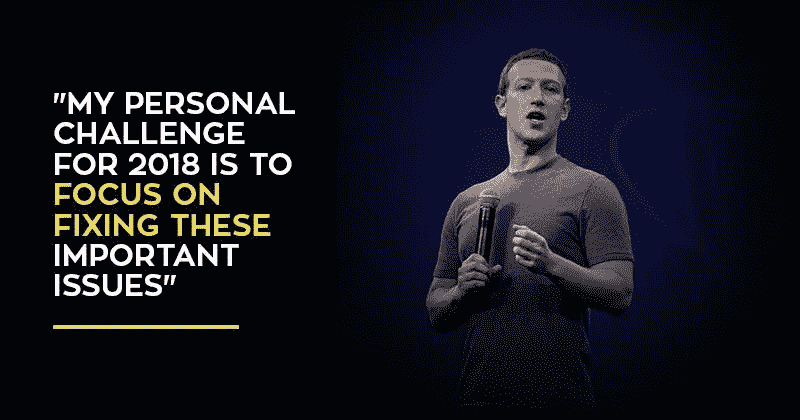

# 爱情只反应:情感分析将如何改变社交媒体

> 原文：<https://medium.com/swlh/love-reacts-only-c1c36b34ca7d>

## 论脸书对“时间花得其所”的设计追求

在数字通信的早期，人们努力封装人类情感的所有方面。短信、电子邮件和社交媒体上的帖子通常都很隐晦；没有音调变化就传达音调感觉不自然。*那条短信是讽刺的吗？他生我的气了吗？“嘿”、“嘿”有什么区别还有“heyyy”？*

不过，我们很快适应了。表情符号、填充词和创造性的标点符号导致了在纯文本中引入情感意义的新规范，一次 140 个字符。

例如，完美的拼写和语法暗示了熟人之间的正式关系，但对密友却有一种敌意的氛围。在评论的末尾加上“ [IMHO](https://www.theatlantic.com/technology/archive/2018/05/the-h-in-imho-does-not-mean-humble-or-honest/559514/) ”(以我的拙见/诚实的观点)标志着一个陈述表达了个人的信念。无止境的多才多艺的“[思维表情符号](http://www.dictionary.com/e/emoji/thinking-face-emoji/)是我个人最喜欢的，它紧锁眉头表示怀疑或疑问。

Oxford Dictionaries faced mixed reactions for making the “crying laughing emoji” their [2015 Word of the Year](https://en.oxforddictionaries.com/word-of-the-year/word-of-the-year-2015)

这些趋势代表了一种新形式的社会素养，要求网民们像面对面交谈时我们凭直觉感知声调和手势一样，去解读字里行间的含义。

今天，我很少遇到在网上传递语气的问题。事实上，比起在现实生活中不熟悉的交流情境中导航，我经常对这个数字符号库感到更舒服。也许我证实了社交媒体评论家对 Z 世代的最大担忧，但不可否认的是，我们的聊天记录和 Instagram 标题中蕴含着丰富的信息。

公司也正在意识到理解情感如何影响技术使用，以及反过来，技术如何影响我们的情感的价值。**量化和分析情感数据点的能力对媒体公司、营销人员和政府等都有巨大的潜力**。

# 玩弄我们的感情

毫不奇怪，脸书处于情感分析研究的前沿。**2012 年，脸书数据科学家和康乃尔大学的研究人员着手进行一项** [**有争议的实验**](http://www.pnas.org/content/111/24/8788.full) **由国防部研究机构** [**DARPA**](https://www.darpa.mil/program/social-media-in-strategic-communication) 资助。在一周的时间里，脸书调整了新闻订阅算法，让一些用户看到更多正面语言的帖子，而另一些用户看到更多负面内容。然后，研究人员评估了这些人自己的发帖活动，发现“情绪状态可以通过情绪传染转移给其他人，导致人们在没有意识到的情况下经历同样的情绪。”

虽然合法，但这个项目遭到了愤怒:用户感觉被操纵了，未经他们同意就被变成了小白鼠。这些反应是可以理解的——对许多人来说，一个人的社交媒体档案是自我的数字化表现。如果企业能够大范围地改变用户的情绪和信仰，他们就能对用户的身份行使不可思议的权力。

**另一方面，当脸书在 2016 年推出** [**反应**](https://mashable.com/2016/02/24/facebook-reactions-new-like-button/#UswvPtJ_WEq4) **时，许多用户欢迎为他们的在线活动**添加细微差别的能力——并避免在“撕奶奶”上点击“喜欢”的尴尬反应并没有取代图标按钮，但爱，哈哈，哇，悲伤和愤怒的反应被添加到脸书的情绪工具包。

这些反应(以及伴随 API 的[支持一种全新的方法来测量和评估用户参与度。尽管自然语言处理还不够成熟，不足以理解现代数字语言的情感潜台词，但统计一篇帖子上的反应数量还是很容易的。对政治新闻的“愤怒”反应会让脸书了解你的意识形态倾向。一个聪明的温迪的广告上的“哈哈”表明他们的帖子正在与你的人群产生共鸣。**聚合后，反应数据为公司提供了一个生动的路线图，以改善其内容并引发期望的反应。**](https://developers.facebook.com/docs/graph-api/reference/)

# 为谁设计？

那么，为什么在某些情况下我们可以接受收集情感数据，而在其他情况下却不行呢？这一切都归结于谁被授权表达自己:用户还是平台。

**平台优先设计优先考虑公司利益**。这是一个旨在增加网站总停留时间的数字游戏。这通常意味着用激烈的政治辩论和理想生活的迷人画像来填充我们的饲料；也就是说，令人上瘾的内容浪费了愤怒引发的评论战或不安全和 FOMO 螺旋小时。这些策略可能会产生更多的点击，但从长远来看会引起对社交媒体的不满。

**与此同时，用户至上的设计鼓励有意义的互动、社区建设，最重要的是，浏览我们自己的*术语。它提出了个性化和透明性，建议人们应该被授权在社交媒体上培养自己的情感体验。毕竟，用脸书来发泄和抱怨，并不是一种普遍的恶；事实上，它可以很好地宣泄情绪。但是当我们不能同意我们的情绪被黑盒算法塑造时，问题就出现了。***

幸运的是，最近公众对社交媒体公司的压力似乎起了作用。它从一些小变化开始，比如 Twitter 将带星号的推文换成了更友好的心形图标。今年 1 月，脸书宣布将修改其方法，并开始突出“[时间的合理使用](https://techcrunch.com/2018/01/11/facebook-time-well-spent/)”——即使以使用时间为代价。

Zuckerberg prioritizes “time well spent” in his 2018 [New Years’ Resolution](https://www.facebook.com/zuck/posts/10104380170714571)

# 赋予人类未来力量

虽然还不清楚“花好时间”意味着什么，但我还是有点乐观。也许这意味着让用户切换他们的新闻源，只显示家庭内容或新闻文章。也许这看起来像开发本地扩展，增加 5 秒的发布延迟(以鼓励深思熟虑)或隐藏喜欢的数量(以避免群体思维)。最后，它可以是一个 Twitter 风格的选项，将某些短语或图片(如警察暴行)列入黑名单，禁止出现在你的提要中。[第三](http://socialfixer.com/) [方](https://chrome.google.com/webstore/detail/pokbmpbjchjmamfgpmkgeabhdfgibeah/publish-accepted?authUser=0&hl=en)开发者和 [UX](/s/story/how-to-fix-what-social-media-has-broken-cb0b2737128) [设计师](/what-to-build/how-to-design-social-systems-without-causing-depression-and-war-3c3f8e0226d1)已经在着手这些建议——还有更多！——脸书最好注意一下。

**情绪是一种新形式的数字货币。**赞、支持票和转发给接收者带来了社会资本，表明了我们喜欢的产品、我们关心的问题和我们所在的社区。因此，社交媒体公司有责任让用户有能力设计自己的数字体验:对此我很乐意给出一个“爱”的回应。

—

*原载于《斯坦福日报》我的专栏* *。如果你喜欢这篇文章，可以看看我在 Medium 上写的更多内容:*

 [## 硅谷有一个救世主的问题

### 英雄企业家精神和超越“善意”

medium.com](/@jasmine_sun/silicon-valley-has-a-saviorism-problem-d06b78df8f2f)  [## 为什么我不会宣誓效忠大数据

### 从网上约会到你的脸书 feed 上的微目标政治广告，一个由信息和…

medium.com](/swlh/why-i-wont-pledge-allegiance-to-big-data-5998daf5c348)  [## 硅谷想长生不老。

### 这就是我不确定的原因。

medium.com](/swlh/silicon-valley-wants-to-live-forever-918ccc4523c0) 

## 这篇文章发表在 [The Startup](https://medium.com/swlh) 上，这是 Medium 最大的创业刊物，有 328，729+人关注。

## 在这里订阅接收[我们的头条新闻](http://growthsupply.com/the-startup-newsletter/)。

