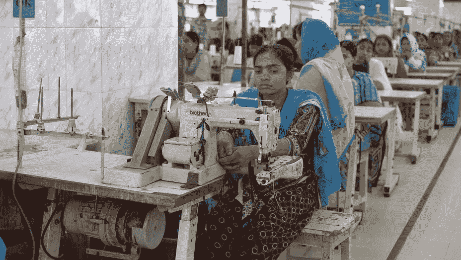
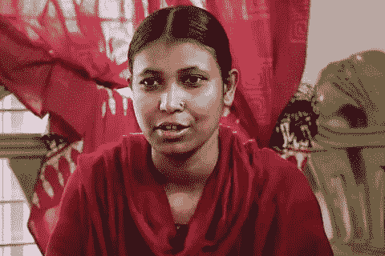

# 喜欢你的新毛衣吗？这是它的制作方法

> 原文：<https://medium.com/swlh/love-your-new-sweater-heres-how-it-was-made-4b0652e9e73c>

## 时装业的真实成本

***The True Cost:*** Documentary Image

安格拉德斯以每小时最高 2 美元的价格雇佣工人，这样他们在缝制别人的衣服时几乎可以自杀。

在过去的几年中，不少工厂事故(如*拉纳广场*的灾难)导致数千人死于不安全的工作条件，包括建筑物倒塌、接触有害化学物质和其他有毒物质。

原来，这些臭名昭著的工厂甚至有了一个名字——*血汗工厂。*

生命的终结并不止于此。

由于这种化学品接触和不安全的工作条件，妇女生下的孩子患有极端的精神残疾，甚至达到完全智力迟钝或身体畸形。

由于工资太低，他们没钱给孩子治病，只能等着孩子死于疾病。

一些妇女太害怕把孩子带到这种不安全的工厂，她们把孩子送到其他家庭或家庭成员那里，一年来两次。

## 唯物主义就是一切

在纪录片 [*的真实成本中，*](https://truecostmovie.com/) 《缝合起来》的作者艾菊·洪金斯解释道:

> “在资本主义中，每家公司都希望获得比竞争对手更多的利润。这是推动最低工资越来越低的原因。
> 
> 这些血汗工厂中的劳工没有集体权利、工会权利或养老金……这就是为什么时尚产业位于孟加拉国。"

纪录片中采访的一位心理学老师提出了另一个可怕的观点:

> “这里的问题是我们的经济是建立在唯物主义和这些价值观的基础上的。因此，它消耗了生存所需的部分燃料……而且代价非常高。”

美国的整个经济体系建立在消费主义之上。这意味着无论代价有多大，美国不经历另一场史诗般的经济崩溃的唯一方法就是扩大可怕的物质主义世界。

在幕后，这意味着孟加拉国有更多不安全的条件，暴露在有害的化学物质中，有不健康的婴儿，在沉默中受苦。

可能比这更糟糕的是，时尚产业已经把问题带到了离家更近的地方。

纪录片中采访了一个种植棉花的农业家庭。他们解释说，他们生活在数百万英亩的棉花中间，这些棉花被喷洒了大量的化学物质，以使它们生长得更快、数量更多。

当在这些土地上工作的女人发现她的丈夫在 47 岁时被诊断出患有第四期脑瘤时，他们没有意识到这会给他们带来如此沉重的打击。

当他们去找一位知名脑外科医生切除肿瘤时，医生强调了这种肿瘤常见于在农业或石油行业工作的 45-65 岁男性。

尽管纪录片中的女子无法证明用于种植棉花的刺激性化学物质是直接原因，但她知道这不是巧合。

她的丈夫在 50 岁时去世。

除了这一可怕的悲剧，每年约有 25 万农民自杀。据统计，这一数字在过去几年里急剧增加了 400%。

奇怪吗？随机？我认为不是。

## 回去做毛衣

制作任何一件衣服并大量生产都是一项艰苦的工作。指凌晨醒来，从事 14 个小时要求很高的劳动，回家还要照顾其他责任。

…然后再做一次。永远。

Shima: True Cost Documentary Image

Shima，其中一个劳工(可能是你的衬衫的制造者)是一个感人的角色。在整个纪录片中，她和女儿一起微笑着，向观众解释孟加拉国的生活。

不过，有一次，她开始哭了。

> “我不希望任何人穿任何由我们的血液产生的东西。”

换句话说，她在做衣服的过程中经历了如此多的死亡和艰难，她只是想改变。

另一个和 Shima 一样的年轻女人解释道:

> “政府不在乎我们有多穷。我们只是想要一份体面的薪水来维持生活**。**

这名年轻女子参加了一场导致 40 人受伤和无辜民众死亡的抗议活动。抗议是为了什么？

这一切都是因为工人们为了每月挣 160 美元**而斗争。**

人们每天都在做这个。

如果你真的仔细想想，奢侈时尚品牌的所有者(认可这种混乱)每分钟都在制造这种混乱。

## 我们需要改变

这部非凡的纪录片的底线是提高人们的意识，并大声喊出我们需要改变的简单现实。

这种变化始于消费者。

我们需要停止把我们没有的钱花在我们不需要的东西上。我们还需要停止在黑色星期五在商场外露营，只进入像忘恩负义的机器人一样的商店购买不会让我们更接近实现的物品。

感恩节后的一天，当我们庆祝我们感激和欣赏的事物时，我们几乎可以揍人的脸，因为我们想要最近的特价商品。

我们需要明白，这个系统正通过将事物与人类经历联系起来，欺骗我们进行虚假的广告和营销。

香水、鞋子、内衣等等都带有能解决我们问题的信息:变得更好看、得到关注、找到快乐。

生活中最重要的“东西”不是东西。

它们是*经历。*

当我们为改善这个世界做出真正的改变时，那些让我们怦然心动的事情。

无论是通过筹款，志愿服务和为人类建立一个强大的运动。

…这最终引出了一个问题:

我们会继续对谁在制造我们的衣服视而不见吗？还是这会是一个转折点？

一切都从你开始。

## 这篇文章发表在[《创业](https://medium.com/swlh)》上，这是 Medium 最大的创业刊物，有+401，714 人关注。

## 订阅接收[我们的头条新闻](http://growthsupply.com/the-startup-newsletter/)。

