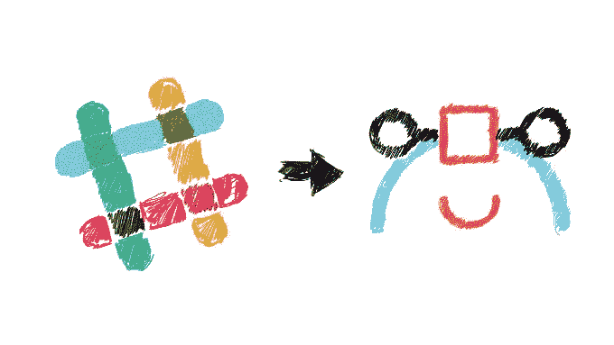

# 通过 Slack 实现低摩擦、高乐趣的登机体验

> 原文：<https://medium.com/swlh/low-friction-high-delight-on-boarding-via-slack-e3b9c753e7a4>

现在有很多很酷的人在用 Slack API 做很酷的事情，我们想分享一些我们一直在做的事情…

(We think you might start seeing this more often)

构建数字产品时，你需要解决的许多问题之一是用户如何注册、下载和登录你的应用程序，尤其是当你的产品家族中有多个应用程序时。虽然我们可以做一些通用的东西，但我们希望考虑我们产品的每个方面，使它真正好用。我们希望用户的参与是简单、低摩擦和‘高乐趣’的。

当我们开始构建我们的第一个原型时，我们只是实现了一个简单明了的 Twitter 登录。早期的测试人员下载了应用程序，点击登录按钮，就这样了。

但是基于用户反馈和我们自己对 Slack 的使用，我们对将上下文与 Slack 集成越来越感兴趣。我们开始写下许多机会，然后迭代。显而易见的比如用户通知，更有趣的想法比如实现一个“通过 Slack 登录”按钮…但是，等一下，这个按钮实际上是做什么的？

Slack and Context — BFF’s :-)

“通过 Slack 注册”按钮比一个老式的“通过”按钮给你更多的力量，**这是一个类固醇注册按钮**。Slack API 让你可以访问团队中的每个用户，它非常强大，这就是我们所做的…

*   Slack 管理员用户可以通过 Slack 登录上下文，并创建或分配上下文给通道。
*   该频道的每个 Slack 用户都会自动收到一封带有我们神奇链接的电子邮件，他们可以在那里下载我们的 iOS 和 Mac 应用程序，然后也可以登录到上下文中。
*   我们希望我们的用户能够专注于获得并给出优秀的设计反馈和评论。如果您在上下文松弛通道中添加或删除用户，他们会自动在上下文中添加或删除，您也可以将多个通道与上下文同步。我们认为这是完美的，如果你有保密协议下的项目。

## 我们学到了什么？

嗯，我们非常有信心团队能够真正从 Slack API 的用例中受益。我们已经看到围绕这个领域实现了很多很酷的功能，比如从你的 Slack 团队和一些很酷的机器人导入电子邮件。

然而，我们找不到一种简单的团队加入方式，我们确信这只是一个时间问题，因为这种实现变得越来越普遍，因为它并不像看起来那么难。

***背景:我们的产品 Context 旨在通过视觉标记和语音剪辑为设计师的工作提供尽可能好的反馈——无论他们使用什么工具，无论他们在设计过程中处于什么位置。***

我们有一个用于拍摄草图照片的 iOS 应用程序和一个用于拍摄数字设计截屏的 Mac 应用程序。

如果您想尝试这一入职流程，请注册[上下文](http://www.getcontext.co)的测试版

或者如果你想了解更多关于我们的实施，你可以发邮件给我们[这里](mailto:welovefeedback@getcontext.co)

显然，很大程度上要感谢[丹尼尔·科沃杰伊](https://medium.com/u/c09edc3d2d8c?source=post_page-----e3b9c753e7a4--------------------------------)、[多彩](https://medium.com/u/bdb241a02761?source=post_page-----e3b9c753e7a4--------------------------------)和[扎克·英格里斯](https://medium.com/u/89faf7a37412?source=post_page-----e3b9c753e7a4--------------------------------)。没有他们，这一切都是不可能的。