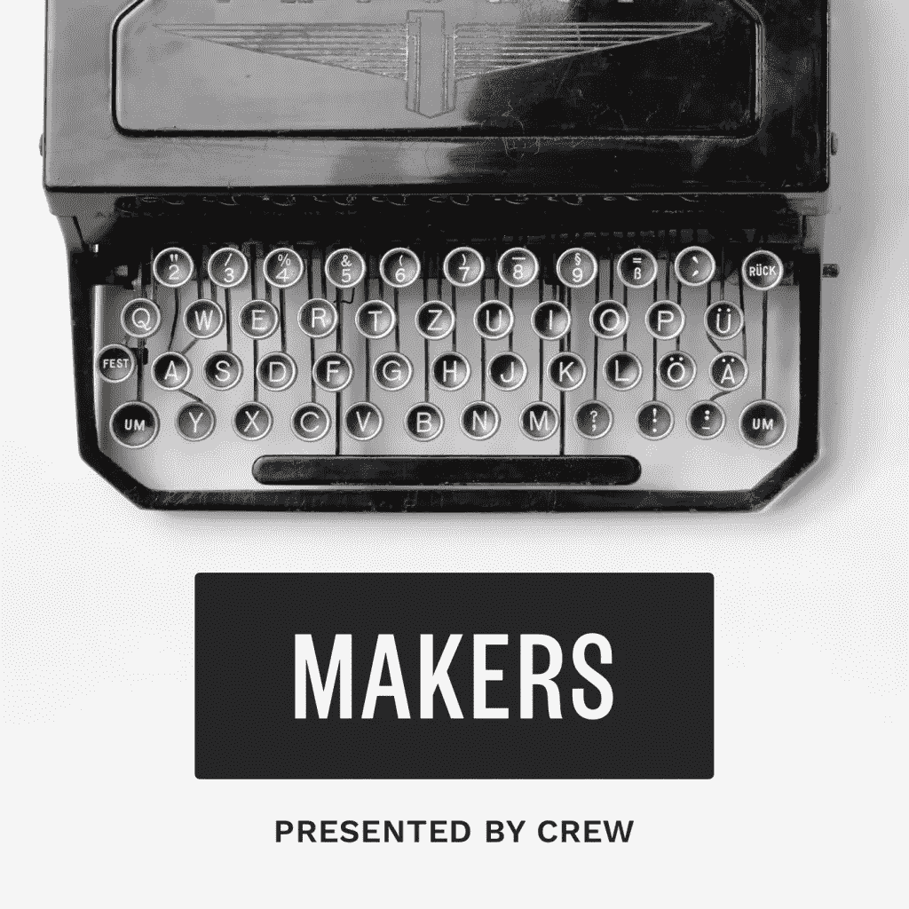
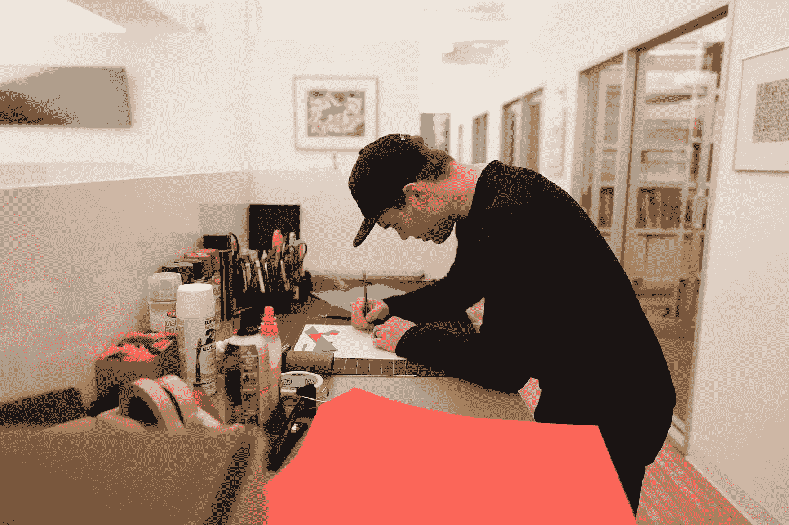
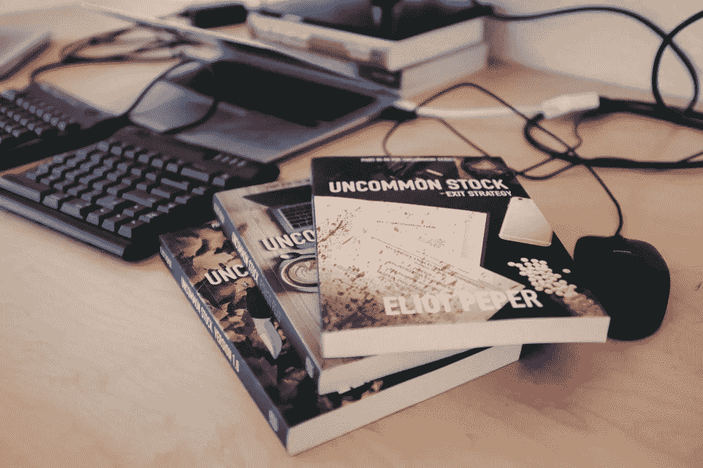
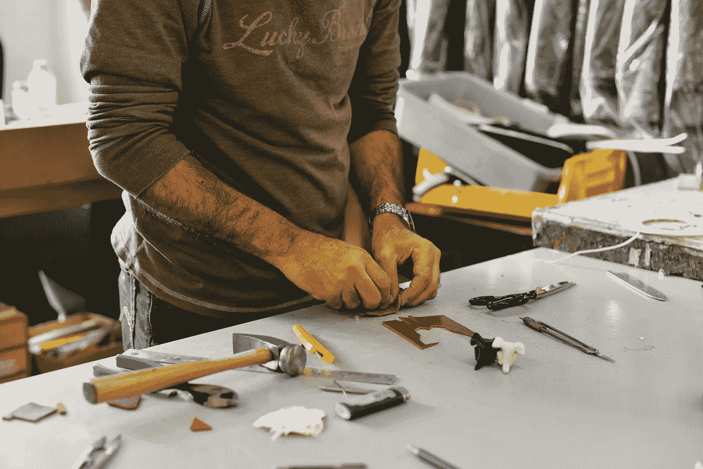

# 迷幻药并不是唯一激励史蒂夫·乔布斯的东西

> 原文：<https://medium.com/swlh/lsd-wasn-t-the-only-thing-that-inspired-steve-jobs-c91f452673a4>

*TL;DR: We launched an awesome podcast and interview series.* [*Check it out!*](http://makers.crew.co/)

## 介绍创客播客和采访系列

功夫和漫画书。

他们可能看起来毫无关联，但他们是获得多白金唱片的音乐组合“武堂帮”的灵感来源。

无印良品获奖的 CD 播放器设计[借鉴了照明行业的一个姿态](http://www.moma.org/collection/works/94351?locale=en)。

史蒂夫·乔布斯传奇般的艺术与科技融合[的灵感不仅来自迷幻药，还来自书法](https://www.youtube.com/watch?v=UF8uR6Z6KLc)。

最好的灵感往往来自我们最意想不到的地方。

我们都忙于工作。开会的时候。在我们的日常生活中。而且在我们自己的工业中。

如果我们在技术领域工作，我们都在看同样的东西。

谷歌和脸书(以及其他所有网站)正在迎合基于我们之前所见的东西。我们消费的东西越来越符合我们已经喜欢的东西。

虽然这可能对他们的业务有好处，但对你的创造力没有好处。

如果你只是生活在这个行业中，你就不能重新思考你的行业。如果我们所看到的只是我们所知道的，我们就不会被引入新的视角。

这就是为什么今天，我们很兴奋地宣布一个新的采访系列，面向制造商和任何想以此谋生的人。

它(恰当地)被称为[制造者](http://makers.crew.co/)。

我知道你在想什么。太好了，又一个播客采访系列。

但我可以向你保证，制造者是不同的。

从图书出版到建筑再到时尚，我们一直努力寻找跨学科的灵感创造者，而不仅仅是网络，让你深入了解是什么激励了杰出的创造者。没有绒毛。我们问了有趣的问题，追寻你从未见过的故事情节，为你寻找独特的灵感来源。

哦，还有一件事。所有采访[中独特的高清照片都可以在 Unsplash](http://unsplash.com/) 上免费下载。每次采访结束时，您都会看到一个下载照片的链接。

每集时长 15-20 分钟，今天你可以在 iTunes 和制作人网站上查看前 5 集。

以下是您可能会收到的回复:

# [克里斯·梅西纳](http://makers.crew.co/?p=278&preview=true)

Messina flashin’ signs like it’s no big deal.

Twitter 最无处不在的功能——标签#的创建者公开了他在旧金山的早期生活，与 Mozilla 基金会合作支持一个免费和开放的网络，以及他如何设法永远改变了我们沟通的方式(尽管 Twitter 一开始并没有那么投入)。

# [麦基星期六](http://makers.crew.co/mackey-saturday-and-the-instagram-logo/)

短短几年间，Instagram 已经从小众照片分享应用发展到全球超过 4 亿用户。几乎有 5 亿人每天登录并在屏幕上方看到该应用的图标，这使其成为世界上最受欢迎的图标之一。我们采访了 Mackey Saturday，他是标志设计的负责人，我们将了解这个项目是如何发生的，以及它如何改变了他的生活。

# [猫诺恩&本·莱纳特](http://makers.crew.co/cat-noone-ben-lehnert/)

就设计力量夫妇而言，很少有人能与柏林的[凯特·努恩](http://heyimcat.com/)和[本·莱纳特](http://benedikt-lehnert.de/)令人难以置信的产量、创造力和才华相媲美。他们不仅在工作上多产，而且两人还设法找到了平衡，创造了共同的生活——这对于我们这些醒着的时候大部分时间都盯着屏幕和制作产品的人来说似乎是不可能的。

我们与这对夫妇聊起了与另一位设计师的生活、副业、科技如何融入他们的育儿哲学，以及微软收购[神童榜](https://www.wunderlist.com/)(本共同创立的公司)对他们的生活意味着什么。

# [艾略特·佩珀](http://makers.crew.co/eliot-peper/)

凭借三本书(全部在不到两年的时间内完成并出版)，艾略特·佩普成功地改变了他的生活，实现了他从企业家转变为职业作家的梦想。

然而，像所有的梦一样，它们并不总是以我们想象的方式结束。在这一集中，艾略特解释了他是如何与自己的自我期望作斗争的，以及一旦发行书籍的最初高潮过去，他是如何面临所有创意人员都面临的同样问题:你如何衡量成功？

# 弗雷德里克·马马尔巴奇

在一个像时尚这样残酷的行业里，很容易陷入跟随者的角色，去追逐今年的潮流。然而，追随意味着你所能做到的最好是令人厌烦的。我们听到了 m0851 创始人 Frederic Mamarbachi 的故事，他是一位富有远见的设计师，以自己的方式建立了一个帝国。他称之为“出售你的歪鼻子”。

前往 iTunes 并订阅 Makers 播客(一定要给我们留下评论！)并浏览[创客网站](http://makers.crew.co/)寻找自己的励志故事。

愉快的探索。

*附言——如果你最终听了《创造者》的歌，并且乐在其中，如果你能花 30 秒钟* [*在 iTunes 上留下评论*](https://itunes.apple.com/us/podcast/makers-by-crew/id1071966581) *，那将意味着全世界。我们真的很感激。*