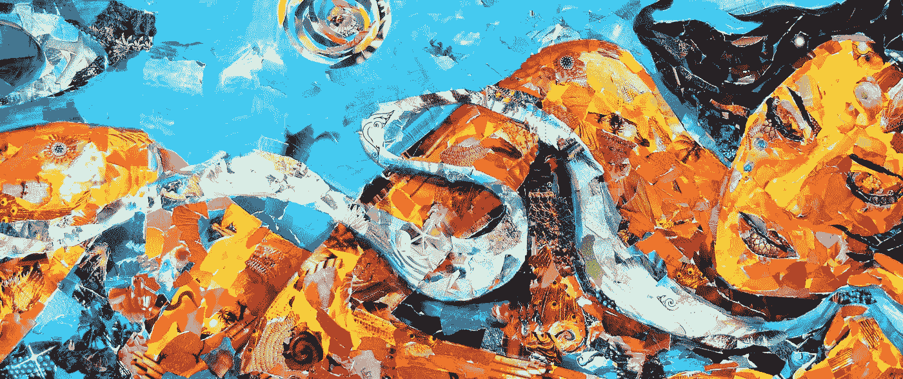

# 运气不是偶然的

> 原文：<https://medium.com/swlh/luck-is-not-an-accident-3a3ca76253ec>

## 意图&奇怪的能量

生活是一场艰难的游戏，但如果你玩得正确——诚实、真实并带着优雅和谦逊的感觉——你可能会非常满意。如果你在其中加入努力和意图，你甚至会时不时地走运；这不是偶然的。

事情是这样的，运气不是偶然发生的。运气是被设计好的，当我们坚持不懈地进行有目的的练习和努力时，我们就为运气找到我们创造了一个环境。无论你在做什么，都有一种深谋远虑、关心和 GAF 将军的感觉。这是令人钦佩的，值得尊敬的，当奇迹发生时。

“我更相信运气，我发现我越努力工作，运气就越好。”托马斯·爱迪生

另一方面，事故是简单的机会，你中了彩票，看看你的四肢有多长，事实上你不是生来就患有衰弱性疾病，也不是出生在第三世界国家的贫民窟。事故发生了，没有任何努力，计划或承认手边的过程。

那么，谁会关心这个呢？好吧，看起来我们已经有了这种文化上的凝聚。因为疏远了一些最优秀最聪明的天才，自然和幸运。我不是来争论的，恰恰相反，我是来说你也可以创造自己的运气。

"运气是当准备遇到机遇时发生的事情."塞内卡

你也可以成为一个天生的、有天赋的人或者与众不同的人，你所需要做的就是:做你喜欢的事情。

“找到你爱的东西，让它杀死你。”查尔斯·布可夫斯基。赞美诗我最喜欢的一句话。

如果你不知道那是什么(就像我们几乎所有人一样),就会感到不舒服。步入生活和时间以人的形式呈现给你的机遇，挑战和虚度时光。

感到无聊，在你的发现中挑起一些麻烦。去找一些古怪有趣的人，看看他们在干什么。请求帮助，找一群人去服务，去做或创造事物。如果你这样做了，运气就会找上你。你的运气会找到你，这不会是一个意外。

当有疑问时…

# 奇怪的能量

能量既不会被创造也不会被消灭，而是被传递和转化。在所有的事物中，所有的人中，所有的事物中，所有的人中。很奇怪，但是我们感觉到了就知道了。

它一波一波地来。意识增强的时刻和看似完美的时机随机相遇。当我们感觉联系最紧密的时候，就好像我们已经来到这里，在正在展开的事情中扮演一个积极的角色；承认和欣赏我们周围最微妙的元素。

清新微风的味道和气味，流水的声音，天空中光明的亮度和喜悦，古老建筑和街道标志的外观。

一个伟大的谈话的方式流动，并在深度和强度上建立到你从来没有想到它会到达的地方，与你刚刚在一个全新的水平上认识的人。然后观察回放，就好像是前段时间看的电影里的片段。

完全迷失在思想或虚无中，感觉像是永恒，然后眨眼回到现实中。

那是能量。呼吸，吸气，在其中展现你自己。利用它的力量。

但我们不能一直拥有它，如果它随手可得，它就不会如此特别并被捕获。所以，有时我们会忘记它，失去它，或者至少失去我们对它的感觉。你不会在自己身上找到它，相反，你会在别人身上，在你的周围找到它。你要做的就是看。

你可以看到你自己，在生活中的奇怪事物中找到你失去的能量。在未知的，不熟悉的地方。在陌生人眼里。

当你经过时，锁定眼睛，点头，微笑，说“你好”。因为这可能是你唯一一次或一次机会去分享他们的能量，或者去发现一个终生的朋友或伴侣。不要浪费机会。不要浪费你们在一起的潜力。

如果你真的找到了，陌生人，陌生人，好好为他们服务。

# 垃圾想法

"我们每个人都有可能成为一个新物种的开端."

规则之前

规则被创造出来是为了控制混乱，创造一个终点，一个有限的游戏。但是规则之前是什么样子，怎么玩的？还有哪些迭代？事实上，我们只是在一个我们无法感知的无限游戏的循环中。

我们就是我们

当我们照镜子的时候，我们应该总是看到我们是谁，我们代表什么，以及我们为之努力的事情。"你所思考的事情决定了你思想的质量."—冥想。你是/认为你周围的五种思维类型的平均值…它们应该是:理性、同一性(逻各斯)、诚实、好奇和果断。

这不是关于我的

我们必须学会说，学会生活，这是:这与我无关。“这”不是关于我，不是关于我在做什么，不是关于你在做什么，也不是关于我在为你做什么。这是做的问题。做我该做的事，服务，生活，回收。

神奇的数学

我们只有一次生命，每周有 112 个醒着的小时，你可以在 1/7 醒着的时间里努力和专注于 2-3 件事情。每人每周 16 小时。你最擅长什么？你的注意力转移到哪里了？你会用它做什么？

糟蹋你的生活

我们不能做、看、听和体验一切；也没有必要这样做，因为我们是一体的，是万物。这是一个从二元思维到合一的令人满意的实现和过渡。"每块石头里面都有一个雕塑."你可以弯曲并创造未来的历史。我们记得未来；我们创造了过去。

## 这个故事发表在 [The Startup](https://medium.com/swlh) 上，这是 Medium 最大的创业刊物，有 293，189+人关注。

## 在这里订阅接收[我们的头条新闻](http://growthsupply.com/the-startup-newsletter/)。

