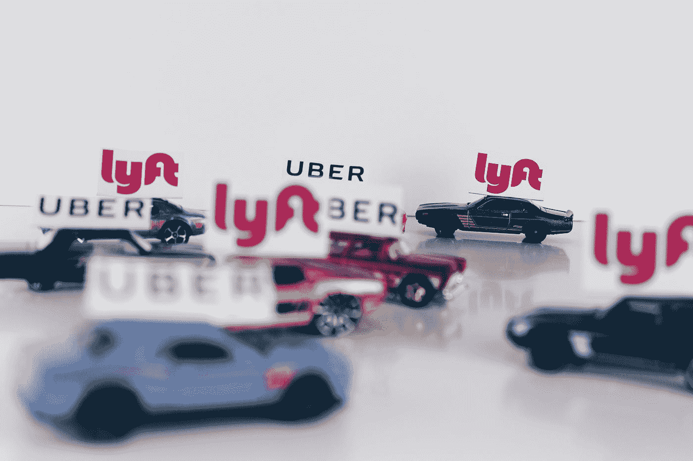
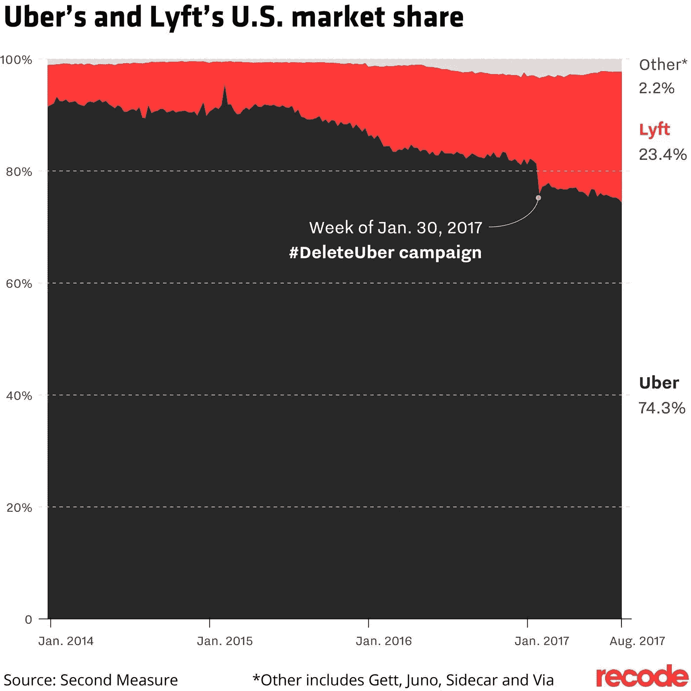
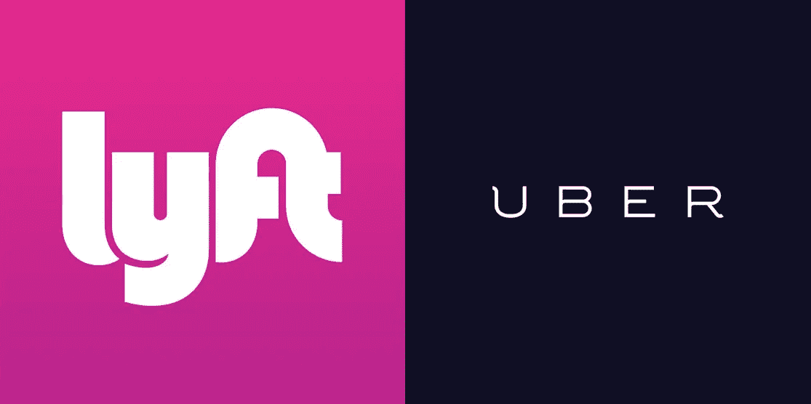
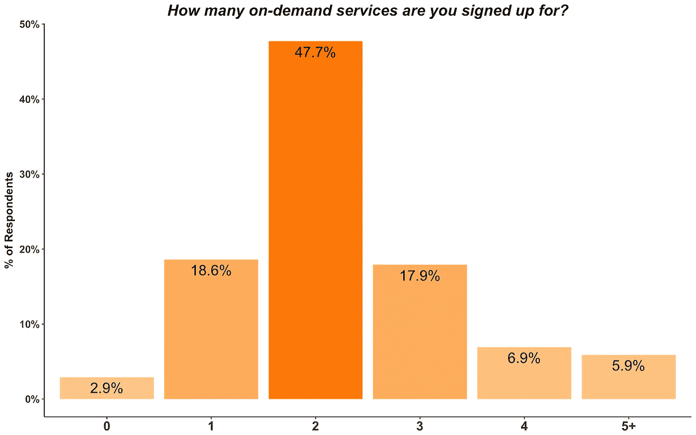

# Lyft 在拼车领域的悄然成功

> 原文：<https://medium.com/swlh/lyfts-quiet-success-in-ridesharing-24f6ca689631>

## Lyft 如何在一个一度由优步主导的市场攀升至 35%的市场份额

Photo by [Thought Catalog](https://unsplash.com/@thoughtcatalog?utm_source=medium&utm_medium=referral) on [Unsplash](https://unsplash.com?utm_source=medium&utm_medium=referral)

> 过去的 18 个月是令人难以置信的持续增长期——Lyft 首席财务官布莱恩·罗伯茨

感觉上，在有人使用 Lyft 的时候，优步已经成为一个动词，但不知何故，这个小公司已经成为该领域的一个真正竞争者。这些数字相当惊人(根据美国消费者新闻与商业频道的说法):

*   这个月，Lyft 告诉我们，它拥有全国拼车市场 35%的份额，高于 18 个月前的 20%。
*   它声称在 16 个美国市场拥有超过 40%的市场份额，在“多个”市场拥有超过 50%的市场份额(阅读:最有可能是 2-5 个)
*   第二个衡量标准是，截至 2018 年 3 月，外部来源 Lyft 的市场份额为 27%

为了了解这是如何发生的，我看了一些他们成功的主要驱动因素。

# 机会

试图在一家公司拥有 90%以上市场份额的市场中竞争通常是不被认可的。一般来说，在位者会通过网络效应、技术专长等建立起某种类型的可持续优势。然而，拼车市场的领导地位极难捍卫，原因有二:

1.  *供应或需求方面的切换没有障碍:*对于司机来说，使用优步、Lyft、Via 等都很容易。没有真正的后果。同样，骑手也可以这样做，并根据当时哪个提供的价格更好继续切换。
2.  *在业绩上几乎没有竞争差异*:商业模式很容易复制，没有什么能阻止竞争对手复制优步。在获取驱动因素上花费的公司通常可以达到相似的绩效水平。作为这两种服务的骑手，我无法告诉你这两者之间有什么一致的区别。

Matt Ward 在最近一篇关于优步面临的困难的文章中完美地捕捉到了这些挑战。Lyft 所要做的就是投入资源赢得司机，因为优步已经证明了需求的存在:

> 增加供给，需求就会随之而来——雷·克洛克，麦当劳

# Lyft 做对了什么？

## 避免优步的错误

可以肯定地说，任何不叫“优步”的拼车服务都受益于负面新闻和 2017 年的多次#deleteuber 活动。如果你需要快速回顾这部戏剧，这里有一些重要事件的快速回顾:

1.  **#deleteuber 第一集**:2017 年 1 月下旬，特朗普总统颁布旅行禁令后，出租车司机在 JFK 机场抗议。作为回应，优步关闭了激增定价(以鼓励人们使用该产品)，这最终被视为优步试图利用那些抗议移民禁令的人。与此同时，时任 CEO 特拉维斯·卡兰尼克是特朗普顾问委员会的成员，这也可能被视为对移民禁令的支持。
2.  **#deleteuber 第二集:【2017 年 2 月，前优步工程师苏珊·福勒发表了一篇关于性骚扰和性别偏见的文章，导致*内部*调查。投资者批评内部调查人员的选择，表明他们不愿公开透明。后来，卡兰尼克被听到痛斥一名优步司机，并承认他需要领导帮助。随着公司不断成为头条新闻，许多高管离开公司，卡兰尼克最终辞去了首席执行官的职务。**

这些事件有什么影响吗？下面的数据表明答案是肯定的。

[Recode](https://www.recode.net/2017/8/31/16227670/uber-lyft-market-share-deleteuber-decline-users)

2017 年，优步发生了很多事情，Lyft 也是如此。企业文化的重要性不可低估。通过*而不是*这些问题，Lyft 的增长引发并持续到 2018 年。随着许多人删除优步应用，Lyft 有机会通过提供另一种选择来打破优步的垄断。

## 将他们的品牌战略聚焦于目标客户

此外，这两家公司在品牌方面存在明显差异，这可能在此期间发挥了作用。从严格的视觉开始，Lyft 使用小写字母的粉红色背景，优步使用全部大写字母和黑色背景。*对立面..*

我认为，我们可能会看到反映在他们的标志是他们不同的起源。优步最初是以“黑车”服务起家的，因此他们更时尚、更商业化的审美是有道理的。Lyft 进入了常规消费者市场，还开创了拼车功能，两者都有助于营造更友好的感觉。

Lyft 的营销更加随意和友好，对年轻一代有吸引力，而优步似乎更不可知论。根据最近的[数据](https://www.recode.net/2018/5/17/17360564/lyft-uber-younger-users)，Lyft 在年轻消费者中的增长速度快于优步，这似乎是有效的。

我记得收到一封电子邮件，称 Lyft 向美国公民自由联盟捐赠了 100 万美元，并谴责了特朗普的禁令，这似乎让人们更加认为，他们是一家更有意识、更有爱心的公司。同样，这符合他们的目标客户和他们的一般信息。采取政治立场是有风险的，但由于 Lyft 只在城市地区运营，而且用户更年轻，他们的乘客不太可能是特朗普的坚定支持者。

此外，他们还发起了“凑齐并捐赠”活动，允许用户凑齐自己的车费，并将差额捐给慈善机构。通常我不会对此有太多想法，但当这款手机发布的同时，优步的首席执行官因与一名司机发生争执而出现在新闻中，这开始在我对这两者的看法上产生分歧。

## 吸引来自优步的司机

以我自己作为两种服务的骑手的经验，我无法告诉你哪一种是哪一种。然而，这些年来我已经看到了一系列关于作为一名*司机*的各种体验的文章。这很重要，因为面向客户的表现很大程度上取决于平台吸引和留住司机的能力。

今年早些时候，*拼车公司 Guy* 在[进行的年度调查](https://therideshareguy.com/2018-uber-and-lyft-driver-survey-results-the-rideshare-guy/)调查了司机对两种服务的看法，Lyft 似乎更受青睐:

1.  *%的司机对体验满意:76%的 Lyft 对 58%的优步*
2.  *%的司机对拼车选择满意:46%的 Lyft line 对 22%的 UberPOOL*

赢得司机是这个市场难题的重要组成部分。同一项研究表明，司机们毫不奇怪地将“薪酬”和“灵活性”视为人们最关心的因素。为了提高工资，Lyft 第一个加入了小费选项(消费者没有义务，但有机会增加司机的口袋里的钱)。此外，Lyft 在他们启动的新城市有一些慷慨的注册奖金，经常超过优步的注册奖金。

也就是说，这些特性中有很多很容易复制。如果 Lyft 推出广受欢迎的新司机福利，优步也会这么做，反之亦然。即便如此，在另一家公司能够复制之前，无疑会有一段时间的延迟，在这段时间里，竞争对手可能会获得更多的份额。

底线是 Lyft 被司机们很好地感知，这最终使他们的服务可以与优步相媲美。如下图所示，司机和公司之间是一对多的关系，这意味着新进入者不必完全击败优步，而是他们必须足够优秀，成为司机使用的选项之一。

[RSG Image Credit](https://therideshareguy.com/2018-uber-and-lyft-driver-survey-results-the-rideshare-guy/)

# 拼车的未来

这些原因解释了过去几年 Lyft 为何以及如何在美国主要市场变得重要。他们声称，与去年相比，2018 年 Q1 奥运会的销售和营销支出减少了 20%。这并不奇怪，因为他们希望实现盈利。

值得注意的是，这两家公司都没有盈利，但资金非常充足，这表明未来有必要也有可能做出改变。从短期来看，两家公司都在努力锁定需求，培养忠诚度。

实现这一点的一种方式可能是过渡到订阅模式——类似于公共交通系统发放月票的方式。或者，建立一个强大的忠诚度奖励计划(类似于 Lyft 目前正在试验的计划)可能有助于锁定消费者，但可能会削弱盈利能力。

未来的事情(希望如此)会有趣得多。两家公司都在自动驾驶汽车领域进行了收购和合作，认为这是降低成本的长期机会。

自动驾驶汽车等式有三个部分:技术、车辆和网络。优步和 Lyft 当然提供了一个网络，并一直在积极地与技术和汽车制造商合作。我之前提到过，到目前为止，我在使用优步和 Lyft 时有过非常相似的体验，但我认为，随着我们转向自动驾驶汽车，这些服务将会有所不同:

*   优步希望垂直整合技术、车辆和网络，而 Lyft 希望成为一个开放的网络，可供多个合作伙伴使用。
*   汽车制造商和科技巨头都试图在自动驾驶汽车市场占有一席之地，这意味着更多的竞争和可能的结果。

这种战略上的差异和市场上新参与者的出现可能会加剧市场的分化**。**如今，Lyft 和优步都在一个大市场中占据了强势地位，但技术突破有办法颠覆一切，因此我们将不得不看看两家公司如何应对。

# 结束语

促成 Lyft 最近成功的一些重要理念适用于各个行业:

*   **首先扩大规模是不够的:**尽管优步已经确立了自己的市场领导者地位，但他们并没有锁定供应或需求。毫不奇怪，像 Lyft 这样的竞争对手会复制他们的业务，并夺走一些份额。
*   **企业文化很重要:**优步的决定有力地提醒人们，一家公司的文化对于吸引客户和人才至关重要。
*   **优先考虑供应方**:在拼车这样的市场中，网络效应是通过赢得供应方来实现的。如果你能聚集足够的供给，那么你的服务就会变得有竞争力。就拼车而言，重要的是司机可以方便地使用多种服务，所以优步在司机方面没有优势。满足供应方的需求可以让你为需求方创造更好的体验。
*   **了解你的受众**:在几年前由一家公司主导的市场，如 ridesharing，竞争应该建立一个针对特定细分市场的品牌战略。这也有助于当你的竞争对手的品牌完全不同时，就像这里的情况一样。
*   领先于颠覆性技术:当每个人都拥有同等资源时，市场可以变得商品化，但突破性技术可以提供巨大的竞争优势。思考它们将如何改变你的商业模式，以及如何最好地利用它们，这一点至关重要。就拼车而言，事情有很多不同的发展方式，但两家公司都对未来进行了投资。

*如果你觉得这篇文章有趣，请鼓掌，并发表你对这篇文章的看法！我总是对学习更多关于市场的知识感兴趣，并且很乐意继续讨论。*

## 这篇文章发表在《T4》杂志《创业》(The Startup)上，这是 Medium 最大的创业刊物，有 326，962 人关注。

## 在这里订阅接收[我们的头条新闻](http://growthsupply.com/the-startup-newsletter/)。

