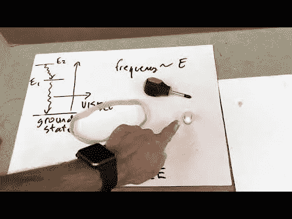

# MacGyver 第一季第 8 集科学笔记:开瓶器

> 原文：<https://medium.com/swlh/macgyver-season-1-episode-8-science-notes-corkscrew-42d868450bf3>

记住，我只是检查一下 MacGyver hacks 里面的科学内容。

**DIY 黑光灯**

这是相当合法的。MacGyver 在一个密室里，需要找一盏黑光灯来阅读墙上一些隐藏的文字。他说制造一盏黑光灯要比找到它容易得多。