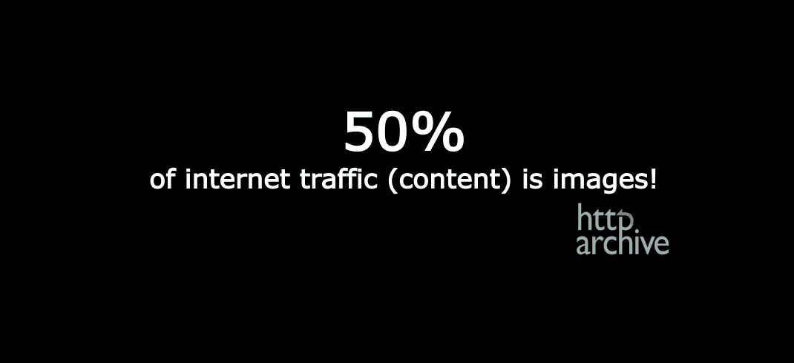
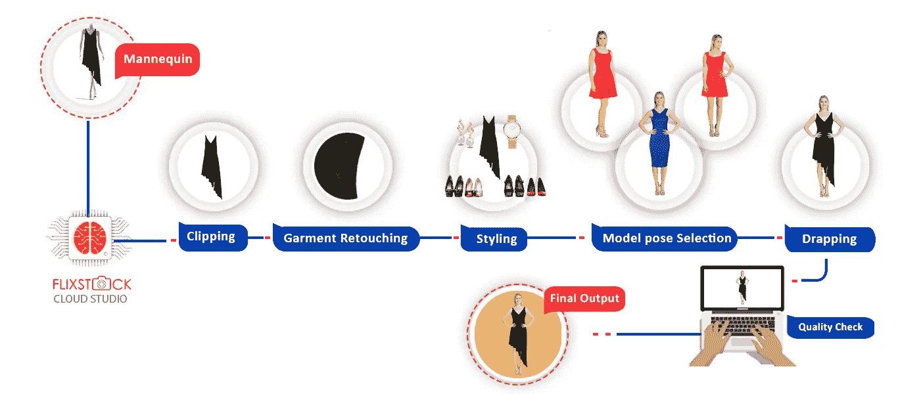
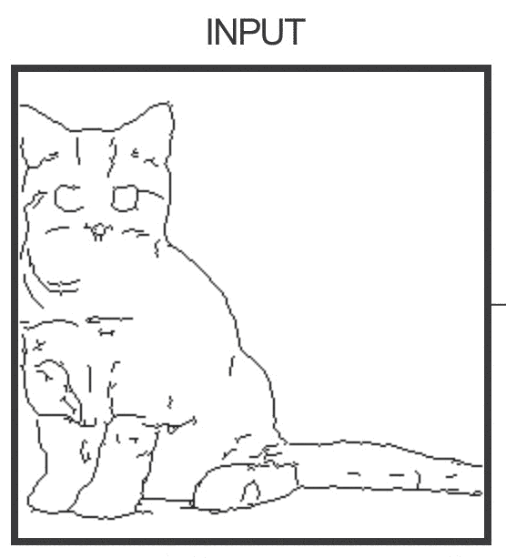
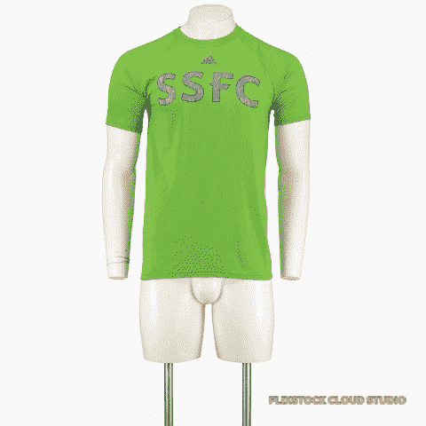

# 机器学习可以编辑图像…更好的是，创建电子商务目录图像！！！

> 原文：<https://medium.com/swlh/machine-learning-can-edit-images-better-still-create-ecommerce-catalog-images-e0c07f10ce23>

## 概述我们如何在 FlixStock 使用机器学习来编辑和创建新图像

source: State of the Web report by httparchive.org

大约 50%的电子商务网站都充满了图片！而正是这 50%才是影响大多数购房者决策的最关键因素。

然而，99%的图像是由熟练的“人类”创建和编辑的——这是一项重复而平凡的工作。在 [FlixStock](http://FlixStock.com) ，我们致力于用先进的软件解决方案取代这种重复性的工作。

使用人工智能创建和编辑图像有助于:

大幅降低错误率，

提高图像编辑的速度&最重要的是，

让熟练的“人类”在营销和创意图像中发挥他们的聪明才智！

# 机器学习和图像编辑

那么机器学习能有什么帮助呢？在 FlixStock，我们创建模型图像而不使用实际模型！我们所需要的只是一件衣服的图片。

我们怎么做呢？…我想象了我们遵循的流程，如下所示:

pic: FlixStock.com Image Generation process

这是一个不断发展的过程，至少有十几个机器学习和深度学习程序同时和/或顺序运行。我们有几个研究科学家日以继夜地工作，使这个过程比以往任何时候都更有效率。

这篇文章是一个与成长中的人工智能社区分享我们的方法、经验和学习的倡议。

# 深度学习和图像编辑

虽然我们已经看到深度学习(DL)在数据分析中的成功实施，以预测您最喜欢的节目或识别图像中的对象，但 DL 仍然没有广泛用于“创建”图像的过程。使用机器学习的图像处理是另一个组成部分。

有趣的是，这种“比以往任何时候都更受欢迎”的内容形式(阅读图片)——占据了世界互联网流量的一半——却不是我们这个领域的优先事项。尽管有许多有趣的项目&一些非常严肃的项目，但我们还没有在图像编辑中大规模实现深度学习。

是时候休息一下了:我偶然发现了这个有趣的项目，在这个项目中，DL 被用于图像创建。你所要做的就是画一只猫&机器会把它变成一只“猫”！下面是一个 gif 和更多结果的链接:

This is DL generated image of cat from a caricature. More results here: [http://bit.ly/2OQS6qW](http://bit.ly/2OQS6qW)

我承认大多数由#Pix2Pix 实验(【http://bit.ly/2OQS6qW】)生成的猫图像远非完美，但大多数绝对像猫！它重申了图像确实可以用人工智能生成。

# 语义分割&剪辑的艺术！

为了提取已识别的对象(例如:来自工作室背景的人体模型)，我们的一位研究科学家( [Beeren Sahu](https://medium.com/u/fd635964bb9d?source=post_page-----e0c07f10ce23--------------------------------) )在多次尝试后选择了语义分割。对于你这个 AI 爱好者，你可以在这里阅读他的语义切分实验详情: [**点击这里**](/@beeren.sahu/semantic-segmentation-of-garment-for-image-creation-with-deep-learning-c385bbb457b1)

有了几十万张图像的数据库，我们能够生成提取对象的近乎完美的图像。就像我们通过解决方案处理的这批 t 恤一样。

然而，有两个主要挑战:

1.为了加快处理速度，我们被迫使用小(尺寸)图像。

2.迁移学习本来会更快，但是输出图像的质量要求我们从头开始。

对于训练有素的眼睛来说，所得到的图像在边缘的像素级有问题。自然，语义分割(或深度学习)有其局限性。但是，随着每一个新的数据集，我们能够缩小这个问题。

出于实用的目的，我们将图像处理(ML)与语义分割相结合，以使图像更好和可用。

不是理想的解决方案，因为它增加了所需的时间&是处理能力的巨大占用者。然而，这是一个快速修复，直到我们的算法得到更好的训练(在不久的将来)。

现在我们已经分享了通过语义分割提取图像的方法，我们的研究团队的任务是为服装识别正确的模特姿势/姿态和配饰——这项任务听起来非常简单，但本质上非常艰巨。我们将在随后的文章中分享我们解决这个问题的经验。

同时，我们可以用你对这篇文章的“鼓掌”和“评论”来鼓励我们。

## 这篇文章发表在 [The Startup](https://medium.com/swlh) 上，这是 Medium 最大的创业刊物，有+ 373，071 人关注。

## 订阅接收[我们的头条新闻](http://growthsupply.com/the-startup-newsletter/)。

