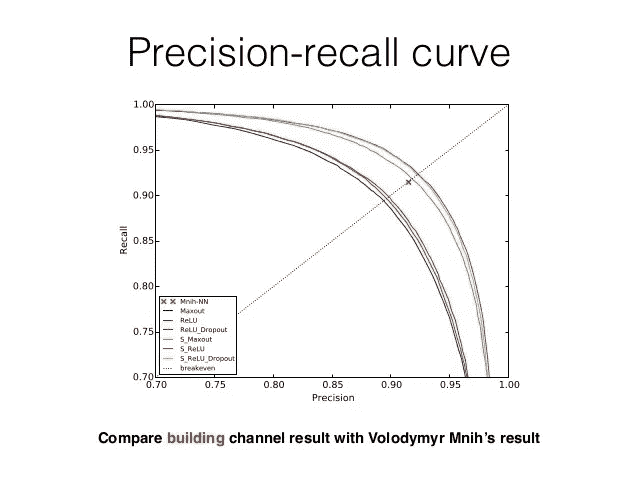

# 产品经理的机器学习:局限性

> 原文：<https://medium.com/swlh/machine-learning-for-product-managers-limitations-3d08a2ccc557>

他的文章探讨了两种机器学习 1 目前的一些局限性。图像分类(种类繁多)2。对话助手(广泛的用例)。

我还总结了一些考虑因素，以帮助决定使用机器学习来解决您的问题是否是一个好的选择。

为了给帖子提供结构，我为每种机器学习经历了这些 **5 个步骤**。

1.  指导原则
2.  执行测试
3.  **解释系统失败的原因？**
4.  如何在给定类型的 ML 中取得成功
5.  分享一些工作实例

# 图像分类

## 1.指导原则

> 关注几种类型的对象，而不是只针对一种环境的多种对象

## 2.执行测试

看一个物体比如一杯咖啡，看它是否分类正确，使用苹果的核心 ML InceptionV3 模型:

My cup of tea is picked up as a punching bag!

## 3.为什么会失败？

图像数据的可变性；假设你只想对咖啡和茶进行分类，你需要一个图像训练数据库来区分茶和咖啡，人眼几乎不可能做到这一点，那么计算机怎么可能做到呢？

图像分类的一些限制包括:

*   有限的数学来解决方向和可变性，一种新的模型最近出现来帮助解决这个所谓的[胶囊网络](/ai³-theory-practice-business/understanding-hintons-capsule-networks-part-i-intuition-b4b559d1159b?source=linkShare-2aff839e49dc-1520802045)
*   没有足够的图像数据来说明分类中对象类型之间的变化以及要识别的环境
*   图像分类之间重叠太多；计算机需要唯一可识别的信息才能区分物体！

这是蓝莓松饼和吉娃娃混在一起的另一个例子！

Credit: Mourad Touzani (LinkedIn)

## 4.如何成功

> 机器视觉的过人之处在哪里？放置在平面上的图像类别的集中子集，例如 25 种服装

上述示例中的一个关键注意事项是要识别的物品类型的位置+特异性的焦点。

给出一个图像分类机器学习问题，比如识别路上的车、人、路牌、动物，这就提供了位置上下文+待识别对象的具体范围。

## 5.工作示例:

*   自动驾驶车辆，这里是一个 bullbozer 惊人的实施！

*   监控视频片段以识别人脸
*   帮助您按面孔对手机上的照片进行排序

# 对话聊天机器人

## 1.指导原则

> 专注于一种类型的对话流以赢得胜利。

## 2.执行测试

我用谷歌助手做了一个简单的测试，试图获得明天要做什么的提示；一旦问到更多的细节，这个循环就被打破了。

Google Assistant on Nexus 6

## 3.为什么会失败？

这里的差距是背景，这些助理中的每一个都需要关于你的信息来真正提供价值！

> 就像第一次见一个人，你需要分享，然后才能得到。

对话聊天机器人的局限性包括:

*   没有上下文来向用户提供相关信息
*   不知道用户的任何个人信息
*   当用户正在寻找不同的对话时，迫使用户进入一种预定类型的对话

## 4.如何成功

与图像分类问题类似，明确你试图自动化的对话类型将有助于你取得成功。

这里有一个对话流程的例子，用来回答一个早上常见的问题:你昨晚睡得怎么样？

Credit: Pepper chat bot

更多详情[点击此处](https://newblog.kiwi.ai/converstation-framework/)

## 5.工作示例

*   客户关怀问题
*   回答问题的第一关(就像你拨打信用卡服务热线时的电话接线员)
*   建议秘诀/项目，如食谱、艺术地点、游戏。

[点击这里](https://chatbotsmagazine.com/2018-the-year-of-the-chatbot-fc5a5f780a31)查看克里斯·休斯在聊天机器人杂志上发表的详细文章。

# 考虑因素:

下面是一些问题和指导方针，让你问自己应用机器学习工具是否适合你的问题。

> 1.你**真的需要机器学习来为你的产品带来价值**吗？或者你可以简单地写出一组固定的数据点/条件，帮助你的产品半自动化
> 
> 2.你**有足够的数据来建立一个模型**吗？这个模型可以被充分地测试并考虑用户数据的变化？1000 个独特的样本被认为是每个分类状态的基线- **您能定义 10-100 个样本的分离吗？那你可能真的有所发现了！**
> 
> 3.在构建之前，你有没有和你的用户一起测试过，看看自动化是不是他们真的会使用或者想要的东西？五星用户可能会给你足够的反馈来决定第一次迭代；你能模拟构建自动化系统，看看人们是否会首先使用它吗？
> 
> 4.您是否评估过自动化和输出精度之间的**权衡？这被称为[精确召回曲线](https://www.quora.com/What-is-Precision-Recall-PR-curve?share=1)，根据所提供数据的可变性，输出结果的精确程度会有所不同。**

## 概括起来

*   专注于在你的整体挑战中占很小一部分的问题，建立一个可以提供自动洞察力的特定模型，而不是创建一个试图做所有事情的广泛模型
*   测试看看你是否有足够的数据，以及其他人是否能够得到你关注领域的结果(例如，在建立你自己的工具之前，尝试一下苹果或谷歌工具的工作情况)
*   与用户一起探索，看看他们是否想要你将要构建的东西
*   确保您在输出的准确性和预期结果之间取得平衡

> 你最不想要的就是一个减肥食品分类系统来说一杯茶就是一个出气筒！

## 这篇文章发表在《创业公司》杂志上，这是 Medium 最大的创业刊物，有 306，372 人关注。

## 订阅接收[我们的头条](http://growthsupply.com/the-startup-newsletter/)。

