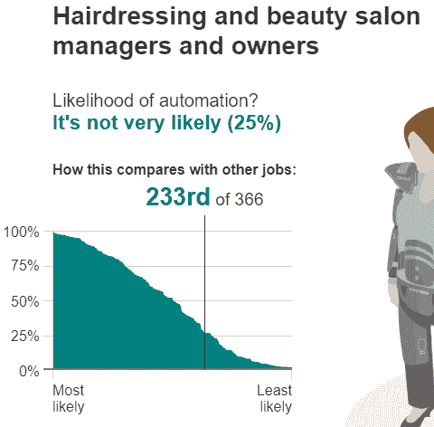

# 卡车司机的机器学习——为什么再培训还不够？

> 原文：<https://medium.com/swlh/machine-learning-for-truck-drivers-why-reskilling-wont-be-enough-95dcb35a95e7>

Photo by [Seb Creativo](https://unsplash.com/photos/3jG-UM8IZ40?utm_source=unsplash&utm_medium=referral&utm_content=creditCopyText) on [Unsplash](https://unsplash.com/search/photos/truck-driver?utm_source=unsplash&utm_medium=referral&utm_content=creditCopyText)

仅在美国，就有[350 万](http://www.alltrucking.com/faq/truck-drivers-in-the-usa/)职业卡车司机，该行业就业总人数超过 870 万。这仅仅是美国的情况。此外，这些卡车路线沿线有数百家企业——即使是这些地方经济也会在完全消失之前萎缩。

从农业耕作到工业工作的旅程是一个巨大的转变，它非常可行，但你不能指望卡车司机成为专业技术人员、程序员或自动化专家？甚至无法想象让卡车司机重新获得技能是一个潜在的解决方案。他们成为卡车司机是有原因的。

有几个其他的工作角色正在走向自动化。你的工作还在吗？自动化的可能性有多大？
**有两个计算器你可以用。你的工作会由机器来做吗？
[机器人会抢你的饭碗吗？](http://www.bbc.com/news/technology-34066941)**

以下是两个例子

[Will Your Job Be Done By A Machine?](https://www.npr.org/sections/money/2015/05/21/408234543/will-your-job-be-done-by-a-machine)

[Will a robot take your job?](http://www.bbc.com/news/technology-34066941)

# 为什么重新获得技能还不够？

技术的发展比以往任何时候都要快，比我们创新的需要更快，比我们学习和适应的速度更快。

> 即使你是一名技术专家，你也很难在不断减少的新技能半衰期和职业生涯的不断起伏之间找到平衡。

> 你必须接受一个令人不安的事实，那就是不会有一辈子只有一份职业的事情。

仅仅因为对雇主有利就强迫老龄劳动力进行技能再培训是个坏主意。仅仅根据雇主的时间表，围绕员工再技能和技能提升制定内部政策也不会有多大帮助。

如果你发现自己的职业偏离了轨道，那并不是因为你缺乏天赋、经验或教育。这些自动化技术进步带来了前所未有的根本性挑战——导致就业增长和生产率增长之间的历史关系被打破，这被称为[大脱钩](https://futuremonger.com/artificial-intelligence-and-the-great-decoupling-yogesh-malik-d2366e806c7c)。

布林约尔松和迈克菲[说](https://www.technologyreview.com/s/515926/how-technology-is-destroying-jobs/)

> 没有经济法则说每个人，甚至大多数人，自动从技术进步中受益

# 从这里去哪里？

技术失业的威胁是真实的。在即将到来的人工智能时代，人类做事的方式将是低效的，如果不是完全无用的话。我们需要放弃高效的想法，开始关注终生学习，找到一些有价值的目标。我们对工作的沉迷是病态的。是时候用不同的眼光看待成功、生活和事业了。

> 工作就是崇拜将来可能不太真实。

## 普遍基本收入

一个积极的前景可能是，夺走你工作与生活平衡的技术将试图通过向你提供免费资金来恢复这种平衡。有了像[全民基本收入](https://futurism.com/images/universal-basic-income-answer-automation/)和循环经济这样的解决方案，充分就业根本就不应该是目标。

这一旅程将会不同，随着新的经济重组，短期内人工智能技术所有者将积累所有财富，并试图[喂我们面包屑](https://www.theguardian.com/technology/2016/may/16/universal-basic-income-equality-tech-silicon-valley)。但从长远来看，这是不可持续的。

> 我们无法猜测在短期和长期之间会爆发哪些更具破坏性的技术因素，我们也无法控制这一进化阶段。

这一切都不容易，也没有人有计划。很少人会赢，而很多人会输。

## 这篇文章发表在 [The Startup](https://medium.com/swlh) 上，这是 Medium 最大的创业刊物，有 324，834+人关注。

## 订阅接收[我们的头条新闻](http://growthsupply.com/the-startup-newsletter/)。

