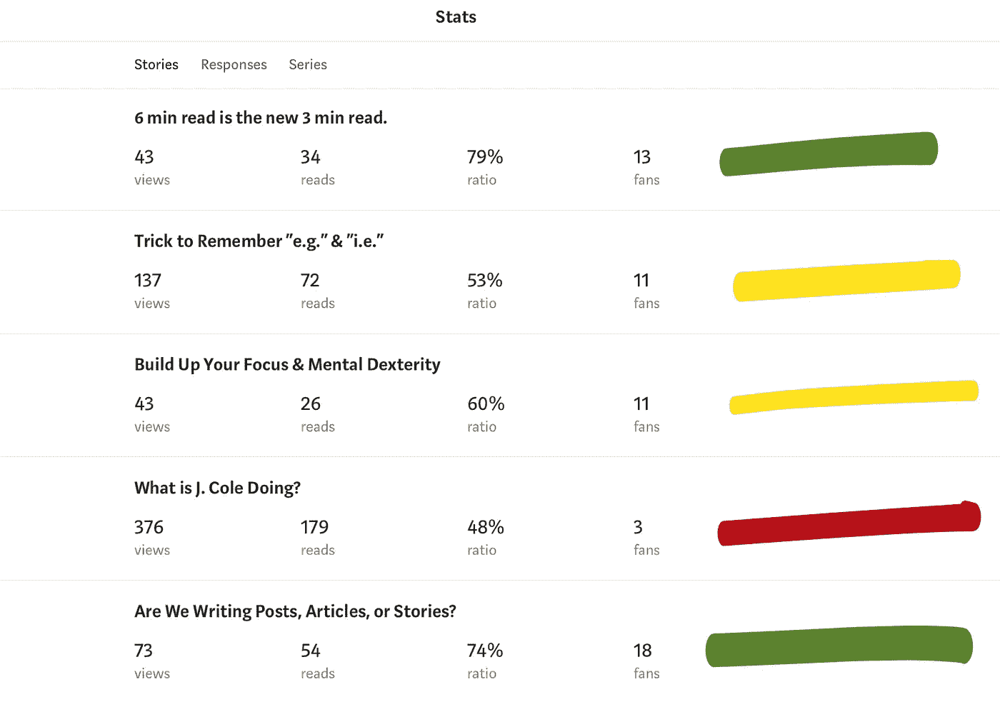

# 媒介优于传统博客的主要原因

> 原文：<https://medium.com/swlh/main-reason-medium-is-better-than-your-traditional-blog-76ed4aeed788>


Source: [Cayce Garrison](https://www.instagram.com/caycegarrison) via Instagram

对你来说，写作中最重要的是什么——现在不要想太多，但你衡量“成功”最有力的标准是什么

*   你把一切都归功于你的浏览量吗？
*   简单地提出一个观点，说一些有价值的事情，你会开心吗？
*   你会写“只是因为吗？”嘿，也许你真的很擅长！

> 有些人喜欢写博客，有些人只是喜欢，但对大多数人来说，这是有益的表达。

我吗？我写作有很多原因。

但是我还是要说出来:**我喜欢博客的统计和物流方面**。我不想撒谎，我看着这些数字。这就是我大脑的工作方式(也是我学习会计的部分原因)。

> 数字。他们讲述一个故事。一个非常无聊的故事，但仍然是一个故事。

统计数据是一种反馈的方式，可以告诉你什么是有成效的——更重要的是，它们可以作为观众的声音，告诉他们什么是有效的，什么是无效的。

最重要的是，这是一个制造更多人们真正想要的东西的机会。

> "数据不是一切，但别忘了，它们也是一切."

## 那又怎样？

我会告诉你为什么我关心阅读、喜欢、掌声和观点:因为它们意味着*什么。在大多数情况下，它们意味着一切！*

我不在乎你做什么，如果你在网上创作，你想知道谁对你的产品感兴趣(和参与)。博客的所有回报和好处都与此相关——内在的、财务的、统计的，等等。

**数据和信息就是一切。**

这就引出了我的观点:)

# 中等统计摇滚，其他人只是没有

哦，是的，你想知道媒体比传统博客更好的主要原因。

别担心，我有办法。简单。

这是统计数据。

《媒介》简洁明了，简单易懂，但内容全面且富有深度。我是说，看看这个(不，这不是 flex):



Medium Stats, iPad iOS

## 主要原因:

Medium 准确无误地追踪你的统计数据——这些数据不会像“普通”网站那样被夸大。

我也使用 WordPress，传统的博客方法，来管理我的网上小空间。在这样做的时候，我必须掌握我的博客的功能、移动性和设计。任何拥有博客的人都知道这一点的重要性。

> 我必须检查间距，链接，图形，加载时间，搜索引擎优化，并确保它看起来“正确”要做到这一点，我需要以一个真正的用户的身份来看待我的博客——通常，这意味着把我所有的博客数据都收集起来。

我知道，我知道有人在想:

" *Alec，有一种方法可以解决这个问题，如果你进入 Google Analytics，跟踪几个 IP 地址，学习代码，乘船游遍大西洋，重新登录 WordPress，点击带有街道标志的方块，查看你的博客，你就万事俱备了！"*

这里的问题是，当我查看我的博客时，我的博客将我识别为用户。我知道这是可以修复的…但是我已经试过了。我想不通。我只是承认我总是歪曲我的数字，我的数据并不尽如人意。

```
Oh, not to mention, my blog is already vulnerable to every virus, spam, and malware bug slithering the World Wide Web… and *I’m* the one doing damage. *Great*.
```

**所以，在这个非常关键的统计类别中，媒介胜出了。**

在这里，可以看看发表的作品——我知道我看到的*正是读者看到的*。我也不必为此感到内疚。

我从不担心我的数字是对是错。如果 Medium 告诉我有 50 人阅读我的文章，我有信心有 50 人阅读我的文章。

那么，你认为你的写作有什么价值？

如果你享受在网上拥有自己的博客的自由，我不会责怪你。传统博客既是礼物也是诅咒。

然而，如果你是一个“数字人”,你喜欢安全/准确的信息，中等是你的位置。

***- AZ***

*哟，哟，哟感谢阅读。👏🙌这篇文章很好，不是吗？看看我做的这个 lil thing，* [**以上是吸引人的中等帖子的平均指南。**](https://mailchi.mp/19b8b6f12767/the-ultimate-guide)

[](https://medium.com/swlh)

## 这个故事发表在 [The Startup](https://medium.com/swlh) 上，这是 Medium 最大的创业刊物，拥有 325，962+人关注。

## 在这里订阅接收[我们的头条新闻](http://growthsupply.com/the-startup-newsletter/)。

[](https://medium.com/swlh)