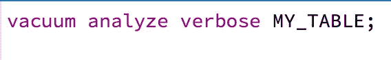
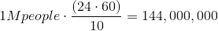
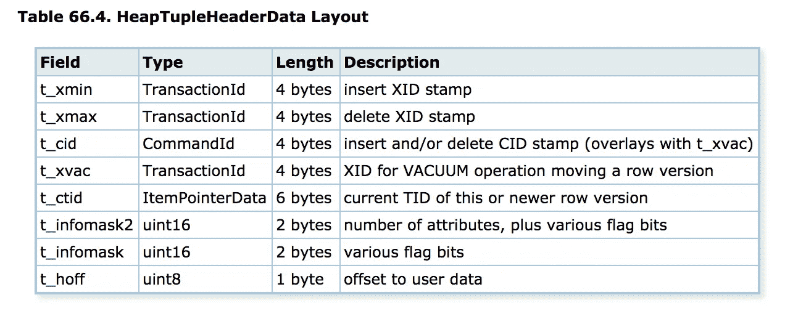

# 维护您的数据库

> 原文：<https://medium.com/swlh/maintaining-your-database-b9911167112f>

# 维护 PostgreSQL 的快速指南


by pexels.com

在过去的两年里，我一直在使用 PostgreSQL。它已经成为我的首选数据库，因为我可以对大型数据集执行查询。我还可以将它用作时间序列数据库，当然也是关系数据库的经典用法；实体间关系高度耦合的物流仓库。

我想和大家分享一下我最近在使用 PostgreSQL 时遇到的一个问题，以及我是如何修复的。



If you familiar with vacuum great! if not keep reading `vacuum analyze verbose my_table`

如果您已经使用 PostgreSQL，那么您已经知道它是一个非常好的数据库。有了最新版本的 PostgreSQL，2017 年 11 月发布了 10.1 版本，二进制 JSON 的支持(现在看来还是有很多 postgres 用户没有在用这个功能)几乎所有用例都能解决。

使用 PostgreSQL，如何管理数据库以及如何设计模式比使用什么类型的数据库更重要。如果您的表模式设计得很好，那么在迁移表时，您将最终节省时间，此外，您的数据库将执行得更好。

> 您也可以简单地通过不使用主键和外键来设计高内聚和低耦合的数据库，并将其视为 NoSQL 数据库。

**用例:**
我无法分享我遇到的确切用例。相反，我将描述一个具有相似参数的不同场景。

我有 100 万用户，我需要在整整一周内每 10 分钟跟踪一次每个用户的位置。我最终需要提供一份过去一周内*所有*的位置报告，以及他们在任何给定时间的当前位置。这意味着我的数据库中每天应该有 1.44 亿条记录(100 万人，每 10 分钟一次他们的位置)。



1M people, data sample every 10 minutes get us to 144M records per day

我每天运行一个 cron 作业，删除超过一周的所有记录。

```
// TODAY = 2018-01-01T00:00:00.000+00:00
DELETE FROM MY_TABLE WHERE created_at <= '2017-12-25T00:00:00.000+00:00'
```

到目前为止一切顺利，对吧？我不断地将数据插入到我的数据库中，并且每天一次通过删除来清除“旧”数据。

# **问题**

在最初的几个月里，数据库运行良好。但是，随着时间的推移，我开始发现它的性能存在一些问题。这令人惊讶，因为总记录数保持不变；这意味着在任何给定的时间都有一周的数据(多给或少给一天)。

我检查的第一件事是查看 cron 作业是否正在运行，但它运行正常。然后我检查了相同记录的数量。

```
select count(*) from MY_TABLE; //same number of records wtf?!
```

我使用 *psql* 来执行查询，当运行 *\dt+* 时，我注意到表的大小变大了，尽管我每天都在删除旧记录！！！

我接下来做的事情是检查我是否能在我的数据库中找到旧记录，但是它们不见了，奇怪。我意识到我别无选择，只能更深入地研究 PostgreSQL 文件系统，检查这些文件是否包含一些应该删除的旧数据。我打开十六进制编辑器，开始寻找数据。但是，一定有更简单的方法来检查 PostgrSQL 中的原始数据。然后…我找到了！pageinspect 模块为我提供了一些额外的功能来检查我的原始数据。

> `pageinspect`模块提供的功能允许您在较低的级别检查数据库页面的内容，这对于调试非常有用。所有这些功能只能由超级用户使用。—postgresql.org

在使用`pageinspect`模块时，我使用了`heap_page_items`函数，这对于查看堆页面上的所有行指针非常有用。显示所有元组，无论在复制原始页时元组对于 MVCC 快照是否可见。在我的情况下，这是被删除的内容。

```
SELECT lp, lp_len, t_xmin, t_xmax, lp_off from heap_page_items(get_raw_page('MY_TABLE', 0));
```

> 当运行`heap_page_items`时，你会注意到列名以`t_` 和`lp_`开始，这是因为它将引用元组和行指针。



Heap tuple header data

`pageinspect`模块中的另一个函数是`page_header`，它可以显示所有 PostgreSQL 堆和索引页共有的字段。

```
SELECT * FROM page_header(get_raw_page('MY_TABLE', 0));
    lsn    | checksum | flags  | lower | upper | special | pagesize | version | prune_xid
-----------+----------+--------+-------+-------+---------+----------+---------+-----------
 0/24A1B50 |        0 |      1 |   232 |   368 |    8192 |     8192 |       4 |         0**Hello MVCC (also known as MCC)**
```

到目前为止，我意识到使用 delete 语句删除记录并没有从数据库中清除空间。我需要挖掘 PostgreSQL 的源代码，以便了解我的数据库内部发生了什么。

在试图找出像`t_xmin`和`t_xmax`这样的列时，我意识到 PostgreSQL 的实现是一行有不止一个副本，这些行将有不同的`t_xmin`和`t_xmax`值，这解释了为什么我的数据库在使用`count`方法(`SELECT count(*) FROM MY_TABLE`)时尽管行数保持不变，但大小却在增长。

`t_xmin`和`t_xmax`是 MVCC 的 PostgreSQL 实现的一部分，其中`xmin`列记录创建行的事务 id，而`xmax`记录通过更新或删除使行过期的事务 id。

# **等什么？MVCC？**

> 多版本并发控制(MCC 或 MVCC)是一种并发控制方法，通常由数据库管理系统使用，以提供对数据库的并发访问，并在编程语言中实现事务存储器。[1]—[wikipedia.org](https://en.wikipedia.org/wiki/Multiversion_concurrency_control)

我意识到 PostgreSQL 保存了一行的多个副本。这很有意义，因为我们希望即使在数据库执行写操作时也能够从一行中读取数据。

PostgreSQL 如何找到行的当前版本？那就是`t_ctid.` 过去，当没有为一行使用唯一标识符时，我使用`ctid`删除重复的记录。

> `t_ctid`是指向行的指针，PostgreSQL 中的每一行都有一个指向当前行的`ctid`。

总结一下这个问题，我每天插入 1.44 亿条记录，但它们从未从我的数据库中完全删除，这是因为配置没有触发负责从文件中移除指针和删除记录的`VACUUM`进程。

# 解决办法

像任何其他 bug 或问题一样，我们作为程序员面临的 90%的问题是理解问题。我将把我的解决方案分成两部分，

*   **确保每周运行** `**VACUUM FULL**` **。** 我应该在运行完`DELETE`查询后运行一个真空。
    
*   **删除重复值**(如果用户位置没有变化，我们为什么要每 10 分钟存储一次用户位置)。
    使用`ctid` 删除重复值，方法是将表格与自身进行比较，并确保仅保留一个`ctid`(唯一记录)，同时仅删除同一用户在同一位置的记录。(我也可以使用记录的创建日期`created_at`，以确保删除 4 小时内的记录`WHERE x.created_at < (y.created_at + 4 hours)`)。

```
DELETE FROM MY_TABLE x USING MY_TABLE y 
WHERE x.ctid < y.ctid and 
x.user_id = y.user_id and 
x.latitude = y.latitude and 
x.logitude = y.logitude
x.created_at - y.created_at < 4 HOURS;
```

# 自动驾驶解决方案

从表中删除行不会从我的表中清除空间，我需要确保我的表被清空，并通过适当的配置频繁地进行分析。我也可以通过设置`autovacuum`来改变我的表格。

```
/*
Specifies the minimum number of inserted, updated or deleted tuples needed to trigger an ANALYZE in any one table.
*/
ALTER TABLE MY_TABLE SET (autovacuum_analyze_threshold = 100);/* 
Specifies a fraction of the table size to add to autovacuum_analyze_threshold when deciding whether to trigger an ANALYZE. The default is 0.1 (10% of table size). 
*/ 
ALTER TABLE MY_TABLE SET (autovacuum_analyze_scale_factor = 0);/*
Specifies the minimum number of updated or deleted tuples needed to trigger a VACUUM in any one table. The default is 50 tuples.
*/
ALTER TABLE MY_TABLE SET (autovacuum_vacuum_threshold = 100);/*
Specifies a fraction of the table size to add to autovacuum_vacuum_threshold when deciding whether to trigger a VACUUM. The default is 0.2 (20% of table size).
*/
ALTER TABLE MY_TABLE SET (autovacuum_vacuum_scale_factor = 0.2);
```

手动运行的方式将是:

```
VACUUM ANALYZE MY_TABLE;
```

我喜欢仔细检查每一件事，确保程序按照我设置的那样运行。为了检查`vacuum`流程是否正常运行，我使用了如下查询:

```
SELECT relname, last_vacuum, last_autovacuum, last_analyze, last_autoanalyze
FROM pg_stat_all_tables
WHERE schemaname = 'public' AND 
relname = 'MY_TABLE';
```

# 结论

我认为 PostgreSQL 是一个了不起的数据库。但是像其他工具一样，你需要知道如何使用它。在创建模式之前，需要进行大量的规划。但更重要的是理解你的数据；
你的数据会有多大，你想用你的数据解决什么问题。

我希望这篇文章能帮助你了解如何维护你的 PostgreSQL。请在推特上关注我。如果你有任何问题，我很乐意回答。

# 学分和参考

Postgres 文档—[https://www.postgresql.org/docs/9.5/static/sql-vacuum.html](https://www.postgresql.org/docs/9.5/static/sql-vacuum.html)

github 上的 Postgresql 源代码—[https://git.postgresql.org/gitweb/?p = postgresql.gita = blobf = src/include/access/htup . h；h = 0 e 626 e 8469 CD 67973 faccc 38d 3 af 511 eed 30 ea 2；hb=HEAD#l70](https://git.postgresql.org/gitweb/?p=postgresql.git;a=blob;f=src/include/access/htup.h;h=0e626e8469cd67973cfaccc38d3af511eed30ea2;hb=HEAD#l70)

[](https://github.com/postgres/postgres/blob/be72b9c378bfe99a3d175c98d36dc150229f4faf/src/backend/postmaster/autovacuum.c) [## postgres/postgres

### 官方 PostgreSQL GIT 存储库的镜像。请注意，这只是一个“镜像”——我们不能使用“拉”……

github.com](https://github.com/postgres/postgres/blob/be72b9c378bfe99a3d175c98d36dc150229f4faf/src/backend/postmaster/autovacuum.c) 

## 这个故事发表在 [The Startup](https://medium.com/swlh) 上，这是 Medium 最大的企业家出版物，拥有 292，582+人。

## 在这里订阅接收[我们的头条新闻](http://growthsupply.com/the-startup-newsletter/)。

