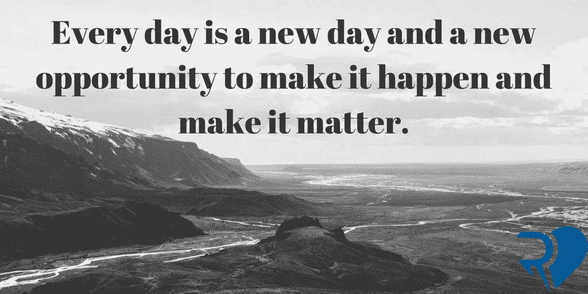

# 让它发生，让它有意义:激励你的简单钥匙

> 原文：<https://medium.com/swlh/make-it-happen-and-make-it-matter-simple-keys-to-your-motivation-1453ebc2f96>

# 你失去动力了吗？

当你反思当前的生活时，问问自己，[是否缺少了什么](https://www.theartofubyrebecca.com/single-post/2017/07/20/5-Steps-to-Boosting-Your-Self-Confidence)？

你是否努力追求更多，却缺乏走出舒适区的**动力**和信心？

如果你不知道如何启动你的动力，花一分钟关注你的内在自我。是什么阻碍了你？是恐惧，还是[缺乏自信](https://www.theartofubyrebecca.com/single-post/2017/07/20/5-Steps-to-Boosting-Your-Self-Confidence)？

不管是什么阻碍了你取得更多成就，有一点是肯定的——让事情发生将从你开始。当你改变你目前的心态，明白你在驾驶座上，你很快意识到一切皆有可能。

# 走出去，让事情发生——真正重要的事情。

# 今天掌控一切

## 我们喜欢借口，不是吗？

指责他人或我们的环境比承担责任更容易。然而，当你变得更有动力，开始释放你真正的潜力时，你会发现你总是有能力成为最好的自己。

我们每个人都有自己独特的目标感，所以问问自己，是什么激励着你，让你乐观，给你一种意义感？这将引导你进入内在动力的核心。

接下来，想想你的个人优势。他们如何帮助你实现短期和长期目标？你的优势如何给你自信？

# 进入你的动力区

以下建议将帮助你实现目标:

*   **从小事做起**——[改变你的视角](https://www.theartofubyrebecca.com/single-post/2017/06/12/Problems-are-Opportunities-in-the-Land-of-I-can)对自己要求更多不会一蹴而就。每一天，你都需要朝着更积极的自我形象迈出一小步。每一个小小的行动都会带来巨大的成果，并建立你的*。*
*   *练习想象——你是否经常梦到可能发生的事情？为什么不把这些梦想变成现实呢？当你想象你想要在生活中处于什么位置时，这种精神意象可以作为你的指路明灯，给你一种 ***乐观*** 的感觉。视觉化鼓励一种新的人生观，产生灵感和积极的行动。这些变化将来自内心，所以保持专注、积极，最重要的是，对自己有信心。*
*   *保持对真实自我的真实——当你真正放下阻碍你的恐惧时，你将开始发展你真正的自我意识。当生活试图把你变成另一个人时，你需要倾听自己内心的声音。无论如何，忠于你的核心价值观，敢于冒险，身边都是鼓舞人心的人。*

*勇敢的挑战你现在的日常生活，回想一下托尼·罗宾斯曾经说过的话，*

> **“改变你的故事，改变你的人生。让限制的故事离婚，让真相的故事结婚——一切都会改变。”**

*从今天开始，专注于一个让你兴奋和激励的目标。采取积极主动是你力所能及的。从坚持你的个人力量、真实性和真理开始。*

# *这是你的生活。你准备好去生活了吗？*

*改变你的故事从问难题开始，以真相结束。当你能清楚地看到真相时，走自己独特的路去过自由和真实的生活就变得更容易了。*

**

## *这个故事发表在 [The Startup](https://medium.com/swlh) 上，这是 Medium 最大的企业家出版物，拥有 298，432+人。*

## *在这里订阅接收[我们的头条新闻](http://growthsupply.com/the-startup-newsletter/)。*

**