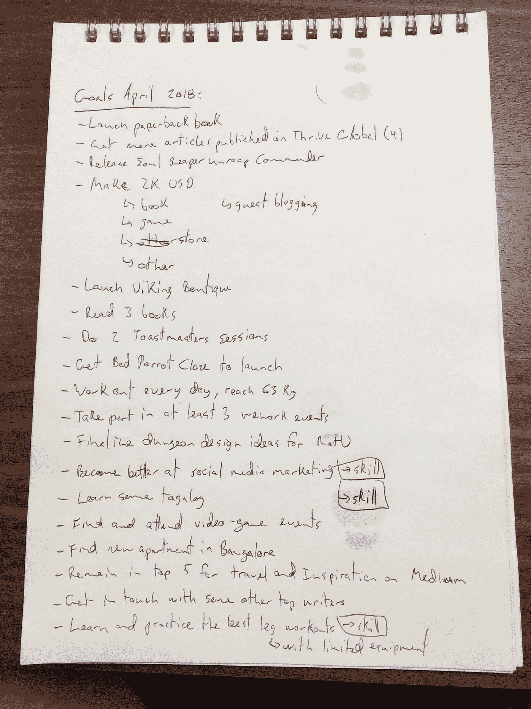

# 使用这三步策略，让下个月成为你最有效率的一个月

> 原文：<https://medium.com/swlh/make-next-month-your-most-productive-month-ever-using-this-3-steps-strategy-7b10fc04a72f>

Photo by [@brookelark](https://unsplash.com/@brookelark) on [Unsplash](https://unsplash.com/photos/jtvGydbUn30)

四月即将来临。我个人对此感到非常兴奋！

是吗？

我喜欢新月份的开始。这就像一个重新开始的机会。努力完成比前一个月更多的任务。为了自己和周围的人成为更好的人。

仅在第一周，我就发布了我的新书、[、我的游戏](http://powerlevelstudios.com)以及[开设我的网上商店](http://www.vikingboutique.com)。

我怎么能不为此兴奋呢！我可以就此打住，这已经是一个多产的月份了。

但我不会！

使用下面的策略，我会让四月成为我一生中最有效率的一个月。

你也可以这样做！

# 战略

有一句话很好地总结了这一战略:

> “把事情想清楚，然后坚持到底。”—埃迪·里肯巴克

以下是更详细的策略:

## 第一步:回顾上个月的成就

*   你上个月过得怎么样？
*   你朝着目标完成了什么？

大多数人不会反思过去的成就或“失败”，然而正是通过理解这些经历，我们得以学习和成长。要变得更有效率，一件很重要的事情是:意识到你哪里有效率，哪里没有效率。

1.  列出你的成就和“失败”。深入细节。
2.  对它们进行定性和量化。这是一项伟大的成就吗？这是一次史诗般的失败吗？给他们一个你选择的数值等级。0-10 对我来说很好。
3.  写下你如何改进每一个方面。写下什么是对的，什么是错的。

也慢慢做吧。没有必要操之过急。如果要花 4 个小时去做，最后也是值得的，相信我。

## 第二步:在开始前几天列出你这个月的所有目标

就在 30 分钟前，我去了一个安静的房间，开始思考我想在四月完成的所有目标。像往常一样，我变得有点疯狂，但正如我常说的那样:“志存高远！”。我倾向于完成我设定目标的 80%。如果我的目标不是那么高，我的成就会少得多。

以下是我未经编辑的四月目标清单(接下来几天我会在日志的其他页面添加更多细节):

My list of goals for April. Don’t mind the chips stains and the terrible writing…

*   你觉得这些目标听起来很疯狂吗？
*   听起来太简单了吗？
*   你们有相似的目标吗？
*   你的目标是什么？

理想情况下，你应该更精确一点。这只是一个草稿。稍后我会添加有趣的细节，但这是一个很好的第一步。

在列表中，**我通常会包括** [**3 个我想学的新技能**](https://www.forestco.co/blog/i-learn-3-new-skills-a-month-and-so-can-you) **、我想发布的东西、我会赚钱的方式(以及多少)、我想参加的活动、我想继续或开始做的事情**等等。

还是那句话，像上一步一样，不要急这个。我通常花 4-8 个小时来计划我的下个月。细节需要时间。

通常，对于我的目标清单上的每一点，都有 3-10 个子点。尽可能详细地描述，这将使你更容易跟踪你的进展。

## 第三步:在一个月内定期跟踪你的进展

很简单。每周回顾一下你的目标进展。在一周的最后一个工作日，留出 1 到 2 个小时来再次检查你的清单。

这类似于该过程的第一步，但发生在更现实的时刻。检查你做过的事情。分析他们的“成功”,并采取正确的行动——这是每周跟踪你进步的主要原因。

如果你不定期跟踪你的进展，你会偏离你的目标。

不可避免。

有时候我们觉得自己太忙了，没有时间后退一步，但是相信我，这样做更有成效，并且为接下来的一周制定一个更好的行动计划。

# 结论

*   你有没有遵循类似的策略来让你的几个月富有成效？
*   你认为你能为自己工作吗？
*   你有更好的策略吗？如果有，你的策略是什么？为什么更好？

欢迎在评论区分享你的答案。我回应他们！

把事情想清楚，然后坚持到底。六个字。记住他们。

回顾上个月，计划下个月，定期跟踪你的进展。这是一个任何人都可以做的简单策略，它会让你更有效率。

你能做到的！

**感谢阅读和分享！:)**

**如果你喜欢这个故事，请随意**👏👏👏**几次(最多 50 次。说真的)。关注我更多类似的故事！**

如需生产率方面的额外帮助及更多，请访问 dannyforest.com。

## 这个故事发表在 [The Startup](https://medium.com/swlh) 上，这是 Medium 最大的创业刊物，拥有 310，538+人关注。

## 在这里订阅接收[我们的头条新闻](http://growthsupply.com/the-startup-newsletter/)。

