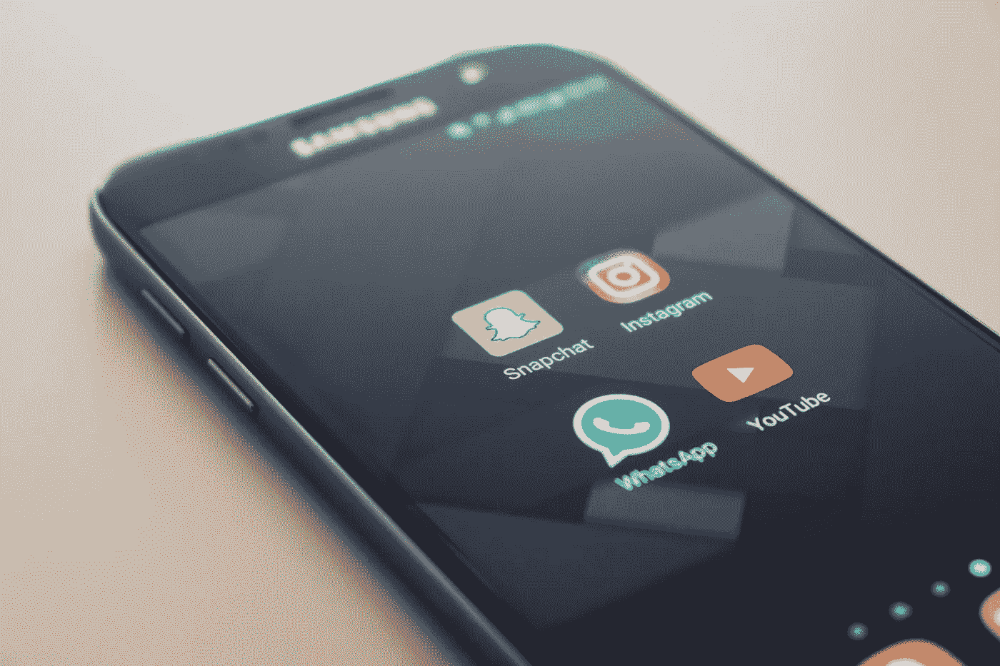
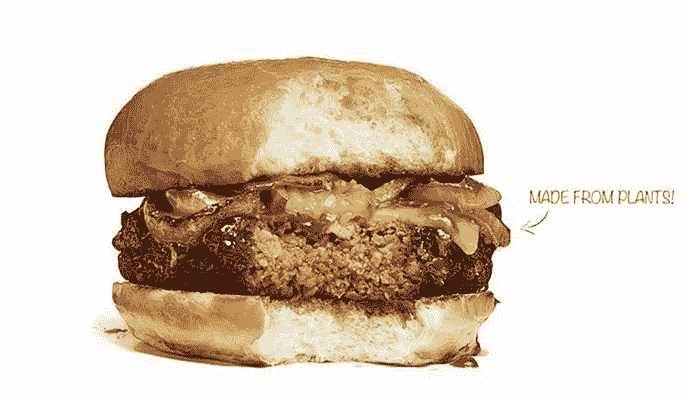
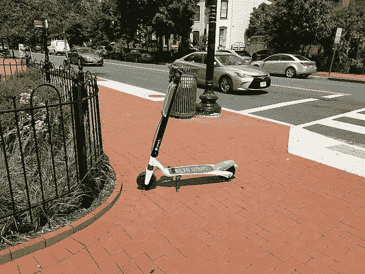
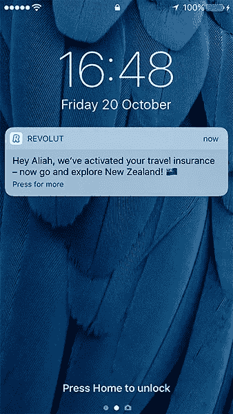
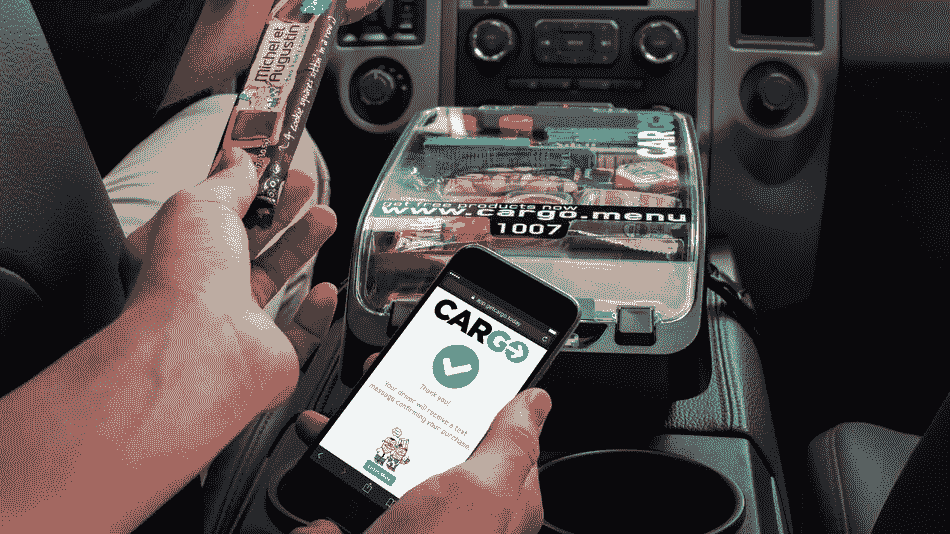
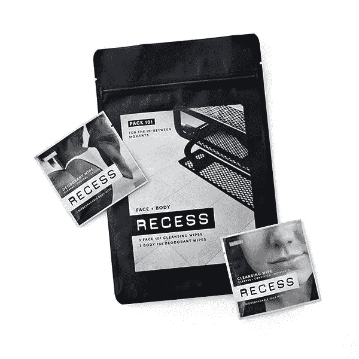

# 让拖延付出代价！

> 原文：<https://medium.com/swlh/make-procrastination-pay-cfd035dbfb7c>

## 以下是如何将你的社交媒体信息转化为你下一个好主意的来源。

Photo by [Christian Wiediger](https://unsplash.com/photos/ZYLmudR28SA?utm_source=unsplash&utm_medium=referral&utm_content=creditCopyText) on [Unsplash](https://unsplash.com/search/photos/social-media-feed?utm_source=unsplash&utm_medium=referral&utm_content=creditCopyText)

你知道[统计数据](https://web-assets.domo.com/blog/wp-content/uploads/2017/07/17_domo_data-never-sleeps-5-01.png):创建了 2.5 万亿字节的数据(那是 10 亿亿，或者 18 个零！)每到*日*；每分钟*发送 456，000 条推文，46，740 条 Instagram 帖子和 1.03 亿封电子邮件。*

但不仅如此，你还能感受到它们。潜入你的收件箱和社交媒体所释放的竞争压力。威胁到你的业务的新创业公司的故事，大品牌闯入你的领地，令人兴奋的新众筹项目吸引了关注。其他五个团队都在你上线的几天内提供你的“独特”功能。对任何经商的人来说，这是最好的时代，也是最坏的时代。

跟上感觉几乎不可能，但同时，你不能阻止自己尝试。但是如果你真的可以把这种半无意识的滚动变成你的秘密武器呢？

**如果你知道如何从商业新闻故事中获得洞察力，帮助你预测*你的*客户的未来需求，你的社交媒体反馈*可以成为你的创新超级力量。***

# 将您的订阅变为(免费！)客户智能

有些违背直觉的是，观察商业创新— *而不是*消费者本身——最能让你了解你的客户未来对你的期望。怎么会这样呢？

因为你的客户的未来期望是由他们今天的经历塑造的。

在吃了一个不可能的汉堡后，你对可持续性、口味和放纵的想法不可能不受到挑战*不是*。在通过 Snapchat 看到你朋友的脸在视觉上得到增强后，不可能*不*想知道——有意识地或下意识地——还有哪些信息可以增强现实。在你花了几分钱把一辆 Lime scooter 停在目的地外面之后，你不可能不质疑私有制是否永远是最好的模式。

Novel innovations set customers’ expectations.

每一分钟，你的 feed 都充满了将客户期望推向新高度的企业的例子。与此同时，他们还为您提供了无与伦比的着眼于未来的客户洞察力来源。

每一项新的商业冒险都是对未来的赌注。任何推出新品牌、产品或服务的人都希望迎合当前和预期的未来客户需求。

找到正在下类似赌注的多个参与者(最好是在不同的行业和/或市场)，你就可以开始对你的客户走向做出强有力的结论。

# 驯服信息野兽

现在你明白了*为什么*你的新闻源是如此强大的来源，是时候看看将它们转化为可操作情报的实际步骤了。

Clayton Christensen 写道，对于一个企业来说，了解其客户是多么重要”[要做的工作](https://hbr.org/2016/09/know-your-customers-jobs-to-be-done)。一个著名的例子是，没有人真正购买钻头；相反，他们买了一个钻子在他们的墙上钻孔。这个洞是“要做的工作”。

无论你的产品和服务能提供什么样的工作，它也能帮助顾客满足某些“更大”的基本需求。在上面的例子中，这个洞可能是保护他们家的一部分，一个可以悬挂反映他们良好品味的艺术品的钉子，或者一张具有情感价值的家庭照片。

好消息是，这些基本需求和欲望不会逐年发生太大变化，即使是千年不变。对社会地位的追求，对安全和社区的渴望，追求便利，寻求相关和可信的信息……不胜枚举。

当然，新技术的出现使人们能够以新的方式实现这些需求——在社交媒体上与朋友和家人联系；在共享经济中信任同行；实时访问超本地信息——但潜在的人类需求和愿望不会改变。

**当你理解了对你的业务至关重要的一些基本的人类需求和欲望时，你就能从你的新闻源中分离出信号和噪音。**

假设便利性是*对你的客户来说*关键的消费者‘要做的工作’。有了它作为你的北极星，当你看到各种行业和市场的创新者如何提高这一领域的客户期望时，你将能够获得有价值的见解。

你将能够加入拼车应用 Grab 的[车载零售服务](https://grab.getcargo.today/riders)和金融科技初创公司 Revolut 的[自动旅行保险](https://blog.revolut.com/introducing-our-powerful-new-geolocation-travel-insurance/)服务之间的点；介于 Spyce 餐厅的[机器人厨师](https://www.spyce.com/)和美容品牌 success 的[移动无水个人护理袋](https://myrecess.co/)之间。

Three startups raising expectations around on-the-go convenience.

所有这些举措会取得巨大成功吗？不要！

但是，新颖、小众甚至“琐碎”的创新是未来主流行为的微弱信号。从脸书到 Snapchat，从网飞到 Zipcar，从 Method 到 Tesla，颠覆性的新进入者最初常常被那些不能超越新奇事物并询问这些业务如何重新定义客户期望的人所摒弃。

# 压倒* *就是*了*的机会！

我们都面临着前所未有的压力。没有人有奢侈的花费几个月甚至几个星期深入研究你的下一个大动作。即使您这样做了，变化的速度意味着当您收集数据时，世界和客户的期望已经发生了变化！

你需要一条捷径。史蒂夫·乔布斯有一句关于创新的名言:

> 我们的工作是在他们行动之前找出他们想要什么。。。人们不知道他们想要什么，直到你给他们看。这就是我从不依赖市场调查的原因。我们的任务是阅读页面上还没有的东西。

关注颠覆性的、设定预期的创新有助于你阅读客户页面上还没有的内容。看看其他企业在为他们的客户做什么，以及和他们一起做什么。看看那几页上的内容。然后自己写。

## 学到了什么？单击👏说“谢谢！”并帮助他人找到这篇文章。

[*亨利·梅森*](https://www.linkedin.com/in/henry-mason-3689572/) *是《趋势驱动创新》(Wiley)一书的作者，也是全球精品消费趋势公司 TrendWatching 的董事总经理，该公司在 60 多个国家拥有 1000 多家客户。*

## 这篇文章发表在 [The Startup](https://medium.com/swlh) 上，这是 Medium 最大的创业刊物，拥有 356，974+人关注。

## 在此订阅接收[我们的头条新闻](http://growthsupply.com/the-startup-newsletter/)。

