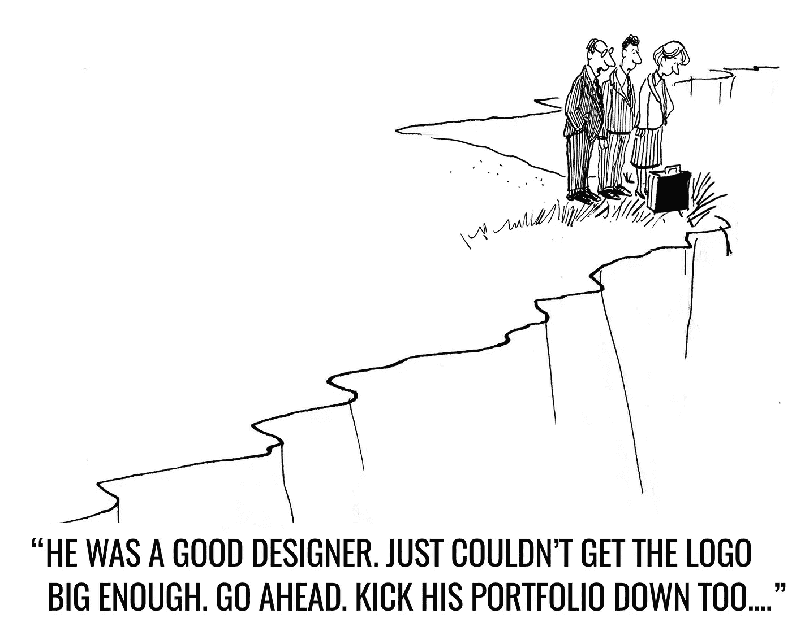

# “让标志更大”:来自地狱的品牌续集

> 原文：<https://medium.com/swlh/make-the-logo-bigger-the-branding-sequel-from-hell-ec4bef7fe25f>

## ***(以下虽然虚构，但基于现实生活中的观察。)***

所以，客户给我回了邮件，“看起来不错。现在，我们能不能把标志放大一点？”

我想，哦，好家伙。

又来了。

> 在全世界的设计师和品牌顾问中，让 logo 变大是一个痛苦的笑点，客户要求“让 logo 变大”几乎和“看起来很棒”一样令人憎恶。你能做一个小小的改变吗:试试 Helvetica 的标志？”现在回到我们的故事。)

标志放大 50%。其他要素相应减少。

邮件回复，“好多了。我们能从视觉上看一下吗？视觉效果似乎太过强烈，关键潜在客户可能会错过我们的徽标。”

*哦兄弟。*

午饭前，编辑完成并通过电子邮件发送过来。有很多要消化。

一个小时过去了。

两个小时过去了。

4 点 45 分，邮件回复终于回来了。我被告知他们的营销委员会已经看过了，并花了一个下午在员工中进行了一次内部调查。

上面写着，“干得好！请将标题和徽标放大，使其填满页面的下半部分。相应地调整所有其他组件。”(被迫不停地听巴瑞·马尼洛的音乐，缓慢而痛苦地死去，现在看起来非常好。)

恼怒之下，我让它在一夜之间沉淀下来。

慢慢的飘向睡眠，我一直在想，“他们怎么会看不到最初设计提交的完美呢？它是品牌的。所有被调查的接触点都被纳入…怎么会？*如何？*为什么？…"

经过一夜短暂而不安的睡眠，我第二天早上到达办公室。我在 27 英寸的显示器上看着最初提交的内容，仍然迷惑不解。

我有所怀疑。

我给客户发邮件问了一个问题。

邮件回复说，“当然是在我们的智能手机上。”

*我问的问题？*

“你用什么来证明这一点？”

然后，我告诉客户，我将发送一份*全新的方向图*，完全修改过的，而且*为了充分理解它，*有必要和他们的委员会在*全尺寸电脑显示器*上对此进行审查。

不到 10 分钟，客户已经在他们的全尺寸电脑屏幕上看过了，他发邮件给我说，“这太完美了！完全搞定了。完美的标志尺寸！感谢所有的辛勤工作和实施我们的建议！委员会给你留了一个新鲜的烤甜甜圈，供我们今天晚些时候开会时吃。”

新设计送来了吗？

*最初的设计。*

好了，巴瑞·马尼洛的 8 声道录音带在哪里？

(经验教训:设备的尺寸确实很重要。)

# 恭喜你。你完成了这个故事。现在，坐下来享受你自己的视频奖励:

*最初发表于*【www.risingabovethenoise.com】

**

**发表于* **创业、旅游癖和生活黑客***

******

*-*