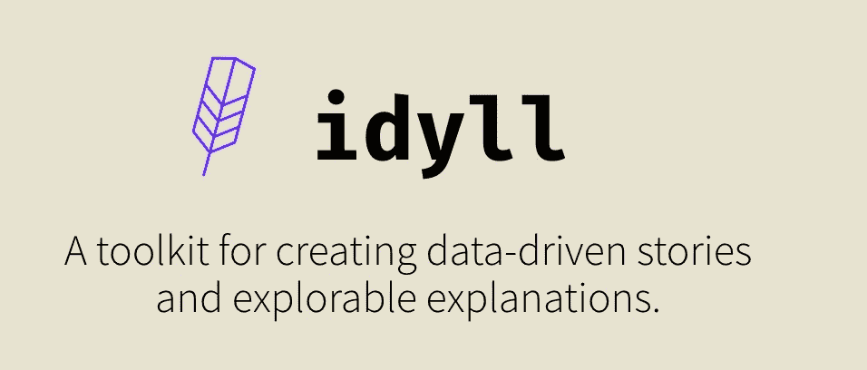

# Idyll-lang:用交互式数据驱动的故事让你的应用脱颖而出

> 原文：<https://medium.com/swlh/make-your-app-stand-out-with-data-driven-stories-b6d6f2c2449c>

[**Idyll**](https://idyll-lang.org/) is an open-source markup language and web runtime

# 你知道现在什么最热门吗？

可探索的解释。

可探索的解释是数据驱动的文档，具有交互性。你在网上看到过许多 EE，每个人都喜欢它们！