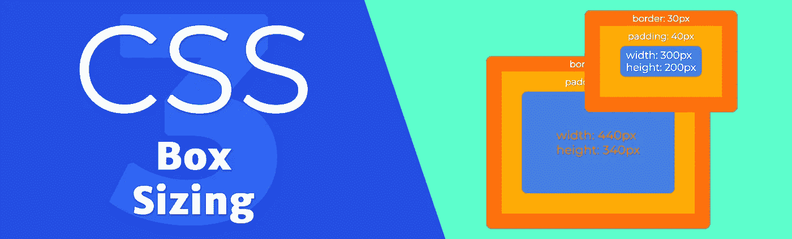
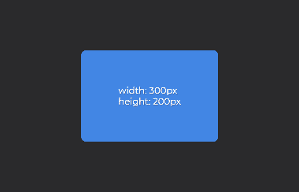
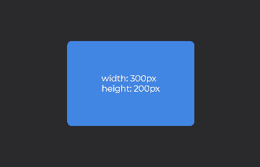

# 使用 CSS 框大小调整让您的生活更轻松

> 原文：<https://medium.com/swlh/make-your-life-easier-with-css-box-sizing-3b6b2578bccd>

## 停止浪费时间重新计算元素的尺寸

属性是一个简单的概念，它可以使你的开发更快，因为它允许你不计算元素的尺寸。它定义了如何将属性`padding`和`border`添加到一个元素中。

有两个值:`content-box`，缺省值，和`border-box`。当属性设置为 default 时，填充和边框被添加到总元素'`width`和`height`，从而将其放大。如果您想要更改元素的尺寸，您必须相应地进行调整:

content-box

`border-box`值将`padding`和`border`添加到元素中，而不改变其尺寸。内容可用的空间被缩小，以便为它们腾出空间。任何时候更改元素的尺寸，都会自动为您重新计算:

border-box

需要记住的一点是:`box-sizing`不适用于`margin`，它永远不会被添加到元素的维度中。

你也可以在[代码草图频道](https://youtu.be/pzAQhYrRbzc)找到视频解释🎬。

感谢阅读！✌️

## 这篇文章发表在 [The Startup](https://medium.com/swlh) 上，这是 Medium 最大的创业刊物，拥有+403，714 名读者。

## 在这里订阅接收[我们的头条新闻](http://growthsupply.com/the-startup-newsletter/)。

