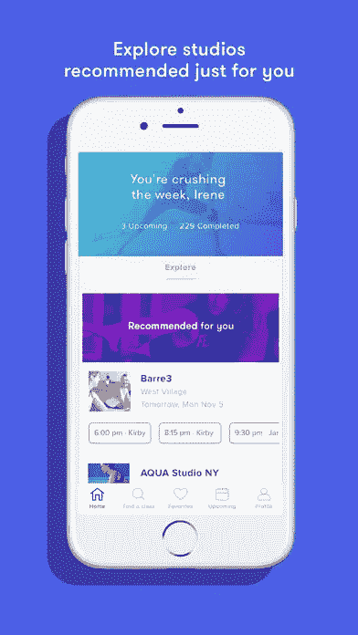

# 让你的新年决心具有容错性

> 原文：<https://medium.com/swlh/make-your-new-years-resolutions-fault-tolerant-7def95b08760>

## 第 2 部分，共 3 部分:保证成功所需的产品、应用和其他东西

## 那么，现在你有你的[愿望纲要](/@parkerkvaughn/make-your-new-years-resolutions-fault-tolerant-1e6d3ac15511)了吗，或者至少有一些任意的计算机生成的承诺？很好。是时候内置一些软件和应用程序支持了。

当谈到帮助组织你的生活和目标的软件时，我整理了一些我个人最喜欢的。然后，我向一些同事和朋友询问了他们赖以生存的应用程序。看看你的目标，决定哪些应用程序可能真正对你有帮助。我真正相信的那些将有益于我在“一般”部分中包含的所有内容。

# **将军**

[特雷罗](https://trello.com/):特雷罗记录每一件事，从大图到小细节。

Example Trello Board

富有成效的:你需要这些工具来建立一个积极的、改变生活习惯的日常生活。

[IFTTT](https://ifttt.com/discover) :帮助您的设备协同工作，自动化连锁反应。

[Dropbox](https://www.dropbox.com/) :一个创造性的协作空间，旨在减少繁忙的工作，将您的文件集中到一个中心位置，并在您的所有设备上安全地同步它们，以便您可以随时随地访问它们。

[亚马逊 Alexa](https://www.amazon.com/Amazon-Echo-And-Alexa-Devices/b?ie=UTF8&node=9818047011) : Echo 和其他 Alexa 设备可以让你立即连接到 Alexa 来播放音乐，控制你的智能家居，只需使用你的声音就可以获得信息、新闻、天气等。

[厨房保险箱迷你](https://www.amazon.com/gp/product/B01N04UT24/ref=oh_aui_detailpage_o06_s00?ie=UTF8&psc=1):用原装时间锁容器对抗诱惑。

[Radpad](https://www.onradpad.com/myrent) :在线付房租，每次。

口袋:把故事留到以后(然后读给你听)。

# **工作**

[回飞棒:](https://www.boomeranggmail.com/)为 Gmail 添加了定时发送和最简单、最集成的电子邮件提醒，帮助你到达零收件箱。

[Speakit](https://chrome.google.com/webstore/detail/speakit/ohpcoflekopkahpgomnabhkclbedepll?hl=en) :将文本转换成语音。选择文本并朗读它会朗读文本。

[自我控制:](https://selfcontrolapp.com/)在预设的时间长度内，阻止自己访问网站或邮件服务器。

[超时:](https://itunes.apple.com/us/app/time-out-free/id402592703?mt=12)轻松休息提醒，如果你想灵活定制。

语法方面:我们免费的语法检查工具可以立即消除语法错误，提高你的写作水平。

[海明威编辑器:](http://www.hemingwayapp.com/)app 突出冗长、复杂的句子和常见错误；如果你看到一个黄色的句子，请缩短或拆分它。

[初级读本](https://www.yourprimer.com/):学习新业务和数字营销技巧的快速、简单的方法。只要你有 5 分钟的空闲时间，你就可以参加我们的互动课程。

[Likeso:](https://sayitlikeso.com/) 一个应用程序中的个人演讲教练，提供了一种有趣而有效的方式来训练口语习惯，练习清晰、自信地说话，没有那些“喜欢”和“sos”

[取消订阅](https://getunsubscriber.com/):阻止不想要的邮件的最简单方法。

[亨特:](https://huntr.co/)失业？这个免费的应用程序是你找工作的地面控制。

# **好玩**

[可听:](https://www.audible.com/)随时随地聆听无与伦比的精选有声读物、原创优质播客等等。

世界上最流行的学习语言的方法。

[Kindle(或 Kindle app)](https://www.amazon.com/Amazon-Kindle-eReader-6-Inch-Touchscreen/dp/B00ZV9PXP2) :随身携带你所有的电子书，无论你去哪里。

斯科特的廉价航班:获取廉价国际航班的提醒。

HeyLets:一个社交城市和旅游指南，关注我们的用户喜欢的体验，并为你匹配相关的推荐。

DoStuff: 回答问题，“我们今晚要做什么？”通过强调我们的城市所能提供的最好的音乐、饮料、食物&夜生活。

# **金融**

[Mint](https://www.mint.com/) :在一个地方查看你所有的财务&创建一个预算。

Honey :一个浏览器扩展，只需轻轻一点，就能在结账时自动找到并应用优惠券代码。

Acorn 帮助你投资，将你购买的东西四舍五入到最接近的美元，然后将这种变化投资到投资组合中。

# **关系**

Flipd:在最重要的时候，Flipd 会消除干扰，鼓励学生集中注意力

众多约会应用中的一个如果你是单身并且正在寻找。

[Kindu](http://www.kindu.us/) :用有趣的调情方式激发亲密感。

[情侣:](https://couple.me/)两个人的私密场所。让你所有的时刻都保持私密，让你的记忆永存。

Image from Couple App. I’m always a fan of shared tasks.

# **灵魂**

[为脸书排毒:](http://usedetox.com/)用黑客新闻、设计师新闻、产品搜索、Dribbble 等代替你的脸书订阅。

每天冥想几分钟，过上更快乐、更健康的生活。

平静:发现冥想和正念改变生活的益处。

你的私人的，100%可定制的在线日志。

# **健康**

[Flux](https://justgetflux.com/) :在晚上加热你的电脑显示器，以配合你的室内照明。

Nekoze 从 iSight 上观察你，当你开始无精打采时，它会发出警告。

[粉红云](http://download.cnet.com/Pink-Cloud-Alcoholics-Anonymous-Meeting-Finder/3000-2129_4-77655189.html):您的戒酒伙伴，将您与全球 132，000 多个匿名戒酒会和 44，000 多个匿名戒毒会联系起来。

[MyFitnessPal:](https://www.myfitnesspal.com/) 免费在线卡路里计数器和饮食计划。

[Sworkit:](https://sworkit.com/) Sworkit 允许你定制和播放适合你生活的个性化视频训练。

[瑜伽工作室应用](http://www.yogastudioapp.com/):播放、创建、定制&安排简单易懂的高清视频瑜伽课程

[汗水:Kayla Itsines 健身:](https://itunes.apple.com/us/app/sweat-kayla-itsines-fitness/id1049234587?mt=8)加入世界上最大的女性**健身**社区，快速跟踪你的旅程

[Fitbit:](https://www.fitbit.com/home) 使用 Fitbit 的健身产品系列找到您的健康，通过跟踪您的活动、锻炼、食物、体重和睡眠来帮助您保持动力并改善您的健康。

[健身折叠磁力脉冲直立式自行车:](https://www.amazon.com/gp/product/B007595TKU/ref=oh_aui_search_detailpage?ie=UTF8&psc=1)我在电视机前放了这辆轻便的可折叠自行车，一举两得。此外，我还购买了这个[阅读架](https://www.amazon.com/gp/product/B00L67Y0I4/ref=oh_aui_detailpage_o03_s00?ie=UTF8&psc=1)，它可以让我在骑车时阅读或使用我的笔记本电脑。基本上，这是我最喜欢的 2017 年采购。

*   ***奖励健康*神奇的膳食套装服务和健身房灵感补充任何健康目标***

# **食品配送**

[绿厨](https://greenchef.com/home)(这是我目前用的):新鲜有机食材。健康可口的饭菜。就在你家门口。

[晒篮](http://try.sunbasket.com/Meals/HealthyNewYear%E2%80%8E) : 18 种有机&清洁食材周食谱。

[PeachDish:](http://www.peachdish.com/) 用爱和关怀送给你。

[紫胡萝卜](http://www.purplecarrot.com/):探索植物性膳食的力量，用紫胡萝卜找到你的平衡。

[Hello Fresh](http://www.hellofresh.com/meal-plans%E2%80%8E):30 分钟内的美味佳肴。

[蓝色围裙](http://www.blueapron.com/%E2%80%8E):直接来自我们农民的新鲜食材。

# **工作室灵感**

*(我试着选择一些全国性的工作室)*

对于初学者: [Classpass](http://class.ps/gNinM) (初学者优惠 40 美元)

瑜伽: [Corepower 瑜伽](https://www.corepoweryoga.com/)，[瑜伽作品](https://www.yogaworks.com/)

Barre: [纯 Barre](http://purebarre.com/) ，[杠法](https://barmethod.com/)，[流行体质](http://www.popphysique.com/)

周期: [SoulCycle](https://www.soul-cycle.com/) ，[飞轮](https://www.flywheelsports.com/)

Hiit 训练:[橘子理论](https://www.orangetheoryfitness.com/)

新兵训练营:巴里的新兵训练营

如果你不够幸运，附近没有这些神奇的工作室，那就去你当地的健身房，下载上面一个神奇的应用程序吧！

请花点时间阅读上述应用程序和产品，以帮助实现您的目标，并准备阅读我的三部分系列的最后一篇文章:

让你的新年决心具有容错性:游戏计划。*本周即将到来*

> 下次见！

## 这个故事发表在 [The Startup](https://medium.com/swlh) 上，这是 Medium 最大的企业家出版物，拥有 293，189+人。

## 在这里订阅接收[我们的头条新闻](http://growthsupply.com/the-startup-newsletter/)。

