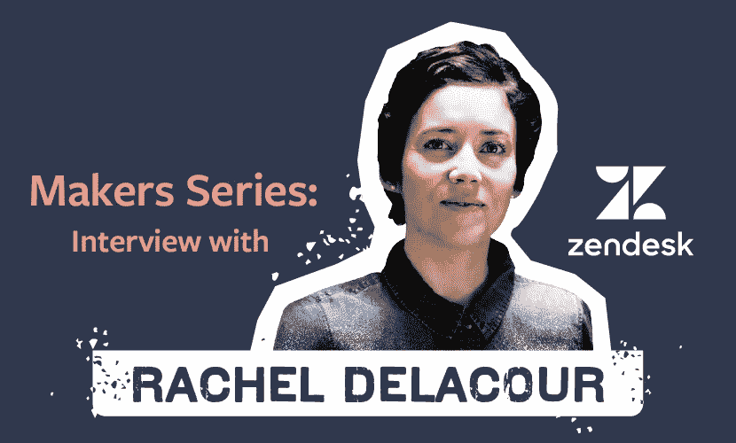
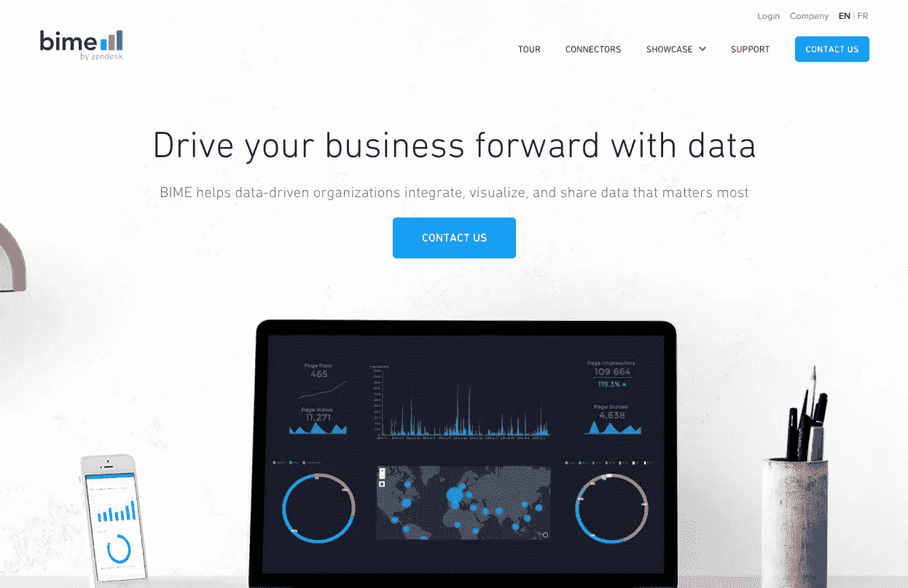
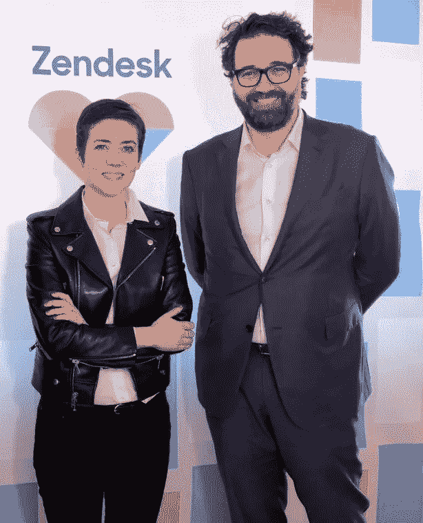
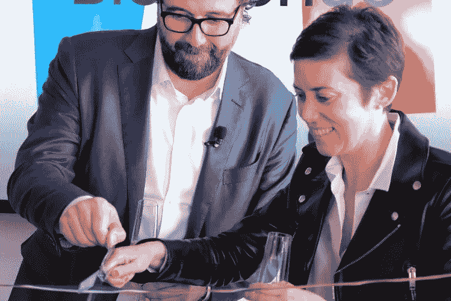

# 创客系列:收购。这家初创公司是如何卖给 Zendesk 的

> 原文：<https://medium.com/swlh/makers-series-acquired-how-this-startup-sold-to-zendesk-ce6721ae8d47>

Originally published on JOTFORM.COM

如果出售公司的最佳方式是不想出售，会怎样？

这似乎有悖常理，但很多时候，公司会沉迷于销售，而忽略了真正推动价值的东西:强大的产品供应。

雷切尔·德拉库尔从未忘记这一点。事实上，她根本就没想过销售。她的目标一直是致力于创造一种能让生活变得更简单的工具。这足以引起 [Zendesk](https://www.zendesk.com/) 的注意。

雷切尔和她的联合创始人在 2015 年将他们的公司 BIME 分析公司卖给了 Zendesk。雷切尔现在担任 Zendesk 负责初创公司的副总裁。

在我们的采访中，雷切尔分享了她如何陷入创业，完善她的产品，并最终将她的公司出售给 Zendesk。她强调了自己的经历，并为企业家提供了技巧、生产力诀窍等。

## 是什么让你有了创办 BIME 分析公司的想法？

来自金融界的我们想要创造我们梦想中的工具，所以我们做到了。我们知道我们在创新，但我们不知道我们正在创建这家初创公司，因为这不是我们的背景。**我们成了企业家，却不知道自己是企业家。**我们经营了六年的 BIME 分析公司，非常喜欢它——我们没有出售的意图。

BIME by Zendesk

## 所以你不想卖。Zendesk 接近你的时候是什么感觉？

嗯，我们是 Mikkel Svane 和 Zendesk 的忠实粉丝，因为他们在 SaaS B2B 领域的声誉——我们就像青少年一样崇拜摇滚明星。Zendesk 找到了我们，起初，它主要是关于我们在市场上已经有的那种集成。

当我们意识到它变得严重时，我们真的很感激 Zendesk 对我们这个时代的高度敏感。他们非常关注我们的业务。我正准备筹集另一轮资金，Zendesk 非常尊重我们的时间，说:“好吧，我们想知道更多，但我们也想确保我们没有占用你太多时间。”如此大的公司如此尊重我们的初创公司，这种感觉真是太棒了。对我们来说，这意味着我们是好伙伴。**关系刚开始的时候，你不知道会是什么样子；你只知道他们如何对待你，这意味着很多。**

## 从个人和商业角度来看，收购中最具挑战性的部分是什么？

几乎在 Zendesk 提出报价的同一天，我意识到自己怀孕了。我期待着我的第二个孩子。从个人角度来说，我不想对 Zendesk 隐瞒这种事情。我很诚实，他们回来说，“Zendesk 喜欢婴儿。”

这是 Zendesk 文化的一个重要组成部分，在如此多不同的个人资料和情况中包含多样性。

这对我们来说意义重大，尤其是因为收购对于客户、合作伙伴和团队来说非常复杂。我意识到，当你越来越接近收购你公司的公司时，情况会越来越好。桌子上除了钱，东西很少的时候要小心。大家都觉得尽职调查和谈判部分很辛苦。复杂的事情实际上从那之后开始，因为重点是集成产品、技术和人员。

Rachel Delacour and Mikkel Svane

Mikkel Svane and Rachel Delacour

## 你能给寻求销售的企业家什么建议？

**对你来说，出售公司的最佳方式是专注于你提供的产品，而不是有出售的欲望。随着你的产品越来越好，你会有更多满意的顾客，你的公司也会发展得更好。**

那你就有好公司可以收购了。我们一天只有 24 小时——如果你试图跳舞来推销你的公司，而不是发展它，事情会变得太复杂，你会忽视产品和客户。

## 你从哪里获得灵感和动力？

我从和我从事不同行业的人那里获得灵感和动力，比如艺术家。灾难简对我来说也是一个鼓舞人心的历史女性角色。为了激励自己，我确保每天都使用 LCD 音响系统！

## 作为一名女企业家，最大的挑战是什么？

作为一个女企业家，我没有经历过艰难的事情，但这并不意味着这些事情不存在。我有很多女性朋友给我讲疯狂的故事。

最近，我一直在尝试组织女性创始人和风投之间的会议。我认为这是在帮助他们，因为他们有很棒的产品和团队。但是在筹款方面有一个缺失的环节。

我们希望避免女性创始人可以藏在人群中的聚会。我希望他们与风投进行一对一的会谈，所以我们努力鼓励这种关系。我希望这有助于纠正系统一点点。

## 关于如何成为最有效率的自己，有什么建议吗？

一定要休息。注意你的健康，不要忘记你的个人生活。建立个人生活；你的公司失败的方式有很多，但你的家人永远在那里。**每天回馈社会，并努力学习新事物。**

Rachel Delacour

## 你认为法国和美国最大的区别是什么？

令我痛苦的是，我们能够在法国创建本地创业公司，但在国际扩张方面仍有所欠缺。我们缺少知道如何扩大创业规模的人。我们没有你在硅谷或纽约所拥有的，那里有很多人愿意在创业公司内部承担风险，并有效地扩大规模。

当然，有一些，但没有美国那么多。我们需要一种模式，将这种类型的人才带到欧洲。我们还需要创造一个有足够吸引力的环境，让有才能的人有动力在这里工作。排名第一的欧洲创业协会 France Digitale 是一个在国家和欧盟层面帮助变革的声音。我目前是该协会的联合主席。

## 当一切都结束后，你希望如何被人记住？

我想被我的孩子记住。其他的并不重要。

采访由 JotForm 的市场专员 Annabel Maw 主持。 [*@AnnabelLMaw*](https://twitter.com/AnnabelLMaw)

*原载于*[*www.jotform.com*](https://www.jotform.com/blog/this-startup-sold-to-zendesk/)*。*

## 这篇文章发表在 [The Startup](https://medium.com/swlh) 上，这是 Medium 最大的创业刊物，拥有+ 376，225 名读者。

## 在这里订阅接收[我们的头条新闻](http://growthsupply.com/the-startup-newsletter/)。

