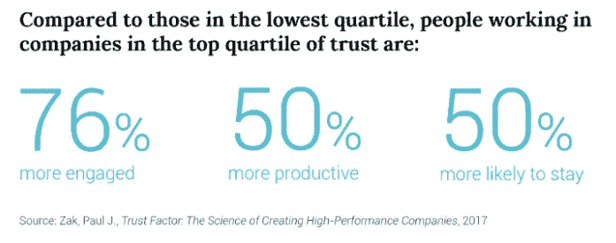
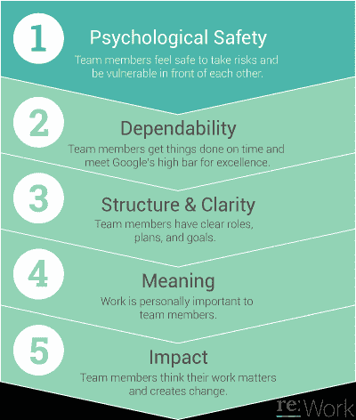

# 打造一支强大、高效的团队

> 原文：<https://medium.com/swlh/making-a-strong-high-performing-team-1a3f2d0e580e>

从创始人团队到跨职能团队，他们成功的秘诀在于他们的信任度。

Source: [Pexels](https://www.pexels.com/photo/group-of-people-holding-hands-forming-teamwork-1083623/)

信任是需要时间去创造的善变事物之一。

作为名为 7Cs Consulting 的 6 人咨询团队的一员，我在咨询生涯的早期就了解到了这一点。

当我们接到一个新客户时，我们的第一个任务是创建一个介绍包，详细介绍所有顾问的姓名、他们的角色、项目的时间表以及我们需要领导团队做什么。

作为团队的新成员，我的任务是创建这个。我工作到晚上，创作了一个草稿，提交给团队，然后睡觉。

我醒来后发现团队中有人不喜欢我创建的东西，并继续提交了一份完全不同的文档。事实上，它肯定比我的好😞

那挫伤了我的自尊心。

“她怎么能不先问我就这么做呢？她难道不知道我花了几个小时创造的吗！”我记得我告诉自己被激怒了。

The 7Cs Consulting Group — minus me

对大多数人来说，他们会埋下这种愤怒，继续生活。

但是在我们下一次见面时，我决定提出来。

“听着，我知道我的草稿的设计不是很好，但是我觉得你的行为非常不尊重我，甚至没有提前告诉我...尽管我承认，你提交的要好得多……”

我的队友立即回答说:“哇，我不知道你会受到不尊重。老实说，我更担心这个项目，确保客户得到高质量的东西，因为已经是深夜了。但回过头来看，我至少应该对你说点什么……”

团队中的每个人都震惊于一个潜在的紧张局势如此容易地得到解决。

因为它发生在早期，这也使我们的团队更加强大。它创造了信任，让我们可以一起度过难关。我的真实让整个团队感到足够安全来分享他们自己的弱点。

# 什么造就了一个强大的团队

研究员兼作家保罗·j·扎克[发现，拥有高信任度的高绩效公司](https://rework.withgoogle.com/blog/creating-a-high-trust-performance-culture/)表现优于竞争对手。

导致团队更投入，更有生产力，更有可能留下来。

拥有最高信任度的团队*有意*培养这种信任度。

Source: [Re-work / Google](https://rework.withgoogle.com/blog/five-keys-to-a-successful-google-team/)

[谷歌的一项为期两年的研究](https://rework.withgoogle.com/blog/five-keys-to-a-successful-google-team/)表明，表现最好的团队都有一个共同点:心理安全。

心理安全是团队相信他们能够承担风险、坦诚并提出想法而不用担心尴尬或反弹的能力。

没有个性化。

没有高人一等。

简单来说，就是一个团队尽最大努力完成工作。

心理安全是将不合格团队与高绩效团队区分开来的基石。团队可以有公开的分歧，提供现成的解决方案，并在压力大的时候感到一起承担预计的风险是安全的。

听起来很简单，对吧？

但是团队成员可能会墨守成规，依赖微妙的社会线索来加强群体思维，这抵消了人们提供不同想法的安全感。

关键是确保团队*在一致的基础上以真实和开放的方式相互交流*。

# 最重要的是团队如何互动

大学一毕业，约翰就加入了一家初创公司的营销团队。作为一个四人团队，约翰有很多想法，也渴望向团队证明自己。但是当他加入这个团队的时候，他意识到每个人都已经是朋友了，有他们自己的内部笑话，和一个既定的做事方式。他希望自己能有所突破，早日确立自己的地位。

在他们与四人小组的第一次全体动手会议上，约翰的许多想法很快就被否决了，没有任何解释。约翰觉得很丢脸，好像他没有什么可贡献的，这让他不想在以后的会议上再发言。没有人知道这一点。随着时间的推移，约翰变得沉默寡言，团队中的每个人都是如此。

团队就是由这样的时刻组成的。

如果有人带着好奇心接近约翰，并认可他的贡献，他会有不同的感受(即使他的想法被否决)。

> 建立信任文化是提高绩效的有力途径。神经科学研究表明，信任减少了社会摩擦，促进了同事之间的合作行为——管理者可以创建高度信任、高绩效的团队。——保罗·扎克

这就是为什么建立信任和安全的文化对于团队的高效运作至关重要。

当领导者树立正直、坦率和诚实的榜样时，这些信念会转化为他们的文化，然后被各级员工接受。

这种行为激励员工放下戒备，公开自己的弱点，哪里需要帮助，以及如何成长。

这是打造强队的关键。

**底线:**在一起完成更多工作的团队之所以这么做，是因为他们可以相互信任。通过创造一种支持公开反馈和不同意见的文化来实现这一点，这样每个人都可以一起畅所欲言。

## 这篇文章发表在《T4》杂志《创业》(The Startup)上，这是 Medium 最大的创业刊物，有 352，974 人关注。

## 在这里订阅接收[我们的头条新闻](http://growthsupply.com/the-startup-newsletter/)。

