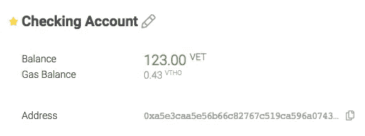

# 通过向电子邮件发送加密信息，让所有人都能访问区块链💌

> 原文：<https://medium.com/swlh/making-blockchain-accessible-to-all-by-sending-crypto-to-e-mail-44c148b7b9bb>

## 寻找一种方法让你不太懂技术的朋友进入加密？把它发到他们的电子邮件地址就行了。

Arkane 网络钱包允许用户发送加密资产到电子邮件，而不是区块链地址。有了这一新功能，我们很自豪能够在与区块链技术互动时为更好的用户体验做出贡献。

这个功能不是告诉人们他们收到了加密。

> 它实际上是发送到一个电子邮件地址，这样任何人都可以发送和接收加密资产，而不会意识到他们正在使用区块链理工大学。

# 幕后发生了什么？

当使用“收件人”字段中的电子邮件地址启动交易时，我们首先检查的是我们是否知道该电子邮件地址。如果是，我们将交易的目的地更改为与已知电子邮件地址关联的钱包地址。如果我们不知道电子邮件地址，我们创建一个新的区块链钱包，将加密资产转移到新的钱包，并通知收件人他可以在 Arkane 收集他的加密。当新用户注册时，资产被转移给他。

# 如果我在 Arkane 有多个钱包，我会在哪里收到发给我的密码？

转移资产时，我们知道使用的是哪个区块链，因此资产将被转移到特定链上的您的钱包中。如果您在该链上还没有钱包，我们将为您创建一个，并在您下次登录时将资产转移给您。

如果您在一条链上有多个钱包，那么资金将被转移到我们称之为您的**主钱包**中。您的主钱包以黄色星形⭐.表示

**A primary wallet called “Checking Account”**

您只需点击将成为新的主钱包的灰色星号，即可更改您的主钱包。

**A regular wallet called “Savings Account”**

**想加入我们不断发展的网络吗？**

在这里注册:[https://app . arkane . network](https://app.arkane.network)获得自己的加密钱包。

[Arkane.network](https://arkane.network/) in collaboration with [FundRequest.io](https://fundrequest.io/)

## 这篇文章发表在 [The Startup](https://medium.com/swlh) 上，这是 Medium 最大的创业刊物，有+393，714 人关注。

## 订阅接收[我们的头条新闻](http://growthsupply.com/the-startup-newsletter/)。

