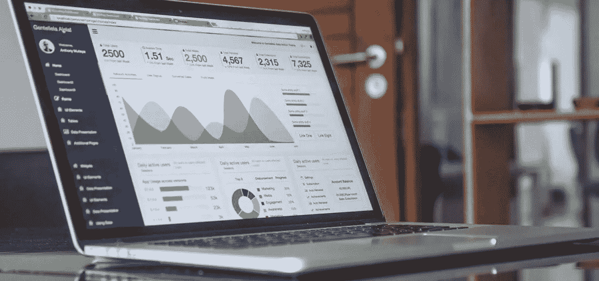
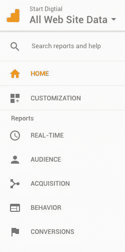

# 使用 Google Analytics 做出明智的营销决策

> 原文：<https://medium.com/swlh/making-informed-marketing-decisions-with-google-analytics-17e6ac71b1e4>

无论你的网站排名是否靠前，谷歌都希望你和你的企业蒸蒸日上。你做得好对他们最有利。为了帮助你了解你的网站和它不断产生的所有数据，他们发布了一系列免费工具来帮助你照亮前方。与 [**Google My Business**](https://www.google.com/intl/en_au/business/) 和[**Google Search Console**](https://search.google.com/search-console/about)，[**Google Analytics**](https://analytics.google.com/analytics/web/)**并列，是市面上最好的免费工具之一。这也恰好是我们数字代理公司为我们自己和我们的客户做出明智决定的**目标之一。****

# ******谷歌分析的内幕******

****早在 2005 年发布，谷歌分析是一个流行的网络分析工具，跟踪和报告网站的流量。尽管它非常受欢迎，但许多企业仍然敬而远之，因为谷歌分析可能有点势不可挡。许多企业，尤其是小企业，理解网站分析的需求，但不确定谷歌分析如何能给他们的业务带来好处。****

****从实时用户到行为流，一直到群组分析和基准测试，谷歌分析提供了大量信息。考虑到这些数据的分布范围，找出对您的企业最有利的统计数据需要时间。(通常是很多人在一起，但那是另外一个帖子。)因此，我们为那些开始使用谷歌分析的人挑选了 3 个关键要素。还有很多——我们真的只是浏览了表面——但如果你是网站分析、数据和转换的新手，这些都很容易理解。****

# ****受众、获取和行为****

********

******谷歌分析列表** 登录谷歌分析账户后，屏幕左侧会出现一个选项列表。在 Home 和 Customisation 下面，你会发现一个报告部分，在那里展示了实时、受众、获取、行为和转换。我们将更详细地看一下 A 和 B。****

# ****1.观众****

****检查你的网站访问者的人口统计、兴趣、地理和行为细分等，观众提供了很多细节，是的，你猜对了——你的观众！在这里，您可以深入了解网站访问者的年龄、性别、位置、网络浏览器类型等信息。你越了解你的受众，你的企业就越有能力解决他们的问题，满足他们的需求。通常这涉及到你的企业更有效地组装你的网站和营销工作。****

****如果对你的受众的调查发现你的受众主要是女性，你的企业应该考虑在你的营销内容和网站上运用更多的女性风格。或者，如果你的受众主要是 18-24 岁年龄段的年轻人，你的内容需要有一种新鲜、年轻的氛围来吸引这一代人。****

****地理信息可以帮助确定网站内容和广告投放。虽然你不能将统计数据分解到郊区，但谷歌分析仍然是有帮助的。例如，如果显示您的网站正在从悉尼获得大量的牵引力，尽管主要集中在珀斯，您可能需要创建一个新的页面，目标是悉尼的客户。相反，如果你在特定的地理区域没有获得很大的吸引力，但你想，你可以建立网页，在这些区域投放广告。****

****此外，你可以看看新的和回头客和你的参与水平。你的企业是否需要采取更多措施来吸引新访客，以及是否需要实施策略来鼓励更多忠诚的回头客，如[内容营销](https://startdigital.com.au/our-services/content-marketing-perth/)等，这些决策都将受到这里提供的数据的影响。****

****你还可以看到你的受众是哪些设备，甚至是浏览器或手机的类型。如果你的网站访问使用移动或平板设备，这意味着你必须确保你的网站是移动友好的。(附带说明，这是绝对必须的，因为谷歌已经将移动索引置于桌面之上！).****

# ****2.获得物ˌ获得****

****顾名思义，获取部分告诉你你的网站流量是从哪里来的。你可能会想，这有什么关系？重要的是人们正在访问这个网站！因为这基本上是最重要的，所以利用这些信息来进一步推动这些积极的成果是至关重要的。****

****例如，如果你的网站访问者来自一个客座博文，你会想要探索其他客座博文的机会，看看你是否可以复制这个结果。同样，如果你从社交媒体[获得了大量流量，你会希望继续保持下去。另一方面，如果一个特定的获取来源目前没有带来足够的流量，你知道要寻找机会来扭转这种局面。](https://startdigital.com.au/our-services/social-media-perth/)****

****通过点击采集>所有流量>频道并修改右上角的时间段，您可以分析特定的日期和时间段，以查看当天是否有任何与业务活动相对应的变化，如发布博客或发送电子邮件简讯。通过点击每个频道并探索呈现的信息，可以进一步完善这种分析。例如，如果你点击“社交”,你会看到引导访问者访问你的网站的确切的社交媒体平台。****

****如果有机搜索驱动的流量很小，你的企业可能需要探索你的企业在搜索引擎结果页面上的排名。如果你藏在第二页和更远的地方，你的企业需要(立即)开始实施 [**搜索引擎优化**](https://startdigital.com.au/why-seo-is-important-to-your-business-survival/) [。](https://startdigital.com.au/why-seo-is-important-to-your-business-survival/.)****

****Start Digital 的一个建议是，你的企业一次只实施一种营销策略。如果你同时尝试几种不同的方法，你可能会在确定每种策略的影响时遇到困难。一次坚持一个活动意味着你可以清楚地看到哪个活动产生最大的结果。一旦你意识到什么在起作用，你可以站起来重复，对于那些不太有效的策略，专注于微调。****

# ****3.行为****

****行为部分关注访问者的行为(你的观众如何与你的网站互动)。****

****在这一部分，您将被告知哪些页面表现最好，并可以通过点击行为>网站内容>内容明细来了解它们的浏览量、跳出率和退出率。该部分还将介绍有关登录页面、退出页面以及访问者如何以及是否在您的网站上从一个页面转到另一个页面的信息。所有这些结果将帮助您确定活动和内容是否需要调整。****

****这也是检查你的网站速度的地方。没有人喜欢一个缓慢加载的网站。人们太忙了，没有时间闲荡。最近的一项研究发现，几乎 50%的网络用户希望网站在 2 秒钟内加载完毕 ，超过 2 秒钟的每一秒钟，你的企业都可能失去客户和销售额。虽然经常需要技术工作来大幅改变网站速度，但有很多 [**超级简单的优化，你可以轻松完成**](https://startdigital.com.au/9-easy-steps-boost-seo/) ，例如通过 TinyPNG 或 TinyPNG 优化你的图像。****

# ****我们明白了****

****我们知道谷歌分析可能会势不可挡。但这是你的企业应该坚持的。这是一个非常有价值的工具，不容忽视，因为即使是最基本的统计数据，如人口统计数据，也会帮助你推动内容。通过考虑谷歌分析提供的信息，你可以定位你的业务，以产生更多的流量和线索，从而创造客户和忠实的粉丝。****

****任何时候都不会太晚、太早或不够重要，都不需要花时间去查阅你的网站统计数据来做决定。****

****这篇文章最初出现在 [**Start Digital**](https://startdigital.com.au/make-informed-marketing-decisions-google-analytics/) 网站上，现已改作媒体使用。****

********

## ****这篇文章发表在 [The Startup](https://medium.com/swlh) 上，这是 Medium 最大的创业刊物，拥有+ 377，643 名读者。****

## ****在此订阅接收[我们的头条新闻](http://growthsupply.com/the-startup-newsletter/)。****

********