# 理解新脸书。

> 原文：<https://medium.com/swlh/making-sense-of-a-new-facebook-2a208b8b99ad>

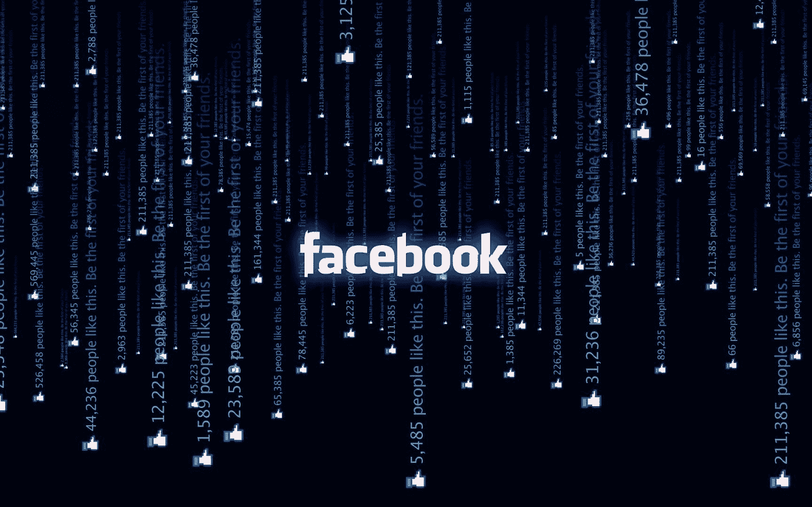

你怎样煮青蛙？慢慢地。这正是脸书现在对品牌、企业和出版商所做的。水烧开了。青蛙现已煮熟。(如果你还不明白的话……你就是那只青蛙)。

我们预测这会发生…我讨厌这么说，但是我们告诉过你。

扎克伯格[最近分享了](https://www.facebook.com/zuck/posts/10104413015393571)脸书正在对新闻订阅源进行改变，将朋友的内容优先于品牌、企业和出版商的内容。这是鼓励在平台上花好时间的努力的一部分，并在许多方面重新定义了超过 20 亿人如何使用脸书。当方向的转变被分享时，脸书的股票价格立即下跌了 5%。

**这个变化不可小视。**虽然脸书确实定期更新其新闻订阅算法，但正如脸书新闻订阅副总裁 Adam Mosseri 上周分享的那样,[“这一次的调整幅度大于平均水平。这不是一个好办法”。](https://www.wired.com/story/facebooks-adam-mosseri-on-why-youll-see-less-video-more-from-friends/)

我写了这篇文章来分享我的观点、研究、预测和对数字广告行业领导者的指导，告诉他们如何理解现在的脸书。这篇文章是我迄今为止最长的，超过 5000 字，因为这是一个需要很好理解的复杂话题。所以请慢慢阅读这篇文章，它不是一篇像脸书新闻那样浏览的文章。

# 脸书终于觉醒了

去年对脸书来说是充满挑战的一年。

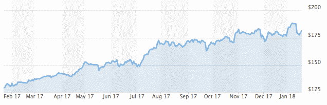

[Source: Marketwatch](https://www.marketwatch.com/investing/stock/fb)

尽管财务表现出色(仅在过去的 12 个月里，他们的市值就增加了 1590 亿美元),但脸书的任何人似乎都没有对过去一年的业务增长感到特别自豪。我想他们已经明白了旅程和目的地一样重要。

他们面临着似乎永无止境的挑战。无论是不得不证明俄罗斯可能利用他们的平台参与美国大选，用户购买脸书广告来瞄准那些认同反犹太主义观点的人，还是在平台上直播人们自杀的非常悲伤的画面。

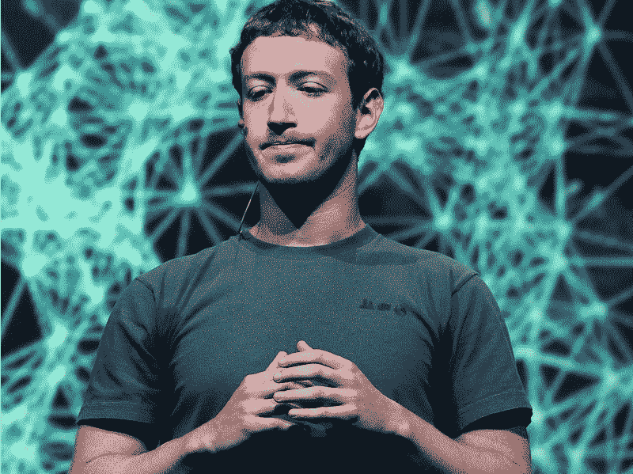

Source: Getty Images

我认为脸书终于觉醒了。它正通过其未来商业模式的根本变化来展现自己。

从历史上看，它的商业模式一直是获取人们的注意力(不管对社会、民主、心理健康或福祉有何影响)，并通过广告市场将其货币化，出价最高者获胜(不管广告商是谁)。

在媒体行业，我们经常谈论让广告环境“品牌安全”，或者对广告商安全。脸书现在不是一个“用户安全”的广告环境，因为任何人都可以根据个人数据访问和锁定用户。事实证明他们没有有效的安全措施。

现在，我试图量化脸书的商业模式，因为它与用户关注度有关，并得出脸书的估计。在平台上花费的时间每小时 0.40 美元(在美国和加拿大)。

几个相关数据(来源:[脸书第三季度财报](https://s21.q4cdn.com/399680738/files/doc_financials/2017/Q3/Q3-'17-Earnings-Presentation.pdf)):

*   季度收入 103.3 亿美元(美国和加拿大为 50.3 亿美元)
*   20.72 亿月活跃用户；13.68 亿日活跃用户
*   全球每用户平均收入为 5.07 美元；美国和加拿大用户为 21.20 美元

据康姆斯克报道，[在脸书的时间为每天 35 分钟](https://www.nytimes.com/2016/05/06/business/facebook-bends-the-rules-of-audience-engagement-to-its-advantage.html)，其他消息来源引用的时间可能高达[每天 55 分钟](https://journal.thriveglobal.com/when-does-facebook-start-to-make-you-unhappy-6484f671b838)。我用 35 分钟的保守估计来计算平台上用户小时的平均收入为 0.40 美元(美国&加拿大)。

因此，你在脸书上每花一个小时，他们就赚 0.4 美元，而你可能会感受到 FOMO(害怕错过)、孤立、孤独和无聊。稍后我会分享更多我对普通用户的观察，但是首先，让我们谈谈对行业的影响。

# 打破脸书的商业模式

要真正理解脸书使命转变的商业影响，我们首先需要理解他们的商业模式，这主要是由广告收入驱动的。

以下是决定任何广告支持的商业模式的收入的关键输入的简化视图:

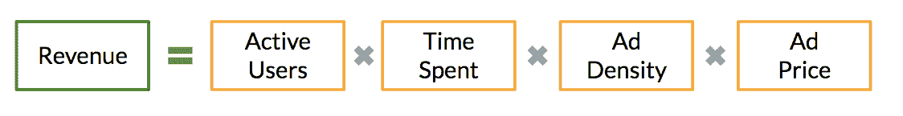

总收入是四个关键输入的组合:

*   活跃用户:平台上每月独立访客或用户的数量。
*   花费时间:每个用户平均在平台上花费多长时间。
*   广告密度:显示给每个用户的平均广告数量。
*   广告价格:每个广告客户为每个广告支付的平均费用。

脸书的股价、总收入、每用户平均收入、在平台上花费的时间、广告投放量和用户群都在持续增长。这一切都很好，但该行业现在唯一关注的增长是在平台上做广告的价格。

我对脸书过去几年的增长有一个重要的观察，那就是收入增长超过了用户增长。

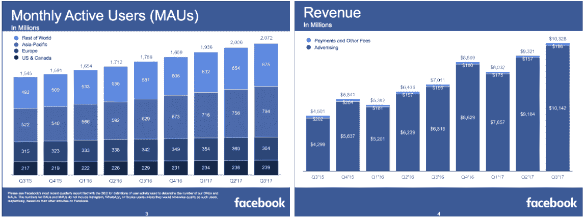

Source: [Facebook Q3 Earnings](https://s21.q4cdn.com/399680738/files/doc_financials/2017/Q3/Q3-'17-Earnings-Presentation.pdf)

在过去两年中，脸书的月活跃用户从 2015 年第三季度的 15 亿增长到 2017 年第三季度的 21 亿，增长了 34%。然而，他们的收入同期增长了 129%，从每季度 45 亿美元增长到现在的每季度 103 亿美元。

**每用户平均季度收入增长了 71%，从 2015 年第三季度的 2.91 美元增长到 2017 年第三季度的 4.98 美元。**他们是如何做到这一点的？用户在平台上花费更多时间(为每个用户创造更多广告库存)、广告密度增加(在每个会话中向每个用户显示的广告数量)以及每个广告的价格增加。

# 脸书对工业的意外组合拳

今天有 600 万家企业在脸书上做广告。当我提到工业时，我指的是这 600 万家企业。行业感受到的第一个冲击将是由于新闻馈送算法的改变，他们的有机帖子的可见性下降。这将立竿见影。我听说有传闻称，美国以外的一些品牌和出版商最近几个月已经注意到了这种下降，可能是来自脸书测试替代新闻馈送算法。

不过，我们认为第二次打击会更大。

“现在，我想澄清一点:通过做出这些改变，我希望人们花在脸书的时间和一些参与度指标将会下降，”[上周分享了](https://www.facebook.com/zuck/posts/10104413015393571)扎克伯格。

随着脸书希望让他们的产品不那么容易上瘾，以鼓励*花更多的时间，而不是花更多的时间*，该平台的整体使用率将会下降。这第二次打击将是缓慢、持续和艰难的。随着潜在的更少的人可能花费更少的时间，品牌、企业和出版商获得有机和付费职位的机会也将更少。

可用供应量会减少，这意味着只有一件事:在平台上打广告的价格即将暴涨。

# 脸书广告价格可能上涨 79%

现在游戏变了。扎克伯格预计，在平台上的时间将会减少。广告密度可能会保持不变。假设脸书打算继续增加收入，那么他们目前的商业模式只会发生一种变化:广告客户的价格将飙升。

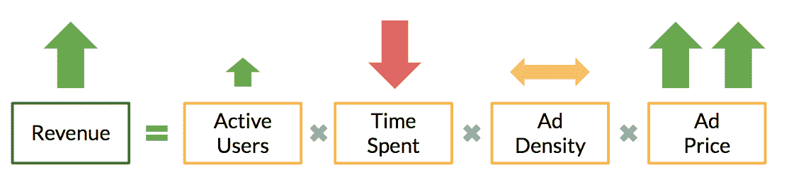

现在让我们真正理解这一点，并做一些预测。

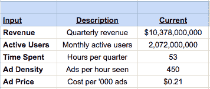

在上述模型中，基线“当前”基于 2017 年第三季度的数据。收入和活跃用户来自脸书的[季度收益](https://s21.q4cdn.com/399680738/files/doc_financials/2017/Q3/Q3-'17-Earnings-Presentation.pdf)。花在平台上的时间是之前从[康姆斯克](https://www.nytimes.com/2016/05/06/business/facebook-bends-the-rules-of-audience-engagement-to-its-advantage.html)报道的估计值(每个用户每天 35 分钟，每季度 53 小时)。广告密度是每小时的广告数量，这是一个猜测，但具体是多少并不重要，因为我们假设广告密度保持不变(因为脸书无法向您展示您在其平台上每小时花费的更多广告)。广告价格是通过总收入除以活跃用户数、花费时间和广告密度逆向得出的。类似地，广告价格(基于每千次印象的有效成本)并不特别重要，因为我们在不同的场景下观察变化百分比(相对与绝对变化)。

以下是在三种不同情况下广告价格可能会如何变化的预测。

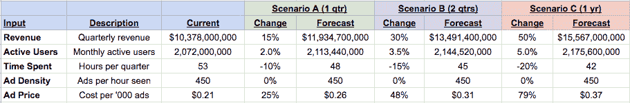

我已经假设了适度的用户增长(与历史趋势一致)，下一年花费的时间从 10%下降到 20%，以及静态广告密度。基于这些假设，**脸书的广告价格可能在 3 个月内上涨 25%，6 个月内上涨 48%，12 个月内上涨 79%。**

我认为这是一件大事，将对行业产生巨大影响。尽管所有这些都是在 facebook.com 作为其核心产品的背景下讨论和辩论的，但 Instagram 肯定会是下一个，因为它有更大的飞跃，可以让用户的注意力被认为是值得花时间的。

# 脸书成为新的广告词

今年美国的数字广告总支出将达到 940 亿美元，其中绝大部分将流向谷歌和脸书。谷歌和脸书“双头垄断”的另一个较少使用的行业术语是效果广告。两家公司都拥有让效果广告有效和成功的三个关键要素:

1.  大范围(这样他们可以找到任何在线的人)
2.  相关数据(无论是个人数据、演示数据还是意图驱动的数据)
3.  用户注意力(在移动设备上以及更广泛的范围内)

我认为谷歌和脸书在数字广告行业的主导地位更多地反映了对业绩驱动型广告的需求。在 IAB 的年度[普华永道互联网广告收入报告](https://www.iab.com/wp-content/uploads/2016/04/IAB_Internet_Advertising_Revenue_Report_FY_2016.pdf)中，他们报告说大约。65%的数字广告收入是基于绩效的定价模式(例如，每次点击成本、每次行动成本、每次引导成本)。这在过去几年中一直保持稳定。

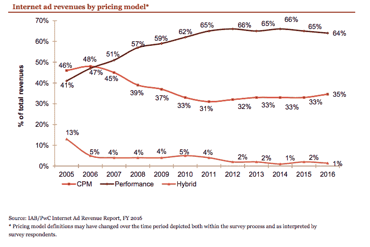

Source: [IAB](https://www.iab.com/wp-content/uploads/2016/04/IAB_Internet_Advertising_Revenue_Report_FY_2016.pdf)

凭借脸书令人难以置信的用户数据、业经验证的受众定位能力和巨大的影响力，我相信他们将成为新的 Adwords(谷歌的搜索广告产品)。这并不是说他们将取代或进入搜索广告业务，而是他们将主要被视为一个漏斗下端的绩效营销和广告平台。今年美国的数字广告总支出将为[940 亿美元](https://www.emarketer.com/Article/Google-Facebook-Tighten-Grip-on-US-Digital-Ad-Market/1016494)，其中[320 亿美元](https://searchengineland.com/google-search-ad-revenues-271188)将用于谷歌的 Adwords 搜索广告业务。这相当于整个美国市场的 34%。

绩效营销者和品牌营销者有不同的目标。这是一个简单的营销漏斗，显示了认知度、意图和行动目标的不同特征。

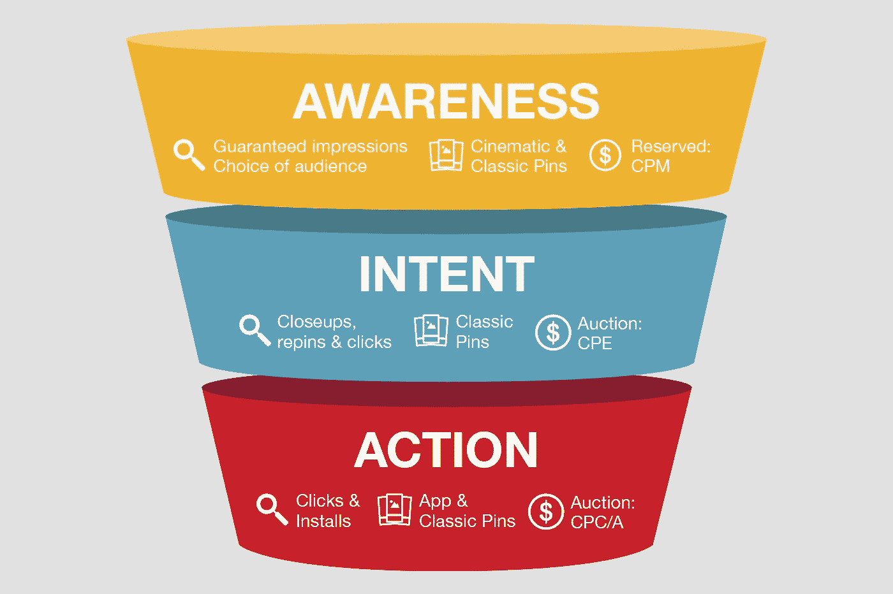

Source: [Hootsuite](https://adespresso.com/blog/much-will-next-facebook-ad-campaign-cost-free-ad-budget-calculator-will-tell/)

对脸书来说，专注于效果广告作为他们的主要商业模式更有利可图。他们使命的宏观转变将巩固该平台在营销漏斗中的地位。随着他们对视频的态度发生变化(更多信息见下文),整体用户关注度可能下降，我不认为他们会专注于为高端品牌营销人员打造广告产品和解决方案。

脸书广告(像 Google AdWords 一样)是一个市场，在这里企业必须“出价”(像拍卖一样)来“赢得”用户。效果营销人员一般比品牌营销人员付出更多。由于他们正在推动漏斗活动，并有用户数据作为目标，他们愿意出价更高。这将使品牌营销人员更难进入游戏(类似于今天的 Adwords)。

# 重新定义社会参与

“我们希望 newsfeed 成为人们进行对话、与人交流的地方”，脸书的 Adam Mosseri 分享道。在过去的十年里，大多数企业都是根据喜欢在品牌页面上发帖和关注来衡量社交参与度的，这两种方式现在几乎没有价值。一个品牌、企业或出版商的帖子因其受欢迎(通过点赞来衡量)而被“病毒式传播”并获得免费有机传播的日子已经过去了。喜欢不再等同于订婚。

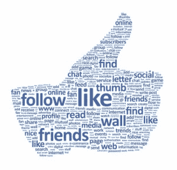

出版商的问题是，脸书可能会使用评论作为对话的衡量标准，但他们只能看到发生在他们平台上的评论。很大一部分对话发生在脸书之外，无论是在其他社交平台(如 Twitter)上，还是直接在出版商的页面上(通过他们的在线评论插件)。

品牌的问题在于，人们希望与其他人而非企业进行对话。Twitter 是唯一一个看到客户与企业对话的地方，它主要被用作客户服务和问题升级的渠道。此外，大多数品牌不允许对他们的帖子发表评论，这也是为什么在新模式下他们会收到更少的有机影响的另一个原因。

# 在视频上改变主意

脸书的视频到底有多大？嗯，两年前，每天有超过 1 亿小时的视频被观看，超过 5 亿人每天观看视频。2016 年，脸书花费了超过[5000 万](https://www.wsj.com/articles/facebook-signs-deals-with-media-companies-celebrities-for-facebook-live-1466533472)美元资助出版商创作视频，有报道称，他们今年将愿意在原创视频内容上花费高达[10 亿](https://digiday.com/media/facebook-video-ambitions-2018/)美元。像 NowThis、Dodo、Tasty 和 Ladbible 这样拥有[数十亿月度视频浏览量](http://tubularinsights.com/top-facebook-video-creators/)的社交视频第一出版商将受到影响，还有像 CNN、Food Network 和 Daily Mail 这样的传统品牌，它们都拥有令人印象深刻的视频统计数据(即将改变)。

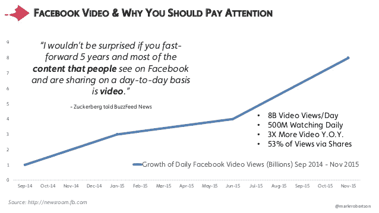

他们有整个团队致力于将视频整合到脸书体验的每一个部分。这是去年 2 月分享的一个宣传视频，它宣布了一些新功能。

嗯，视频对脸书来说只是一个实验，用扎克伯格自己的话来说，他们内心的改变是最强烈的。

2016 年 7 月 27 日，他在一次[收益发布](https://investor.fb.com/investor-news/press-release-details/2016/Facebook-Reports-Second-Quarter-2016-Results/default.aspx)中分享道:“我们对我们在视频领域取得的进展感到特别高兴，因为我们正在迈向一个视频是我们所有服务的核心的世界。”

仅仅 18 个月后，2018 年 1 月 11 日，他在一篇[公众帖子](https://www.facebook.com/zuck/posts/10104413015393571)中分享道:“被动地阅读文章或观看视频——即使它们是娱乐性或知识性的——可能并不那么好……但今天太多时候，观看视频、阅读新闻或获取页面更新只是一种被动的体验。”

在接下来的几个月里，许多行业领袖将会挠头，不知道他们是如何被这一次所迷惑的。

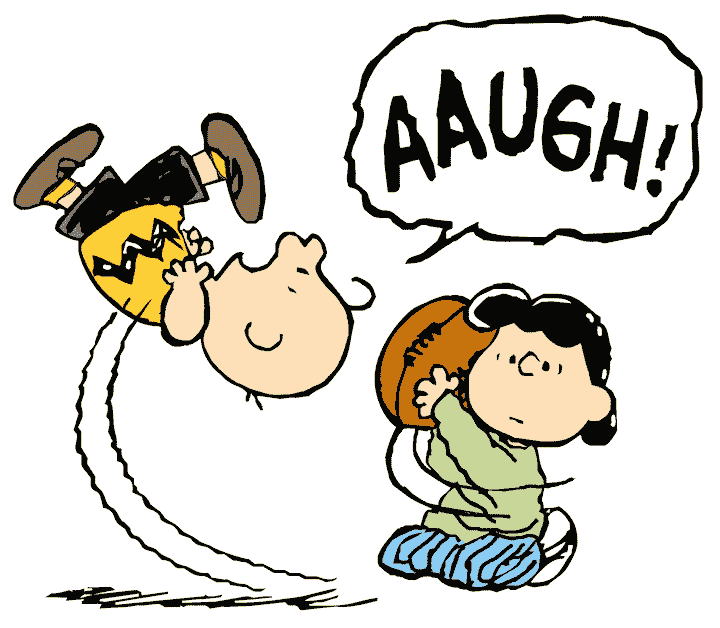

“[l]视频越少，你就越倾向于坐下来看。当你看电视时，你通常不会喜欢、评论或与朋友交谈。”[说](https://www.wired.com/story/facebooks-adam-mosseri-on-why-youll-see-less-video-more-from-friends/)亚当莫塞里上周。脸书可能仍然会优先考虑来自朋友的个人视频，然而，这些视频变得很难赚钱，也不太可能布满广告。

# 时间花得值

在上周发布的一段视频中，[脸书新闻订阅研究负责人 Lauren Scissors 分享道:“只是被动地浏览你的脸书订阅，或者不与他人互动地阅读或观看，往往会让人感觉更糟。”。](https://www.facebook.com/facebook/videos/10156988765141729/)

脸书设定了一个愿景，即平台上的注意力应该得到充分利用。这是一个崇高的愿景，有可能为社会如何采用社交媒体带来更大的平衡。脸书有潜力为大型平台树立榜样，为其产品和服务的精神健康和健康含义承担责任。这是一个新的领域，生态系统应该为大量真正脸书风格的实验做好准备。这意味着只有一件事:不断变化。

我不禁怀疑脸书是否有能力大幅改变其产品，以改善其用户的心理健康和福祉。我认为这有点像烟草公司说“我们要让我们的香烟更健康”。这个平台有一种让人上瘾的特性，这也解释了为什么它在培养人们的注意力方面如此成功。然而，这也是为什么它可能会导致其用户的心理健康和健康问题。

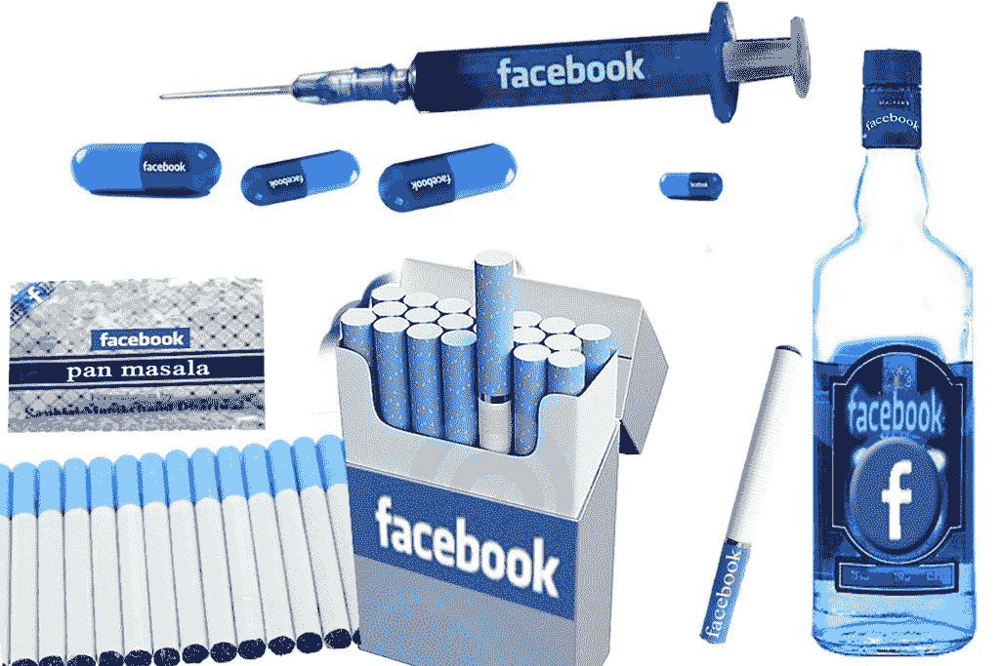

Source: Jan Vanderhoeven

去年，英国皇家公共健康协会进行了一项调查研究，他们采访了 1400 多名青少年，询问他们几个月来的社交媒体习惯。他们就心理健康和健康的 17 个不同属性对他们进行了调查。他们得出结论，基于当前的使用行为，目前对 Instagram、Snapchat 和脸书等平台的采用明显对精神健康有负面影响。

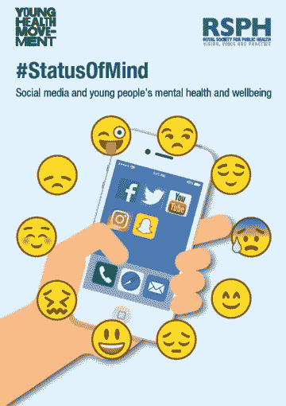

研究表明，平台上较低的心理健康和健康水平来自嫉妒和社会比较。现在，脸书将优先考虑来自朋友的帖子，朋友们有只分享好消息的习惯，心理健康和健康水平更低的风险很高。

毕竟，时间最好不要花在脸书上。

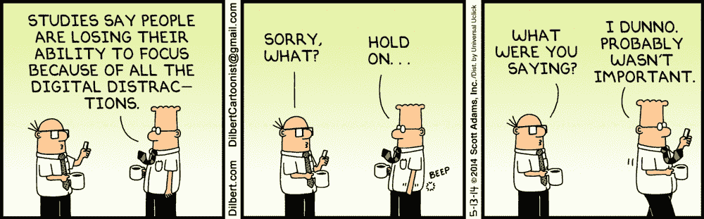

# 一个没有人要求的更加互联的世界

我们的世界比以往任何时候都更加紧密地联系在一起，也许比需要的还要紧密。脸书要成功完成其重新定义的使命，一个关键的假设是，人们非常需要比现在更紧密地联系在一起。

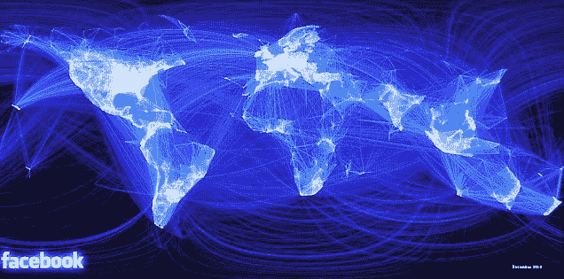

Source: Paul Butler

脸书会优先考虑好友的内容，但是我想知道这些内容对其他人来说会有多有趣。虽然技术可以用来使与你认识的人交流变得更容易和更有效，但我不认为技术可以使人们比他们实际上更有趣，或者比他们实际上想要的更与他人联系。

在纽约的普通日子里，我会看到人们在地铁里、在街上走着，甚至坐在一家高档餐厅里，都盯着自己的手机。如果脸书是当前行为的反映，我不知道人们实际上想要或需要更多的相互联系。

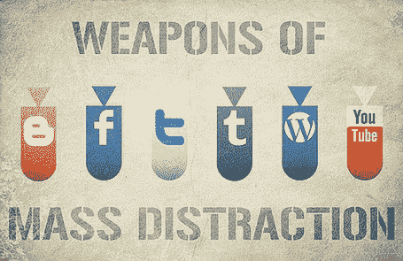

Source: Cohesion Arts

今天，吃饭时的现实生活对话经常被人们打断，他们选择在手机上浏览脸书，希望找到比互相交谈更有趣的东西。一旦脸书成为人们主要相互交谈的场所，他们就不会去脸书以外的地方寻找比与他人交谈更有趣的东西，从而打断这种体验。

我担心脸书可能低估了对更多在线人际交流的需求。人们想花更多时间与他人交谈的未满足需求微乎其微。似乎我们总是试图逃避与他人在一起，而是选择用更有趣的信息来分散注意力。

# 对付假新闻的另一种方法

过去的一年让脸书的假新闻问题对世界变得非常明显，最终对脸书自己也是如此。

不解决这一问题的风险继续增加。去年，他们推出了许多新工具来帮助用户识别和标记假新闻。

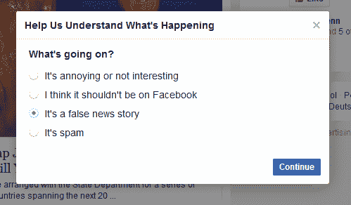

Source: [Factcheck.org](https://www.factcheck.org/2017/07/flag-fake-news-facebook/)

2017 年 4 月， [BBC 报道](http://www.bbc.com/news/technology-39515319)德国政府已批准计划，如果社交网络未能在 24 小时内删除非法内容，将被罚款 5000 万欧元。欧洲其他政府也开始制定计划。因此，假新闻问题的金融风险正在持续上升。

脸书明白，问题不仅限于运营付费广告的企业可能会推广假新闻，同样重要的是，其平台上的有机潜力。在脸书[的第三季度收益电话会议](https://s21.q4cdn.com/399680738/files/doc_financials/2017/Q3/Q3-'17-Earnings-call-transcript.pdf)上，雪莉·桑德伯格分享道“因为我们平台上的干扰超越了广告，我们也增加了页面有机内容的透明度。我们正在寻找方法来提供更多关于谁是基于政治或问题的脸书页面背后的信息。我们相信这将使欺骗性网页更难获得大量追随者，并使我们更容易识别恶意活动。”

脸书最近对其新闻源的改变是处理假新闻问题的另一种方式。首先显示较少的新闻。限制*有机可及的任何新闻*(真的还是假的)。虽然这意味着会看到更少的真实新闻，但也意味着会看到更少的假新闻。

# 谁是真正的掌控者？

脸书正在增加用户新闻源中来自朋友和家人的内容，减少来自企业、出版商和品牌的内容。脸书怎么知道这将导致时间被很好地用在它的平台上呢？

一个人只看到和与你认同的人(和观点)互动而产生的过滤泡沫可能对我们的社会非常有害。用户将开始看到一个更极端的世界，而不是一个更平衡的世界。多亏了个性化

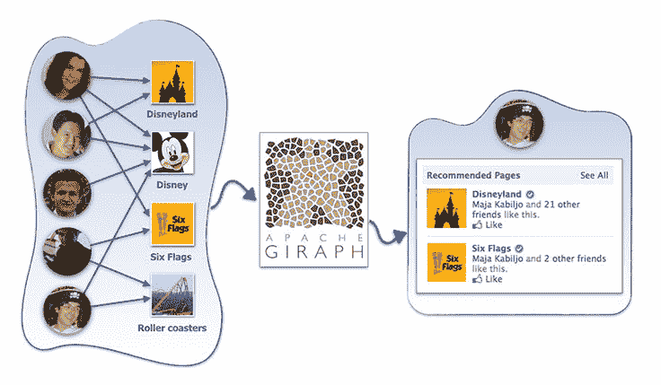

Source: [Facebook](https://code.facebook.com/posts/861999383875667/recommending-items-to-more-than-a-billion-people/)

在脸书的[工程博客](https://code.facebook.com/posts/861999383875667/recommending-items-to-more-than-a-billion-people/)上，他们解释了用于向超过 10 亿人大规模推荐商品的主干技术。“协同过滤(CF)是其中一个重要的应用领域。CF 是一种推荐系统技术，帮助人们发现与他们最相关的项目。在脸书，这可能包括页面、群组、事件、游戏等等。CF 基于这样一个想法，即最好的推荐来自有相似品味的人。换句话说，它使用志同道合者的历史物品评级来预测某人会如何评价一件物品。”

理解脸书的新闻提要是如何工作的也是值得的。这是一个简短的视频，新闻提要的头解释它。

真正需要问的问题是谁真正在控制？是脸书的工程师还是算法？我认为，最近一年向我们表明，算法是控制的因素。他们被设计来优化两件事:脸书的收入和用户对其平台的关注。他们做了出色的工作。*工程师们设计、构建和扩展了世界一流的算法，并按要求行事，这值得称赞。*

现在脸书告诉我们，他们告诉算法做一些不同的事情。改变 20 亿人如何放置他们的注意力并不容易，我认为存在一种适合所有需求的算法是短视的。

我们习惯于选择。不管是我们住在哪里，我们买的东西，我们穿的衣服，我们吃的食物还是我们交的朋友。一般来说，我们通过自己做出的选择来掌控自己的生活。

脸书算法是一个例外，它代表我们做出选择。现在，脸书决定改变他们代表我们做出的选择，因为他们不喜欢之前为我们做出的选择带来的意想不到的后果。我认为这些变化会带来许多意想不到的后果。

我不知道到底是谁在控制着 20 亿人的注意力。脸书的人？一个算法？还是它的用户？

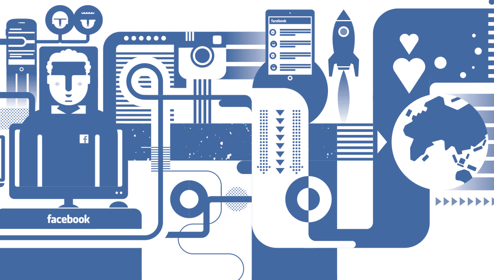

Source: TechCrunch

# 华尔街的新脸书

现在，让我们假设脸书成功地从一个注意力获取平台转变为一个促进用户积极心理健康的人际联系平台。

脸书将会变得非常不同。它可能仍然拥有今天享有的广度，但花在平台上的时间将减少，对品牌、企业和出版商共享内容的关注将更少。

我认为在不久的某个时候，扎克伯格将开始积极地从其核心广告业务转向多元化(就像谷歌的创始人已经有一段时间了，他们在几十个新的无关领域的投资就证明了这一点)。脸书可以进入许多行业，包括云计算、人工智能、企业软件、家庭自动化或移动商务。

要做到这一点，脸书的投资者应该准备好看到杰夫·贝索斯式的利润哲学:将利润返还给企业，而不是交给股东。快速浏览一下亚马逊和脸书过去几年的每股收益就可以看出:

***脸书办事趋势:过去 5 年***

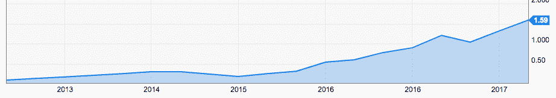

Source: [YCharts](https://ycharts.com/companies/FB/eps)

***亚马逊 EPS 趋势:过去 5 年***

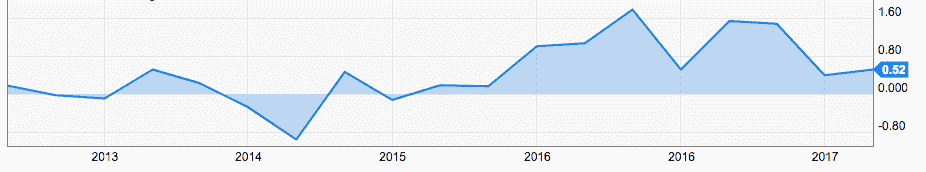

Source: [YCharts](https://ycharts.com/companies/AMZN/eps)

亚马逊采取了一种深思熟虑的策略，将利润立即再投资于业务，而不太考虑向股东支付股息。我相信脸书会采取类似的策略，在广告之外探索新的投资行业。

很明显，有一个行业他们不会进入:出版业。他们已经吸取了教训，我认为有一天他们会很高兴不再有责任的重量(以及对他们使命的干扰)，这是社会如何获得信息、灵感和娱乐的起点。

扎克伯格已经承诺将其 99%的财富捐给慈善机构，这是一种令人钦佩的领导行为，为那些积累了超过个人需求的金融财富的人设定了基调。这一举动也表明了扎克伯格与金融财富的关系:没有积累财富的强烈愿望。

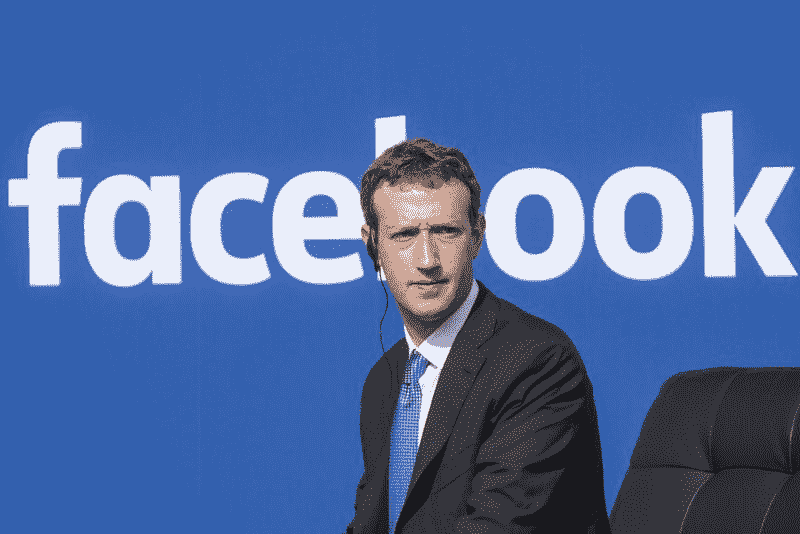

Source: Getty Images

尽管他可能不会被个人金融财富的进一步积累所驱动，但有一点是清楚的:他是被控制所驱动的。几个月前，[他发布了](https://www.facebook.com/zuck/posts/10104055333186581):“在过去的一年半时间里，脸书的业务表现良好，我们股票的价值已经增长到我可以完全资助我们的慈善事业，并在 20 年或更长时间内保留脸书的投票权。”这是在恢复[提议](https://techcrunch.com/2016/04/27/facebook-is-adding-a-new-class-of-stock-that-will-help-keep-zuckerberg-in-control/)的背景下分享的，他提出的提议是如果他卖掉大部分股份(为慈善事业提供资金)，他将在未来进一步加强对公司的严格控制。

脸书的未来真的是基于扎克伯格决定他想做什么。董事会不能告诉他该做什么。股东无法取代他。对于大多数上市公司来说，这种治理结构是独一无二的。就脸书而言，股东们很快就会发现，他们的财务利益与扎克伯格并不完全一致。让我们希望社会的利益。

# 建议:制定脸书战略

鉴于我们的重点是帮助优质出版商取得成功，我将把我的大部分具体建议集中在行业的这一部分。

尽管出版商短期内会感到痛苦，但我认为脸书的觉醒和商业模式的改变将为出版商带来新鲜空气，并(再次)为新产品、新模式和新解决方案创造空间。

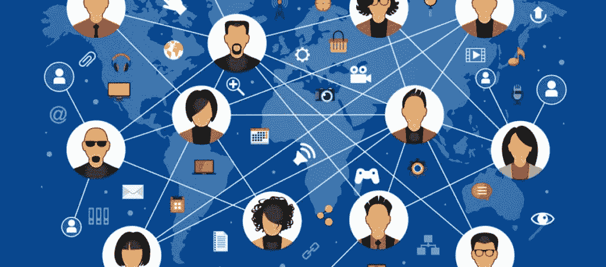

正如我在最近的一篇文章中所写的，我仍然对很少有出版商对脸书有明确的战略感到惊讶。每个出版商都应该考虑三件具体的事情:

**1。分配的 B 计划:**计划一个你在脸书没有任何有机可及的世界。去年秋天，我在[的一篇帖子](https://polar.me/blog/plan-b-world-without-facebook/)中预测，随着脸书选择向企业、品牌或出版商收取“通行费”来获取用户，这种情况可能会在未来发生。看起来这比我预测的要早得多。你需要一个新的观众分布策略。

**2。支持品牌营销人员:**将此视为一个机会，因为顶级品牌营销人员将比出版商受到更大的打击。品牌营销者拥有的有机影响力将为零，他们将别无选择，只能购买广告。脸书的广告费率将会飙升，低漏斗表现的营销人员将会胜出(类似于谷歌搜索)。品牌营销者将寻找脸书的替代品来接触他们的受众，出版商可以填补这一空白。

*注意:依靠脸书扩大受众范围和品牌内容分发的出版商将很快发现，他们负担不起使用该平台的费用，因为他们将整天被业绩营销人员出价超过。*

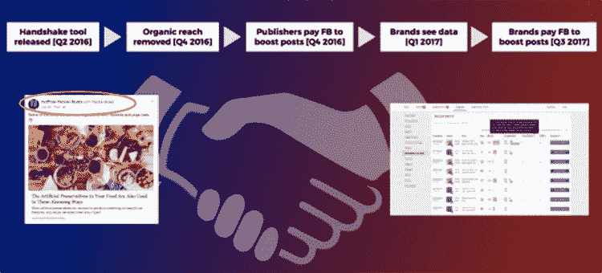

Source: Polar

**3。花的时间值得:品牌和出版商应该认真思考用户在网站上花的时间是否值得。我认为脸书加入进来只是时间问题，如果他们认为当一个用户访问你的网站时，花费的时间是不值得的，他们可能不会引导那么多用户访问你的网站。**

鉴于脸书正在发生的变化，现在是出版商投资发展战略的时候了。你能做的最糟糕的事情就是“等着瞧”。

# 最后，这并不奇怪

如果你还不知道，我个人同意这将对这个行业产生巨大的连锁反应，一段时间以来，我已经清楚地看到这种迹象。我不想这么说，但是我告诉过你。

去年夏天，我们发布了一份 20 页的白皮书， [*如何煮青蛙*](https://polar.me/resources/how_to_boil_a_frog/) ，提供了脸书如何慢慢扼杀其平台上的品牌、影响者、出版商和零售商的分销，并从这些举措中获得丰厚收益的背景和背景。

我们还[详细解释了](https://polar.me/blog/paid-distribution-part-2-facebooks-not-so-friendly-handshake/)脸书的品牌内容“握手”工具如何不是一个非常友好的握手，因为脸书为品牌创造了一种绕过出版商的方式，直接在平台上花费以增加他们被标记的出版商帖子。

去年秋天，我们推出了“[B 计划](https://polar.me/blog/plan-b-world-without-facebook/)”的愿景，我们预测脸书的有机接触将会消失，并建议制定一个备用计划，说明如何接触和吸引受众。

上面的链接提供了一些相关的背景和上下文，如果你还没有看过的话。

去年我非常喜欢读的一本书是吴添的 [*【招商】*](https://www.nytimes.com/2016/11/03/books/review-attention-merchants-tim-wu.html) *。这是对过去 100 年来获取关注的行业的一个很好的深度审视。*

# 重获信任:脸书何去何从

脸书有信任问题。用户和行业之间严重缺乏信任。

用户信任脸书的注意力，而脸书不惜一切代价将注意力货币化，完全不顾精神和情感安全等基本的人类原则。

该行业已经开始依赖脸书作为一个有效的营销渠道来接触和吸引他们的客户，而脸书已经从他们的地毯下拉了下来。

一切都在变化，脸书在社会中的角色也在变化。

—

Kunal Gupta 是 Polar 的创始人兼首席执行官，Polar 是一家技术平台提供商，其使命是为优质内容提供商业模式。Polar 的合作伙伴包括 Conde Nast、Oath、The Telegraph、News Corp、Gannett 和 Fairfax Media 等主要出版商。Polar 在纽约、伦敦和悉尼设有办事处，总部位于多伦多。

Kunal 热衷于在现代寻找平静和专注。库纳尔是加拿大领先的精神健康医院和研究机构 CAMH 的董事会成员。他定期在他的博客 findfocus.today 上写关于领导力、正念和技术文化的话题。

你可以在 [LinkedIn](https://ca.linkedin.com/in/kunalfrompolar) 上和他联系。

## 这个故事发表在 [The Startup](https://medium.com/swlh) 上，这是 Medium 最大的企业家出版物，拥有 291，182+人。

## 在这里订阅接收[我们的头条新闻](http://growthsupply.com/the-startup-newsletter/)。

