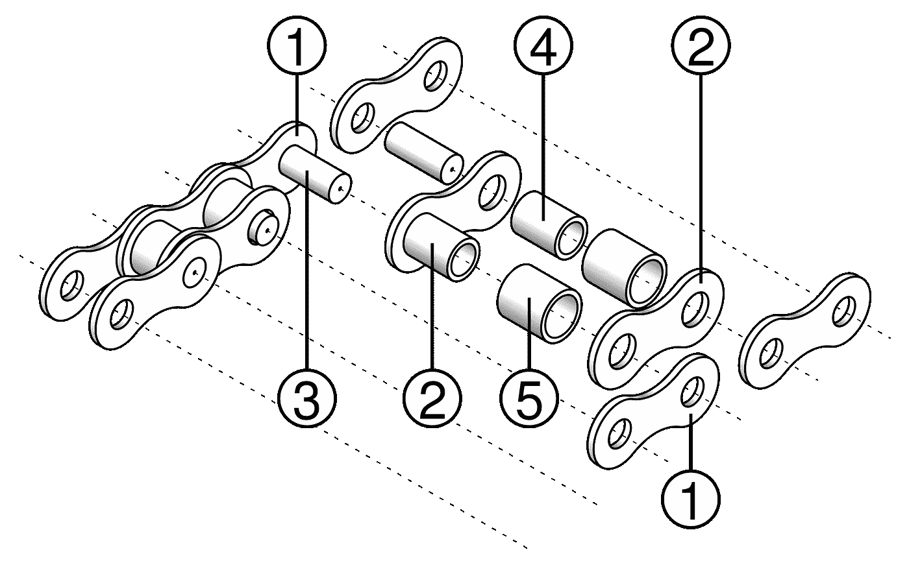
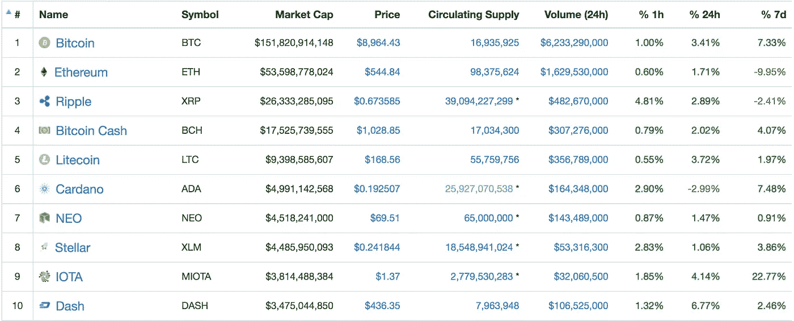

# 理解非公开的区块链

> 原文：<https://medium.com/swlh/making-sense-of-non-public-blockchains-915d5d538ae6>

越来越多的听到“**私有区块链**这个名词。经常断章取义，并且经常以明显错误的方式使用。 [**汇丰**](https://www.coindesk.com/uk-bank-hsbc-might-soon-pilot-live-blockchain-payments/) ， [**非主要银行**](https://cointelegraph.com/news/major-polish-bank-to-implement-blockchain-document-storage-system) ，【不容错过的】 [**Techcrunch**](https://techcrunch.com/2018/01/28/bank-based-blockchain-projects-are-going-to-transform-the-financial-services-industry/) ，甚至埃森哲、IBM 之流力推的 [**《金融时报》**](https://www.ft.com/content/615b3bd8-97a9-11e7-a652-cde3f882dd7b) 。
**这对“crypto”生态系统不利。**
这个问题需要澄清。

因此，让我们来看看非公开的区块链，并透露一些急需的信息。

这是我将在这篇文章中讨论的内容:

1.  *什么是区块链？*
2.  外面有多少区块链人？
3.  *非上市区块链*
4.  会不会只有一个赢家？

# 1.什么是区块链？

什么是区块链？这是一种缓慢、昂贵、复杂的交易跟踪方式。
然而，它有一个**惊人的**属性:对于哪些交易有效的共识是去中心化的，**不能被轻易规避或抵制**。它允许人们在不信任银行、经纪人、票据交换所或政府的情况下进行货币交易。它还提供了一个无人控制的不可变的“公共注册表”。区块链上的每一笔交易都是公开可见的。

一个“**分散的共识**”意味着你不需要一个中央权威；您只需要大多数“投票者”同意验证哪些交易。
(以目前比特币区块链中的“投票”系统为例，基于“ [**【工作证明】**](https://en.wikipedia.org/wiki/Proof-of-work_system) ”原理)。

例如，与中央数据库相比，以分散的方式获得这种共识使其成为一个缓慢、昂贵、复杂的系统。
事实上，区块链的所有节点冗余地**执行所有计算**，而不是以隔离的方式(并行计算)。

你可能认为这是浪费资源；然而，让共识**难以绕过**是一种“必要之恶”。

Decentralized consensus? (painting by Pablo Echaurren)

让我再次强调这个概念:

> **区块链的主要优势在于，你不需要依赖一个中央机构来达成共识。**
> 
> **规避或抵制共识通常代价太高。**

那么，当“X 银行”正在构建一个**私有区块链**时，意味着什么呢？这仅仅是一个矛盾吗？ [**当然，大多数情况下**](https://www.investopedia.com/news/banks-building-blockchains-distributed-ledger-permission/) 。

# 2.外面有多少区块链人？

没有所谓的“THE”区块链。有**比特币区块链**，以太坊区块链**，还有几个不太重要的其他。**

这是否意味着我们可以简单地在 Amazon Web Services 上启动一些 EC2 实例，安装一些区块链软件，然后称之为我们的“Blah blah”区块链？

不要！如果太容易“获得”那个区块链的控制权(被称为**“51%攻击”**的东西)，我就不会称之为“合适的”区块链。如前所述，区块链的一个必备属性是**其分散共识不能被轻易攻击**。

如果你看看 Coinmarketcap 上的“前 10 大”加密货币，你会注意到其中一些(Ripple、Cardano、NEO、Stellar、IOTA)在“流通供应”一栏下有一个星号:

你知道星号是什么意思吗？硬币**不能被开采**。星号本质上表示非公有区块链。
非公开的区块链有什么特别之处？谁可以加入，谁可以采矿，谁可以阅读等等都有限制。

我们现在可以引入非公有区块链的概念:是什么使它们不同，以及它们为什么首先存在。

# 3.非公有区块链

“公共”区块链暴露了一个完全公开且不受控制的网络，仅通过密码经济学(工作证明、利益证明、BFT 或另一种共识算法)进行验证，与此不同，非公共区块链可能有一种不同的方法，涉及:

1.  读取权限(你可能需要某种程度的隐私)
2.  **块生成权限**(您可以限制谁可以“挖掘”或以其他方式确认交易；或者换个说法，你想相信谁？)
3.  **如何接纳参与者**(任何人都可以加入吗？或者是否有一个中央权威机构，或现有参与者之间的共识，来决定某人是否可以加入)
4.  **身份:**参与者是否需要被识别。
5.  **合法性:**交易在特定的司法管辖区是否合法？
6.  **法律挑战:**相对于公共区块链的“不可改变”的交易，有人可以“起诉”并获得特定交易可以被删除或修改吗？
7.  **治**(和叉，和“硬”叉)。这个案例对于区块链的“土地注册处”类型特别有意思，这个案例接近我们公司 [**Fabrica**](http://www.fabrica.city) 正在构建的案例，因为必须不惜一切代价保证土地注册处的“合法性”；你不能简单地假设一个完全去中心化的区块链会一直和一个地方政府“打得很好”(我们用一个“合法的”中间层来解决这个问题)。

你可以想象这些细节将决定区块链的“类型”，从“部分去中心化”/“联合体”一样的区块链，到完全私有的区块链。

[**Ripple**](https://www.ripple.com/) 例如，一个部分去中心化的区块链，由一个中心实体(Ripple 公司)和几个金融机构的“联合体”控制。

一个**部分下放的**——我们是不是应该简单地称之为“非公”？—可以提供非常强大的功能。一个完全私有的数据库对我来说没什么意思——它本质上是一个集中的数据库，也许还附有一些加密证明。

# 4.会不会只有一个赢家？

区块链模型的发展还有很多事情要做。

作为一个例子，我可以想象 NuCypher 的代理加密可能为部分去中心化的区块链提供强大的工具，同时也消除了一些问题。(披露:我知道 NuCypher 团队，我在他们公司有一小部分既得利益)。

Hashgraph consensus 算法之上的公共区块链 [**Hadera**](https://venturebeat.com/2018/03/13/hedera-hashgraph-and-mz-unveil-next-generation-blockchain-alternative/) 呢？

以及 [**以太坊 Casper**](https://blockgeeks.com/guides/ethereum-casper/) 最终会不会给一个非公开的区块链供电？

我是区块链完全分权的坚定支持者。像 TCP/IP 和电子邮件一样，一个完全开放、透明的协议是其他所有人赖以生存的正确基础。我毫不怀疑最大的两个，比特币和以太坊，将会有一个漫长而成功的一生。

然而，我们不能轻易放弃被允许的区块链。随着空间的成熟，有太多的边缘情况需要它们。TCP/IP 和电子邮件并没有阻止孤岛式解决方案(脸书、亚马逊、谷歌)的发展。我不知道 [**JP 摩根的法定人数**](https://www.jpmorgan.com/global/Quorum) 是不是我心目中的实现，但还会有很多其他的。

最后，我坚信区块链的一个伟大用例是成为“全球土地注册”的基础。想象一下这样一个世界:你可以即时了解世界上任何地方的某处房产，如果房主愿意出售，你可以有计划地对该房产出价/出价。或者看看它的历史。诸如此类。

How will the Blockchain power a global land registry?

这种特殊的用例不能仅通过去中心化的区块链来完成。这种情况，以及其他有趣的用例，将如何将分散化的自由/开放/透明方面与非公共的必需元素混合起来，使其发挥作用？

这将是 2018 年一个非常值得关注的空间。

[**你可以在这里**](https://medium.com/fabrica) 订阅“Fabrica”的帖子。

## 这篇文章发表在 [The Startup](https://medium.com/swlh) 上，这是 Medium 最大的创业刊物，有 312，043+人关注。

## 在此订阅接收[我们的头条新闻](http://growthsupply.com/the-startup-newsletter/)。

