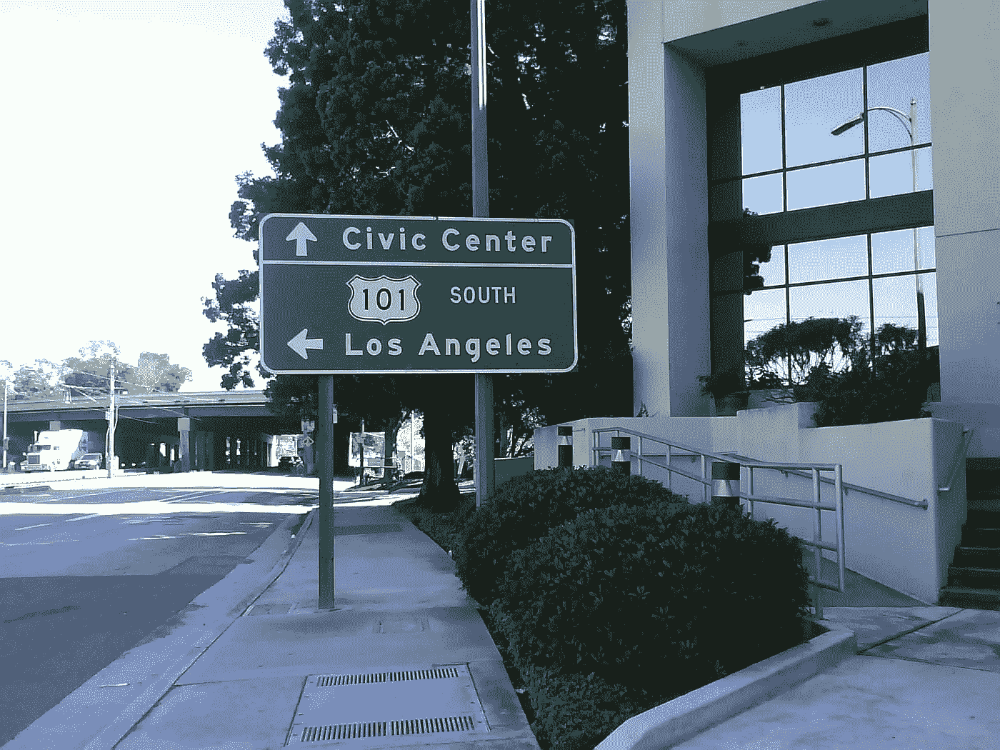

# 打造硅谷

> 原文：<https://medium.com/swlh/making-silicon-valley-22329890420>

San Jose, California (photo by F. Javid)

走出旧金山机场，沿着 101 公路下到圣何塞，硅谷因其独特的历史而具有在其他任何地方都找不到的精神。

湾区是一个海上交通区，来自太平洋的船只穿过金门向奥克兰港口驶去。在三十年代，一些业余爱好者开始制作无线电来与船只交流，并建立了一个无线电爱好者社区。这些第一台收音机是用放大真空管制造的，起初非常不可靠。为了提高效率，真空管被用来建造雷达和第一台计算机，在那里“虫子”实际上是真正的昆虫，它们会制造捷径。

制造和改进真空管的研究主要是在斯坦福大学进行的，由军事合同资助，并得到工业项目的支持。聪明的学生参与了这些组件的开发，然后他们成立了自己的创业公司，开发更先进的组件或设备，如生产电子管的烤箱。

尽管如此，真空管的一个主要缺陷是它们的预期寿命，这意味着要定期更换它们以确保雷达或计算机的功能。晶体管的发明标志着硅革命的开始，晶体管的作用与真空管相同，而且更可靠，更容易生产。从那一刻起，随着集成电路和数据时代的到来，世界将永远不同。英特尔于 1968 年由一群飞兆富有远见的工程师创立，是首批为大众消费应用制造晶体管的初创企业之一。像英特尔这样的初创公司得到了风险投资基金的支持，其中一些是由前成功的硅企业家建立的。

因此，学术研究、军事和风险投资基金以及工业/创业生态系统的结合造就了硅谷的诞生。不墨守成规的心态和边疆神话，这是美国根源的一部分，也是使不可能成为现实的关键。

要了解更多细节，请阅读 Christophe Lecuyer 的优秀文章:*打造硅谷——1930 年至 1970 年高科技的创新和发展。看伟大的*硅谷*电视剧！*

## 这篇文章发表在 [The Startup](https://medium.com/swlh) 上，这是 Medium 最大的创业刊物，有 316，028 人关注。

## 订阅接收[我们的头条新闻](http://growthsupply.com/the-startup-newsletter/)。

