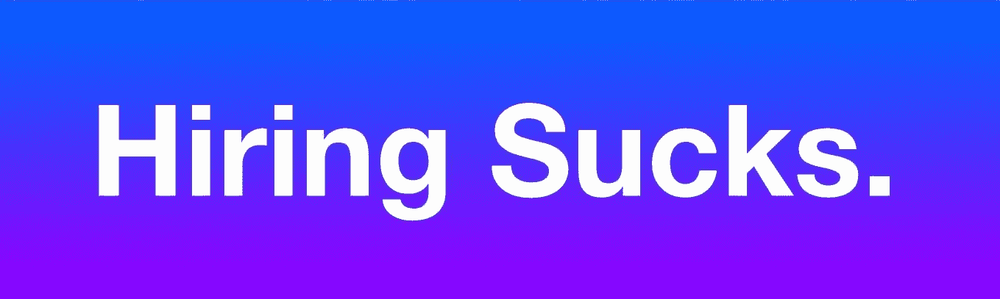
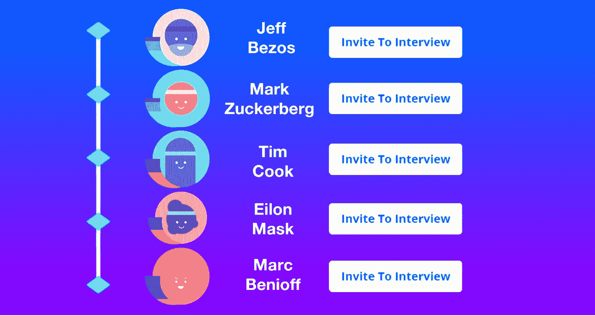

# 在初创企业中招聘第一批员工——这是一个严酷的事实

> 原文：<https://medium.com/swlh/making-the-first-hires-in-a-startup-the-hard-truth-fa7dbf37160f>

“我们怎么能从这么多有才华的候选人中做出选择呢？
谁不想成为如此大好机会的一部分呢？”

说真的，我发誓，这是我在 [**感知人工智能**](http://www.prcptv.ai) 开始寻找第一批员工加入我们团队之前的一些初步想法。显然，在你真正成为自己创业公司的创始人之前,**,雇用早期创业公司的第一批员工是你脑海中想象的非常不同的事情之一。**

我真的认为这就像建立我的幻想 NBA 球队一样，我将很难在勒布朗·詹姆斯和斯蒂芬·库里之间做出决定。不幸的是，建立一个有成就的超级明星的梦之队比我想象的要复杂得多。有人可能会说，团队的质量将预先决定一个公司成功的可能性。毕竟，人才是年轻创业公司最重要的资产，这一点毋庸置疑。唯一的问题是我们在世界上哪里能找到这些人？

有些人可能会说，试图说服来自亚马逊和谷歌的人是一个大胆的举动。我认为这很傻。尤其是在阅读了几天前《国土报》上的这篇令人沮丧的文章 之后，这篇文章讲述了行业巨头如何在争夺精明开发者的竞赛中碾压无助的初创公司。另一方面，在公司生命周期的这个阶段，雇佣纯粹基于原始潜力的人风险太大了。

斗争是真实的。所有不同的创业公司都在竞争同一个人力资源，让我告诉你，熟练人才的名单没有你想象的那么长。或者有人曾经告诉我，追求 1%的顶尖人才的问题是，只有 1%的顶尖人才。事实上，唯一比找到顶尖人才更难的事情，就是找到有兴趣在你的创业公司工作的顶尖人才。当不确定性像乌云一样笼罩在你的头顶时，在早期创业公司工作并不适合每个人。大多数人十有八九会选择稳定而不是不确定，顺便说一句，这并不意味着他们在任何方面都没有天赋。但是当你把这个过滤器添加到你的完美竞争者中时，你实际上是在大幅削减潜在候选人的名单。

## 经验教训

今天，在开始这个过程以来犯了无数错误之后(然而这个任务仍然没有完成)，我觉得我获得了一些实际的见解，这些见解可能对其他人非常有价值。

**等不及了****——**“A”玩家可能不会一天敲你三次门，尽管这可能是有史以来最酷的事情。所以我的建议是——不要只是堆积随机的简历，或者期望它们来自脸书/LinkedIn 上的某个状态。更不用说人力资源公司了，在我看来，这完全是浪费时间和金钱。但主要是时间。如果你正在寻找少量的职位——自己去争取，积极主动！试着寻找符合你要求的最优秀、最有经验的专业人士，并在 LinkedIn 上给他们发信息。可能发生的最糟糕的事情是什么？最终，你不需要每个人都改变信仰。只有一个或两个 ace 的每一个位置，这肯定是可行的。否则，在我们公司，我们将永远无法接触到顶级人才。

面试官是谁？——信不信由你，如果你做的每件事都是正确的，并且接触到了正确的候选人，那么你实际上就是将要被面试的人，而不是相反。起初，我真的很难接受我是被采访的人，但当你仔细想想，这很有意义。如果你在和一个大人物打交道，你可以有把握地假设他从其他大公司那里得到了很多兴趣/邀请，并且由你来说服他选择你的公司，前途无量。为了帮助他做出这种冒险的、非直觉的信念飞跃，你必须以非常详细的方式向他解释你的产品是如何发展到这一步的，为什么客户喜欢你的产品/服务，更重要的是，为什么未来比太阳还要光明。

一个幸福的家庭——我称之为“一拍即合”的因素，但其他人可能会称之为文化契合。与拥有数百名员工的大企业不同，在一家初创企业中，通过*啤酒测试对公司和应聘者本人来说都是绝对必须的。*

*从**候选人的**的角度来看，与创始人或其他员工没有良好的关系可能会像终止进程一样致命，即使他愿意在高薪上妥协。至于你的**公司**，这将是一个非常亲密的环境和一个地狱般的旅程，所以仅仅满足于“我们可能会相处得很好”是不会成功的。一起去喝杯啤酒，一起吃顿午餐，或者做任何你想做的增进感情的活动。你必须有出色的化学反应，以确保你正在形成一个有凝聚力的团队，即使事情变得有点不稳定，他们也会一起战斗。他们可能会的。*

*T **慢慢来，不要强求** —当你是一家初创公司时，你缺乏很多资源，时间是重中之重——投资者、烧钱速度、竞争和市场时机都在给你施加压力，让你的产品在昨天准备好。事实是，为了快速交付高质量的产品，你需要优秀的人才，而优秀的人才需要时间去雇佣。所以你发现自己面临着时间和质量的经典困境。我是应该快速雇佣平庸的人，还是以牺牲计划进度为代价雇佣优秀的人？*

*说起来容易做起来难，但是让我们假设一下，你已经找到了一个有才华的候选人，他也是一个很棒的人，而且你们已经就条件(工资/股权)达成了一致。最终目标是确保她对自己做出的决定有 100%的信心。你最不希望的就是候选人加入你的公司，仅仅因为你非常有说服力，或者因为她在这个特定的时间点没有收到任何邀请。你希望她加入你，因为她相信你的愿景，因为她想成为你团队的一员！即使你不是绝对确定，这可能很诱人，但如果候选人最终在四个月后离开，因为她得到了更好的工作机会，或者因为她不了解你最初同意的条件，那么你最终弊大于利。*

*你的竞争对手无法复制的是你的人力资本，这是你最大的差异化和头号优势。作为一家早期创业公司，有相当多的风险需要处理和减轻，以确保公司有机会成功。我想不出还有比雇佣错误的人更致命的风险了。你可以改变算法，修复漏洞，改变业务，但仍然可以成功，当然前提是你雇佣了正确的人。但是雇佣了错误的人，这一切都不重要了。采取积极主动的措施，确保这些措施在专业和文化上适合你，并有可能永远对你有利。*

*哦，对了，顺便问一下，我有没有提到我们在招人？*

**

## *这个故事发表在 [The Startup](https://medium.com/swlh) 上，这里有 263，100 多人聚集在一起阅读 Medium 关于创业的主要故事。*

## *订阅接收[我们的头条新闻](http://growthsupply.com/the-startup-newsletter/)。*

**