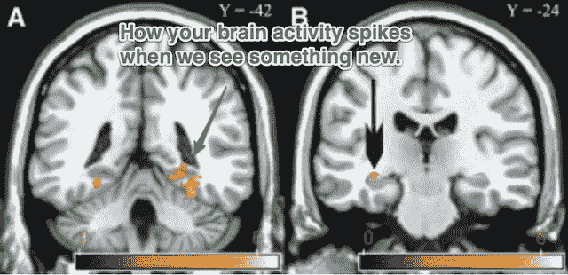
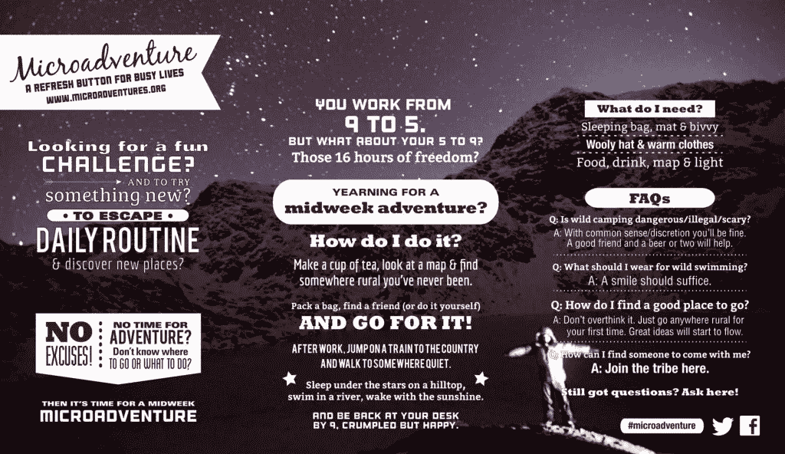

# 充分利用您的 5–9

> 原文：<https://medium.com/swlh/making-the-most-of-your-5-9-679a2ecc4d27>

## “微冒险”如何让你变得更聪明、更快乐、更有创造力

Image by Joshua Earle on Unsplash: [https://unsplash.com/@joshuaearle](https://unsplash.com/@joshuaearle)

上周，我在星空下睡了一夜。头顶上是美丽开阔的天空，我感觉自己就像一个舒适地躺在睡袋里的完美冒险家。

踢球者？我在我的后院。

我总是被冒险迷住。我喜欢只带一个背包去乡村旅行的想法，但是生活经常会被账单、截止日期和杂务所阻碍。

但不一定非要这样。

几个月前，我偶然发现了[阿拉斯泰尔·汉弗莱斯](http://www.alastairhumphreys.com/)——*国家地理*年度冒险家的作品。虽然阿拉斯泰尔有一些大的冒险经历(比如[骑自行车环游世界](http://www.alastairhumphreys.com/adventures/roundtheworldbybike/)和[划船横渡大西洋](http://www.alastairhumphreys.com/adventures/rowing-atlantic/))，但他现在的热情完全是为了变小。

他的使命是鼓励普通人通过他称之为“微冒险”的小探险来体验冒险(因此有了我的后院露营):

> 普通人可以在普通的地方，在很短的时间内进行冒险，而且不需要花很多钱

对汉弗莱斯来说，冒险代表了一种简单的机制，将匆忙而平凡的世界换成有趣而不可预测的东西。这是将自己推出盒子的完美方式，对于想要保持创新精神的创新者来说是绝对必要的。

最精彩的部分？冒险生活比看起来容易。

*本帖最早出现在剧组博客上。* [*点击此处查看更多喜欢。*](http://crew.co/backstage)

# 为什么你需要过冒险的生活

冒险可能会很混乱。首先，你被迫走出自己的舒适区，涉足不熟悉的领域，同时也从日常生活中抽出时间。

但是，尽管有风险和困难，冒险为创意者提供了一些惊人的好处:

# 1.冒险在大脑中激发新的突触

在许多方面，创造力可以被总结为[将不相关的东西联系起来的能力](https://blog.crew.co/become-creative/)——将两个独立的、看似不相关的想法组合成新的、新奇的东西。我们建立这些联系的能力很大程度上受到大脑构造的影响。

把你的大脑想象成一个复杂的高速公路系统。如果你经常在同一条路上来回行驶，很难有新的体验和新奇的想法。

你需要打破常规。在大脑中，这被称为神经可塑性——我们大脑回路改变的能力。

[关于旅行的研究](http://www.theatlantic.com/health/archive/2015/03/for-a-more-creative-brain-travel/388135/)表明新的经历可以刺激你神经通路的变化:

> “神经通路受到环境和习惯的影响，这意味着它们对变化也很敏感:新的声音、气味、语言、味道、感觉和景象会激发大脑中不同的突触，并可能具有振兴思维的潜力。”

此外，最近的研究发现了国外旅行和联系想法之间的联系，而联系想法是创造力的基础:

> “国外的经历增加了认知的灵活性和思维的深度和完整性，以及在不同形式之间建立深层联系的能力。”

这里的带回家的东西不是打包行李和拿护照。你可以在门外体验新的景象、声音和气味。你只需要再努力一点(稍后会有更多的想法)。

# 2.冒险让你走出你的文化泡沫

我上大学时，有幸多次去阿拉斯加旅行。在一次旅行中，我们乘坐一架小型飞机去了偏远的渔村瓦尔迪兹。我会记得那次旅行有几个原因，但主要是因为当地的生活方式与我自己的有太多不同。从导游到渔民，我发现这个社区的生活方式令人着迷。

在家里，我们很自然地被自己喜欢的人包围。不应该感到惊讶的是[这些人中的大多数实际上在许多方面与我们相似。我们创造了自己思想的回音室。](https://blog.bufferapp.com/thinking-mistakes-8-common-mistakes-in-how-we-think-and-how-to-avoid-them)

研究人员建议让自己接触不同的文化身份，作为打破这种回音室的一种方式。这有助于消除研究人员所说的“习惯性封闭思维”。事实上，文化沉浸[是](http://amj.aom.org/content/58/1/195.abstract)旅行有助于增加创造力的一个关键原因。仅仅躺在坎昆的沙滩上是不够的。你必须融入当地的生活。

甚至在你自己的城镇周围，也有打破文化窠臼的方法。当然，这可能和去另一个大陆不一样，但这是朝着正确方向迈出的一步。

# 3.停工让你有时间思考

告诉你一个秘密:我手机上瘾了。

即使当我在度假的时候，查看我的电子邮件，联系 Slack 的基地，或者浏览我的 Twitter feed 的诱惑也是压倒性的。我只要看一眼杂货店的队伍或者吃饭时我旁边的桌子，就知道我不是一个人。我们不断受到来自手机的大量信息的轰炸，这损害了我们的创造潜力。

根据研究人员的说法，[我们的大脑需要停工期](http://www.scientificamerican.com/article/mental-downtime/):

> “休息时间补充大脑的注意力和动力，鼓励生产力和创造力，对于实现最高水平的表现和在日常生活中形成稳定的记忆都是必不可少的。”

在这些停工期，我们大脑中被称为默认模式网络的部分开始活动。

这个网络反映了我们的一天，处理了事件的记忆，并做了一种内部绩效评估。默认模式网络还[鼓励大脑间接思考](http://pps.sagepub.com/content/7/4/352)并在想法之间建立新的联系。如果你一直有源源不断的信息，你就错过了。

我发现了一个我很擅长切断联系的地方:在树林的中央。没有手机信号意味着没有电子邮件、推特或应用程序。

如果你不喜欢在大自然中露营，强迫自己脱离常规也有帮助。就我个人而言，如果我身边没有一张放着笔记本电脑的桌子，我就不太愿意工作。

待在镇上？去一个你从未去过的地方，把手机留在车里。离开城镇？租一个 AirBnB，看看你能探索多少新的地方。

# 这听起来很好，但我不能，因为…

你可能凭直觉知道冒险和休息时间对你的大脑有益。

这本书叫做《哈克贝利·费恩历险记》而不是《T2·哈克贝利·费恩历险记》和《不可思议的任务清单》是有原因的。冒险是迷人的，但在繁忙的生活中很难找到合理的解释。

这就是微观冒险概念的用处。

# 借口:我不能休长假

那很好。冒险不需要持续一周。事实上，研究人员指出[比起一年中的一两次长假，更频繁、更短的假期](http://www.springer.com/about+springer/media/pressreleases?SGWID=0-11002-6-849021-0)会让我们更快乐。

不要担心整整一周的休假。相反，请一两天假来延长你的周末。利用这段时间开车去一个新的地方。周一早上你就可以出发了。

# 借口:我的日程很紧，没有足够的时间

汉弗莱斯经常碰到这种借口。事实上，他经常开发“5 到 9 挑战”。我们中的许多人从早上 9 点到下午 5 点非常忙，以至于我们甚至不能考虑离开，但是在我们第二天回到工作之前，我们有 16 个小时的空闲时间。现在是进行一次小冒险的时候了。

和大多数习惯一样，关键是从小处着手。

不要想一连几天冒险去野外。集中精力在平时有空的时候抽出几个小时。把它写进你的日历，让自己负起责任。我在离我家不到一小时车程的地方做过三次微观冒险(站立式滑板、露营和徒步旅行)。

# 借口:装备太贵了

如果你准备进行户外微观冒险，你可能会考虑适度的金融投资(Alastair 在这里整理了一份有用的清单)，但你可能已经拥有比你想象的更多的东西。如果没有，过一段时间再买装备，现在坚持免费探险。上周，我们开车进入山区，进行了两个小时的徒步旅行，在山顶看到了美丽的景色。总费用:20 美元(回家路上吃午饭)。

# 借口:我不知道该怎么办

我也很纠结。谢天谢地，这里有一些很棒的想法让你开始。这里有几个我觉得很容易找到的:

*   **上下班**。走风景优美的路线，而不是直接的路线，甚至可能沿途停下来吃早餐。
*   爬上一座小山，看星星。就我而言，我们看了烟火。你所需要的只是一条可以躺在上面的毯子。
*   尝试一项新的活动。对我来说，我们去了单人桨板滑雪(非常有趣！).你可以去攀岩、划皮划艇，或者在城市里骑自行车。它必须是新的东西。

我不太可能变成下一个贝尔·格里尔斯。你不会在*国家地理*上看到我骑自行车环游世界或划独木舟横渡大西洋。没关系。我满足于坚持较小的冒险。

在过去的几个月里，我试着每周都去冒险。我并不总是成功。生活阻碍了我们。但是，当太阳刚刚落山，我发现自己在树林中搭起帐篷时，我感到一丝兴奋。那一晚，我觉得自己像个冒险家。这种感觉令人上瘾，让我不断回来想要更多。

这篇文章是由杰瑞米杜瓦尔写的。[在推特上追上他](https://twitter.com/JeremeyD)。

# 开始你的下一次微冒险[建造你喜欢的东西。](https://crew.co/?utm_source=Medium&utm_medium=CTA&utm_campaign=MediumCTAs)

## 查看 Crew，在这里您可以与世界上最好的设计师和开发人员一起工作。超过 1000 万人使用过 Crew 生产的[产品。超过 300 万人阅读了我们的博客。在这里加入他们](http://crew.co/?utm_source=Medium&utm_medium=CTA&utm_campaign=MediumCTAs)。