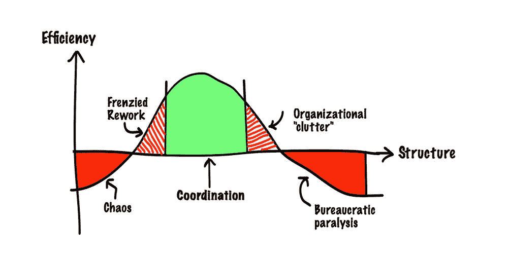
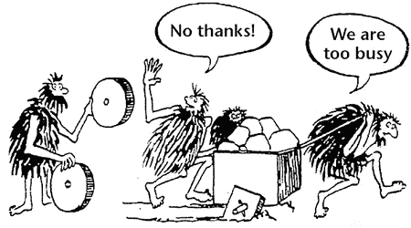
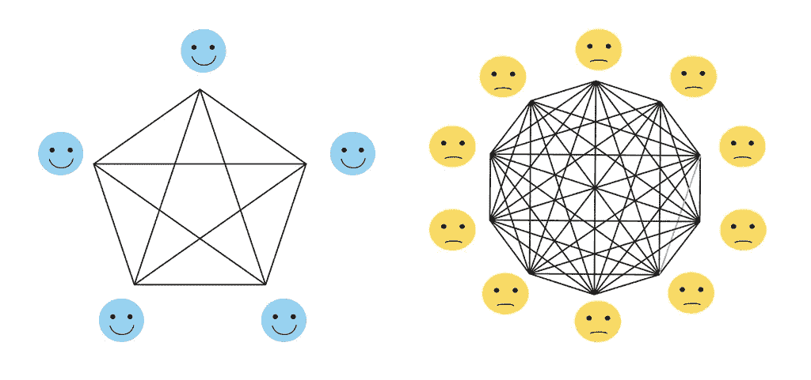

# 如何管理你的初创公司的快速增长

> 原文：<https://medium.com/swlh/manage-startup-hyper-growth-ceo-96bb7d3f94f2>

## 建立共同的价值观、运营清晰性和效率。

我很幸运能在处于爆炸式增长阶段的公司工作。最著名的可能是 2010 年至 2014 年的 Twitter，在此期间，我们的员工人数从 100 人增长到近 4000 人。

有一个普遍的说法是，公司越大，它往往运作得越慢。让公司走上类似轨迹的创始人经常问我，如何在提高效率的同时，最好地管理如此快速的增长。

随着越来越多的人加入团队，您如何全面衡量运营效率？什么是正确的组织结构？合适的团队规模？在不断扩大规模的同时，你如何管理社交、产品或工程文化？

这篇文章试图回答这些问题，分享我在这类公司中观察到或帮助实施的最佳实践。

# 你公司的核心价值观是什么？

我最近写了“使命驱动”意味着什么，以及为什么它会大大增加你成功的几率，让你专注于执行。在愿景和执行之间建立一致性不仅有助于你描述你的组织的目的，还能回答它做什么，为谁做，以及如何做。

 [## 为什么我喜欢使命驱动的企业家

### 使命驱动的公司如何在愿景和执行之间建立一致性。

medium.com](/numa/mission-driven-founders-70c7b78979e8) 

“如何”在很大程度上取决于在公司内部建立共同的价值观。这意味着发展和维护一套具体的核心价值观。在您的公司中共享并付诸行动的价值观。

> 就你希望如何工作和建设公司达成共识。

还记得电影《办公空间》里，员工是怎么感觉公司是敌人的吗？一个很大的原因是公司的核心价值观。

“Office Space” (the movie). A funny example on the importance of employee engagement.

让你的员工参与到这个过程中来。获取关键人员的价值观，将它们结合起来，发送给整个公司并征求反馈。

然后测试你对他们的承诺。如果需要，冲洗并重复。可能会很长，但相信我，这是值得的。

这些价值观将补充你的使命。他们会统一你公司思考问题的方式。它们会给你一个坚实的基础，在你成长的过程中指导你的行动和决定。

这是 T2 的迪克·科斯特洛在担任推特首席执行官期间领导的一项令人难以置信的工作。我们在发展核心价值观方面投入了大量资金，在我们的面试过程、我们的绩效评估、全体会议和其他任何可能的场合使用这些价值观。我们就如何工作和建设公司达成了共识。

> 让你的员工接受你的思维模式。

以脸书这样的公司为例，其著名的口号一直是“快速行动，打破常规”。领导团队在提升每个人都应该快速工作并产生影响的信念方面做得很好。创造速度是关键，从你作为一名新工程师开始工作的那一刻起，就鼓励你创造速度。一些直接转化为消费者体验的东西，产品线在这段时间内发展得非常快。

共同的心态、核心价值观……在你的公司里发展并付诸行动应该是你的首要任务之一。让它们有意义，让它们有价值。一长串平庸或基准标准不会让你有任何进展。

# 你如何衡量运营效率？

当你扩大公司规模时，建立强大的公司文化会有很大的帮助。但是，随着你的员工数量呈指数级增长，你也需要密切关注运营效率。

> 管理你的燃烧率。根据你的收入计划模拟你的增长，不要再担心招聘的速度。

有趣的是，现金往往很容易燃烧。你想知道的第一件事是你能以什么样的速度雇佣员工，以控制你的消耗速度。这意味着通过建立财务和运营预测，根据您的收入计划模拟您的增长。这将帮助你理解你将如何烧钱。

Keep your burn rate under control.

SaaS 企业应该关注他们的 CAC 和 CAC 回收期(CPP ),确保将流失因素考虑在内。消费者业务应制定使用量/参与度的衡量标准，以更好地了解他们需要获得何种收入，才能随着销量的增长而盈利。

> 制定衡量标准，告知您如何充分利用整个公司的员工。

Too busy to improve?

使用工具和软件来扩展您的销售团队是否有意义，或者您是否应该继续增加更多代理？

公司的其他职能呢？究竟是什么推动了收入、客户获取和用户增长？你在哪里最有优势？

想一想那些能让你了解如何在公司范围内充分利用员工的指标。你希望处于这样一个位置，在那里你能详细了解你经营企业的效率。

从那里开始，调整组织结构将会容易得多，这将有助于你清晰地做到这一点，与你的员工分享你优化的目标。

# 你的组织结构是如何演变的？

随着创业公司的成长和发展，保持结构清晰变得越来越困难。团队很容易以一种混乱的方式开始成长，尤其是在招聘过程薄弱的情况下。从有明确定义的意义和责任的清晰的工作描述开始会有很大的帮助。

> 为组织清晰而优化。消除冗余。

当团队开始成长时，努力保持清晰的谁负责什么，并寻找冗余。

Need to get people working together better?

人们是否同时在太多的团队中工作，变得过于劳累？

或者相反，是不是团队之间产生了冗余，导致角色模糊，员工在不同职能之间来回切换？

与高管团队紧密合作，不断调整组织结构，优化清晰性和运营效率。一旦团队被赋予了明确的目标和职责，下一步就是授权你的经理让他们高绩效。

> 保持团队小而团结。保持他们的任务清晰。

在工程中，随着时间的推移，保持团队的小型和稳定是一个很好的实践。我管理的表现最好的工程团队大约有 5 个人，他们一起工作了很长一段时间。

*Communication pathways increase as a square of team size.*

有了一个小而稳定的团队，交流变得更容易，像 Scrum 这样的敏捷方法展示了它们的全部潜力，人们更好地了解彼此的优势和能力。

Chris Fry 在[第一轮](https://medium.com/u/aef2a725508e?source=post_page-----96bb7d3f94f2--------------------------------)博客上写了很多关于这个话题的内容。如果你想深入了解这个话题，我鼓励你阅读[释放稳定团队的力量](http://firstround.com/review/Twitter-Engineering-SVP-Chris-Fry-on-the-Power-of-Stable-Teams/)。绝对值得一看。

将这样一个有着明确目标和责任的团队应用于解决问题是非常强大的。尤其是当组织的其他成员知道这些目标和责任是什么的时候！那么，你能做的最好的事情就是…不要碍事，给你的经理他们所需要的东西，以清除障碍，简化团队内部的流程。

# 让开！

字面上。作为一家成长期公司的首席执行官，像过去一样参与日常运营将变得不可持续，并可能对你的公司有害。

花时间雇佣一个优秀的领导团队，然后离开球场去指导他们。你不能在引擎室指挥这艘船。

在成长阶段，你应该专注于创造目标和目标，不断思考是什么推动了发展，同时培养你的公司文化。 [Ali Rowghani](https://medium.com/u/97dbd50ecd69?source=post_page-----96bb7d3f94f2--------------------------------) 在 [Y Combinator](https://medium.com/u/cb8adc841a29?source=post_page-----96bb7d3f94f2--------------------------------) 博客上写了一篇[的博文](https://blog.ycombinator.com/the-second-job-of-a-startup-ceo/)，讲述了从第一阶段首席执行官(实干家)到第二阶段首席执行官(公司创始人)的转变。强烈推荐你去读。

想法？有问题吗？关于如何管理初创公司的高速增长，还有其他有趣的故事吗？分享你的评论吧！