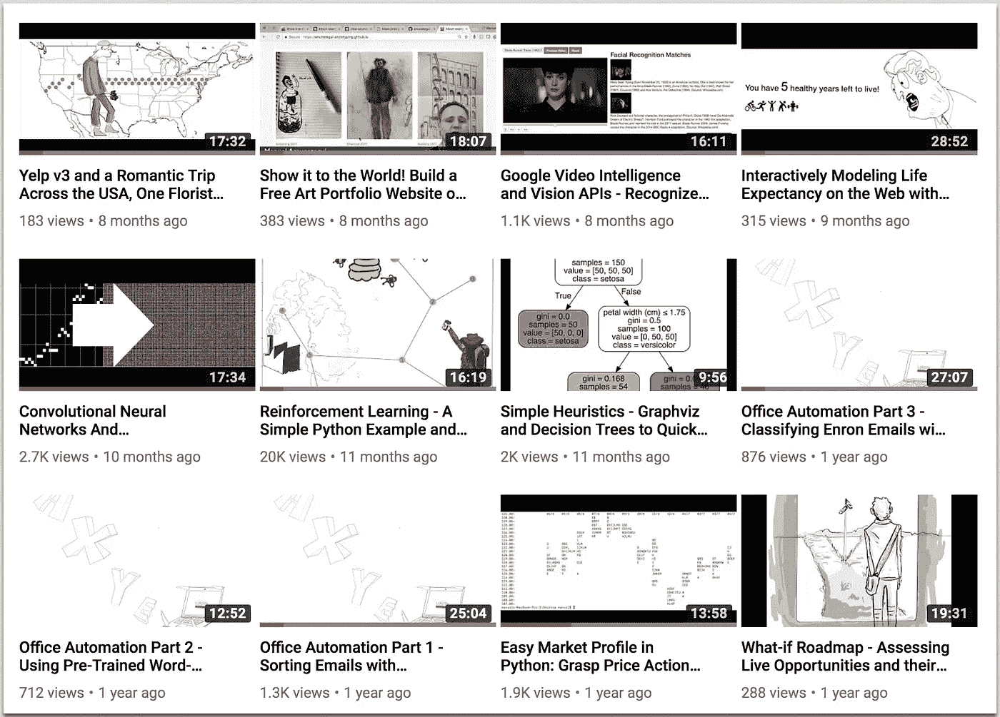

# 管理我的 Youtube 视频——让数字决定下一部电影

> 原文：<https://medium.com/swlh/managing-my-youtube-videos-letting-the-numbers-decide-what-to-film-next-446b6a41eaff>

Can you spot the outlier?

上面的图片展示了我大约一年前的一些视频——你能发现异常吗？

不管你使用 YouTube 是为了娱乐，是为了成名，是为了被发现成为下一个明星，还是为了继续谋生，你都需要倾听你的观众，总的来说，他们的信息变得响亮而清晰。

# 你想去哪里？

在过去的 5 年里，我一直在制作视频，我承认，当我开始时，纯粹是为了题材的乐趣——任何与数据科学相关的东西。但我很快看到了这带来的巨大兴趣和好处，并决定如果我试图理解这个过程，我可以把它带到一个特别的地方，而不仅仅是沉迷于制作视频和在线朋友的快乐。

# 视图计数

我上面提到的离群值是截图中间的视频 smack，有 20k 浏览量的那个。它的浏览量是其他网站的 40 倍。显然，强化学习的话题胜过了其他话题。这也是观众的一个明确邀请，即围绕这一主题需要更多的材料。

你可以通过点击 YouTube 账户中的“视频”标签来访问这些简单但非常有趣的指标。为了透明起见，这里是我的:

[https://www.youtube.com/user/mamunate/videos](https://www.youtube.com/user/mamunate/videos)

# 尼尔·帕特尔的建议

如果说我从尼尔那里学到了什么的话，那就是你应该把注意力放在能够转化的内容上。我花了一段时间才同意这一点(就像大多数为了好玩而开始写作的人一样)。不幸的是，我目前没有在这些视频上卖任何东西，所以我会把收视率作为我的收入(我每个月都会得到一点 AdSense 的钱)。那么，当压倒性的兴趣正盯着你的脸时，我们能做什么呢？许多和一些需要很少的工作:

*   在更多的媒体平台上分享视频—这是一个好的视频，它一定会取悦他人！并要求其他人也在描述/评论中分享这一点。
*   通过 YouTube 评论与观众互动。询问他们喜欢或不喜欢什么，试着找出为什么这种材料比你的其他材料更受欢迎。
*   创建额外的相关材料——制作第 2、3、4 部分，等等。
*   一两个月，然后想出一个修订版(见鬼，再发表一个同样的版本，做一些调整——现在我绝对是在喝尼尔·库尔援助)。
*   把它做成一个付费的 Udemy 类——显然你的小众群体喜欢这个材料，给他们一个更深入的版本。人们喜欢知识下载快捷方式，你无疑会改变他们中的一些人。我郑重声明，这正是我选择我的 Udemy 课程主题的方式(【https://www.udemy.com/user/manuelamunategui/】)。

# 但是这些指标有更多的含义

我从这些指标中得到了更多，也许不太明显，但仍然很重要。这些花了我几年时间才真正明白。

## 我的视频太长了

首先，它告诉我，我的视频太长了。平均视频长度不到 5 分钟([https://www . comScore . com/Insights/Press-Releases/2014/2/comScore-Releases-2014 年 1 月-美国在线视频排名](https://www.comscore.com/Insights/Press-Releases/2014/2/comScore-Releases-January-2014-US-Online-Video-Rankings))。长视频容易让人泄气，就像长文章一样。除非他们有强烈的愿望去了解这些材料，否则如果他们觉得阅读这些材料是一件费力的事情，你就会失去他们。

## 我的头衔蜿蜒

它还表明给你的视频命名也很重要——抓住要点，使用能快速传达和吸引感兴趣的观众的关键词。不要因为使用诗意或神秘的措辞而失去任何人——抓住要点。关于这个话题的更多内容，请看[如何写出完美的标题](http://www.viralml.com/how-to-create-a-perfect-title)。

如果你觉得这有帮助，请分享并鼓掌——感谢阅读！

曼努埃尔·阿穆纳特吉

在 ViralML.com**的 [**和**](http://www.viralml.com/)**[的 **amunategui.github.io**](http://amunategui.github.io/) 获得它和更多。****

好的— [注册我的电子邮件群](http://amunategui.github.io/)和**我会向你发送我的免费电子书，介绍如何成为(更好的)数据科学家**(即使你对电子书不感兴趣，也要注册)。感谢阅读！！

## 这篇文章发表在 [The Startup](https://medium.com/swlh) 上，这是 Medium 最大的创业刊物，拥有+368，366 名读者。

## 在这里订阅接收[我们的头条新闻](http://growthsupply.com/the-startup-newsletter/)。

