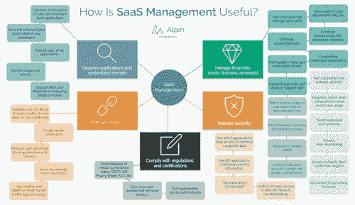
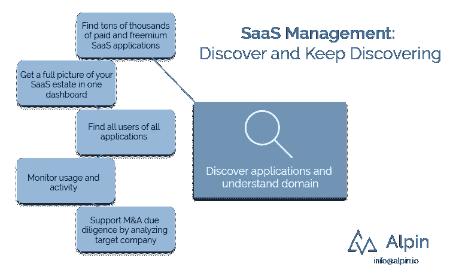

# 管理 Saas 第 2 部分—探索 SaaS 影子 IT

> 原文：<https://medium.com/swlh/managing-saas-part-2-discover-saas-shadow-it-d4d4942df33>

*编辑:* [*管理 SaaS 第 1 部分*](https://alpin.io/blog/saas-management-use-cases/)*——与所有其他部分链接。*

还记得我们[第一帖](https://alpin.io/blog/saas-management-use-cases/)的[大信息图](https://alpin.io/wp-content/uploads/2018/10/Alpin-benefits-overview-summary-details.png)吗？就像在杰森·伯恩的电影中一样，我们将点击*增强*按钮并放大以查看此次讨论的一部分:

当我在电影和电视节目中看到这样的事情时，我总是感到害怕。享受愚蠢的敬意。

# **为什么(持续)发现对管理 SaaS 如此重要？**

由于其经常隐藏的性质和病毒传播的能力，SaaS 通常很难管理。在内部进行调查可能有助于您找到云应用。查看堆积如山的互联网流量最终会有所帮助。

但是 SaaS 管理要求*有组织的和快速的*发现才能有效。

当我们与公司合作，在他们的环境中发现 SaaS 应用程序时，我们努力找到所有的应用程序和用户，并以直观和可操作的方式呈现出来。

有兴趣了解您的云应用生态系统内部的情况吗？我们可以做 10 分钟的演示，您将看到 Alpin 如何为您工作。通过发送电子邮件 [info@alpin.io](mailto:info@alpin.io) 开始。

# 【Alpin 如何进行发现？

看你想知道多少了。

Alpin 使用多种方法来发现云应用，包括与领先应用的 API 集成、与 SSO 平台的连接、从会计和费用系统中提取数据、浏览器插件、设备上的代理、防火墙日志分析、电子邮件扫描等等。

换句话说，Alpin 允许您从许多强大的选项中进行选择，以扫描您的云环境，并自动发现那里的一切，无论是免费还是付费，活动还是非活动，移动还是桌面。

(顺便说一句，与其他人相比，他们说他们发现了影子 IT，但只关注你的金融系统。只能获得 10%或 20%的利润……)

# 对于 SaaS 发现，你能做什么？

有了你的 SaaS 生态系统的组织和细节，你可以做很多事情

*找到数以万计的付费和免费 SaaS 应用*

你的公司可能没有 10，000 个 SaaS 应用。然而，你可能会发现比你预期的更多的应用程序。

为什么？[思科报告](https://blogs.cisco.com/cloud/gartner-report-says-shadow-it-will-result-in-13-of-security-breaches%27)大型企业平均使用超过 1，200 种云服务，其中 IT 知道的不到 50 种。这与其他研究和我们的经验相吻合:拥有 100–200 名员工的 Alpin 客户通常拥有 120–250 个 SaaS 应用程序，然后从那里扩展到我们更大客户的数千个应用程序。

此外，Alpin 的应用程序发现正在进行，这很重要，因为您的员工总是会添加新的应用程序，您可能会收购拥有自己的应用程序集的公司，等等。

*在一个仪表盘上获得您在 SaaS 房产的全貌*

我们所说的全图是什么意思？Alpin 不仅可以发现所有的应用程序，还可以通过自动分类来组织它们。您可以看到有多少应用属于各种类别，如协作、聊天或视频会议，以帮助您减少蔓延。

同样，你可以用你自己制作的类别来标记应用程序，并基于这些标记进行报告。

以前很难的问题现在变得容易了。"我们总共有多少个 SaaS 应用程序，按用户分类？"客服部门用哪些 app？只需点击几下鼠标即可找到答案。

*查找所有应用的所有用户*

Alpin 不仅查找应用程序，还查找所有应用程序用户。现在，您可以知道谁使用什么，如果有问题，应该找谁。

同样，随着新的 SaaS 产品出现并开始传播，你确切地知道应该隔离谁来阻止感染(如果你需要的话)。

*监控使用和活动*

应用和用户都很棒——但是用户到底在用应用做什么呢？Alpin 可以向你展示应用程序最近被使用的频率，甚至人们在这些应用程序中采取了什么行动。

将这与情感分析结合起来，你会对云软件有一个比桌面软件更好的看法。

将此与财务分析结合起来，你肯定会找到削减成本的方法——通常高达 30%。Alpin 仅从这一点上就能获得数倍的回报。

*通过分析目标公司*支持并购&尽职调查

收购一家公司，想知道他们有哪些云软件资产？或许能了解一下他们的安全状况？

你可以通过 Alpin 找到它。查看所有应用，并查看我们对这些应用的安全评级。根据数据做出决策，而不仅仅是目标公司高管告诉你的信息。

俗话说，除非你去衡量，否则你无法改进某样东西。SaaS 应用程序发现是我们在概述中提到的其他 4 个领域的基础:1)管理财务(成本、许可证和续订)；2)提高安全性；3)符合法规和认证；4)管理供应商。订阅我们的时事通讯，在未来的文章中了解这些领域！

有兴趣了解您的云应用生态系统内部的情况吗？我们可以做 10 分钟的演示，您将看到 Alpin 如何为您工作。通过发送电子邮件 [info@alpin.io](mailto:info@alpin.io) 开始。

*想多聊聊吗？联系*[*info @ alpin . io*](mailto:info@alpin.io)*或通过订阅我们的每周综述保持联系——其中包括新闻、关于 SaaS 应用程序的有用提示和我们的最新博客帖子。*

*原载于 2018 年 10 月 10 日*[*alpin . io*](https://alpin.io/blog/saas-shadow-it/)*。*

## 这篇文章发表在 [The Startup](https://medium.com/swlh) 上，这是 Medium 最大的创业刊物，拥有+ 378，907 读者。

## 在这里订阅接收[我们的头条新闻](http://growthsupply.com/the-startup-newsletter/)。

