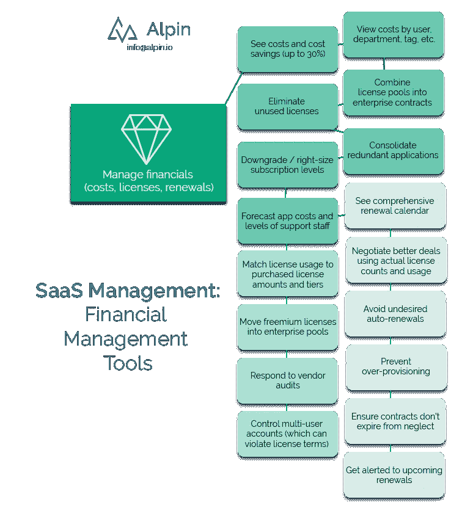

# 管理 Saas 第 3 部分—财务优化工具

> 原文：<https://medium.com/swlh/managing-saas-part-3-financial-optimization-tools-162c8b3ff867>

*编辑:* [*管理 SaaS 第 1 部分*](https://alpin.io/blog/saas-management-use-cases/)*——与所有其他部分链接。*

你可能还记得我们的[巨型信息图](https://alpin.io/wp-content/uploads/2018/10/Alpin-benefits-overview-summary-details.png)，SaaS 管理层提供了大量的财务优化工具。对合适的人来说，这是令人惊奇和激动的:

Enjoy this classic meme with Vince McMahon which perfectly encapsulates how people feel about SaaS cost optimization.

**为什么持续 SaaS 成本优化如此重要？**

[影子 IT 现在占 IT 支出的 40–50%](https://alpin.io/blog/saas-spread-stampede-cycle/),很可能没有人给予足够的重视。

换句话说，SaaS 有很多唾手可得的水果。

对削减 SaaS 成本感兴趣吗？我们可以做 10 分钟的演示，您将看到 Alpin 如何为您工作。通过发送电子邮件 [info@alpin.io](mailto:info@alpin.io) 开始。

【Alpin 如何优化财务？

Alpin 根据我们进行的调查的[范围和性质，以多种方式管理和调整您的 SaaS 应用程序财务。](https://alpin.io/blog/saas-shadow-it/)

我们通过以下方式帮助优化 SaaS 的财务状况:

直接降低成本

强制许可证合规性

监控续订

(顺便说一句，与其他人相比，他们说他们发现了影子 IT，但只关注你的金融系统。只能获得 10%或 20%的利润……)

**削减 SaaS 成本的细节**

*直接降低成本*

一些削减成本的行动可以很快发生，而另一些则需要时间。

一个应用程序是否有多余的许可证、不活跃的用户或者真正不需要昂贵的高级订阅的用户？找到那些，快点切掉。

当您发现多个部门正在使用一个应用程序时，您可以整合到一个合同下，以降低每许可证成本。也许另一个部门也使用类似的应用程序，但价格更高。对应用程序进行重复数据删除，并让它们加入新的企业协议。

接受财务审计？使用 Alpin 快速分析情况，按产品类别报告成本，并预测未来的支出。

*强制执行许可证合规性*

当(不是如果，而是当)供应商启动审计来检查许可证合规性时，您可以避免一些不必要的成本。为什么？你已经很快审核过自己了。

例如，您可能会注意到，您的整个营销部门只有一个 marketing@example.com 电子邮件许可证。然而，其他部门有多个许可证。这可能是提示您删除违反许可条款的多用户帐户。

另一个部门可以订阅应用程序，但他们使用的是免费增值版。但是，您的许可协议可能会禁止免费增值订阅，如果被发现，将受到严厉处罚。让 Alpin 在供应商向您收取成本和罚款之前找到这些漏洞。

*管理续订*

如果您有一个针对每个 SaaS 应用程序的续订日历，会怎么样？你可以。不仅如此，还能获得即将到来的续订提醒。

为什么这很重要？有了时间和用户信息，你就可以为任何谈判做好准备。而且，您可以在续订时消除任何过度配置。这就是杠杆。

此外，您可以防止不良的自动续订，并保留良好的合同。

想要削减 SaaS 成本吗？加入我们 10 分钟的演示，您将看到 Alpin 如何为您工作。通过发送电子邮件 [info@alpin.io](mailto:info@alpin.io) 开始。

有兴趣了解您的云应用生态系统内部的情况吗？我们可以做 10 分钟的演示，您将看到 Alpin 如何为您工作。通过发送电子邮件 [info@alpin.io](mailto:info@alpin.io) 开始吧。

## 这篇文章发表在 [The Startup](https://medium.com/swlh) 上，这是 Medium 最大的创业刊物，有+ 380，756 人关注。

## 订阅接收[我们的头条新闻](http://growthsupply.com/the-startup-newsletter/)。

