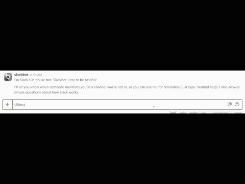
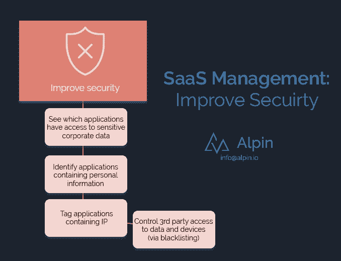

# 管理 Saas 第 4 部分—提高安全性

> 原文：<https://medium.com/swlh/managing-saas-part-4-improve-security-a3fddc707e53>

*编辑:* [*管理 SaaS 第 1 部分*](https://alpin.io/blog/saas-management-use-cases/)*——与所有其他部分链接。*

你听说过那个通过 SaaS 服务台访问数百个内部闲置账户和其他 SaaS 软件的家伙吗？还是[“登录谷歌”钓鱼攻击](https://alpin.io/blog/sign-google-phishing-attack/)？这就是为什么你需要提高 SaaS 的安全性。

***Totally real*** *SaaS hackers in action, finding that password someone cleverly gave to Slackbot for safekeeping.*

云应用的快速用户增长，加上缺乏监管和用户态度懒散，意味着我们应该预计未来会出现更多问题。

除非你做点什么。

SaaS 管理为您提供了更好地控制云软件安全性所需的平台和信息。以下是一些方法:

**您为什么应该关心 SaaS 的安全？**

注册 SaaS 的用户比任何人想象的都多。思科的一项研究发现，企业平均使用 1200 种云服务。但是它知道的**不到 50 个**。

假设你是一名黑客。在单个公司的核心系统上进行网络钓鱼和社会工程是否更有意义？还是针对许多公司使用但没有主动监控的云软件？

在 SaaS，员工可以而且确实比任何人都不舒服地存储敏感信息，比如在空闲频道共享密码。

如果你对揭露你的员工使用的影子 SaaS 感兴趣，我们可以做一个 10 分钟的演示。你会看到 Alpin 如何为你工作。通过发送电子邮件 info@alpin.io 开始。

【Alpin 如何帮助提高安全性？

[影子 IT 可以给任何组织带来现实问题](https://alpin.io/blog/shadow-it-problems/)。我们的许多发现方法有助于解决这个问题的很大一部分——揭示影子 IT。

Alpin 更进一步，对应用程序进行分类，并对它们被授予访问你的公司数据的权限的安全性进行评级。

Alpin 的 SaaS 管理还提供工具，使您能够:

查看哪些应用程序可以访问公司数据。

识别哪些应用程序包含个人信息。

标记包含知识产权(IP)的应用程序。

**提高安全性的细节**

*查看哪些应用程序可以访问公司数据*

一些应用程序权限授予对数据的扩展访问权限。SaaS 管理提供了一种方式来查看哪些应用程序拥有特定用户的哪些权限。像 Alpin 这样的 SaaS 管理工具可以立即在大海捞针的情况下进行筛选，显示应用程序和权限的准确列表，以及相关的供应商或用户。

*识别哪些应用程序包含个人信息*

不仅仅是获得访问权，一些应用程序可能会存储个人或其他敏感信息。这些应用程序可能是活动的…或者它们可能被完全遗忘，并连接到一个停用的用户帐户，即使他们尝试也没人能回忆起来。

使用 Alpin 作为您的 SaaS 管理工具，您可以标记这些应用程序，这样您就有了一个关于个人和敏感信息在组织外部保存位置的最新列表。显而易见，该列表对于合规性和安全性审计、供应商评估、灾难恢复规划以及知道在出现安全漏洞时应该联系谁非常有用。

你甚至可能*期望*一些应用程序，比如云存储提供商，存储敏感信息。Alpin 可以帮助你识别*数据在迷宫般的文件夹中的位置，以及它是否包含敏感信息。是[云存储的数据丢失防护(DLP)](https://alpin.io/blog/feature-dlp-tools-cloud-storage/)。*

*标记包含知识产权(IP)的应用程序*

标记和报告*只有在包含 IP 的应用上*才能让你入围一些最重要的云供应商。

你为什么想要那种候选名单？最明显的是，这样你就知道你的知识产权存储在哪里，这样你就可以把它带回公司内部，而不是把它放在未使用和未管理的供应商那里。此外，与了解哪些应用程序包含个人和敏感信息一样，供应商列表对于安全审计、供应商评估、灾难恢复规划以及知道在发生违规事件时应该调查谁非常有用。

*控制第三方访问您的公司数据(黑名单)*

黑名单(仅适用于使用 G 套件的公司。它使你能够永久阻止任何应用程序访问你的 G Suite 帐户内的数据。这允许使用“登录谷歌”，同时防止来自不可信应用程序的访问。

如果你对揭露你的员工使用的影子 SaaS 感兴趣，我们可以做一个 10 分钟的演示。你会看到 Alpin 如何为你工作。通过发送电子邮件 info@alpin.io 开始。

有兴趣了解您的云应用生态系统内部的情况吗？我们可以做 10 分钟的演示，您将看到 Alpin 如何为您工作。通过发送电子邮件 [info@alpin.io](mailto:info@alpin.io) 开始。

*想多聊聊吗？联系*[*info @ alpin . io*](mailto:info@alpin.io)*或通过订阅我们的每周综述保持联系——其中包括新闻、关于 SaaS 应用程序的有用提示和我们的最新博客帖子。*

## 这篇文章发表在 [The Startup](https://medium.com/swlh) 上，这是 Medium 最大的创业刊物，拥有+385，320 名读者。

## 在这里订阅接收[我们的头条新闻](http://growthsupply.com/the-startup-newsletter/)。

