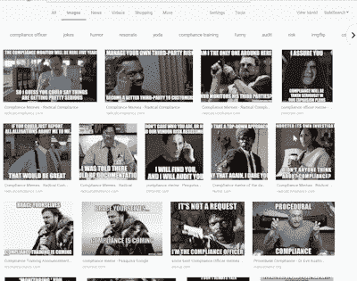

# 管理 SaaS 第 5 部分—遵守法规和认证— Alpin.io

> 原文：<https://medium.com/swlh/managing-saas-part-5-comply-with-regulations-and-certifications-alpin-io-d5ab0caae21e>

*编辑:* [*管理 SaaS 第 1 部分*](https://alpin.io/blog/saas-management-use-cases/)*——与所有其他部分链接。*

合规工作中最困难的部分是什么？人们。人们给合规专业人员带来了挑战。然而，我们需要其他人的合作来实现组织合规性。

我合作过的一些最佳合规人员将合规视为团队目标。他们的角色是帮助、教育和引导他人。SaaS 管理层至少可以让你知道该帮助谁，以及有多紧急。

更重要的是，现在有一些 SaaS 管理工具可以突出显示供应商合规性状态，甚至可以帮助自动化一些合规性任务。

Side note, if you haven’t looked, there’s an unexpected abundance of compliance-related memes (please note the Barbra Streisand one).

# **为什么 SaaS 合规很重要？**

在过去与一些杰出的法规遵从性专业人士合作过之后，这可能是不言而喻的:无论数据是存储在您的服务器上还是其他人的服务器上，您的公司最终都要对保护数据负责。

由于供应商运营着许多保存您数据的服务器，因此供应商合规性是您作为数据所有者的责任。

如果你说你不知道，事情就不会进展顺利。在违规或审计事件中，对影子 SaaS 供应商的无知并不能免除你的责任。

想开始寻找影子 SaaS，这样你就知道如何评估合规性？联系我们观看 10 分钟的演示。你会看到 Alpin 如何为你工作。通过发送电子邮件 info@alpin.io 开始。

# 【Alpin 对依从性有什么帮助？

Alpin 首先发现以前隐藏的应用程序，并提供正在使用的每个 SaaS 供应商的列表。然后，大多数合规人员想要做两件事:评估和报告所说的供应商。包括 Alpin 在内的一些 SaaS 管理工具可以帮助您:

查看供应商对 GDPR、ISO、隐私保护、SOC 等的合规状态。

将您自己的评估表发送给供应商。

自动计算供应商的评估分数。

假设你是一名黑客。在单个公司的核心系统上进行网络钓鱼和社会工程是否更有意义？还是针对许多公司使用但没有主动监控的云软件？

结合定制标记和报告中心，可以非常快速地组织、分类和报告所有供应商。

你也可能对我们在上一篇文章中提到的安全特性感兴趣。

# **合规细节**

*查看供应商在 GDPR、ISO、隐私保护、SOC 等方面的合规状态。*

想象一下这个场景:“该供应商符合 SOC 2 标准吗？他们的网站上没有贴…网上也没有贴…”去过吗？你可以查看 Alpin，而不是打电话或发邮件给他们。我们收集供应商合规状态的信息，您可以在 Alpin 应用程序中搜索并找到结果。

*将您自己的评估表发送给供应商*

更有可能的是，您已经向潜在供应商发出了几十份(如果不是几百份的话)评估问卷或评估。你可能有一个很好的系统来跟踪和组织这些。

然而，随着 SaaS 供应商的出现，可能会有成百上千的供应商需要覆盖。使用 Alpin，您可以从一个仪表板发送和接收供应商评估*。结果将保留在每个供应商的 Alpin 配置文件中，所有数据都在一个地方，因此您、审计员或其他任何与您共享数据的人都可以看到。*

*自动计算供应商的评估分数*

您的供应商评估包括分数计算吗？您可能已经设置了一个 Excel 文件来完成这项工作，但它并不完美。Alpin 可以从您发送和接收的评估中计算分数，帮助您快速浏览供应商分数，以了解谁是合格的，谁需要跟进。不再需要电子表格或其他临时解决方案！

想开始寻找影子 SaaS 并让这些供应商合规，这样你就合规了吗？联系我们观看 10 分钟的演示。你会看到 Alpin 如何为你工作。通过发送电子邮件 info@alpin.io 开始。

有兴趣了解您的云应用生态系统内部的情况吗？我们可以做 10 分钟的演示，您将看到 Alpin 如何为您工作。通过发送电子邮件 [info@alpin.io](mailto:info@alpin.io) 开始。

*想多聊聊？联系*[*info @ alpin . io*](mailto:info@alpin.io)*或通过订阅我们的每周综述保持联系——其中包括新闻、关于 SaaS 应用程序的有用提示和我们的最新博客帖子。*

## 这篇文章发表在 [The Startup](https://medium.com/swlh) 上，这是 Medium 最大的创业刊物，拥有+386，966 名读者。

## 在这里订阅接收[我们的头条新闻](http://growthsupply.com/the-startup-newsletter/)。

