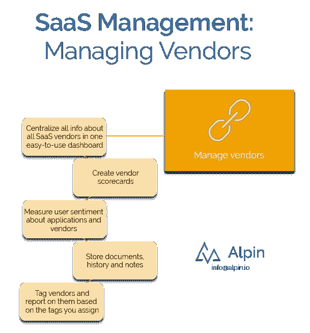

# 管理 SaaS 第 6 部分—供应商管理

> 原文：<https://medium.com/swlh/managing-saas-part-6-vendor-management-1f8b5bd0cd5d>

如果您的供应商管理平台真的以一种前所未有的方式将您的组织*凝聚在一起*会怎样？

SaaS 管理可以带来强大的供应商管理功能，以及其他部门加入该平台的充分理由。[看看这个系列的第一篇文章为什么要做](https://alpin.io/blog/saas-management-use-cases/)。

对于寻求更好的供应商管理的公司或寻求提高可见性的供应商经理来说，现代 SaaS 管理平台是不二之选。

# **为什么 SaaS 供应商管理很重要？**

供应商管理发生了重大变化。过去，供应商经理*管理每个供应商*，而在 SaaS 时代，供应商关系更加分散。

现代的供应商经理可能不会处理所有的关系，但他们可能想知道谁管理哪些关系。这也将使任何供应商经理能够以更少的责任报告企业范围内的供应商数量。那个人会知道该向谁提供帮助，以及使用哪些应用程序。

# **供应商管理详情**

*在一个仪表板中集中 SaaS 供应商信息，包括文档和注释*

这对于任何供应商管理系统来说都是相当标准的，不是吗？但是使用 SaaS 管理平台作为供应商管理系统，除了像谁处理关系、谁处理账单等旧的备用信息之外，你还可以很快看到谁真正使用了供应商，使用了多少，使用的频率。

*创建供应商记分卡*

同样，您可能在标准供应商管理软件中见过类似的功能。然而，现代 SaaS 管理平台可以与数以千计的 SaaS 订阅相集成，使该平台能够通过这些供应商所需的权限和信息访问来自动计算供应商得分。如果系统中有成千上万的供应商，那种捷径真的可以节省时间。

*测量用户对应用和供应商的情感分析*

如果供应商经理是*谈论谁喜欢哪个供应商以及为什么喜欢的人会怎么样？以前，供应商经理可能看起来有点远离用户。但使用 SaaS 管理平台的内置情感分析工具来调查活跃用户，可以帮助供应商经理知道谁喜欢哪个供应商，喜欢多少，以及为什么喜欢。*

*供应商标签和报告*

您可以用您选择的任何信息标记供应商，并将其用于报告。你可以用这种报道做很多事情，[我们发了一整篇文章，列举了很多例子。](https://alpin.io/blog/feature-tags-and-search/)

有兴趣了解您的云应用生态系统内部的情况吗？我们可以做 10 分钟的演示，您将看到 Alpin 如何为您工作。通过发送电子邮件 [info@alpin.io](mailto:info@alpin.io) 开始。

## 这篇文章发表在[《创业](https://medium.com/swlh)》上，这是 Medium 最大的创业刊物，有+393，714 人关注。

## 订阅接收[我们的头条新闻](http://growthsupply.com/the-startup-newsletter/)。

