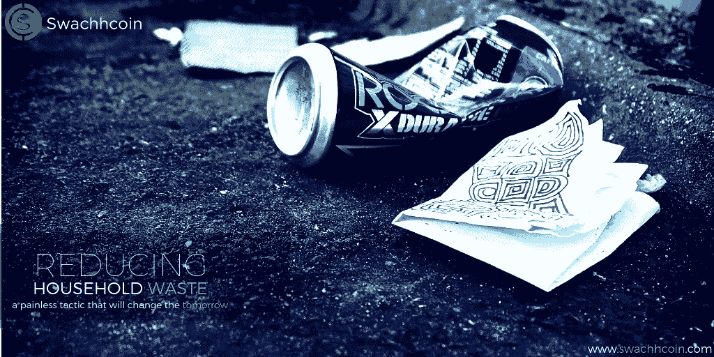

# 管理家庭垃圾

> 原文：<https://medium.com/swlh/managing-waste-at-home-486578f9d7e>

全球废物管理系统正处于十字路口。我们产生的垃圾比我们能够处理或回收的还要多。因此，每个人都必须为废物管理全球倡议做出贡献。做到这一点的最好方法是减少和管理你和你的家人在家里产生的垃圾量。因此，我们将重点介绍如何管理家中的垃圾。

# 有哪些方法可以减少你家产生的垃圾量？

## **停止使用塑料**

我们买的许多产品都用塑料包装。因此，每年产生的塑料垃圾数量惊人。因此，消除塑料包装的产品是阻止这一祸害的方法之一，也可以减少你产生的废物量。还有，不要用塑料购物袋，应该用布袋。

## **购买包装较少的产品**

许多产品都有一层层的包装。有些情况下，产品的尺寸被其包装夸大了。所有这些都会增加你的垃圾桶被填满的速度。因此，最好的办法是选择包装最少的产品。你也可以选择购买新鲜的农产品，而不是加工食品。

## **控制你使用的纸张数量**

我们处于数字时代，因此，纸质文件不再流行。因此，有更好的方法来存储文档、接收电子邮件和阅读日报。这将有效地减少你产生的废物量。你应该使用电子邮件服务来处理账单和电子邮件。此外，选择在线新闻服务，而不是在你的垃圾桶里堆积报纸。

## **考虑捐赠旧物品**

有些物品我们不再使用，但仍然完好无损。当没有更多的空间来容纳这些物品时，你可能会想把它们扔掉。这肯定会在你的垃圾桶里留下一堆垃圾。因此，你应该考虑捐赠这些物品。旧衣服可以捐给布料回收厂、旧货店和捐赠中心。

## **回收你的废物**

世界上不同的地区采用不同的回收政策。因此，你应该严格遵守这些政策，因为它有助于你管理你的废物。将可回收材料从垃圾中分离出来，对垃圾进行分类。有了这个，就很容易符合你所在地的回收政策。有些城市有回收中心，你可以在那里倾倒垃圾。一些可回收材料包括:

*   编号为 1-7 的塑料瓶和容器
*   像报纸，纸板，
*   玻璃容器
*   铝箔和易拉罐等铝制包装

你可以通过堆肥处理你的花园垃圾，比如树叶、树枝和杂草，来进一步减少你的垃圾。此外，新鲜食物的剩菜也会属于这一类。坚持上述建议将有效地减少你产生的废物量以及处理废物的成本。

> 要了解更多关于兑换硬币的信息，请访问:[https://swachhcoin.com/](https://swachhcoin.com/)
> 
> 链接到 Swachhcoin 主要销售:【https://swachhcoin.com/ico 

## 在此加入我们的社区:

[Official Telegram Discussion Group](https://t.me/swachhcoin)

[Twitter Channel](https://twitter.com/@swachhcoin)

[Facebook FanPage](https://www.facebook.com/swachhcoinofficial/)

[Swachhcoin Subreddit](https://www.reddit.com/r/swachhcoin/)

## 这篇文章发表在[《创业](https://medium.com/swlh)》上，这是 Medium 最大的创业刊物，拥有+ 378，330 名读者。

## 在这里订阅接收[我们的头条新闻](http://growthsupply.com/the-startup-newsletter/)。

