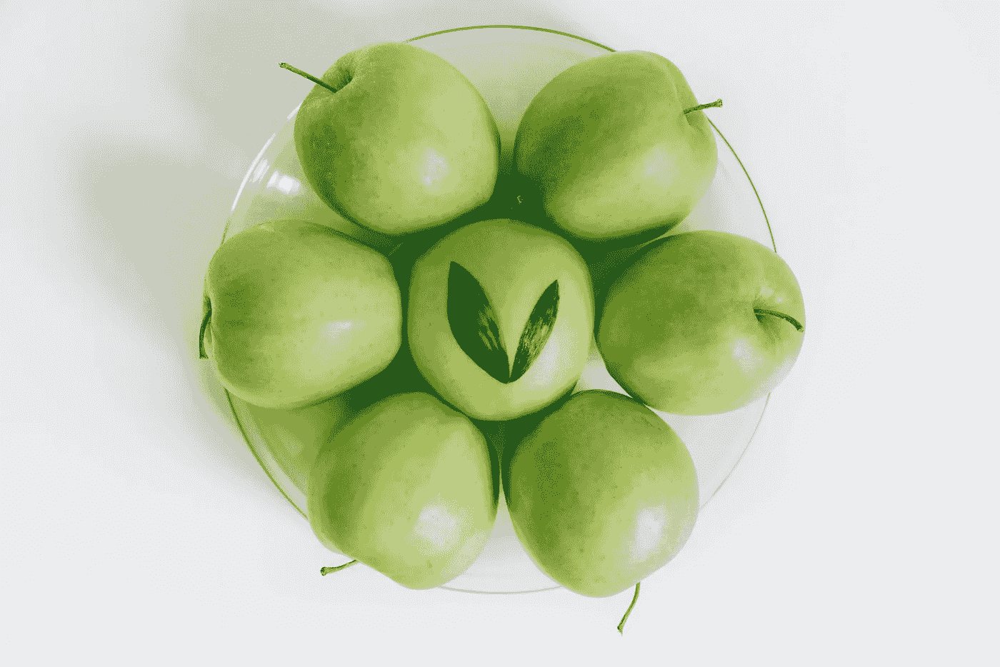

# 向苹果公司学习，管理你的职业生涯

> 原文：<https://medium.com/swlh/managing-your-career-by-learning-from-apple-58eb0c390350>

Photo by [Roman Kraft](https://unsplash.com/photos/b9wQvEXJTFg?utm_source=unsplash&utm_medium=referral&utm_content=creditCopyText) on [Unsplash](https://unsplash.com/search/photos/apple?utm_source=unsplash&utm_medium=referral&utm_content=creditCopyText)

## 将自己视为“产品”

你想*成为*新的 MacBook Pro 吗？MacBook Pro 由光滑的冷铝制成，配备了 Retina 显示屏和 Touch Bar。用户所知的 MacBook 开箱后运行非常出色。顾客愿意花 5000 美元购买的 MacBook Pro，眼睛都不眨一下。