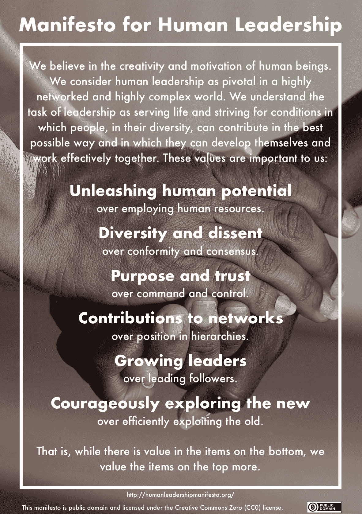

# 人类领导宣言

> 原文：<https://medium.com/swlh/manifesto-for-human-leadership-16cb72f77583>

在这个“许多事情都在变化，而且变化的速度比以往任何时候都快”的时代(Karl-Heinz geiler)，领导力的作用至少必须得到讨论，甚至部分受到质疑。如今，只有将员工的自我领导作为目标，领导力才是合法的。[领导力就是让*别人*成功](https://fuehrung-erfahren.de/en/2017/12/leadership-is-about-making-others-successful/)。这种人类的领导力不是地位的问题，而是态度的问题。在这份宣言中，我们描述了这种态度和一种新的、敏捷的、数字化的、最重要的人类领导的价值观。

> *当然，我不能说如果有所不同是否会更好；但我可以说，如果它是好的，它必须是不同的。*
> 
> *~格奥尔格·克里斯托夫·利希滕贝格*

这份宣言是在敏捷转型的背景下回答领导力问题的第一次尝试。然而，面对 VUCA、数字化和颠覆，这一走向更加敏捷和自我组织的旅程只是一个受欢迎的机会，让长期存在的概念复活，如*仆人式领导*。该宣言基于彼得·德鲁克对知识工作和知识工作者领导力的研究，以及道格拉斯·麦格雷戈的开创性著作《企业的人性一面》中 Y 理论对人类的积极构想。在这个意义上，宣言的标题可以理解为这本书的典故。

# 人类领导宣言

我们相信人类的创造力和动力。我们认为，在高度网络化和高度复杂的世界中，人类领导力至关重要。我们认为，领导的任务是为生活服务，并努力创造条件，使各种各样的人都能以尽可能好的方式做出贡献，使他们能够发展自己并有效地一起工作。这些价值观对我们很重要:

**释放人的潜能** 过度使用人力资源。

**多样化和异议** 超过从众和共识。

**目的和信任**
超过指挥和控制。

**对关系网的贡献**
超过等级制度中的职位。

**成长中的领导者**
战胜领先的追随者。

**勇于探索新的**
过度有效地剥削旧的。

也就是说，虽然底部的项目有价值，但我们更重视顶部突出显示的项目。

在[*fuehrung-erfahren . de*](https://fuehrung-erfahren.de/en/2018/02/manifesto-human-leadership/)*也可以找到《人类领导力宣言》的印刷版本。请在那里签署宣言并广而告之！*

**

**原载于 2018 年 2 月 8 日*[*fuehrung-erfahren . de*](https://fuehrung-erfahren.de/en/2018/02/manifesto-human-leadership/)*。**

**

## *这篇文章发表在[的《创业》(The Startup](https://medium.com/swlh) )上，这是 Medium 最大的创业刊物，拥有 295，232+人关注。*

## *在这里订阅接收[我们的头条新闻](http://growthsupply.com/the-startup-newsletter/)。*

**