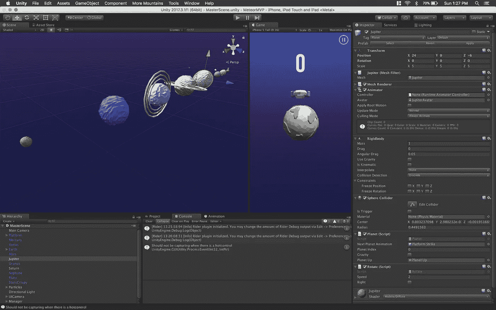
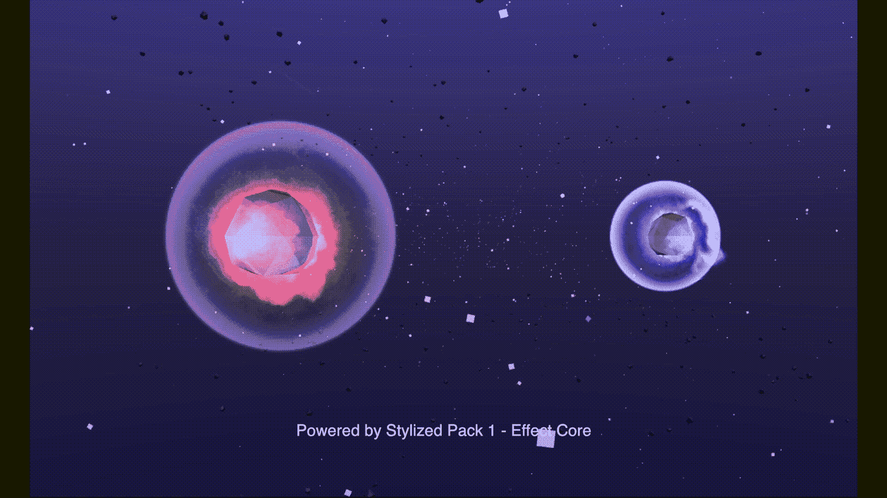
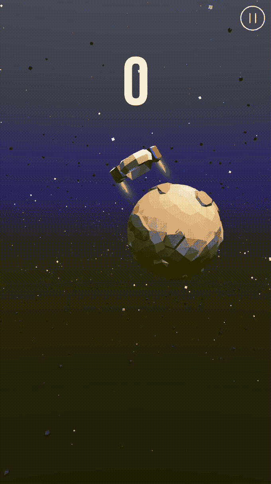
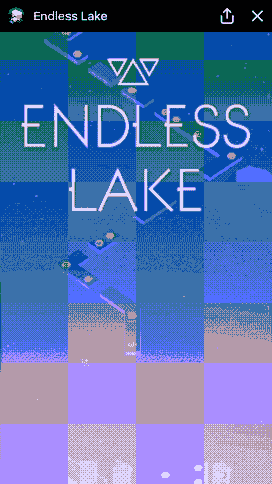
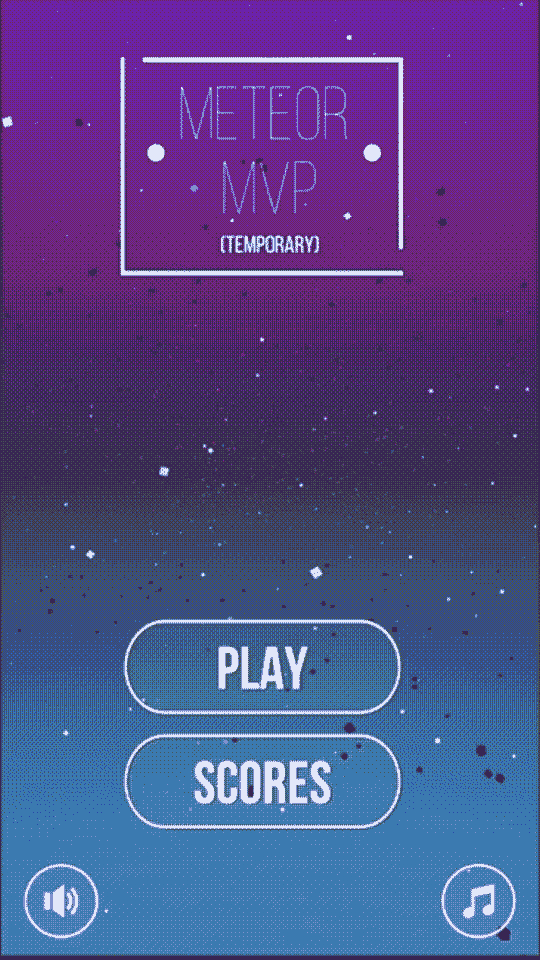
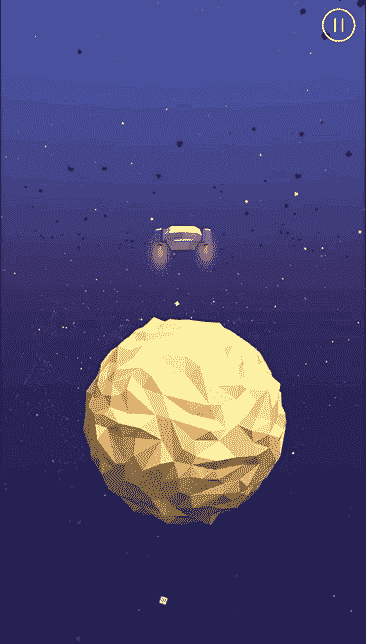

# 我如何在一天之内做出我最小的令人惊奇的产品

> 原文：<https://medium.com/swlh/map-day-84dd2fe11b1a>

在我的第一个 Unity3D 项目上花了 17 个月之后，我决定是时候从头再来了…这次是在 24 小时内。

老实说……尽管标题如此，总花费时间是 26 小时，但 24 小时确实是一个更好的口号。既然我已经说出来了，那就让我尽量把这个故事讲得生动、准确些。

我们都有这样一个朋友，他巧妙地戳你的项目，你花了这么多时间和精力。你在社交上有义务跟着笑，但暗地里你会觉得他们好像伤害了你的宝宝——这是早上更容易醒来的原因之一。如果我没有说我至少有 120%的朋友属于这一类，那我就是在撒谎，尽管如此，我仍然爱他们——*。*

> **“反击仇恨者的最佳方式是让他们明显地知道他们的攻击对你没有影响”——***蒂姆·费里斯***

*我的朋友们认为我在大学生涯中不可能再开发出另一个应用程序了。当你考虑到 [Space Bolt](http://sbolt.app.link) 确实比我的其他项目平均多花了 8 个月的时间，这是公平的。然而，他们不理解学习 Unity3D 的所有细微差别。即使你最终理解了着色器是如何工作的，以及如何优化你的模型，你仍然需要限制所有的绘制调用，以确保你的应用程序不会在 512 MB 内存的 Android 手机上延迟。悲剧。最终一切都完美运行，你肾上腺素激增，筛选所有多余的错误变得值得，因为你终于有值得分享的东西了。无论是世界上任何地方的任何软件周期，我们都知道开发的两极性和紧张性。*

*在[太空螺栓](http://sbolt.app.link)、上和 Unity3D 合作了这么久，真的觉得对开发流程有了扎实的把握，想挑战自己(*当然也想证明朋友们是错的*)。我想给自己一个不可能的时间框架，把任何开发人员推向疯狂的边缘。我给了自己 24 小时。*

***构思***

*在开始这个几乎不可能完成的任务后，我得出了一个结论:我想创造一个游戏，它有直观的游戏性，容易学习但很难掌握。巧合的是，我在同一时间玩一个城堡防御游戏，并意识到确实没有任何好的移动空间防御游戏。通过将设定保持在最终边界，我将能够最大限度地利用我从[太空闪电](http://sbolt.app.link)中获得的资产。我希望游戏非常简单，任何年龄的人都可以学习；这就产生了一个简单的滑动手势来控制防守者的移动。*

**

*Reusing Assets*

*时间不多了，我面临着一些权衡。首先，我让应用程序保持单一场景，整整 20 个小时没有任何菜单或 GUI 的痕迹。我甚至没有给这个应用命名，也没有想出一个漂亮的标志(**T3)。如果你有任何命名建议，请在下面评论！** )。此外，我做了一个大胆的决定，没有任何复杂的电源，以保持游戏的简单性，并有一个最大的拾取和播放无附加条件的体验。然而，我添加了一个简单的随机繁殖的双防御者，它的移动方向与主防御者相反。仅仅专注于游戏机制和极简主义让我(*几乎*)达到了 24 小时的最后期限。*

> **UI 像个笑话。如果非要解释的话，没那么好*—平面设计谚语***

*****构思*****

***我的冒险始于从 Space Bolt 分叉低聚合行星，用于我的新游戏。我把两根柱子放在一起，用同一个发射台制作了一个低平的多边形表面来创建防御者平台。我想尽可能多地重用 Space Bolt 中的资产，尽可能在 Blender 上花费最少的时间建模。然而，我在商店里发现了这个非常有用的资产，我用它来存放彗星。它被 effect core称为[风格化的抛射体包 1，该资产被很好地记录在案，动画是好莱坞式的。](https://assetstore.unity.com/packages/vfx/particles/stylized-projectile-pack-1-106979)***

******

***Two types of Comets in MeteorMVP***

***为了让应用程序的润色感觉更丰富，我想加入一个平移相机，每次滑动都有一点点时间偏移。在实现它之后，这不仅让应用程序感觉更干净，还让玩家能够更好地看到他们周围的天空，以发现来袭的彗星。***

***对于图形用户界面，我想要一些最小的和平面的东西来匹配游戏和图形风格。我看了 Spil Games 的[无尽的湖](https://www.facebook.com/EndlessLakeGame/),寻找一些如何接近界面的灵感。当这款游戏首次登陆《脸书信使》时，我被它震撼了；游戏和用户界面之间的联系有一种纽带，很少有游戏能够做到这一点，所有这些都充满了简单的用户控制和令人上瘾的游戏弧线。MVP 中的一些 UI 元素可以追溯到无尽的湖，如图所示。***

******************

***Left to Right (Camera Pan/Endless Lake GUI/MeteorMVP GUI)***

*****发射？*****

***尽管我对结果非常满意，但我不确定是否应该推出这个游戏，还是让它永远消失在软件的边缘。与我过去的项目相比，在这个项目上投入的时间大大减少了，这让我从依恋中获得了一定程度的自由。对我来说，这个应用不是我的宝贝，不像 Space Bolt，甚至不像 [VolunTree](http://vtree.app.link) 。流星 MVP 是我被放入一个不可能的时间限制和一个不可能的任务的演示。***

******

***然而…如果我确实激发了你对这个应用的兴趣，我会尽最大努力来调整最后几个滞后的功能。除了为这个应用程序开发一个身份之外，投射体的生成必须更聪明一点，UI 应该更健壮。除了随意评论，还有什么其他的特点可以让流星防御 MVP 与众不同？有人可能会想:我应该保留滑动样式控件吗？我应该增加更多的敌人/投射物吗，如果是，你有什么想法？我应该创造随机生成的行星在冥王星之后产卵，还是应该让冥王星结束，让彗星在到达时无限期地产卵？***

******

***Gameplay Demo***

***起初，我打算写这篇文章来联系我在世界各地的所有其他独立开发者朋友，与我们(蹩脚的)令人沮丧的朋友进行斗争，但当我完成写作时，我意识到它创造了一个非常不同的故事…它帮助我确认了我的信念，即使有一点点灵感和正确的动机，即使像我这样的普通开发者也可以实现他/她从未想过的事情。感谢您的阅读。***

****如果你喜欢这篇文章，并想知道我是否会发布这个应用，* [***在 Twitter 上关注我***](https://twitter.com/intent/user?screen_name=thisisprad) ***。*** *一定要把这篇文章分享给你的朋友！投入越多越开心(同样，拍几下也没什么坏处)****

******

## ***这篇文章发表在 [The Startup](https://medium.com/swlh) 上，这是 Medium 最大的创业刊物，有 311，185+人关注。***

## ***在这里订阅接收[我们的头条新闻](http://growthsupply.com/the-startup-newsletter/)。***

******