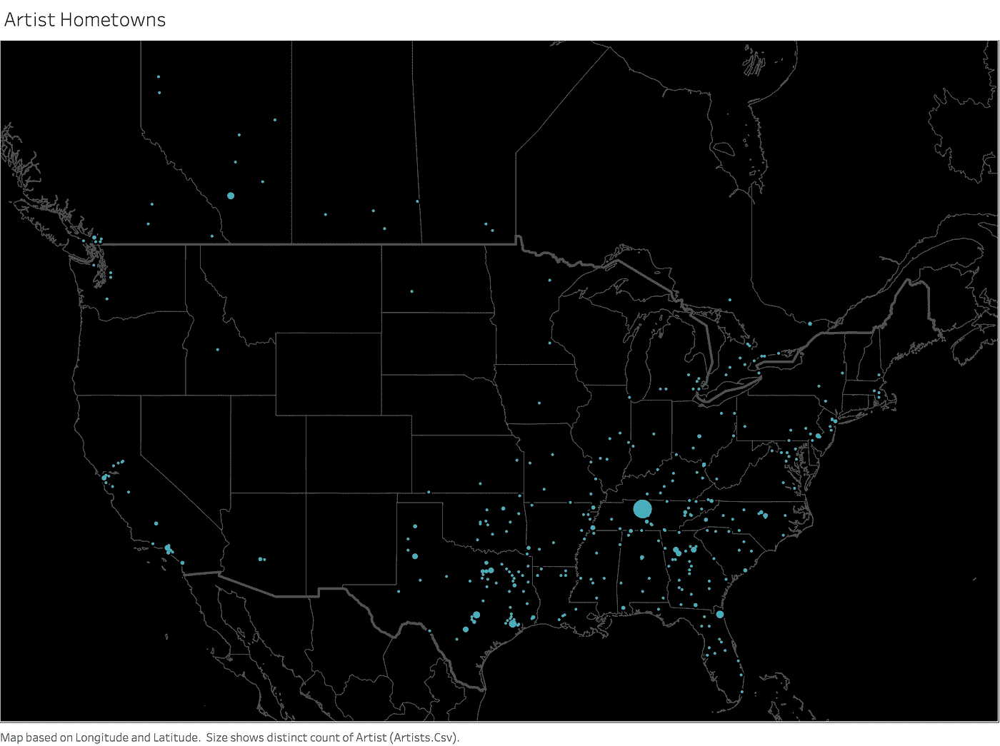
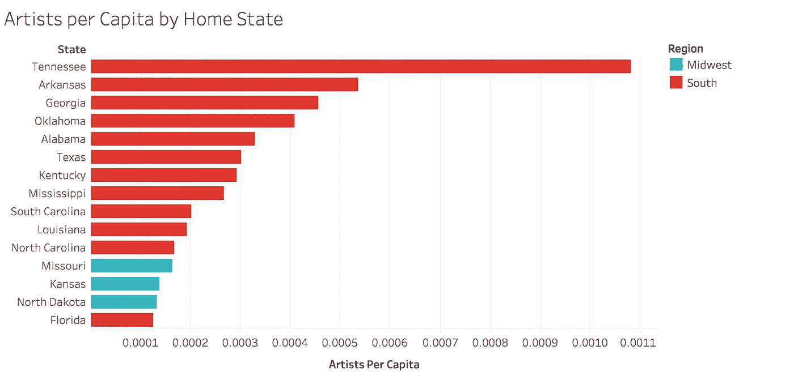
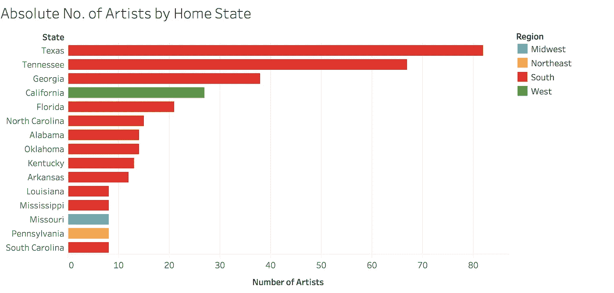
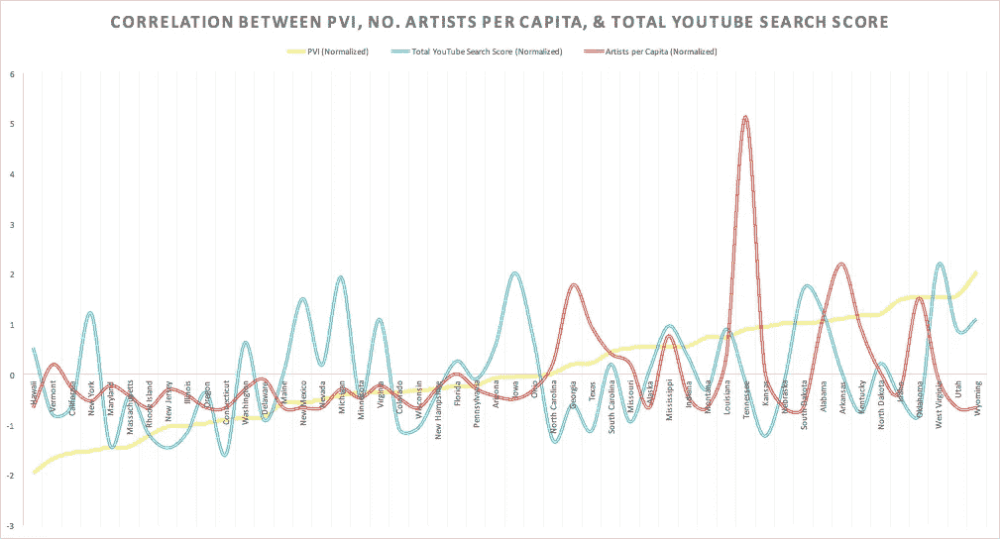

# 描绘乡村音乐的政治

> 原文：<https://medium.com/swlh/mapping-country-musics-politics-8270b19b63cc>

在最近的总统选举周期中，我注意到一些评论家在猜测乡村音乐作为唐纳德·特朗普民粹主义基础象征的意义。

我读了《经济学人》1843 年杂志的文章，听了马尔科姆·格拉德威尔的修正主义历史播客[的一段精彩而感人的片段](http://revisionisthistory.com/episodes/16-the-king-of-tears)，但是在乡村音乐与政治、人口和地理的关系方面似乎没有太多的定量研究。因此，为了更多地了解我最喜欢的音乐类型，提高我的数据分析技能，我开始尽可能地学习。

我决定从拍摄乡村音乐现状的“快照”开始——我在 9 月 7 日收集了 Spotify 的 30 多首特色乡村播放列表中的每一首歌曲(不包括“这是:”专门展示单个艺术家作品的播放列表)。然后，我用谷歌趋势按州汇编了过去一年的 YouTube 搜索数据。我用这些信息以及人口普查和政治光谱数据创建了一个本地 Postgres 数据库，目的是通过当今乡村音乐的视角对美国进行一次简要的审视。

虽然乡村音乐明星在很大程度上避免公开的政治活动(除了儿童摇滚)，但这种分析可以让我们感觉到乡村音乐与这种音乐类型的艺术家和听众的政治和地理观念有多么接近。

首先，我们来看看哪里的乡村音乐最受欢迎。使用来自 Google Trends 的 YouTube 数据，我们可以通过 Spotify 播放列表过滤，按州检查乡村艺术家的相对受欢迎程度。

These maps display where artists on Spotify’s country playlists are most popular on YouTube. Clicking on the left or right arrows in the corner of the map will allow you to filter by some of Spotify’s featured country playlists to see where artists from those playlists are most popular.

这里需要注意的是，这里使用的 YouTube 数据总和表明了一个艺术家的受欢迎程度，而不是一个艺术家在搜索次数方面的绝对受欢迎程度。

达科他州、蒙大拿州和爱荷华州的得分似乎比田纳西和德克萨斯等更常与乡村音乐联系在一起的州高得多，你对此感到惊讶吗？我也是，但我有几个猜测为什么:

*   YouTube 数据代表的是某个艺术家在一个州的 YouTube 总搜索量，而不是该艺术家的绝对搜索量。
*   因此，国家听众比例较高的州得分较高，而不是绝对人口比例较高。是人均。
*   就人口统计而言，大平原地区比田纳西州或德克萨斯州更具乡村气息，也更不多样化，这导致了假设中更高比例的乡村粉丝，从而导致了更高的 YouTube 分数。我有一张图表，可以看到更深层次的部分内容！

既然我们已经看到了音乐的粉丝群在哪里，那就让我们来看看乡村歌手本身来自哪里。

Map of artist hometowns created in Tableau — I collected the data from artists’ Facebook pages, websites, and Wikipedia articles. Notice the enormous number of artists from Nashville. While bands or groups are especially likely to call Nashville home, more solo artists grew up there than anywhere else as well.

在下一对地图中，我们将按州查看乡村艺术家来自何处，既包括人均人数，也包括每个州的绝对人数。

Click the tabs on the top of the map to switch between Per Capita and Absolute.

也许更令人惊讶的是，在 YouTube 上乡村音乐如此受欢迎的中西部北部和山区州，产生的艺术家如此之少。即使从人均水平来看，这些人口较少的州似乎也没有培养出很多他们经常听的音乐类型的艺术家。

从地区来看，很明显，南方产生了大量的美国乡村音乐。有趣的是，尽管像佐治亚州和德克萨斯州(在某种程度上甚至是田纳西州)这样的南方大州明显产生了大量的艺术家，无论是绝对数量还是人均数量，他们在 YouTube 上的搜索分数都不是特别高。这些阳光地带的州近年来经历了高水平的国内和国际移民，也许降低了日益多样化的州中乡村听众的比例——这是我在未来的研究中可能探索的问题。

While California outranks several Southern states, other highly populated states like New York and Illinois still fail to produce many artists.

德克萨斯州确实产生了最多的绝对数量的艺术家，这是有道理的，因为它是人口最多的南部州。尽管在人均排名中排名第 21 位，但从绝对数字来看，加利福尼亚州在各州中排名第四，这可能是因为它是人口最多的州。

现在让我们来看看乡村艺术家来自的社区。他们真的都来自农场和“地图上的点”城镇吗？

使用 2010 年人口普查数据，我们还可以看到，乡村艺术家比其他美国人更有可能来自中小城镇，正如所料，不太可能来自超过 50，000 人的城市。有趣的是，虽然 19%的美国人来自农村地区(一个人口众多的管辖区)。<2,500), only 12% of country artists are. So, while all those songs about growing up on farms in the middle of nowhere are probably exaggerated, country artists do come from small towns at a higher rate than most people.

Now, to the point— is there any correlation between country music and political conservatism? To find out, I collected each state’s Cook Partisan Voting Index (PVI), a metric developed by the Cook Political Report that grades a state’s political leanings by comparing a state’s Democratic or Republican Party’s share of the presidential vote in the past two presidential elections to the nation’s average share of the same. I then compared each state’s PVI with that state’s number of artists per capita, as well as the state’s total YouTube search scores.

This chart is sorted by PVI (in yellow) from most heavily Democrat (Hawaii) to most heavily Republican (Wyoming). Artists per Capita (red) and Total YouTube Search Score (blue) are shown as well — notice, for example, Tennessee’s spike in Artists Per Capita.

The correlation coefficient (r) between the normalized PVI data and the normalized number of artists per capita is **0.3265** ，表示中低相关性。同时，在归一化的 PVI 和州的归一化的 YouTube 总搜索分数之间， **r = 0.6809** ，相关性高得多。

这让我们观察到，乡村听众更有可能生活在保守的州，而不是自由的州，在某种程度上，越靠右的州乡村听众的比例越大。与此同时，平均而言，艺术家本身来自相对更加平衡，但仍倾向于保守的州。由于 0.6809 的 PVI/YouTube *r* 大约是人均 PVI/艺术家的两倍 *r* 是 0.3265，我们可以得出结论，政治保守主义与乡村音乐的听众比其艺术家更相关。

暂时就这样吧！接下来，我认为比较每个州的人均农村人口和其他人口统计信息，看看这与艺术家和粉丝的人口有什么关系，会很有意思。我希望你今天学到了一些关于乡村音乐的新知识。

想了解更多你从来不知道自己需要的见解，[在 Twitter 上关注我](https://twitter.com/C_S_Taylor)并查看[我的网站！](https://carsontaylor.net/)此外，要了解更多关于我的数据来源和方法的信息，[请点击此处。](https://carsontaylordotnet.files.wordpress.com/2017/09/data-sources-and-methodology1.pdf)

## 这个故事发表在 [The Startup](https://medium.com/swlh) 上，这是 Medium 针对企业家和初创公司的领先出版物。

# 在这里加入+12，417 名[获得头条新闻的人](http://growthsupply.com/the-startup-newsletter/)。

