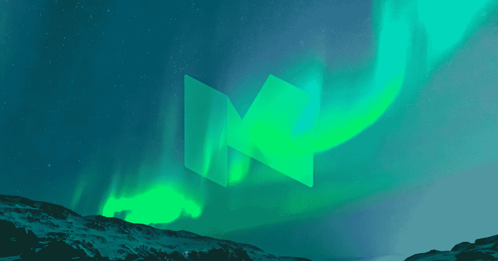
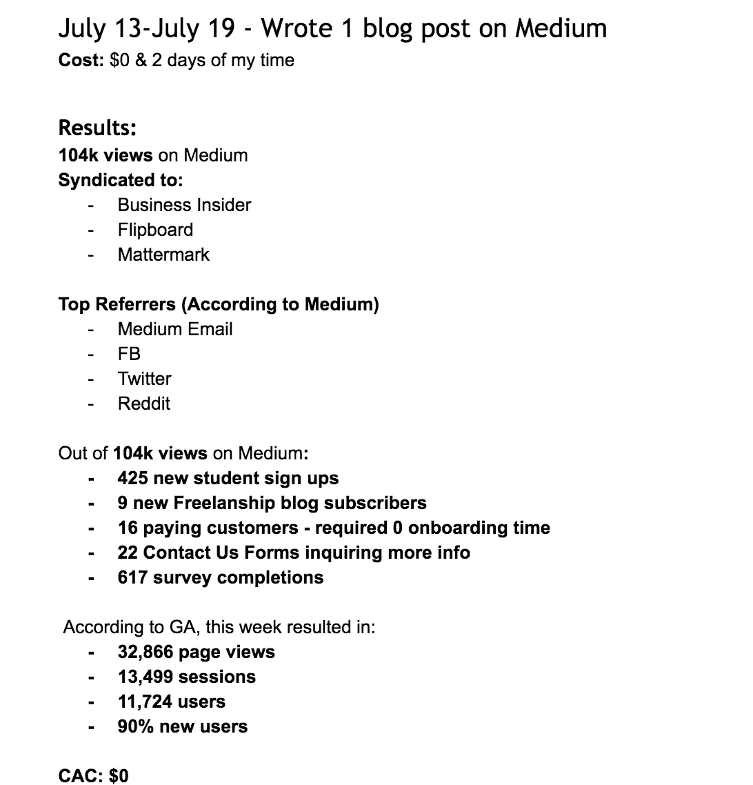
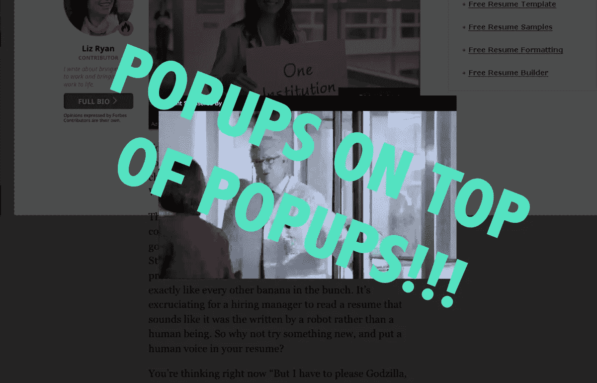
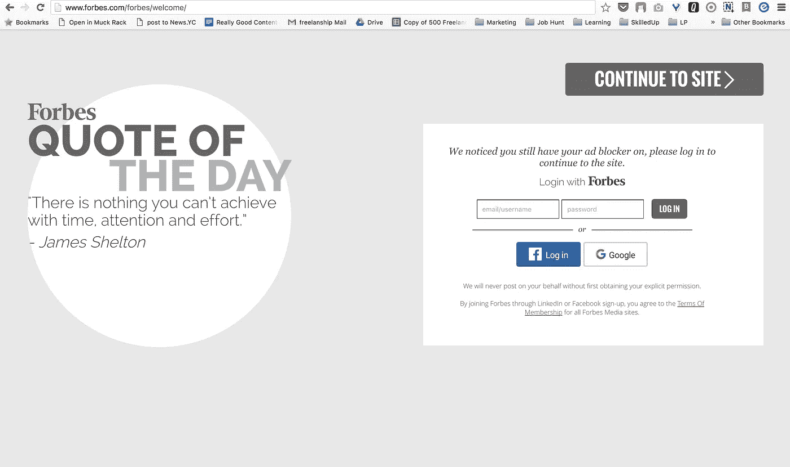
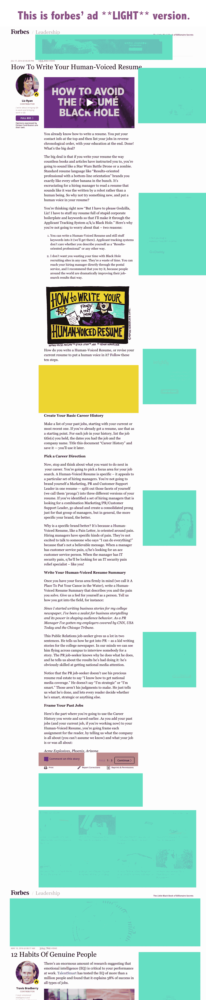
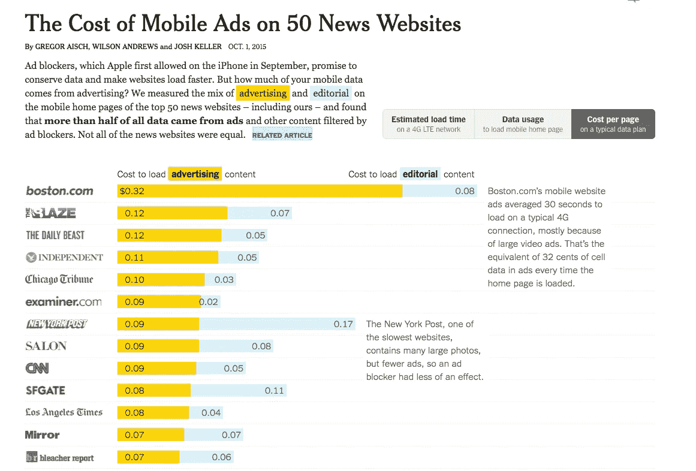
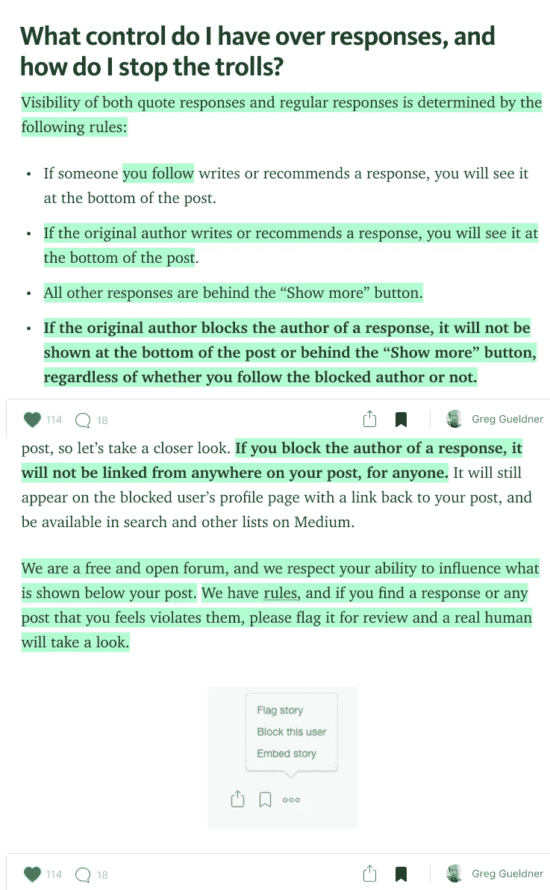
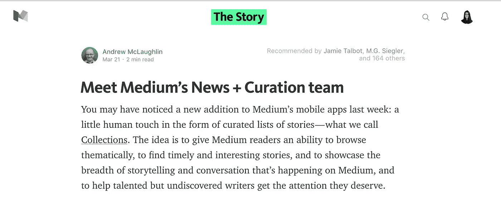
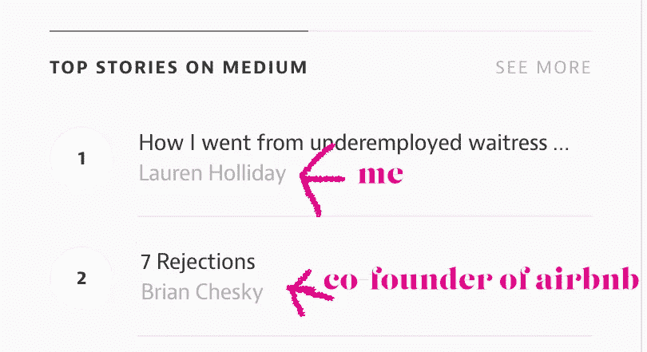
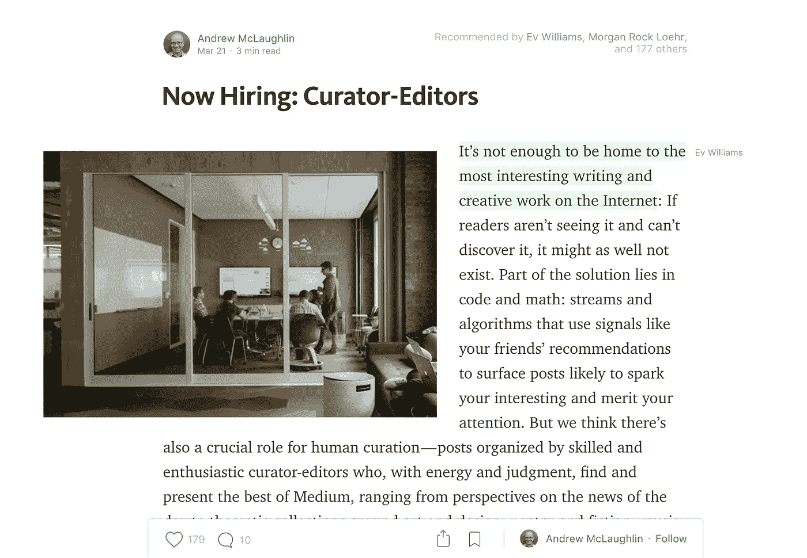

# 记住我的话:媒体会赢——原因如下

> 原文：<https://medium.com/swlh/mark-my-words-medium-will-win-heres-why-9c3e5d2bd13e>

人们总是嘲笑我和我的想法。

在 **2012** 年，我清楚地记得当我讲述一个关于[糖宝宝](/@laurenholliday_/sugar-coated-729a8cabdcef#.spyeq8gxy)的故事时，我的整个高级报告班都在嘲笑我奥兰多哨兵报的当地大报编辑也嘲笑我。

《奥兰多周刊》却没有，我的封面故事大受欢迎——以至于——我从以前的同学那里得到了脸书的标签，如下所示:

> “非常感谢劳伦·霍利迪，在当地新闻媒体报道这件事的一年半前，她就有远见地意识到这件事的吸引力/新闻价值。我们都认为她追求这个故事有点疯狂，它属于周刊，而不是哨兵，但这可能是他们这个月最受欢迎的故事之一。我们谨代表斯皮尔 2011 年秋季高级报告班的全体学员，接受指正。”

在 2014 年的**中，我清楚地记得当时我的编辑拒绝了我写过的一篇我最喜欢的文章，因为“它不是面向消费者的。”**

**尴尬是因为我被这位炙手可热的前 CNN 编辑拒绝了，我会在几个月内忘记这篇文章，并暂停发表。**

**后来有一天晚上，我睡得很晚，很无聊，我很想在《媒介讨论》上发表这篇文章。**

**我做到了。一天之内，这成为我发表的最受欢迎的帖子。看看第一周的数据:**

****

**这张截图甚至没有提到来自真正大交易的个性化电子邮件的数量，这些邮件阅读并喜欢我的帖子。**

**投资者、潜在合作伙伴、潜在客户、受启发的读者、采访请求等。名单很长。**

**我的中等以下，徘徊在 400 左右，暴涨。**

**我经常被问到的一个问题是:为什么你在媒体上发表文章，而不是在其他地方——比如你自己的博客？**

**以上只是我选择在媒体上发表的一个原因。总的来说，有七个原因让 Medium 偷走了我的忠诚，也是为什么我预测它会赢得出版业的战争。他们来了。**

# **1.Medium 拥有大量参与其中的内置观众。**

**见上文。任何人都可以在媒体上出人头地……当然，任何发布惊人内容的人都可以。**

# **2.Medium 相信原生广告。**

**在福布斯上读书有多讨厌？**

****

**福布斯的经历让我疯狂。如此疯狂，以至于我总是冒着错过一篇非常棒的文章的风险，而不是卸载我的广告拦截器或打开不同的浏览器，如 Safari，来阅读这篇文章。**

**为了这篇文章，我卸载了我的广告拦截器，等待《福布斯》加载并阅读我当天的报价。**

****

**看看这个…**

****

**…这是福布斯“广告轻”版。**

**这个页面不仅杀了我的眼睛，让我心烦意乱，完全破坏了我的阅读体验，**而且它还以互联网数据费的形式花费了我(和你)一大笔钱。****

> **“除了加载时间，网页大小也很重要，因为大多数[最新的智能手机计划](http://www.nytimes.com/2015/09/03/technology/personaltech/choosing-the-best-smartphone-plan-for-you.html)都有数据限制。一些运营商，比如 AT & T 和[威瑞森](http://topics.nytimes.com/top/news/business/companies/verizon_communications_inc/index.html?inline=nyt-org)，如果你超出了你的数据配额，就会收取费用。因此，广告膨胀的网站不仅需要更长的加载时间，还会增加数据消耗和电话费。”([来源](http://www.nytimes.com/2015/10/01/technology/personaltech/ad-blockers-mobile-iphone-browsers.html))**

**如果你想知道哪些出版物在数据上花费了你最多的钱，看看[纽约时报*的这张超级简洁的互动图表*](http://www.nytimes.com/2015/10/01/technology/personaltech/ad-blockers-mobile-iphone-browsers.html)。**

****

**让我们回顾一下。**

## **传统广告流口水…**

1.  **他们在数据使用上花费你的钱，变得昂贵。我上个月在威瑞森的账单是 163 美元——因为我的个人数据计划，这个价格太高了。#疯狂**
2.  **它们烦人、垃圾，破坏阅读体验。**
3.  ****广告显著增加了文章加载的时间；因此，浪费你的时间，你的电池寿命和你花在数据上的钱。****

## **…以及原生广告规则。**

**不管你喜不喜欢，内容制作不是免费的。**

**我们将不得不为消费内容付费，就我个人而言，我更希望品牌通过有严格编辑准则的原生广告付费。**

> **赞助内容是原生广告的一个子集，互动广告局(IAB) 将其定义为**“与页面内容紧密结合、融入设计并与平台行为一致的付费广告，让浏览者感觉他们属于这个平台。”****
> 
> ****基本上，付费帖子看起来和其他在线内容一样；不同之处在于，品牌付钱给出版商，让他们在自己的网站上发布广告，以吸引受众。****
> 
> **([来源](http://www.sitepoint.com/why-native-advertising-is-hotter-than-jennifer-lawrence/))**

**原生广告本身是另一个帖子，所以如果你有兴趣了解更多，请阅读这个帖子。如果你想了解 Medium 如何利用原生广告，请点击[这里](https://help.medium.com/hc/en-us/articles/218475847-Advertising)。**

# **3.媒体把作家放在首位。**

> **市场最重要的一部分不是需求；这是供应。在最初阶段，你在让供应商参与进来方面有多有效，他们对你的服务有多忠诚？很多时候这实际上会导致需求。如果你的供给是忠诚的，需求就会到来。([来源](/cs183c-blitzscaling-student-collection/cs183c-blitzscaling-assignment-1-b8f443fa783c))**

**Medium 将会胜出，因为它是唯一一个真正保护作家免受巨魔攻击的地方。**

**Buzzfeed 上最近的一篇[报道就是上述引用的一个典型例子。](https://www.buzzfeed.com/alexkantrowitz/as-social-shifts-to-video-content-creators-win-power-and-dol)**

**简而言之，脸书、Twitter、Snapchat 和其他公司都在争夺有影响力的 Vine 明星，为他们的平台创造内容，因为记住，脸书只是一个平台——内容来自个人。**

> **脸书已经向媒体公司和名人支付费用，让他们通过其直播产品发布视频。据知情人士透露，该公司将在三个月内每月为 20 个职位提供约 25 万美元的报酬。(BuzzFeed 是脸书直播付费媒体合作伙伴之一。)([来源](https://www.buzzfeed.com/alexkantrowitz/as-social-shifts-to-video-content-creators-win-power-and-dol))**

**我们看到包括作家在内的内容创作者的觉醒，媒体是唯一保护作家免受恶意攻击的地方——这对我来说是一个巨大的好处。**

**去年，在我写了一篇敏感的帖子后，我差点放弃写作。评论者很残忍，我真想放弃。**

**我写作是因为我喜欢教书，喜欢让人们意识到我内心所关心的问题。我喜欢辩论。我喜欢和评论者辩论，他们有不同的观点，因为他们知道我不知道的信息。不幸的是，我没能做到这一点，因为这意味着我实际上不得不阅读所有的评论——甚至是那些来自巨魔的令人讨厌的、彻头彻尾的恶意评论，我甚至不能给他们一个回应。**

**我不是唯一一个在看了一篇下流且毫无意义的评论后有这种感觉的作家。不考虑作者感受的出版商将会失败，因为，记住，供给驱动需求。**

**这里有一张关于 Medium 压制巨魔的截图。**

****

**[https://medium.com/the-story/notes-quote-responses-and-troll-control-99a45dfcdaa0#.76rjd0hac](/the-story/notes-quote-responses-and-troll-control-99a45dfcdaa0#.76rjd0hac)**

# **4.介质其实是透明的。**

**如果你还没有[读过 Gizmodo](http://gizmodo.com/want-to-know-what-facebook-really-thinks-of-journalists-1773916117) 中这篇非凡的文章，我强烈推荐它。这是一篇有点令人震惊的文章(取决于你以什么为生),讲述了脸书如何利用人类策展人来提升“好”的内容，贬低“坏”的内容。**

**这些策展人都是不知名的承包商。**

> **脸书可能希望趋势新闻业务保持匿名的一个原因是，它希望培养一种无偏见新闻排名过程的幻觉——一个像完全非政治化的机器一样分类和选择新闻故事的网络。**
> 
> **毕竟，由脸书的执行主编 Benjamin Wagner 运营的公司的整个媒体部门依赖于人们对作为信息渠道的平台的信任。**
> 
> **如果一个编辑团队正在商议热门话题——就像一名报社员工谈论头版新闻一样——脸书就有可能失去其在媒体行业的无党派角色、分发内容的中立渠道，而不是有选择性和固有缺陷的策展人的形象。([来源](http://gizmodo.com/want-to-know-what-facebook-really-thinks-of-journalists-1773916117))**

**脸书的排名算法不应该是秘密，这些承包商也不应该是秘密。**

> **/侧栏**
> 
> **我们称赞编码员的算法就像没有明天一样，但实际上是人类——事实上是记者——才是算法。这是另一篇博客文章，但只是一些咀嚼。**
> 
> **/侧栏**

**我不知道你怎么想，但是我不喜欢公司试图欺骗我。中号不会这样。我可以很容易地[在这里读到](/the-story/meet-medium-s-news-curation-team-3feb0ee3ff65#.naerffuf0)关于 Medium 的新闻+策展团队——甚至看到 Medium 背后一张怪异的脸——多么令人耳目一新。**

****

**[https://medium.com/the-story/meet-medium-s-news-curation-team-3feb0ee3ff65#.naerffuf0](/the-story/meet-medium-s-news-curation-team-3feb0ee3ff65#.naerffuf0)**

**然后我可以[阅读](/talkback/how-we-curate-guidelines-and-principles-fdcf43e049c5#.xm6hpy748)媒体的策展:指导方针和原则。**

**透明是公平的，这就引出了我的下一个观点。**

# **5.中等是公平的。**

**媒体上有正义。这就像博客作者的美国梦——任何博客作者，任何像我一样的博客作者——只需一篇文章就能在媒体上实现。**

****

# **6.在 Medium 背后有真实的人，比如团队成员，他们是可以接近的。**

**我喜欢这个媒介[显示谁发布了工作岗位](/@Medium/jobs-page-b157594e8fce)。**

****

**媒介不是互联网上的黑洞。它的团队成员实际上使用平台并为其增值。**

**#可访问性规则#黑洞**

# **7.中等很美。**

**我喜欢在媒体上写作。我喜欢在介质上突出显示。我认为我有很大的潜力去喜欢在媒体上回应。**

**这很简单，直观，而且专注于你的话。我喜欢我能突出。当我不在 Medium 上阅读时，我使用一个 Chrome 扩展，高度称为，但它不如 Medium 的高亮功能好用。这让我得出了我的结论…**

**想象一下，如果 Medium 成为**选择的**出版平台，这对我们——读者和作者——实际的平台用户会有多大的好处。我想我的愿望迟早会实现，这是你的七个理由。**

****喜欢这个？不要害羞，点击回复，告诉我为什么。(好吧，对不起——押韵走得太远了)****

## **推荐阅读:**

** [## 你需要变得擅长赚钱

### "一个聪明的人应该头脑里有钱，而不是心里有钱。"—乔纳森·斯威夫特

medium.com](/p/e1d85167c231)  [## 去他妈的大学。拿钱。

### 如果你在不公正的情况下保持中立，你就选择了支持压迫者。德斯蒙德·图图

medium.com](/p/94ebfb0ccf51)**