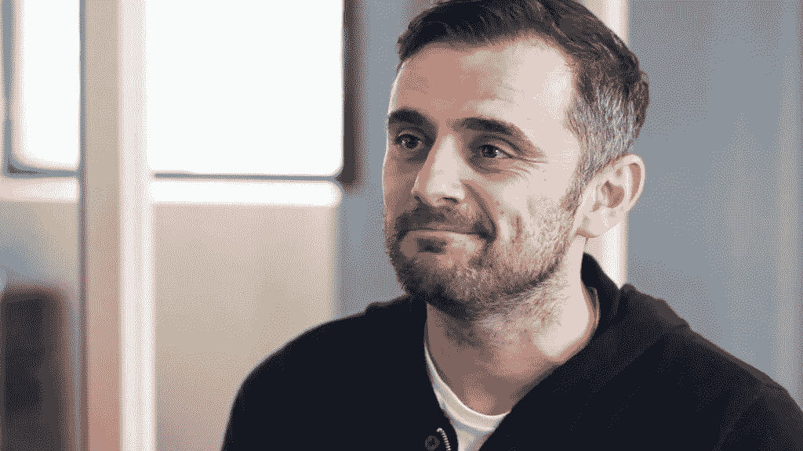

# 你所在年份的市场

> 原文：<https://medium.com/swlh/market-for-the-year-you-live-in-6303a73f01e1>

> 我日交易关注和建立业务。
> 
> 我们要跑马拉松了。你需要成为建筑师、总承包商和管道工——因为如果你不这样做，你就会失败。——加里五世

这篇博文是加里·维纳查克关于*如何让你的终端消费者关注*(2017 年 12 月)的讲话的摘要。

