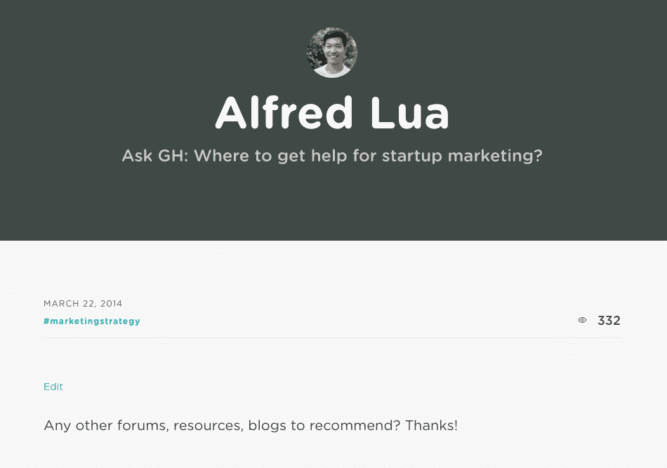
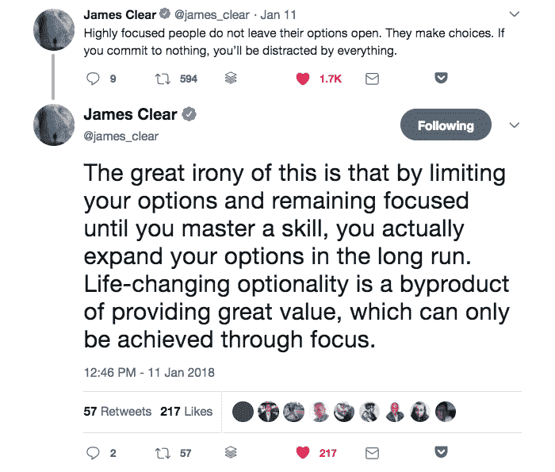
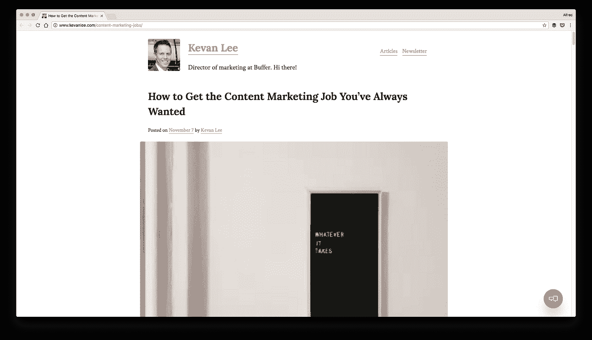

# 给年轻自己的营销职业建议

> 原文：<https://medium.com/swlh/marketing-career-advice-to-my-younger-self-d8ebbc219669>

当我在大学的时候，我每隔几个月就会经历一次小小的生存危机。我会躺在床上，思考我这辈子想做什么。

我正在攻读会计和金融学位，但我不确定毕业后自己真正想做什么。我并不热衷于进入银行业(讽刺的是)，所以我知道我需要学习对其他职业有用的技能。

我一直感兴趣的一个职业是市场营销。我喜欢看精彩的电视广告。大学之前，我在一家公司的营销和沟通团队工作了几个月。我在大学的空闲时间都花在了[增长黑客](https://growthhackers.com/questions/ask-gh-where-to-get-help-for-startup-marketing)和 Inbound 上，阅读关于营销和增长的书籍。

当时(甚至现在)我对创业营销特别感兴趣。但是我觉得卡住了…

我应该做什么？

在[做了大约一年半的营销人员](http://alfredlua.com/content-crafter-buffer/)后，我想我学到了一些东西，可以和 20 岁的自己分享。这是我要告诉他的。

# 先深入

> 在各种事情上“还行”远不如在一件事情上表现出色有价值
> 
> *— Brian Balfour，Reforge 的创始人兼首席执行官*

显而易见的事情是学习市场营销。

*但是，我是否应该试着学习一些营销方面的知识(电子邮件、文案、博客、广告等等)。)还是应该专注于一个领域？通才还是专科？*

从我的经验来看，我相信一开始专注于一个(或两个)领域会更好。

正如 Brian Balfour 所说，“要成为所有在线营销渠道的专家并跟上最新的变化几乎是不可能的。除了不断涌现的新渠道，每个渠道都在以令人难以置信的速度变化。”作为一个完全的营销新手，一次尝试学习多种营销渠道会更加困难和令人不知所措。

此外，有一个焦点会让你更快地了解特定的营销渠道。我很幸运能够在 Buffer 专注于内容营销大约一年，在这么短的时间内我学到了很多。我的成长得到了小小的肯定，那就是受邀在[的一些活动](http://alfredlua.com/2017-year-of-personal-growth/)上[谈论内容营销](http://alfredlua.com/winningcontent/)。如果我分散注意力，同时在多个营销渠道上工作，我可能会花更长的时间来学习我所学到的东西。

此外，还有二阶效应。擅长一个营销渠道通常意味着你可以更容易地擅长另一个营销渠道。例如，在我很好地掌握了写博客帖子之后，写电子邮件和广告文案对我来说变得稍微容易了一些。当然，写一篇 2000 字的博文和写一篇 80 字的 AdWords 广告文案(我现在还在学)是很不一样的。但是技能的重叠使学习变得更容易。(从更广阔的市场角度来看，我有机会[致力于用户获取](http://alfredlua.com/content-to-user-acquisition/)。)

> “当我招聘时，我会在一周的任何一天选择在一件事情上变得惊人的人，而不是多面手，因为如果他们在一件事情上变得伟大，他们在另一件事情上变得伟大的可能性会大得多。”
> 
> *— Brian Balfour，Reforge 的创始人兼首席执行官*

先深入，然后从那里扩展。

# 学会写好

> *“天天写。即使你不是作家，我也发现这种做法可以澄清很多事情。”*
> 
> *——谷歌风投合伙人 MG sie gler*

*当然，深入。但是应该先挑哪个技能呢？*

**内容营销。**

我的营销总监凯旺·李认为，内容营销(特别是写博客)是开始营销的好方法。那是因为写作是所有营销渠道的基本功。

想创作广告？你需要写广告文案。

想要创建登录页面吗？你需要写副本。

想发送电子邮件吗？你需要写电子邮件。

想写博文？是的，你猜对了！

我很幸运，[内容营销是我开始营销生涯的方式](http://alfredlua.com/content-crafter-buffer/)。如果我能让时间倒流，我还是会从内容营销开始，因为写作作为一种技能是多么有价值。还有，当我回顾过去的几年，我觉得当我让自己经常写作时，我成长得最多。[一次是在我被 Buffer](http://alfredlua.com/tag/30in30/) 和[聘用之前，另一次是在我转变成一个专注于内容的角色](https://twitter.com/search?f=tweets&vertical=default&q=%40alfred_lua%20streak&src=typd)时。

如果你想进入内容营销，我的营销总监凯旺·李有一篇非常棒的博文:

[如何获得自己一直想要的内容营销工作](http://www.kevanlee.com/content-marketing-jobs/)。

# 让你周围都是优秀的营销人员

> “你是和你相处时间最长的五个人中的平均水平。”
> 
> *—吉米·罗恩，企业家、作家和励志演说家*

我过去常常独自一人训练铁人三项，但从来都不擅长。当我在华威大学时，我加入了铁人三项俱乐部，和一些我见过的最好的铁人三项运动员、游泳运动员、自行车运动员和跑步运动员一起训练。虽然我远没有达到他们的标准，但我游泳、骑车、跑步的速度都是前所未有的。他们不仅帮助我更好地训练，还帮助我打破了我身体极限的精神障碍。

我觉得同样适用于营销。

**与志趣相投的营销人员在一起，你可以讨论挑战，分享经验，共同成长。不是每个营销问题都能亲身体验和学习。在一个小组里，你有机会交换意见，学习彼此的经验。**

一个很好的方法是加入一个拥有强大营销团队的公司。它能让你的成长扶摇直上，这是我有幸亲身经历过的。以下是布莱恩·鲍尔弗关于向其他公司学习的话:

> 例如，在内容营销方面，我会关注 Moz、Hubspot、KissMetrics 和 Buffer 等公司。

幸运的我在 Buffer 学习并做内容营销*！我远非内容营销专家。但是和太空中的巨人一起学习和工作非常有帮助。*

# 做某事

我在这篇博文中的观点非常具体(来自我作为中小企业 SaaS 产品领域营销人员的经验)并且狭隘(因为我只有不到两年的经验)。它们可能并不都适用于你的情况，但我希望它们有助于提供一个视角。我相信你会像我在大学时一样，寻找更多关于进入市场营销的博客文章。

如果你从这篇博文中只学到了一件事，那就是:

做点什么。

那是我当时需要听到的。

你的目标应该是成为多面手还是专家？不管怎样，你都必须从学习一些东西开始。

应该从哪个技能入手？写作很重要，但这不是唯一重要的技能。投身其中，尝试一些东西，总比只是在网上阅读要好。

如果你想成为一名营销人员，先把手弄脏。

做某事。

*本帖原载于 2018 年 4 月 3 日 alfredlua.com**的* [*。*](http://alfredlua.com/marketing-career-advice-to-my-younger-self/)