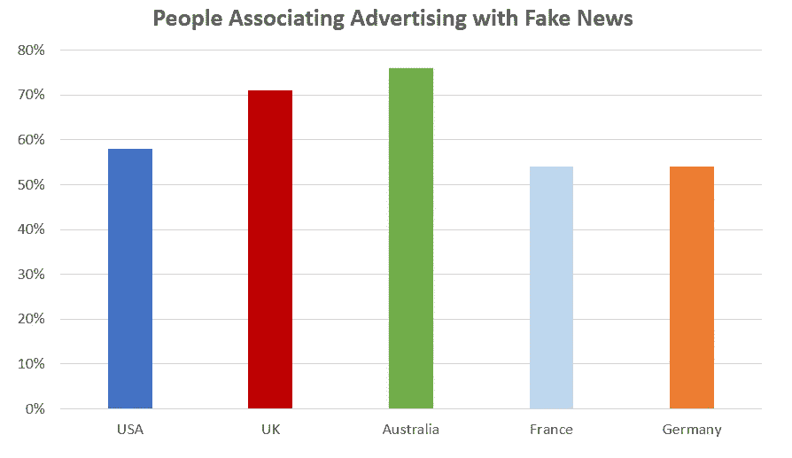
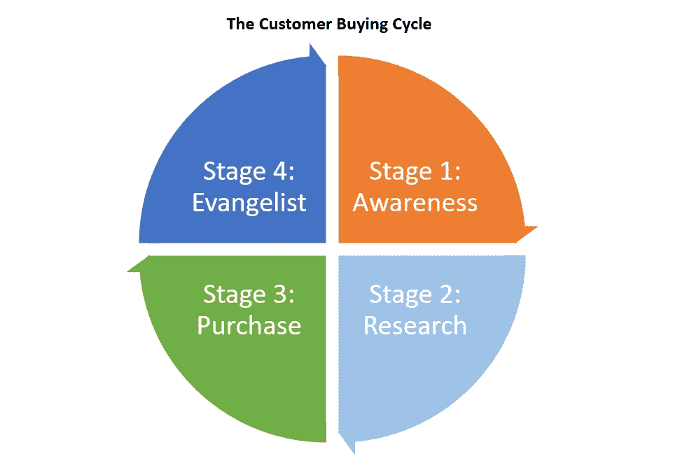

# 假新闻时代的营销

> 原文：<https://medium.com/swlh/marketing-in-the-fake-news-era-47bb2265c479>

## 在消费者信任度空前低的情况下，你如何打破噪音，让人们看到你的产品有多棒？

“假新闻”时代不容忽视。这个词并不新鲜，但实际上是在 2016 年美国大选期间创造的，当时有报道称，不准确的消息正在传播，以帮助影响选民的意见。它在公众中流行起来，并像野火一样传播开来。结果是人们越来越怀疑他们接触到的任何信息。

因此，2018 年[爱德曼信任晴雨表](https://www.edelman.com/trust-barometer)显示，公众信任在所有四个关键机构中显著下降，这也许并不奇怪:企业、政府、非政府组织和媒体。这种大幅下降是 2017 年开始的持续趋势。

公众的怀疑并不仅限于新闻，根据乐天市场的[研究，在美国超过 58%的人将网络广告与假新闻联系在一起。](https://blog.marketing.rakuten.com/hubfs/rakuten-marketing-insights-consumer-online-ad-sentiments-what-needs-to-change-about-online-advertising.pdf?__hstc=56362548.0cc9f6b05061fa2f234872e33314c6be.1524500328373.1524500328373.1524500328373.1&__hssc=56362548.2.1524500328374&__hsfp=358607951)

这意味着越来越多的消费者带着最初的怀疑态度接近营销内容，赢得他们的信任越来越难。

## 信任是社会的基石

信任是人性中最重要的方面之一，也是现代社会的核心基石。尤瓦尔·赫拉利的《T5 智人》一书极好地描绘了信任在整个人类历史中的重要性。

人类最初是以狩猎采集者的身份开始的，他们以小团体或社区的形式漫游。当时流行的是人情。如果你帮我一把，我希望将来能报答你。没有回报的人会被排斥，结果生存完全依赖于可信度。

在农业革命期间，人类发现了一种利用共享的信仰体系(金钱、宗教、政治等)发展社区的方法。).这使得两个陌生人能够相互信任，并朝着共同的目标一起努力。金融货币最终诞生了，随之而来的是信用的概念。信贷允许企业家借钱去追寻他们的梦想，资本主义开始起步。

这些文化转变复合在一起，社会飞速发展。孤立的小社区开始合并成庞大的国家。但如果没有一个潜在的信任体系，这些转变都不会发生。

## 信任危机中的营销

这种信任的侵蚀对营销人员来说是一件大事。广告的核心是与陌生人建立信任。信任是通过诚实产生的。如果人们信任你，他们会重视你们的关系。如果客户信任你，他们更有可能与你做生意。

随着 20 世纪 90 年代数字时代和 21 世纪初社交媒体的兴起，内容比以往任何时候都更容易分享，我们所知道的内容营销就此诞生。博客文章和白皮书很快成为营销人员寻求建立对其产品信任的黄金标准，但这有效吗？

McCann2017 年的一项调查发现，42%的美国人认为品牌不如 20 年前真实。埃尔德曼报告指出，去年美国消费者对企业 ***的信任度下降了 20 个百分点。***

内容营销旨在提供帮助，但许多文章都带有明显的产品偏见，这导致了一定程度的操纵。人们开始认识到这些偏见，内容营销正在失去它的影响力。

人们不喜欢被出卖，我们希望感觉我们能控制自己所做的决定。然而，我们确实有一种天生的求知欲；81%的美国消费者认为，如果他们对某个感兴趣的领域有所了解，在线广告是有用的，而且不会打断他们的在线体验。

## 穿过噪音

为了与潜在客户建立信任，我们必须首先接触他们。由于一些原因，这也变得越来越困难。

Dropbox 初创时，他们发现大多数目标客户并不积极寻找他们的产品。这导致了传统的在线广告(即搜索)不起作用。他们能够通过主动寻找目标客户在网上花时间的地方来激发更多的兴趣，并根据他们的需求定制内容。

不积极寻求购买产品的客户符合购买周期中的“认知”阶段。这个阶段的人正在对话题形成总的看法，更多的是依靠直觉。心理学家称之为系统 1 或“快速”思维。

随着社交媒体和互联网广告的兴起，[普通消费者每天过滤 5，000 条广告](https://www.nytimes.com/2007/01/15/business/media/15everywhere.html)，这超过了 System 1 的思维。为了理解我们所接触到的大量信息，人类发展出了被称为启发式的潜意识过滤方法。大多数人没有意识到我们在使用启发式方法，这会导致认知偏差。

一旦客户进入研究阶段，就会触发系统 2 思维，或“慢”思维。他们对这个话题产生了兴趣，并深入研究，有意识地花费更多的精力和注意力来形成和验证观点。尽管系统 2 的思维被认为是有意识的决策，系统 1 通过启发法对它有很大的影响。

这就是为什么“点击诱饵”标题有效，它们迎合直觉。我们通常点击标题，看看我们是否对文章感兴趣，如果不符合预期，我们继续前进，忘记它。为了让内容产生共鸣，它需要通过提供真正的价值来抓住系统 2 的注意力。找到这种平衡会给读者留下印象。

需要注意的一些启发是[可用性](https://en.wikipedia.org/wiki/Availability_heuristic)和[熟悉度](https://en.wikipedia.org/wiki/Familiarity_heuristic)启发。消费者将从他们已经知道的产品开始研究，并且更有可能购买他们熟悉的产品。这加强了产生意识的重要性。

消费者参与的社区也通过[社交](https://en.wikipedia.org/wiki/Social_heuristics)试探法发挥作用。依赖直觉的人更容易被社会舆论所左右，这加强了社区对营销人员的重要性。

最终结果是，处于认知阶段的人恰好是受当前信任危机影响最大的人。当人们不信任企业时，他们会更加依赖社区的意见。如果大多数公众不信任企业，它会很快变成一个负反馈循环。

## 赢回信任

如果我们将 Dropbox 的发现与我们对人类如何做出决策的了解结合起来，我们就可以选择最佳策略来建立信任并提高我们产品的知名度。

从人类历史来看，建立信任的最佳方式是:

*   给人们有价值的东西，因为这会引发回报的需求
*   将你的产品与你想与之做生意的客户的共同信念或理想联系起来
*   利用社区的力量

从 DropBox 我们了解到:

*   大多数潜在客户都处于认知阶段，在这个阶段他们不会特别寻找你的产品

考虑到人类天生的思维过滤器，我们知道:

*   接触你的目标客户需要你积极寻找他们的社区，创造迎合他们兴趣的内容，为读者增加真正的价值，否则他们会过滤掉
*   处于认知阶段的客户使用系统 1 思维，这意味着他们使用称为启发式的认知工具过滤大量信息
*   要留下印象，提供有价值的内容，这将引起系统 2 思想的注意

考虑到这一点，最佳策略如下:

**思想领导力**

思想领导力已经演变成任何形式的内容营销的通用短语，但这不是真正的思想领导力。思想领导不是以产品为中心，而是以人为本。它揭示了目标市场感兴趣的想法和主题。为了有效，它需要是真实的，并提供真正有助于某人学习的知识。这就创造了价值(即。一个人情)，进而建立信任。

当我们看到一篇文章，亚马逊的首席执行官杰夫·贝索斯分享了如何有效地召开会议的知识，我们停下来阅读。召开会议确实与亚马逊的产品无关，但我们都知道杰夫·贝索斯是一位专家型企业家。如果 Jeff 分享的知识对读者有价值，它会建立信任。这种信任将间接与杰夫的产品——亚马逊联系在一起。

在选择主题时，不要局限于产品规格，要深入到产品影响的社区。迎合你的目标群体的广泛兴趣将为内容打开一个充满机会的世界。创建内容来回答他们的问题，或围绕感兴趣的领域提供想法。

假设你是卖跑步机的，你是跑步狂热者。创建关于跑步好处的内容。你将能够提供洞察力，并与其他跑步者的观众(他们恰好是你的目标市场……)建立即时联系。

记住，专注于帮助读者，而不是推销产品。这是处于认知阶段的读者所期待的。

**利用社区的力量**

我们对社区的渴望已经转移到网上，我们都可能是虚拟社区的一部分。Medium 就是一个很好的例子。人们加入是因为他们对某些话题感兴趣，这是一个我们可以向有类似兴趣的人学习和互动的地方。如果我们发现一个好主意，我们会分享它。

[Seth Godin](https://medium.com/u/f9ac9806e153?source=post_page-----47bb2265c479--------------------------------) 在 Ted 演讲中概述了社区的力量:

利用社区有两种选择:建立自己的社区，或者利用现有的社区。各有各的优势。

建立一个社区需要花费大量的时间和精力，但是它可以让你对故事有更大程度的控制。从利用社区开始可能更容易，随着用户群的增长，重点可以转向培养自己的社区。

如果你去 Reddit，你可能会找到一个几乎什么都有的社区。Medium 拥有多种主题的出版物。找到这些社区，并开始积极贡献。引导叙述，围绕你的公司建立一种文化。

从市场营销的角度来看，社区可以帮助你找到愿意传播你的产品的顾客，并把其他顾客也变成传播者。围绕你的产品产生正面口碑的客户群体可能是你最有力的工具。

从产品管理的角度来看，建立一个客户社区可以让你建立关系并获得产品反馈。你让你的社区参与的越多，他们对你的产品投入的情感就越多。

**影响者营销**

影响者营销的出现是一个日益增长的趋势。影响者是那些有能力通过他们的影响力和可信度来改变特定社区的想法或行为的人。影响者营销是在一个与你的产品相关的社区中赞助一个影响者。你实际上是在购买一个布道者，这是获得目标群体关注的一种快速方式。

社区信任影响者，品牌利用影响者建立的信任。要让影响者保持真实，他们需要对你的品牌真正感兴趣，有共同的目标，并有能力谈论积极和消极的方面。

影响者营销也影响了名人代言。安德玛的首席运营官，Patrick Frisk，最近提到 Dwayne“The Rock”Johnson 超过了 Steph Curry 成为安德玛最有价值的代言人。

岩石的运动不仅仅依靠明星的力量，而是成为大众的动力。摇滚的品牌是关于努力工作和坚持不懈的回报，这几乎能引起任何人的共鸣。光是明星是不够的，你还需要代表人们认同的东西。

Shivers, right?

大多数产品不需要世界知名的名人，但我们需要小众的名人。在你的目标群体中寻找思想领袖。一旦加入，确保他们像其他顾客一样成为你社区的活跃成员。

影响者营销有一个巨大的风险。一旦你开始花钱请人代理你的品牌，消费者自然会质疑这种关系的真实性。这里有一个关于如何与有影响力的人建立有效、真实的合作关系的可靠指南。

## 包装它

随着信任危机的全面爆发，真实性比以往任何时候都更加重要。为了产生最大的影响，你的营销应该以建立品牌和受众之间的信任为中心。看看你目前的营销策略，确保你专注于创造真正有价值的内容。

## 这个故事发表在[的创业](https://medium.com/swlh)上，这是 Medium 最大的创业刊物，有 327，829+人关注。

## 订阅接收[我们的头条新闻](http://growthsupply.com/the-startup-newsletter/)。

