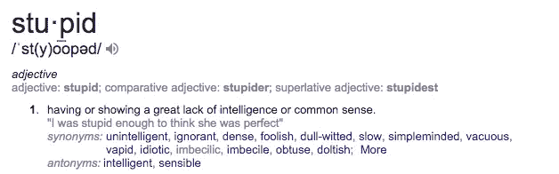

# 营销是愚蠢的，第一部分:

> 原文：<https://medium.com/swlh/marketing-is-stupid-part-1-a92ad4ce1fc2>

## 让我们从战略角度出发

I JUST WANT MORE CUSTOMERS!!!

> 我花什么？
> 
> 我把它花在哪里？
> 
> 我应该刊登脸书的广告吗？

这是我经常遇到的问题类型——尤其是前两个。我的回答通常都是一样的:“不要把重点放在战术上。战术是容易的部分。确保你关注的是房子而不是工具。”

换句话说:

## **钻孔>钻孔**

[这是我以前写过的东西。](/swlh/why-i-stopped-calling-myself-a-marketing-guy-91053e3f5902)

如果你想盖一栋房子，你不会去找一个“拿锤子的人”。你尽可能地寻找最好的建造者，并合理地假设他们知道如何使用必要的工具。

如果你正在寻找建立和扩大业务，你不应该寻找一个“社会家伙”，或“点击付费家伙”。

**企业主希望被钻一个洞。他们并不在乎你用的是什么钻头。**

根据这个定义，营销并不愚蠢:

然而，这种定义是愚蠢的:

其实营销是美好的。也是落伍了。上个世纪最具创新力的两家公司(谷歌和脸书)实际上都是广告技术公司。还有一套杀手级营销技术工具。营销科技创业公司和技术有大量的支持。

但是市场营销仍然是过时的。为什么？

因为太蠢了。

这是我遵循的让它不那么愚蠢的过程。通常，客户会这样开头:“你认为$X 能给我带来什么？”或者，“你认为我们应该在哪里营销？”(郑重声明，当营销被用作动词时，我感到很奇怪)。

这就像是在说，“嘿，我想做晚饭。我应该用什么配料？”

我:我不知道，杰克(在写这篇文章的时候，我没有和任何叫杰克的人一起工作)。你想做什么菜？

他们:嗯，我想这顿饭我可以花 30 美元。那能给我带来什么？

**我:**退一步讲。

这种类型的思考类似于“我应该花什么？”“我应该花在哪里？”“我该不该做 X？”

## 这里有一个受精益创业方法论启发的过程，我遵循它来解决这个问题。希望有所帮助:

## **1。隔离假设**

当你开始创业，或推出新产品时，你天生就会对人性做出假设。

如果我今天开了一家咖啡杯公司，我是在暗示:1)我能比其他所有咖啡杯制造商做得更好，2)我知道我能做到，因为我比其他公司更了解人们想要什么样的咖啡杯。

我们都倾向于这种想法，并开始考虑在哪里卖这些让你大吃一惊，让你奶奶大吃一惊，让她大吃一惊的咖啡杯。但是我发现退一步讲是有帮助的。

**我们在此假设:**

*   这些咖啡杯会比竞争对手的更好。为什么？
*   他们会更好，因为我们有杀手级的设计。他们是怎样的杀手？
*   我们的咖啡杯生病了，因为我们的艺术家被委托为国家元首制作真人大小的木偶玩偶复制品(太奇怪了？).显然，他们可以做出很棒的咖啡杯。
*   我们认为我们可以卖出很多这样的坏男孩。
*   为什么我们认为我们能做到？

把这些写出来。把它们写在便利贴上。使用白板。让你的[单桅帆船](https://www.google.com/search?q=sloop&oq=sloop&aqs=chrome..69i57j0l5.4416j1j1&sourceid=chrome&ie=UTF-8)漂浮的任何东西。我们不是战术上的。我们只是在勘测地形，而不做任何假设。

## **2。定义假设**

(我正在写一篇将于下周发表的第二部分。我们会采取战术。)

假设是我们在没有数据的情况下接受为真实的东西。假设是可以检验的。

企业经历的每一项计划都应归入以下两类中的一类:

1.  验证
2.  缩放比例

当一个计划处于假设阶段时，你要验证它是否是真的。为了验证它，您需要在一段时间内定义适当的指标。我喜欢 30 天的窗口。

一旦假设得到验证，你就要专注于衡量它。验证阶段针对最小可行误差。

一旦你把它缩减到每个类别 2-3 个假设，找出什么样的度量标准可以准确地表示有效性。

这些是我觉得每个人都需要的总体假设:

**你的力量乘数/不公平优势是多少？**

每个人都有。有些人比其他人拥有更多。你呢？这与你的团队、动力或抱负无关。这与你正在解决的问题有关。

人有这个毛病吗？**(如果是，继续)**

这是一个足够大的问题，他们会付钱来解决吗？**(如果是，继续)**

你有解决这个问题的正确方法吗？

不要在这个阶段使用调查。人们用美元和他们的时间投票。调查有点像根据 16 岁孩子对自己的评估给他们颁发驾照。

在这个阶段，度量标准可能会有很大的变化。

**受众假设**

你在和谁说话？

有你发现的问题吗？

对于初创公司，这通常是非常小的数据集。确定你的假设，然后找出那些人在哪里出没。然后亲自去见他们，向他们推销。如果他们不喜欢，他们可能不是合适的观众。

**消息传递假设**

一旦你发现你在和谁说话，然后弄清楚你在和他们说什么。

有共鸣吗？

它能移动指针吗？

这对他们有影响吗？

这不是战术哨所，但我会尝试一下。

*   AdWords CTR 测试

选择 3 个标题，花最少的每日预算在 Adwords 上，把标题作为文案。创建一个空白的登录页面，只说，“我们正在建设中。”并有一个电子邮件列表注册表单。你收到电子邮件并不重要。你唯一关心的是广告的点击率。点击率最高者获胜。

当 Tim Ferriss 在写《每周 4 小时工作制》(我最喜欢的书之一)的时候，他不能决定是把它叫做“每周 4 小时工作制”还是“为了娱乐和利润而贩卖毒品”。他采用了这种策略，最终选择了“每周工作 4 小时”。

天哪，如果后者赢了这场比赛，世界会是怎样的不同。

*   登录页面测试

一旦你这样做了，然后用获胜的标题建立一个 1 页的网站，有 2 段文字，3 张图片，1 段视频和一个行动号召(表格，测验，电子书，等等)。这是你测试其他信息元素的地方:次要信息、标语、叙述结构等。

你可以手动创建登陆页面，使用 Google Optimize(它有一个杀手级的免费版本)，Optimizely(没有免费版本)，Unbounce(肯定没有免费版本)，或者类似的东西。在这里，您正在测试行动号召。哪个组合最高，谁就赢。

**收购假设**

你实际上如何让他们购买？

这包括从收购渠道(脸书、谷歌、推特等)获得的一切。)，到优惠(折扣、测验、电子书)，到其他一些我们将在下周发布的战术文章中深入探讨的东西。

这里，我们想用非常有限的预算进行测试。与其一开始就给它 2 万美元，不如用 500 美元测试一下。你已经有了其他的元素。这应该是比较容易的部分。以下是你决定花费的方法*:

*请注意，这些估计的指标是否超级精确并不重要。重要的是让车动起来，这样你就可以一路开着它。估计时间不要超过 5 分钟。

*   a)估计终身价值:在客户的整个生命周期中，他们对你来说值多少钱？
*   b)我喜欢将每次收购的成本目标定为大约生命周期价值的 10%。做对你有意义的事情，但是要确定一个现实的目标。您可以随时降低每次收购的成本。
*   c)你需要获得多少客户才具有统计意义？如果你在卖咖啡杯，我的目标是 10 个人，2 个人购买，这并不意味着我有 20%的转化率。这意味着我的两个朋友想帮我。走出你的朋友圈子。
*   d)将 C 乘以 B 得到起始预算
*   e)一旦这些假设得到验证，就往火上浇煤气。

## **3。测试**

这就是你操作的地方。我将在下一篇文章中深入探讨这个问题。

## **4。缩放和迭代**

如果某个东西没有被验证，那并不一定意味着它是无效的。不要把婴儿和洗澡水一起倒掉。你很可能只需要稍微调整一下。

想知道你的营销健康得分吗？[点击这里查看！](https://marketr.life/marketing-score)

感谢阅读！[如果您想讨论您的组织可能会面临的情况，请安排与我通话](http://calend.ly/tristantarpley)。让我们在电话上聊 30 分钟，我可以帮你开始这个过程——不需要购买:)

## 这个故事发表在 [The Startup](https://medium.com/swlh) 上，这是 Medium 最大的创业刊物，有 320，924+人关注。

## 订阅接收[我们的头条新闻](http://growthsupply.com/the-startup-newsletter/)。

