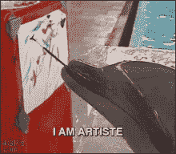
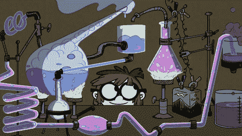
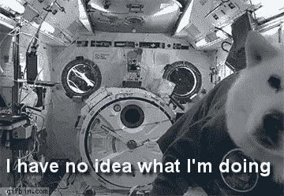

# 营销+科学=艺术

> 原文：<https://medium.com/swlh/marketing-science-art-590a23eae688>

当我在[*T2*](http://placeoforigin.in)工作的时候，我第一次发现营销是一门科学。一家迷人的初创公司，在网上策划和销售印度所有 29 个邦的地方美食。

*PlaceofOrigin* 有一个相关的、丰富的数据库可以挖掘。直到 24 岁，我一直从事传统的营销工作，对数字和尺寸毫不关心。

我很快就对提问产生了兴趣，比如是什么驱使人们购买我们的产品。是出于好奇还是对美食的熟悉，我如何通过分析商店行为数据而不直接询问任何问题来找出答案。

我很好奇对某种口味的偏好如何与人们在商店的行为、花费多少以及联系客服的次数相关联。

我很快发现自己遇到了技术上的障碍，不得不在附近的一所大学寻求帮助，这所大学恰好是世界上市场营销科学前沿研究的首选目的地之一。

他们对营销科学的热情和对原始数据的渴望证实了我自己对这一行业不太健康的感情。我这么快就找到了我的部落。

当你问了正确的问题，并出于纯粹的好奇心，不带任何先入之见地把数据放在一起时，你所迸发出的智慧和洞察力，是我认为让阿基米德裸奔的东西。我几乎可以理解。

我觉得自己像一个咯咯笑的小女孩，刚刚得到了她的第一套着色工具。可能性是无限的。这是一个全新的世界，等待着用几种颜色去创造。唯一的限制是我的想象力和我所做的事情。

> 不在于你有多少数据，而在于你问了什么问题。

当我换了工作，发现自己成了 Bumberry 的首席营销官，这是我加入过的最有目标的公司之一，也是印度最大的布尿布销售商，这个行业是一个尽可能不了解技术的行业，我决定衡量我能做的任何事情。

> 如果无法衡量，就无法改进。

很快，我们就在算法和电子表格的帮助下，决定印刷哪些设计、推出哪些产品、定价甚至保留哪些供应商。我的新欢。

然后，将所采取的决策与结果数据进行对比，并持续改进。没有数据，改善不会轻易发生。即使它发生了，你也不知道它发生了什么或者发生了多少。这让它变得很不真实。

> Kaizen(改善) refers to small but consistent improvements.
> 
> 领悟:没有数据就没有改善。

营销办公室现在是一个修补实验室，通过讲故事、信息图表、短片甚至戏剧来预测和解释。对我们来说，见解就像诗歌一样。它不仅启发了工作，也启发了生活本身。

> 数据应该在开始时激发灵感，在发展过程中启发灵感，并在最后得到改善。

我发现处理数据的最佳方式是费德勒打网球的方式，不仅有效而且高效，更重要的是，优雅。

> 分析背后有一门科学；然而，交流见解是一门艺术。

伟大的问题将产生启发性的见解，激发改进，减少低效，推动进步。

## 这篇文章发表在 [The Startup](https://medium.com/swlh) 上，这是 Medium 最大的创业刊物，有+ 375，041 人关注。

## 订阅接收[我们的头条](http://growthsupply.com/the-startup-newsletter/)。

