# 7 个无价的营销技巧，可以帮助团队始终如一地创作出优秀的内容

> 原文：<https://medium.com/swlh/marketing-skills-a3484b13928d>

在过去几年与数以千计的营销人员和企业交谈中，我们了解到营销对人们的生活有着不可思议的潜在影响。

事实上，美国营销协会[将](https://www.ama.org/AboutAMA/Pages/Definition-of-Marketing.aspx)营销定义为:

*“创造、沟通、交付和交换对顾客、客户、合作伙伴和整个社会有价值的产品的活动、机构、技能和过程的集合。”*

我喜欢这样。**我们作为营销人员正在造福整个社会**！

但是在一个以光速前进的领域，营销技巧和职业发展并不容易。似乎每周公司都在要求员工具备一套进化的技能——催生了一个营销角色的新时代，比如全栈式和 T 型营销人员。

能够成功地将各种各样的人、营销技巧和独特的视角结合在一起的品牌在提供价值方面具有巨大的优势。

这就是为什么我们与领先的工作管理软件 [Asana](https://asana.com/) 的优秀营销团队合作，来分解前 **7 个无价的营销技巧，帮助这个星球上一些最伟大的品牌团队制作出** [始终如一的伟大](https://blog.asana.com/2017/09/how-create-execute-editorial-calendar/) **内容**。

让我们开始吧！

# 团队的 7 个无价营销技巧

正如苏扬·帕特尔[在他的博客](https://sujanpatel.com/marketing/50-skills-every-marketer-should-have/)中写道，“现代营销人员必须熟悉很多东西，擅长很多东西，并且精通一些东西。”

拥有各种各样的技能和工具不仅为团队创造各种成功的营销活动提供了极大的灵活性，而且也让每个营销人员作为一个个体而大放异彩。

这 7 个高级营销技巧将有助于确保你的团队拥有终极灵活性和个性。

# 1.讲故事

似乎有一种普遍的看法认为，营销一直都是讲故事，营销人员一直都认为自己是天生的故事讲述者。

但事实可能并非如此。

LinkedIn [发现](https://business.linkedin.com/en-uk/marketing-solutions/blog/posts/content-marketing/2017/The-Rise-of-Storytelling-in-Marketing-as-told-by-LinkedIn-data)就在七年前，将“讲故事”列为一项技能的营销人员数量已经过时。作为一门受人尊敬的营销学科，它根本不存在。

然而，今天，LinkedIn 全球范围内 7%到 8%的营销人员根据他们的个人资料描述和技能列表将自己视为故事讲述者。

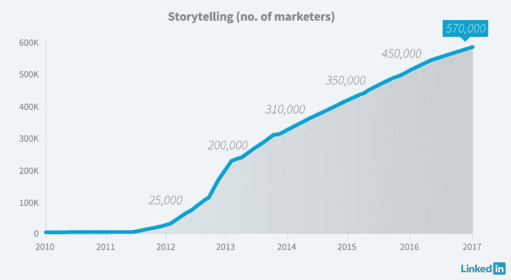

作为一名营销人员，讲故事不仅仅意味着告诉你的观众你的产品或服务做了什么或它已经做了什么。**有效的讲故事包括对人类情感、动机和心理的深刻理解**，以便以真实、吸引人的方式与他们有效沟通。

在写这篇文章的时候，阿萨娜·CMO[戴夫·金](https://twitter.com/dbkinger?lang=en)告诉我:“最好的营销人员是问题解决者和故事讲述者。内容创作者应该问“这个作品为我的观众解决了什么问题？”"

作为营销人员，有无数种方式来讲述一个故事。

我最喜欢的开发一个引人入胜的故事的方法之一是使用由专业剧作家和即兴创作人 Kenn Adams 创造的“故事主线”公式。多年来，皮克斯用这个公式[赢得了无数奖项](https://io9.gizmodo.com/5916970/the-22-rules-of-storytelling-according-to-pixar)，包括 13 个奥斯卡奖、9 个金球奖和 11 个格莱美奖。

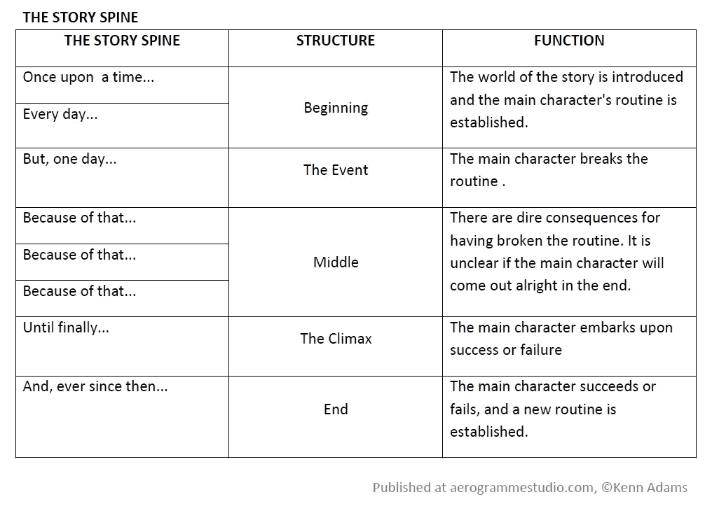

**从前有 __。每天，___。某天 __。正因为如此，_ _ _ _ _ _。正因为如此，_ _ _ _ _ _。直到最后 __。**

我鼓励你在自己的品牌、产品或服务中实践这个公式。

让我们用一个我们可能都知道的品牌来试试吧:**耐克**。

*   很久很久以前，有一个充满热情的鞋匠，他想把他的鞋子送到全世界跑步者的手中。
*   **每天，他都在努力完善自己的鞋子，以便这些跑步者能发挥出最佳水平。**
*   **但是有一天，这位鞋匠意识到向全世界成千上万的跑步者提供鞋子并不是一件容易的事情。**
*   ****因为那个**，他越来越努力地工作，以确保他拥有成功所需的产品供应，不管批评家们怎么说。**
*   ****因为那个**，他的鞋子不断改进，越来越多的运动员开始穿着它们参加著名的比赛。**
*   ****直到最后**，它不再仅仅是关于跑步。这变成了更大的事情——找到你内心的冠军，做你喜欢的事情，让你感觉很棒。**

**正如肯所描述的，“故事的脊梁不是故事，而是脊梁。它只不过是故事赖以建立的框架结构。这就是它成为如此强大的工具的原因。”**

**作为营销人员，我们有责任填补故事中的所有细微差别。**

****

# **2.优先处理**

**许多营销人员都非常清楚——总有事情可以做。**

**成为一个有效的优先排序者是一种很少被谈论的营销技巧，但它对你的团队和内容的成功起着巨大的作用。**

**持续制作优秀的内容意味着**对少数优秀的内容创意/机会说“是”，对许多其他的说“不”。****

**Asana 营销团队使用了一个名为“内容机会”的[项目，强烈鼓励公司中的任何人提出想法。然后，当他们的营销团队准备好对某个内容或活动采取行动时，他们会将其添加到他们的](https://asana.com/guide/help/projects/basics)[编辑日历](https://asana.com/guide/help/projects/basics)项目中。**

**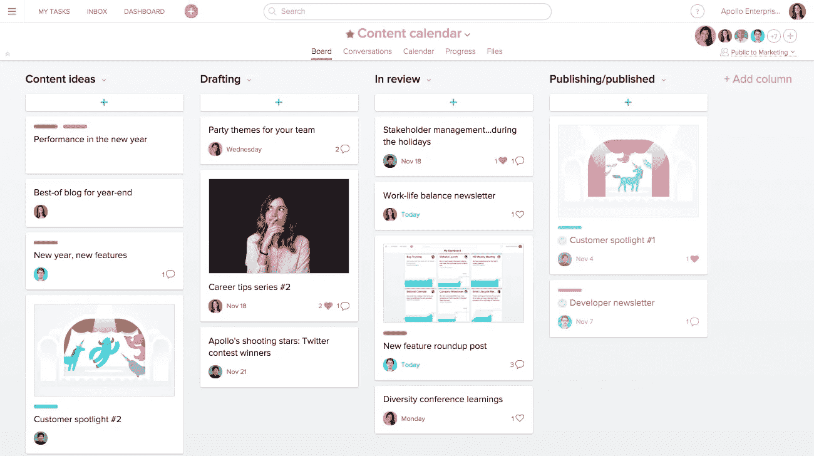**

**这种对想法、项目和计划的管理使他们能够始终如一地保持高度专注和高效。**

**那么，你如何将优先排序发展成一种营销技巧呢？您如何确定高水平的内容和活动的优先级？**

**这就是[目标设定](https://blog.bufferapp.com/goal-setting-strategies)发挥作用的地方！**

**在 [Buffer](https://buffer.com/) ，我们已经尝试了各种目标设定框架，比如 [OKRs](https://www.quora.com/topic/Objectives-and-Key-Results-OKRs) ，洛克和莱瑟姆的[目标设定 5 原则](https://www.mindtools.com/pages/article/newHTE_87.htm)， [BHAGs](https://en.wikipedia.org/wiki/Big_Hairy_Audacious_Goal) 等等。**

**今天，我们的营销团队根据范围使用两种类型的目标设定方法。对于长期规划和战略制定，我们使用一个[修正的沃伦巴菲特框架](https://open.buffer.com/goal-setting/)，对于短期(实验内容)，我们使用一个叫做 [ICE](https://growthhackershelp.zendesk.com/hc/en-us/articles/212386217-Selecting-an-ICE-score) 的框架。**

## **修正的沃伦·巴菲特框架**

**我的同事 Hailley 一直很欣赏沃伦·巴菲特(Warren Buffett)提出的设定目标的原始框架，这是一种写下 25 件你想在职业生涯中完成的事情的方法，从中挑选出前五件作为重点，并将另外 20 件放在“不惜一切代价避免”的清单上。**

**此后，我们采用了这个目标设定框架的修改版本。下面是它如何工作的一个快速概述(用我们的 [6 周周期](https://open.buffer.com/6-week-cycles/)中的一个真实例子目标):**

****第一步:选择 10 个目标****

**头脑风暴列出 10 个与你的团队工作相关的目标，这些目标可以在预先设定的时间内完成。**

**记住关注目标而不是任务。记住这一点的一个好方法是，任务描述了你如何度过时间，而目标是你的结果。**

**例如:**

**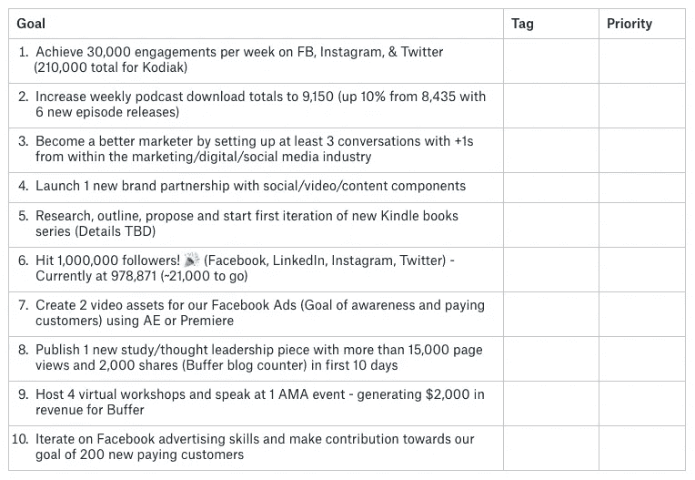**

****第二步:给每个目标分配一个“标签”****

**接下来，浏览并添加一个标签到每个目标及其所属的类别。每个人的标签系统应该是独特的。**

**想出你的标签，并把它们分配给你的 10 个目标中的每一个。**

**例如:**

**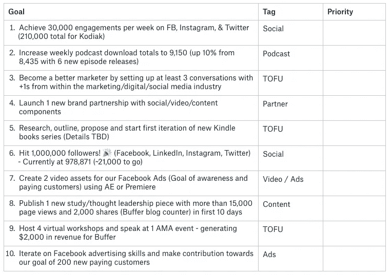**

****第三步:挑选三个要关注的目标(P1s)****

**这是练习中最难的部分！将清单从 10 个细化到 3 个，你将在指定的时间内关注它们。**

**为列表中的每个标签选择一个目标。**

**例如:**

**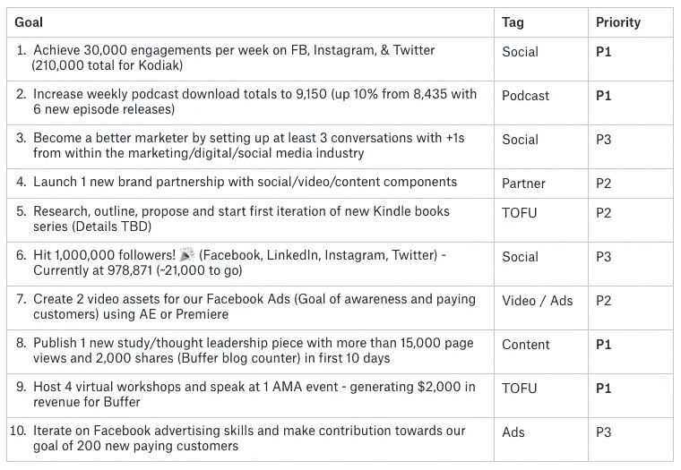**

**然后，添加一个 P2 和一个 P3 来排列列表中其他目标的优先顺序。**

**这并不意味着你有 10 个目标同时相互竞争。**

**这意味着一旦你完成了任何一个类别的 P1，你就可以(也只有在那时)进入你的 P2 和 P3。**

## **ICE 评分框架**

**“冰”代表**冲击、自信、轻松**。**

**以下是直接来自 [GrowthHackers](https://growthhackershelp.zendesk.com/hc/en-us/articles/212386217-Selecting-an-ICE-score) 的 ICE 评分框架创建者对每个元素的描述:**

*   ****影响**:如果这个想法被认为是“成功”的话，它可能对业务产生的影响**
*   **自信:这关系到你对自己是否会赢有多大的信心**
*   **轻松:这涉及到实现这个想法需要多少资源，需要什么样的资源**

**对于每个想法，给每个因素一个从 1 到 10 的分数。取三次得分的平均值，确定总得分。你应该从得分最高的想法开始。**

**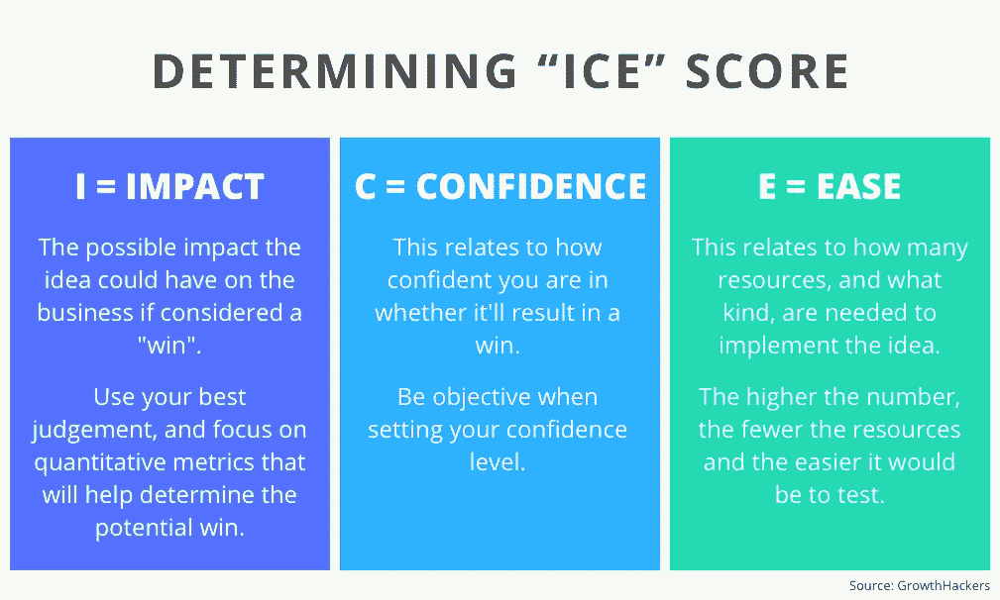**

**例如，假设您想与您所在行业的同行或影响者进行一次[内容合作实验](https://blog.bufferapp.com/run-social-media-experiments)(与此类似！)您的 ICE 分数可能如下所示:**

*   ****影响** : 8**
*   ****置信度** : 7**
*   ****缓和** : 7**
*   **总数:22**

**将它与其他 ICE 分数进行比较，你可以很快决定接下来要处理哪些想法，哪些暂时搁置。随着时间的推移，你将能够快速有效地获得灵感。**

****

# **3.合作**

**为什么团队[协作](https://blog.asana.com/2017/11/cross-functional-collaboration/)是必要的？**

**根据凯洛格商学院战略教授本杰明·琼斯的研究，部分原因是我们个人的知识基础变得越来越专业化。**

**琼斯举了一个莱特兄弟制造飞机的很好的例子:**

**“1903 年，两个人设计并驾驶了一架飞机。今天，一架波音 787 单引擎就有几十名专家在工作。然后是控制，液压，机身本身。需要多种多样的专业技能。”**

**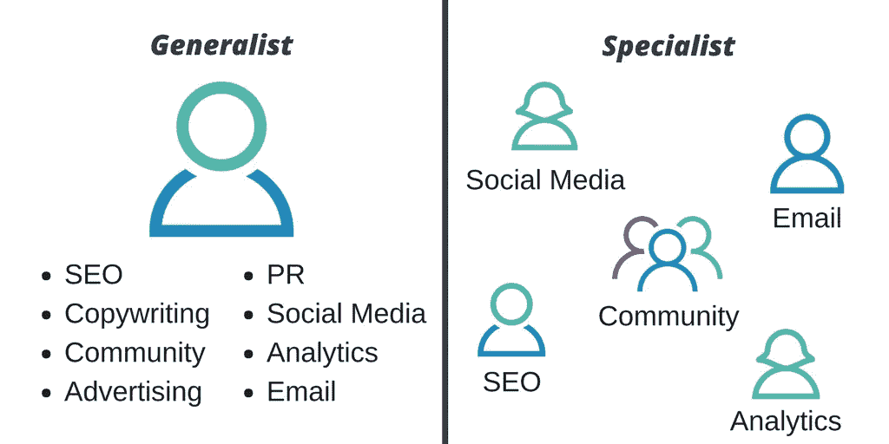**

**公司内部越来越需要专家(团队)之间的合作，以使产品或服务顺利开展。**

**根据我们在 Buffer 和 Asana 的经验，最成功的营销团队在两个重要层面进行协调:**

1.  ****信息传递**:确保各种渠道(博客、网站、社交网站等)的信息保持一致。**
2.  ****分发**:对内容进行规划和排序，以实现跨渠道的最大影响**

**通过在信息传递和分销中结合正确的营销技巧，您可以提高营销活动的成功率。**

## **信息发送**

**无论你是发起一场全面的营销活动，还是简单地[在脸书发布一个视频](https://blog.bufferapp.com/facebook-video)，在各种渠道创造一致的信息是建立你的品牌的重要部分。**

**我们发现，拥有有效的协作工具非常重要。**

**这里有一个[的简单例子，我们使用一些工具](https://blog.bufferapp.com/buffer-marketing-tools)和工作流程来帮助我们的团队创建一致的信息:**

*   **在消息应用程序 [Slack](https://slack.com/) 中就提议的想法或活动展开对话:**

**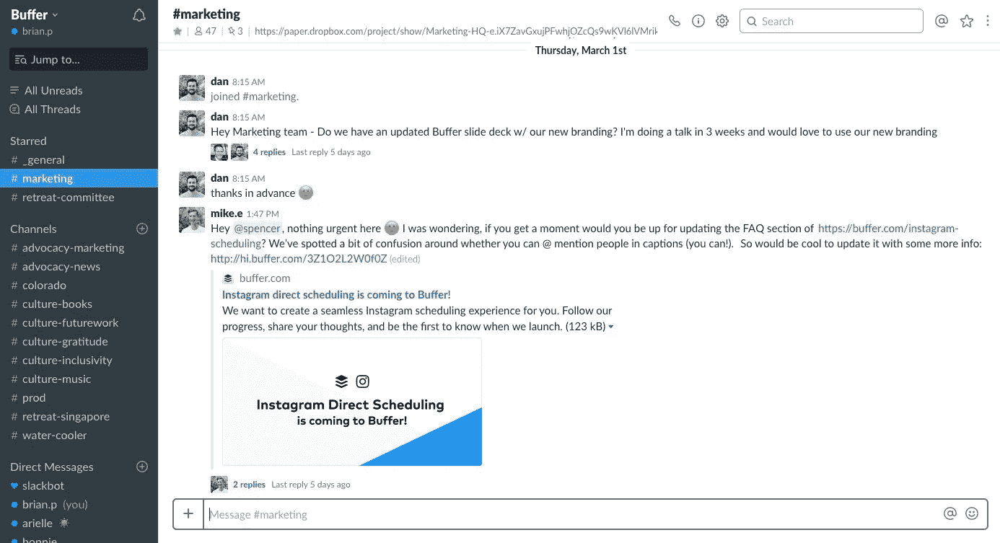**

*   **在[收存箱纸](https://www.dropbox.com/paper)中开始一个文档，添加额外的细节、注释、副本等:**

**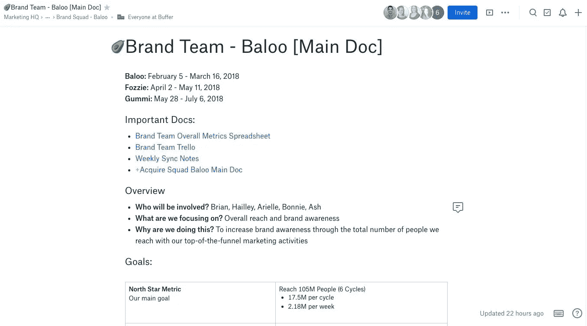**

*   **在[体式](https://asana.com/uses/team-collaboration)中创建一个项目，并将任务分配给整个组织的团队成员:**

**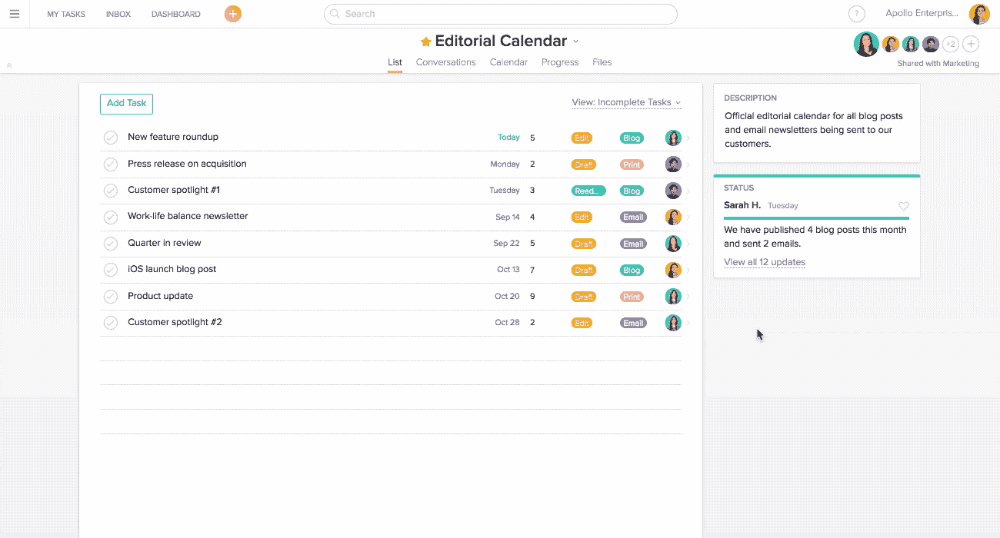**

**这三个工具对于组织内团队之间透明的[跨职能的](https://blog.asana.com/2017/11/cross-functional-collaboration/#close)协作和沟通是无价的。作为一家完全偏远的公司，他们对我们 Buffer 来说尤其重要！**

## **分配**

**如果没有一个可靠的分发计划，您的信息可能永远不会到达他们的目标受众。对于任何营销人员来说，不仅要有创造资产的技能，还要有通过多种渠道有效交付这些资产的技能，这是一项重要的素质。**

**下面是我们用来分发一致内容的一些工具和工作流的快速浏览:**

*   **用于托管和创建博客内容的 WordPress :**

**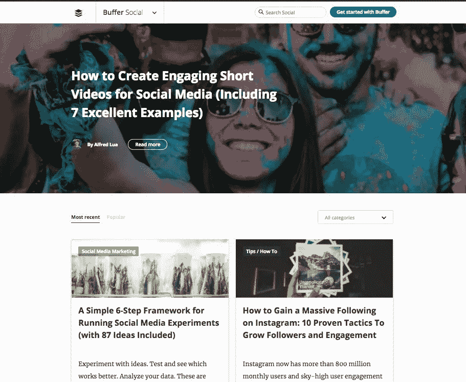**

*   **[讨论](https://discourse.org/)内部分发、信息和公告:**

**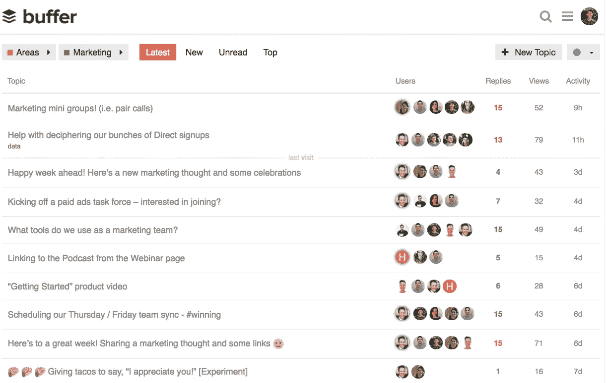**

*   **[用于社交媒体规划、时间安排和分析的缓冲区](https://buffer.com/):**

**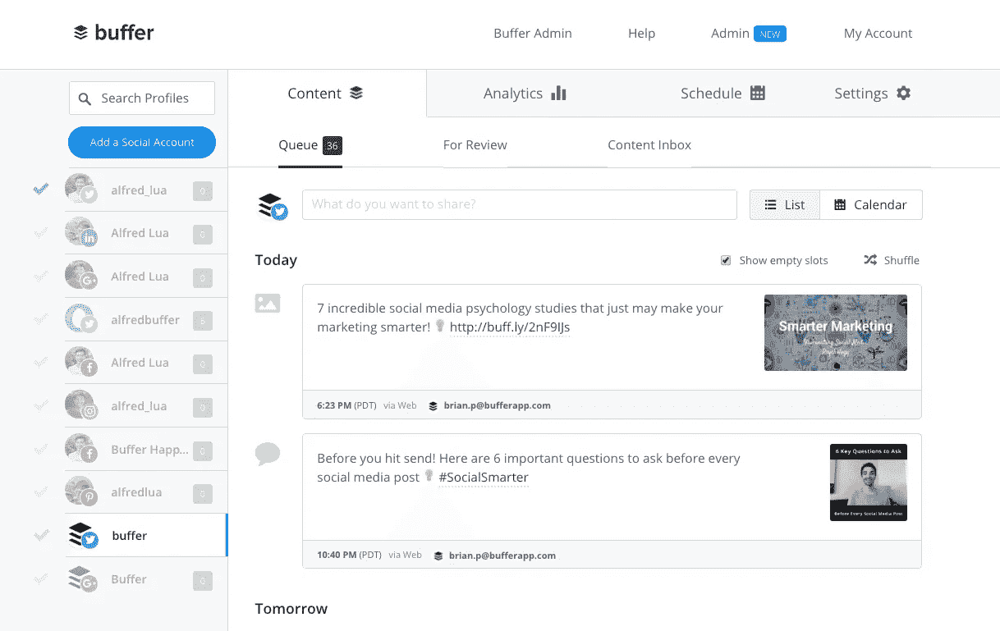**

**任何伟大团队协作的核心都是[信任](https://open.buffer.com/trust-remote-team/)。信任是有意与你的直接团队和整个公司的队友交流的意愿和开放性。**

**为人们创造见面和分享想法的空间(物理的或虚拟的)取决于你。[皮克斯](http://www.businessinsider.com/steve-jobs-designing-pixar-office-2015-3)是一个很好的例子——他们设计了自己的办公室，这样艺术家、设计师、程序员和营销人员就可以有目的地相遇。**

****

# **4.肉眼观察**

**人类本质上是非常视觉化的生物。**

**在大脑本身，有数亿个神经元专门用于视觉处理，几乎占整个皮层的 30%，相比之下，8%用于触觉，只有 3%用于听觉。**

**换句话说，最成功的营销团队不仅能够以书面形式传达信息，他们还能够[创造出令人惊叹的设计](https://blog.bufferapp.com/social-media-design-tips)，帮助讲述一个引人注目的视觉故事。**

**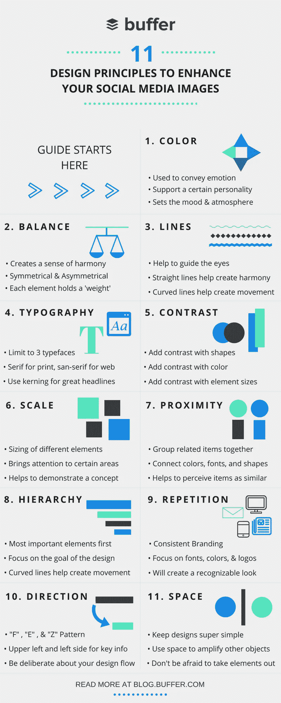**

**我们在 2017 年写了一篇名为“**为什么每个营销人员都需要成为一名(兼职)设计师**的[文章](https://blog.bufferapp.com/53-design-terms-explained-for-marketers)，这个一般理论在 2018 年的今天仍然成立，甚至更加成立。**

**最好的部分是有大量的免费资源可以开始使用！以下是我们最喜欢的一些:**

*   **[平面设计基础:平面设计的核心原则](https://www.skillshare.com/classes/design/Graphic-Design-Basics-Core-Principles-for-Visual-Design/1539782161?via=loggedin-home-recommended) (Skillshare)**
*   **[如何创作更好的平面设计](https://www.udemy.com/how-to-create-better-graphic-design-1/) (Udemy)**
*   **[登陆页面转换教程](https://do.thelandingpagecourse.com/) (Unbounce)**
*   **平面设计 101 (Udemy)**
*   **[提升社交媒体形象的 11 个简单设计技巧](https://blog.bufferapp.com/social-media-design-tips) (Buffer)**
*   **[设计体式:产品设计师的一天](https://blog.asana.com/2017/01/what-product-designer-do-asana/)(体式)**

**视觉叙事是经常被忽视的营销技巧之一，但它在每一个内容的成功中都扮演着重要的角色。**

****

# **5.做实验**

**你有没有想过一些营销团队是如何想出这么多好主意的？**

**他们的秘密…**

****每一个成功的营销理念或营销活动背后，都有几十个(如果不是几百个)小失败。****

**这让我想起了很多在产品开发中被称为[最小可行产品](http://blog.crisp.se/2016/01/25/henrikkniberg/making-sense-of-mvp) (MVP)的东西。MVP 是一种产品，它具有验证人们是否需要的最少的功能。**

**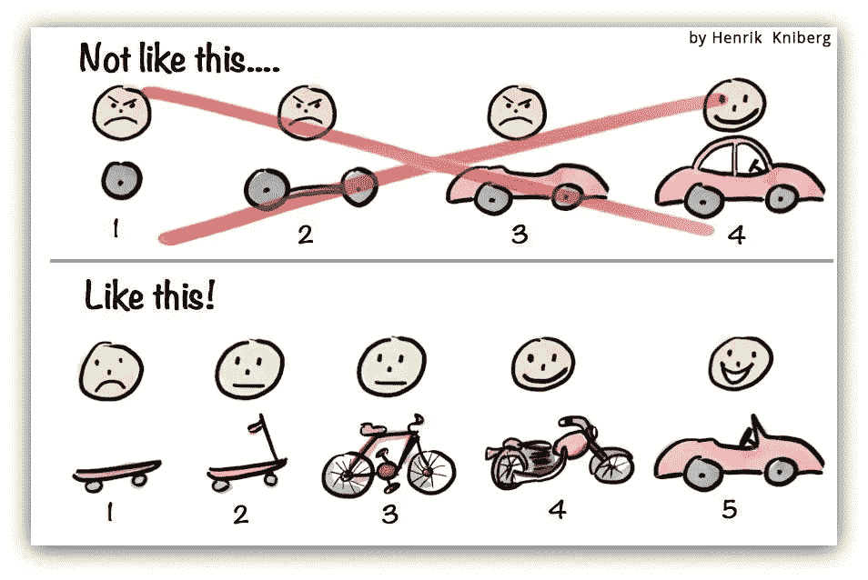**

**同样的理论也适用于[营销实验](https://blog.bufferapp.com/run-social-media-experiments)和测试。**

**一个不怕失败并且愿意进行数百种不同测试以快速验证想法的营销团队通常会比一个把鸡蛋(想法)放在一个篮子里(渠道/活动)的营销团队成功。**

**这些信息，[例如](https://wavelength.asana.com/editorial-planning-process-the-information/#close)，在任何时候都可能有数百个潜在的 Asana 故事创意——根据竞争、重要性、机会成本等等对实验和创意进行优先排序。**

**尽管没有真正科学的方法来进行营销实验，但这是我们在 Buffer 想出的系统测试创意的公式:**

**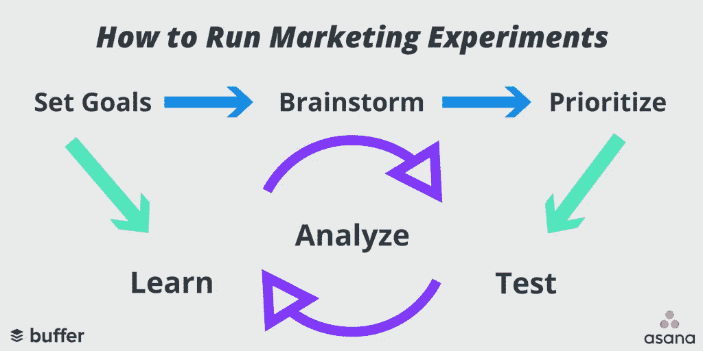**

**我们从设定明确的目标开始，然后从那里往回努力。**

**假设我们想在一年内增加 10%的缓冲博客流量(**目标**)。**

**我们的营销团队首先会聚在一起**集思广益**我们可以实现这一目标的所有不同方式——搜索引擎优化、社交媒体、代销商等等。**

**然后，我们会根据影响力(沃伦·巴菲特框架/ ICE 分数)对想法进行优先排序，并开始测试。**

**然后，我们会不断地**测量和分析**结果，同时进行增量改进。**

**带着[成长心态](http://www.briangreggpeters.com/how-i-approach-digital-marketing-at-buffer-as-a-tofu-marketer/)进行实验和测试，类似于开发产品，是一种营销技巧，将帮助你的团队更上一层楼。**

****

# **6.分析**

**作为营销人员，我们都处在分析专业知识的范围内(不管我们是否知道！)从[分析奇才](https://blog.bufferapp.com/learn-social-media-analytics)到我们这些刚刚开始接触数据分析的人，我们都有一个基础层。**

**我们在 Buffer 的营销总监，[凯旺·李](https://twitter.com/kevanlee)，说得很好:**

> ***“深化你的分析技能的好处在于，我们都有一个基础。我们都知道如何建立直觉。直觉只是一个被吸收的数据历史。再加上问好问题的能力，你就已经在路上了。(工具本身远没有你想象的那么重要。)"***

****就数据和营销分析而言，提出好的问题是任何团队都必须具备的宝贵营销技能。****

**这幅来自 [Moz](https://moz.com/blog/the-importance-of-marketing-analytics) 的图片展示了有多少大问题需要问:**

**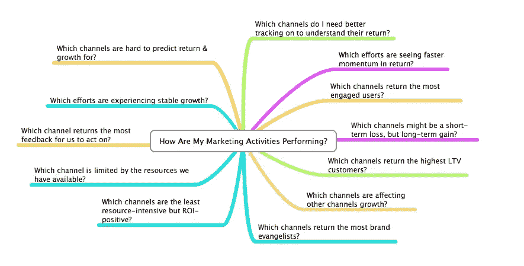**

**起初，问所有这些问题可能有点吓人。**

**如果我不知道答案呢？**

**没关系！**

**我们认为处理分析的一种方式是“爬行、行走、奔跑”，如果您刚刚开始，它可能看起来像这样:**

*   ****抓取**:哪些渠道的参与度最高？**
*   ****行走**:哪些战术和/或战略有助于这种互动？**
*   ****跑步**:我们应该实施哪些渠道、战术和策略来增加参与度？**

**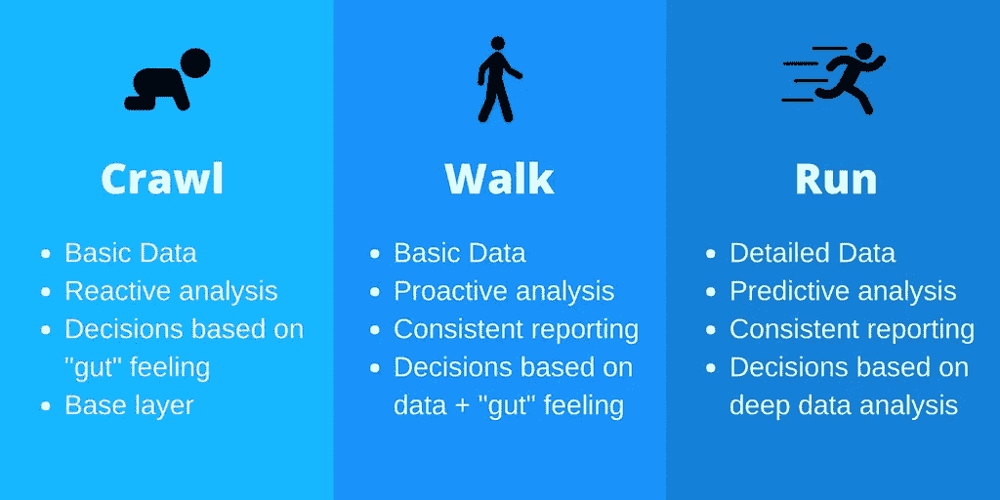**

**另一种思考分析的好方法是由数据向导 Christopher S. Penn 流行的“[层次分析](http://www.christopherspenn.com/2018/02/the-next-evolution-of-analytics-is-proactive/)”模型:**

**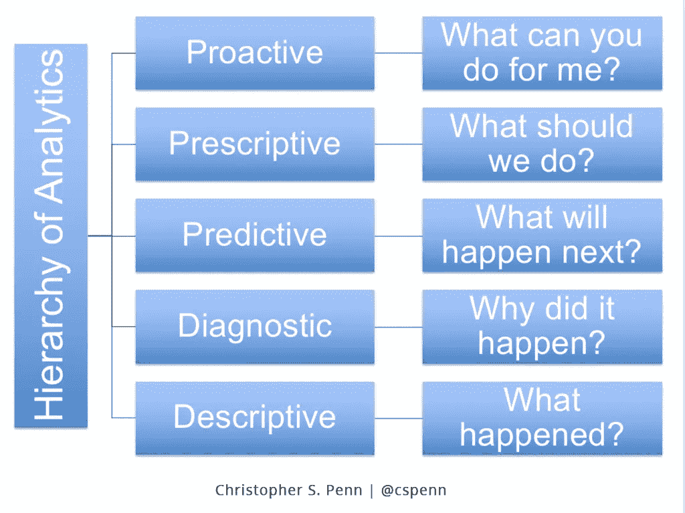**

**一开始，你可能会尝试各种[分析平台和工具](https://blog.bufferapp.com/social-media-analytics-tools)，以便对营销分析的基础有所了解。了解哪些数据是可用的，其局限性，以及您可以报告什么是一个很好的开始。**

**然后，随着你对数据越来越熟练和自信，你可能会根据你的发现深入了解**某事为什么会发生或者将来可能会发生什么**。**

**谷歌、IBM、脸书、亚马逊和微软等公司有一些令人难以置信的数据分析工具可以帮助你做到这一点！**

****

# **7.学问**

**我喜欢认为成为伟大营销者的**之路是一个终生的旅程，永远不会真正完成**。**

**知识、激情和专长是无形的品质，我们通常不会在一夜之间获得。这些通常是多年(甚至几十年)努力工作、错误、自我反省和个人成长的结果。**

**甚至像米开朗基罗这样的艺术大师在他职业生涯后期也曾说过:“**我仍在学习**”。**

**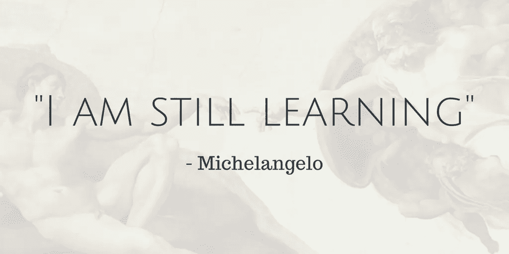**

****在 Buffer 和 Asana，我们的目标是围绕天生好奇、渴望学习、充满激情、乐于接受新想法的人来建立我们的营销团队。****

**“热爱学习是我们在营销人员中寻找的主要技能之一，因为它告诉我们几件事:他们热爱自己的工作吗？他们对这个世界好奇吗？”凯旺·李解释道。“仅这两个因素就能让你走得很远！”**

**就像食物滋养我们的身体一样，信息和不断的学习滋养我们的心灵。**

**但是，作为一名营销人员，你从哪里开始学习呢？**

**我们发现，有一个合适的框架可以让我们发现增长的机会。我们称之为 [T 型营销人员](https://blog.bufferapp.com/t-shaped-marketer)框架:**

****

***T-Shaped Marketing at Buffer. Feel free to grab a download of* [*the Sketch file*](https://www.dropbox.com/s/tdr0loxi2wtkvhd/T-shaped%20marketer%20framework%20-%20editable.sketch?dl=0) *or* [*Canva template*](https://www.canva.com/design/DACQuL5OaYQ/CCIG5g3szGG4tgoExYjXwQ/view?utm_content=DACQuL5OaYQ&utm_campaign=designshare&utm_medium=link&utm_source=sharebutton) *we used to build this, if you’d like to customize it for your company.***

**我鼓励你为自己创建一个这样的模板。这是一项令人难以置信、令人大开眼界的活动，将为你提供一条清晰的前进道路。**

**然后，我们建议围绕你最感兴趣的营销原则养成习惯:**

*   **如果你想在数据分析方面做得更好，试着参加一个关于我的课程来扩展你的技能**
*   **如果你想深入[视频营销](https://blog.bufferapp.com/video-marketing)，尝试在 [Animoto](https://animoto.com/) 中创建一个视频，或者在 [YouTube 上学习免费的 Adobe Premiere 教程。](https://www.youtube.com/watch?v=Hls3Tp7JS8E)**
*   **如果你热衷于社交媒体，我们在社交博客、 [SkillShare](https://www.skillshare.com/classes/Introduction-to-Social...Buffer/1934895986) 和 [Buffer Podcast](https://buffer.com/podcast) 上有大量的学习资源。**
*   **如果你想提高你的组织、工作流程或项目管理技能，Asana 在他们的博客上为工作管理[创造了大量的资源和最佳实践。](https://blog.asana.com/)**

**如果你好奇、好奇、真诚，如果你的意图真诚，总会有人在你的旅途中支持你。**

**尝试新事物——有些甚至会吓到你！一旦你获得了一些动力，保持下去。这将为你在营销方面的终生成功奠定基础。**

****

# **轮到你了**

**非常感谢你查看这个帖子！**

**如果你有兴趣从业内一些才华横溢的专业人士那里学习更多关于职业和营销技巧的知识，请随意查看 Asana 博客。它包含了一些令人难以置信的见解。**

****我们也很乐意在下面继续与您对话！****

**这个列表中我们遗漏了哪些技能？是什么帮助你的团队创造了持续的优秀内容？你对那些想招聘营销人员的人有什么建议？**

****

****Brian Peters.** Humbled and grateful to be living the social media life at Buffer! California coast born and raised, but always on the go with my lovely wife Katelyn. Love reading, designing, writing, running and adventuring.**

****

## **如果你喜欢读这篇文章，你可能也会喜欢这些文章:**

** [## 如何建立营销职业生涯

### 顶级创始人和投资者的建议和见解

medium.com](/swlh/career-in-marketing-7a284cba08ed)  [## 社交媒体经理的一天

### 社交媒体经理如何打发时间？

medium.com](/social-media-tips/social-media-manager-life-fbdd8f840bb9)  [## 如何制作引人入胜的社交媒体视频

### 你上一次在社交媒体上看视频是什么时候？

medium.com](/social-media-tips/social-media-videos-9baba53d067d) 

*本帖最早由*[*Brian g . Peters*](https://medium.com/u/82aabc6b322f?source=post_page-----a3484b13928d--------------------------------)*于 2018 年 3 月 13 日在* [*Buffer 社交博客*](https://blog.bufferapp.com/marketing-skills) *上撰写。*

## 这个故事发表在 [The Startup](https://medium.com/swlh) 上，这是 Medium 最大的创业刊物，拥有 318，583+人关注。

## 在这里订阅接收[我们的头条新闻](http://growthsupply.com/the-startup-newsletter/)。

**